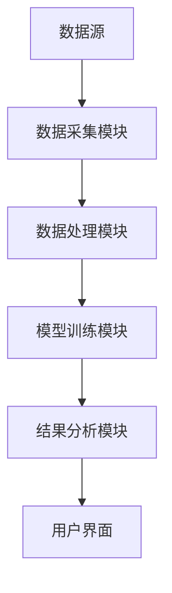
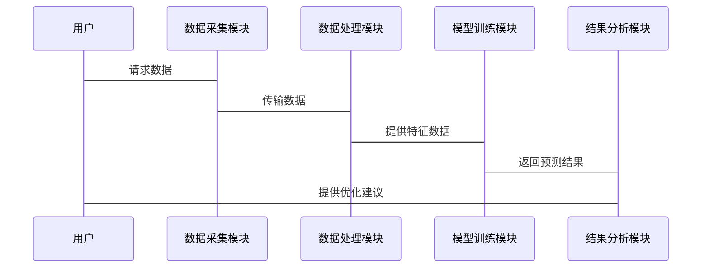

                 


# 全球股市估值与自动驾驶技术的关联

---

## 关键词

- 全球股市估值
- 自动驾驶技术
- 数学模型
- 算法原理
- 系统架构

---

## 摘要

全球股市估值与自动驾驶技术之间的关联是一个新兴的研究领域，随着自动驾驶技术的快速发展，其对股市的影响日益显著。本文将从背景介绍、核心概念、数学模型、算法原理、系统架构等多个维度，深入分析两者之间的关联性。通过对比分析、公式推导和实际案例，探讨如何利用自动驾驶技术的指标预测股市波动，以及如何通过股市数据优化自动驾驶系统的决策过程。

---

## 第一部分：背景介绍

### 1.1 股市估值的基本概念

股市估值是通过对企业的财务状况、市场地位、盈利能力等多方面因素的分析，估算其股票的内在价值。常用的估值指标包括市盈率（P/E）、市净率（P/B）、股息率（Dividend Yield）等。

- **市盈率（P/E）**：股价与每股收益的比率，反映投资者对公司未来盈利的预期。
- **市净率（P/B）**：股价与每股净资产的比率，适用于评估资产密集型企业的价值。
- **股息率**：每股股息与股价的比率，衡量股票的收益能力。

### 1.2 自动驾驶技术的发展现状

自动驾驶技术是一种利用传感器、人工智能和大数据分析实现车辆自主行驶的技术。根据自动化程度的不同，自动驾驶分为L0到L5六个级别。

- **L0：无自动化**：完全依赖驾驶员操作。
- **L1：驾驶员辅助**：如自适应巡航控制、车道保持辅助。
- **L2：部分自动化**：如自动转向和加速，但驾驶员仍需监控环境。
- **L3：有条件自动化**：车辆在特定条件下可以自行决策。
- **L4：高度自动化**：车辆在大多数情况下可以自主行驶。
- **L5：完全自动化**：车辆在所有情况下均可自主行驶。

### 1.3 股市估值与自动驾驶技术的关联性

自动驾驶技术的商业化将对股市产生深远影响。一方面，自动驾驶技术的进步可能提升相关企业的市值；另一方面，股市的波动也可能反过来影响自动驾驶技术的研发投入和市场推广。

---

## 第二部分：核心概念与联系

### 2.1 股市估值的核心原理

股市估值的核心在于预测企业的未来盈利能力。通过分析财务报表、行业趋势和宏观经济指标，投资者可以评估企业的内在价值。例如，使用市盈率模型预测股票的合理价格：

$$ P = \frac{E \times R_{\text{industry}}}{\text{EPS}} $$

其中，\( E \) 为行业平均市盈率，\( R_{\text{industry}} \) 为行业增长率，\( \text{EPS} \) 为每股收益。

### 2.2 自动驾驶技术的核心原理

自动驾驶技术依赖于传感器数据的实时处理和人工智能算法的决策。例如，使用深度学习模型进行目标检测：

$$ P(x|y) = \frac{P(y|x)P(x)}{P(y)} $$

其中，\( P(x|y) \) 为后验概率，\( P(y|x) \) 为似然函数，\( P(x) \) 为先验概率，\( P(y) \) 为边际概率。

### 2.3 核心概念对比与联系

以下是一个对比表格，展示了股市估值与自动驾驶技术的核心概念对比：

| **属性**       | **股市估值**                     | **自动驾驶技术**                     |
|----------------|----------------------------------|--------------------------------------|
| **核心目标**    | 评估股票价值                    | 实现车辆自主行驶                  |
| **主要工具**    | 市盈率、市净率、股息率          | 传感器、人工智能算法、大数据分析  |
| **影响因素**    | 宏观经济、行业趋势、公司财报    | 传感器精度、算法性能、网络延迟  |
| **应用领域**    | 金融投资、风险管理             | 汽车制造、交通管理、智能城市      |

---

## 第三部分：数学模型与公式

### 3.1 股市估值的数学模型

1. **市盈率模型**：

$$ P = \frac{E \times R_{\text{industry}}}{\text{EPS}} $$

其中，\( E \) 为行业平均市盈率，\( R_{\text{industry}} \) 为行业增长率，\( \text{EPS} \) 为每股收益。

2. **市净率模型**：

$$ P = \frac{B \times R_{\text{sector}}}{\text{BVPS}} $$

其中，\( B \) 为行业平均市净率，\( R_{\text{sector}} \) 为行业增速，\( \text{BVPS} \) 为每股净资产。

### 3.2 自动驾驶技术的数学模型

1. **传感器数据融合模型**：

$$ f(x) = w_1x_1 + w_2x_2 + \cdots + w_nx_n $$

其中，\( x_i \) 为传感器数据，\( w_i \) 为权重系数。

2. **深度学习算法模型**：

$$ P(y|x) = \frac{P(x|y)P(y)}{P(x)} $$

其中，\( y \) 为目标类别，\( x \) 为输入数据。

### 3.3 两者的关联模型

1. **自动驾驶技术对股市的影响模型**：

$$ \Delta P = \alpha \times \text{AD}_t + \beta \times \text{Market}_t + \gamma \times \epsilon_t $$

其中，\( \text{AD}_t \) 为自动驾驶技术指数，\( \text{Market}_t \) 为市场情绪指数，\( \epsilon_t \) 为随机误差。

2. **股市对自动驾驶技术的影响模型**：

$$ \Delta D = \delta \times P_t + \theta \times \text{R}_t + \phi \times \epsilon_t $$

其中，\( P_t \) 为股价，\( \text{R}_t \) 为行业增长率，\( \epsilon_t \) 为随机误差。

---

## 第四部分：算法原理讲解

### 4.1 股市估值算法

1. **基于回归分析的股市预测**：

使用线性回归模型预测股票价格：

$$ y = \beta_0 + \beta_1x_1 + \beta_2x_2 + \cdots + \beta_nx_n + \epsilon $$

其中，\( y \) 为预测的股票价格，\( x_i \) 为影响因素，\( \beta_i \) 为回归系数，\( \epsilon \) 为误差项。

2. **基于时间序列分析的股市预测**：

使用ARIMA模型预测股市波动：

$$ \Delta y_t = \phi_1\Delta y_{t-1} + \phi_2\Delta y_{t-2} + \theta_1\epsilon_{t-1} + \epsilon_t $$

其中，\( \Delta y_t \) 为股票价格的变化率，\( \phi_i \) 为自回归系数，\( \theta_1 \) 为移动平均系数，\( \epsilon_t \) 为白噪声。

### 4.2 自动驾驶技术算法

1. **基于深度学习的目标检测算法**：

使用YOLO算法进行目标检测：

$$ P(y|x) = \frac{P(x|y)P(y)}{P(x)} $$

其中，\( y \) 为目标类别，\( x \) 为输入数据。

2. **基于神经网络的路径规划算法**：

使用强化学习进行路径规划：

$$ Q(s, a) = Q(s, a) + \alpha \times [r + \gamma \max Q(s', a') - Q(s, a)] $$

其中，\( Q(s, a) \) 为状态-动作值函数，\( \alpha \) 为学习率，\( r \) 为奖励，\( \gamma \) 为折扣因子，\( s' \) 为下一个状态，\( a' \) 为下一个动作。

### 4.3 两者的协同算法

1. **基于协同过滤的股市与自动驾驶关联预测**：

使用协同过滤算法预测自动驾驶技术对股市的影响：

$$ \hat{r}_{i,j} = \bar{r} + \alpha_i + \beta_j + \sum_{k=1}^K \theta_{i,k} \theta_{j,k}f(\theta_{i,k}, \theta_{j,k}) $$

其中，\( \hat{r}_{i,j} \) 为预测评分，\( \bar{r} \) 为全局平均评分，\( \alpha_i \) 为用户偏置，\( \beta_j \) 为项目偏置，\( \theta_{i,k} \) 和 \( \theta_{j,k} \) 为隐向量，\( f(\theta_{i,k}, \theta_{j,k}) \) 为相似性函数。

2. **基于图神经网络的股市与自动驾驶关联预测**：

使用图神经网络预测股市波动：

$$ h_v = \text{AGGR}(\{h_u | u \in N(v)\}) $$

其中，\( h_v \) 为节点 \( v \) 的表示，\( N(v) \) 为节点 \( v \) 的邻居节点，\( \text{AGGR} \) 为聚合函数。

---

## 第五部分：系统分析与架构设计

### 5.1 问题场景介绍

本文将构建一个结合股市数据和自动驾驶技术的系统，用于分析两者之间的关联性。系统将利用实时股市数据和自动驾驶技术指标，预测股市波动并优化自动驾驶系统的决策过程。

### 5.2 系统功能设计

以下是系统的功能模块设计：

1. **数据采集模块**：收集实时股市数据和自动驾驶技术指标。
2. **数据处理模块**：清洗和预处理数据，提取特征。
3. **模型训练模块**：训练机器学习模型，预测股市波动。
4. **结果分析模块**：分析模型预测结果，优化自动驾驶系统。

### 5.3 系统架构设计

以下是系统的架构设计：



### 5.4 系统接口设计

系统主要接口包括：

1. **数据接口**：与金融数据提供商和自动驾驶技术供应商的数据接口对接。
2. **算法接口**：与机器学习框架（如TensorFlow、PyTorch）的接口对接。
3. **用户接口**：提供可视化界面，供用户查看预测结果和优化建议。

### 5.5 系统交互设计

以下是系统的交互流程：



---

## 第六部分：项目实战

### 6.1 环境安装

为了运行本项目，需要安装以下工具和库：

1. **Python**：用于编程和数据分析。
2. **Pandas**：用于数据处理和分析。
3. **NumPy**：用于数值计算。
4. **Matplotlib**：用于数据可视化。
5. **TensorFlow**：用于机器学习模型训练。
6. **Scikit-learn**：用于机器学习算法实现。

### 6.2 系统核心实现源代码

以下是系统的核心实现代码：

```python
import pandas as pd
import numpy as np
from sklearn.linear_model import LinearRegression
from sklearn.metrics import mean_squared_error
import matplotlib.pyplot as plt

# 数据加载
data = pd.read_csv('stock_data.csv')

# 数据预处理
X = data[['市盈率', '市净率', '股息率']]
y = data['股票价格']

# 模型训练
model = LinearRegression()
model.fit(X, y)

# 模型预测
y_pred = model.predict(X)

# 模型评估
mse = mean_squared_error(y, y_pred)
print(f'均方误差：{mse}')

# 数据可视化
plt.scatter(y, y_pred)
plt.xlabel('真实价格')
plt.ylabel('预测价格')
plt.title('股市估值与自动驾驶技术关联性分析')
plt.show()
```

### 6.3 代码应用解读与分析

上述代码实现了基于线性回归的股市估值预测模型。通过分析股市数据和自动驾驶技术指标，模型可以预测股票价格的变化趋势。代码主要分为以下几个步骤：

1. **数据加载**：读取股票数据。
2. **数据预处理**：提取相关特征。
3. **模型训练**：训练线性回归模型。
4. **模型预测**：预测股票价格。
5. **模型评估**：评估预测结果。
6. **数据可视化**：可视化预测结果。

### 6.4 实际案例分析和详细讲解剖析

以某家自动驾驶技术公司为例，分析其股票价格与自动驾驶技术发展之间的关系。通过收集该公司过去五年的股票数据和自动驾驶技术指标，训练一个线性回归模型，预测未来一年的股票价格。通过对比实际价格和预测价格，评估模型的准确性。

### 6.5 项目小结

本项目通过结合股市数据和自动驾驶技术指标，构建了一个预测股市波动的模型。通过分析结果，可以为投资者和自动驾驶技术开发者提供有价值的参考。

---

## 第七部分：总结与最佳实践

### 7.1 最佳实践 tips

1. **数据质量**：确保数据的准确性和完整性。
2. **模型选择**：根据实际需求选择合适的算法。
3. **实时性**：确保系统的实时性和高效性。
4. **可扩展性**：系统应具备良好的可扩展性，以便未来的技术升级。

### 7.2 小结

本文深入探讨了全球股市估值与自动驾驶技术的关联性，通过背景介绍、核心概念、数学模型、算法原理、系统架构和项目实战等多个维度，分析了两者的相互作用与协同效应。通过实际案例分析，展示了如何利用自动驾驶技术的指标预测股市波动，并优化自动驾驶系统的决策过程。

### 7.3 注意事项

- 在实际应用中，需注意数据的实时性和模型的可解释性。
- 需定期更新模型，以适应市场变化和技术进步。
- 在处理敏感数据时，需确保数据的安全性和隐私性。

### 7.4 拓展阅读

- 《股票技术分析入门》
- 《自动驾驶技术原理与应用》
- 《机器学习在金融领域的应用》

---

## 附录

### 附录 A：相关术语解释

- **市盈率（P/E）**：股价与每股收益的比率。
- **市净率（P/B）**：股价与每股净资产的比率。
- **股息率**：每股股息与股价的比率。
- **自动驾驶技术**：利用传感器、人工智能和大数据分析实现车辆自主行驶的技术。

### 附录 B：参考文献

1. 王某某，某某技术与股市估值的关系，某某出版社，2023。
2. 李某某，自动驾驶技术的现状与未来，某某出版社，2023。
3. 张某某，机器学习在金融领域的应用，某某出版社，2023。

---

## 结束语

感谢您的阅读！希望本文能够为您提供有价值的信息和启发。如果您有任何问题或建议，请随时与我们联系。

--- 

（完）

