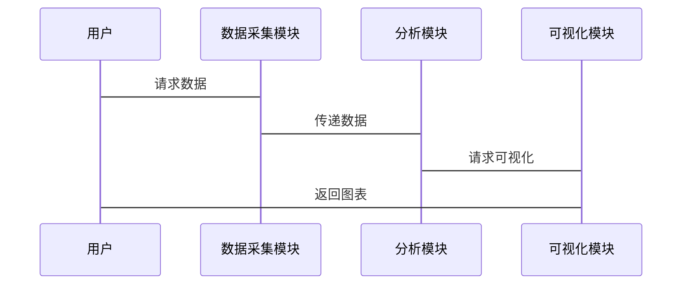

                 


# 全球股市估值与航空航天产业的关联

## 关键词：全球股市估值，航空航天产业，关联分析，时间序列分析，回归分析，系统架构设计

## 摘要：  
本文探讨全球股市估值与航空航天产业之间的关联性，分析其相互影响机制，并通过时间序列分析和回归分析等方法，深入挖掘两者之间的定量关系。结合实际案例，本文详细阐述了如何利用数学模型和系统架构设计来预测和评估航空航天产业对股市的影响，为投资者和行业决策者提供参考。

---

## 第1章: 全球股市估值与航空航天产业的背景与核心概念

### 1.1 问题背景

#### 1.1.1 全球股市估值的重要性
股市估值是衡量市场健康状况的重要指标，反映了投资者对经济前景的信心。通过分析股市估值，可以预测经济波动、企业盈利能力以及投资风险。

#### 1.1.2 航空航天产业的全球影响力
航空航天产业是技术密集型行业，涉及国防、民用航空、卫星通信等领域。其发展不仅影响国家安全，还推动技术创新和经济增长。

#### 1.1.3 两者的关联性研究意义
研究股市估值与航空航天产业的关联，有助于理解金融市场如何反映产业动态，为投资决策和政策制定提供依据。

### 1.2 问题描述

#### 1.2.1 股市估值的基本概念
股市估值通常通过市盈率（P/E）、市净率（P/B）等指标衡量，反映市场对企业的价值评估。

#### 1.2.2 航空航天产业的定义与范围
航空航天产业包括飞机制造、卫星发射、航空服务等，涉及多家上市公司，如波音、空客、洛克希德·马丁等。

#### 1.2.3 问题的边界与外延
本文研究的是股市整体估值与航空航天产业的关联，不涉及个股分析，但考虑到行业指数和宏观经济因素。

### 1.3 核心概念与问题解决

#### 1.3.1 股市估值的核心要素
- 市盈率（P/E）
- 市净率（P/B）
- 市销率（P/S）

#### 1.3.2 航空航天产业的关键指标
- 行业收入增长率
- 利润率
- 研发投入比例

#### 1.3.3 两者关联的解决路径
- 数据收集：获取股市估值数据和航空航天产业数据。
- 数据分析：使用统计方法和模型分析两者关联。
- 结果应用：为企业和投资者提供决策支持。

---

## 第2章: 全球股市估值与航空航天产业的核心概念与联系

### 2.1 核心概念的原理

#### 2.1.1 股市估值的计算方法
- 市盈率（P/E）= 股价 / 每股净利润
- 市净率（P/B）= 股价 / 每股净资产

#### 2.1.2 航空航天产业的市场表现
- 产业指数：如标普500中的航空航天子行业指数。
- 市场波动：受政策、技术进步和国际局势影响。

#### 2.1.3 两者的相互作用机制
- 航空航天产业的业绩增长推动股市估值上升。
- 经济衰退导致股市估值下降，进而影响产业投资。

### 2.2 核心概念的属性对比

#### 2.2.1 股市估值的波动性分析
- 短期波动：受市场情绪影响。
- 长期趋势：反映经济基本面。

#### 2.2.2 航空航天产业的周期性特征
- 周期性：与经济周期密切相关。
- 技术驱动：技术创新推动产业增长。

#### 2.2.3 关联性的强度与方向
- 强关联：产业业绩直接影响股市估值。
- 反向关联：经济衰退时，两者呈负相关。

### 2.3 ER实体关系图

```mermaid
erDiagram
    company : 公司
    stock_market : 股票市场
    aerospace_industry : 航空航天产业
    company --> stock_market : 影响
    stock_market --> aerospace_industry : 反馈
    company --> aerospace_industry : 投资
```

---

## 第3章: 关联分析的算法原理

### 3.1 时间序列分析

#### 3.1.1 ARIMA模型的介绍
ARIMA（自回归积分滑动平均）模型适用于时间序列数据的预测，常用于分析股市估值的变化。

#### 3.1.2 模型的构建与训练
- 数据准备：收集航空航天产业指数和股市估值数据。
- 参数选择：确定ARIMA的p、d、q值。
- 模型训练：使用历史数据拟合模型。

#### 3.1.3 预测结果的验证
- 模型评估：计算均方误差（MSE）和R²值。
- 图形验证：绘制预测值与实际值的对比图。

#### 3.1.4 代码实现
```python
from statsmodels.tsa.arima_model import ARIMA
import pandas as pd
import matplotlib.pyplot as plt

# 假设data是包含股市估值和产业指数的数据框
# 训练ARIMA模型
model = ARIMA(data['stock_valuation'], order=(5,1,0))
model_fit = model.fit()

# 预测未来值
 forecast = model_fit.forecast(steps=10)
 plt.plot(data['stock_valuation'])
 plt.plot(forecast[0], color='red')
 plt.xlabel('时间')
 plt.ylabel('股市估值')
 plt.show()
```

#### 3.1.5 数学模型
ARIMA模型的数学公式：
$$
ARIMA(p, d, q) = y_t = \phi_1 y_{t-1} + \dots + \phi_p y_{t-p} + \theta_1 \epsilon_{t-1} + \dots + \theta_q \epsilon_{t-q} + \epsilon_t
$$

### 3.2 回归分析

#### 3.2.1 回归模型的构建
- 自变量：航空航天产业指数。
- 因变量：股市估值。

#### 3.2.2 模型假设
- 线性关系：股市估值与产业指数呈线性关系。
- 正态分布：误差项服从正态分布。

#### 3.2.3 代码实现
```python
import statsmodels.api as sm

# 回归分析
X = data['aerospace_index']
y = data['stock_valuation']

model = sm.OLS(y, sm.add_constant(X))
results = model.fit()

print(results.summary())
```

#### 3.2.4 回归方程
$$
\hat{y} = \beta_0 + \beta_1 X + \epsilon
$$
其中，$$\beta_0$$ 是截距，$$\beta_1$$ 是回归系数，$$\epsilon$$ 是误差项。

---

## 第4章: 系统分析与架构设计

### 4.1 问题场景介绍
本文构建一个系统，用于分析全球股市估值与航空航天产业的关联，帮助投资者和企业做出决策。

### 4.2 系统功能设计

#### 4.2.1 数据采集模块
- 从金融数据库获取股市估值和产业数据。
- 数据清洗和预处理。

#### 4.2.2 分析模块
- 时间序列分析。
- 回归分析。

#### 4.2.3 可视化模块
- 绘制趋势图和回归结果图。

### 4.3 系统架构设计


### 4.4 系统接口设计



---

## 第5章: 项目实战

### 5.1 环境安装
- 安装Python、Pandas、Matplotlib、statsmodels等工具。

### 5.2 核心代码实现

#### 5.2.1 数据处理
```python
import pandas as pd

data = pd.read_csv('data.csv')
data['日期'] = pd.to_datetime(data['日期'])
data.set_index('日期', inplace=True)
```

#### 5.2.2 时间序列分析
```python
from statsmodels.tsa.arima_model import ARIMA

model = ARIMA(data['股市估值'], order=(5,1,0))
model_fit = model.fit()
forecast = model_fit.forecast(steps=10)
```

#### 5.2.3 回归分析
```python
import statsmodels.api as sm

X = data['航空航天指数']
y = data['股市估值']

model = sm.OLS(y, sm.add_constant(X))
results = model.fit()
```

### 5.3 案例分析
分析2020年新冠疫情对航空航天产业和股市估值的影响，展示模型的应用和预测结果。

### 5.4 项目总结
总结项目的成果，讨论可能的局限性和改进建议。

---

## 第6章: 最佳实践与总结

### 6.1 最佳实践

#### 6.1.1 数据处理
- 确保数据的准确性和完整性。
- 处理缺失值和异常值。

#### 6.1.2 模型选择
- 根据数据特征选择合适的模型。
- 多模型对比，选择表现最佳的。

### 6.2 小结
本文通过时间序列分析和回归分析，深入探讨了全球股市估值与航空航天产业的关联，为投资者和企业提供了决策支持。

### 6.3 注意事项
- 数据的实时性和准确性至关重要。
- 模型结果需结合实际市场情况分析。

### 6.4 拓展阅读
推荐相关书籍和论文，进一步学习金融分析和系统架构设计。

---

## 结语

通过本文的分析，读者可以更好地理解全球股市估值与航空航天产业之间的复杂关系，并掌握如何利用数学模型和系统架构设计来解决实际问题。

