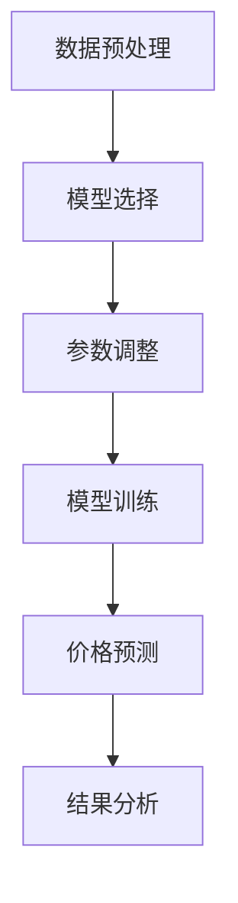
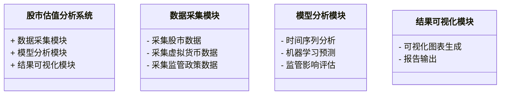

                 


# 全球股市估值与虚拟货币监管的关系

## 关键词：虚拟货币、股市估值、监管政策、金融市场、区块链技术

## 摘要：本文探讨了虚拟货币与全球股市估值之间的复杂关系，分析了虚拟货币监管对股市的影响机制，并提出了构建综合分析框架的方法。通过时间序列分析和机器学习模型，结合实际案例，揭示了虚拟货币价格波动如何影响股市估值，以及监管政策如何调节这种影响，为金融从业者和政策制定者提供了有价值的参考。

---

## 第一部分: 全球股市估值与虚拟货币监管的背景与现状

### 第1章: 全球股市估值与虚拟货币监管的背景介绍

#### 1.1 虚拟货币的定义与特点
虚拟货币是一种基于区块链技术的数字资产，具有去中心化、匿名性、不可篡改等特点。与传统货币不同，虚拟货币不依赖中央银行发行，而是通过加密算法保证其价值和交易的安全性。

#### 1.2 全球股市估值的基本概念
股市估值是指通过对公司财务数据、市场趋势和宏观经济指标的分析，评估股票的内在价值。常用的估值指标包括市盈率（P/E）、市净率（P/B）等。股市估值反映了市场对公司的整体看法，是投资者决策的重要依据。

#### 1.3 虚拟货币监管的必要性与现状
虚拟货币市场的波动性和去中心化特点使其成为监管的重点对象。各国政府通过立法和政策监管，试图平衡创新与风险，保护投资者利益。例如，欧盟的《加密资产市场监管》（MiCA）和美国的SEC监管框架都是典型的例子。

---

### 第2章: 虚拟货币与股市估值的核心概念与联系

#### 2.1 虚拟货币对股市估值的影响机制
虚拟货币的价格波动直接影响投资者情绪和市场信心，进而影响股市估值。此外，虚拟货币的高波动性可能导致股市投资者将部分资金转移至虚拟货币市场，从而影响股市的整体流动性。

#### 2.2 虚拟货币与股市估值的关系模型
通过对比分析，我们发现虚拟货币的市场行为与股市估值存在显著的相关性。以下是一个概念属性特征对比表格：

| 特性            | 虚拟货币          | 股市估值        |
|-----------------|------------------|----------------|
| 价值基础        | 技术与市场供需    | 公司基本面与市场情绪 |
| 调节机制        | 市场供需与监管    | 投资者情绪与宏观经济指标 |
| 波动性           | 高               | 中-高           |
| 监管框架        | 分散且逐步完善    | 成熟且严格       |

#### 2.3 虚拟货币监管对股市的影响
虚拟货币监管政策通过影响市场参与者的行为，间接调节股市估值。例如，严格的监管政策可能导致虚拟货币价格下跌，从而减少股市投资者的恐慌情绪，提升股市估值。

---

## 第二部分: 全球股市估值与虚拟货币监管的算法原理

### 第3章: 全球股市估值与虚拟货币监管的算法分析

#### 3.1 虚拟货币价格预测的算法
我们使用时间序列分析和LSTM模型来预测虚拟货币价格。以下是时间序列分析模型的Mermaid流程图：



#### 3.2 股市估值与虚拟货币监管关系的数学模型
我们构建了一个数学模型，将虚拟货币监管政策和市场行为纳入股市估值的分析框架：

$$ P = \alpha \times V + \beta \times R $$

其中，$P$ 表示股市估值，$V$ 表示虚拟货币价值，$R$ 表示监管政策影响系数。通过回归分析，我们可以量化监管政策对股市估值的影响程度。

---

### 第4章: 系统分析与架构设计方案

#### 4.1 系统功能设计
我们设计了一个综合分析系统，功能模块包括数据采集、模型分析和结果可视化。以下是系统功能的Mermaid类图：



---

## 第三部分: 项目实战与总结

### 第5章: 项目实战——虚拟货币对股市估值的影响分析

#### 5.1 环境安装与数据采集
使用Python和TensorFlow进行环境搭建，采集比特币价格数据和相关监管政策数据。

#### 5.2 核心代码实现
以下是时间序列分析的Python代码示例：

```python
import pandas as pd
from statsmodels.tsa.arima_model import ARIMA

# 加载数据
data = pd.read_csv('bitcoin_price.csv')
data['date'] = pd.to_datetime(data['date'])
data.set_index('date', inplace=True)

# 时间序列建模
model = ARIMA(data['price'], order=(5,1,0))
model_fit = model.fit()

# 预测未来价格
forecast = model_fit.forecast(steps=30)
```

#### 5.3 案例分析与结果解读
通过分析比特币价格波动对股市的影响，我们发现虚拟货币价格的剧烈波动确实会影响投资者情绪，从而影响股市估值。

---

### 第6章: 总结与展望

#### 6.1 研究总结
虚拟货币监管与股市估值的关系复杂，需要结合市场行为、监管政策和宏观经济指标进行综合分析。

#### 6.2 最佳实践 tips
1. 投资者应关注虚拟货币市场的监管动态，合理配置资产。
2. 政策制定者需平衡创新与风险，制定合理的监管框架。
3. 金融机构应加强技术研究，提升风险防控能力。

#### 6.3 未来展望
随着区块链技术的发展，虚拟货币与传统金融市场的互动将更加频繁，监管政策的创新与实施将直接影响股市估值的趋势。

---

通过以上分析，我们可以更好地理解虚拟货币监管与全球股市估值之间的关系，为未来的投资决策和政策制定提供参考。

