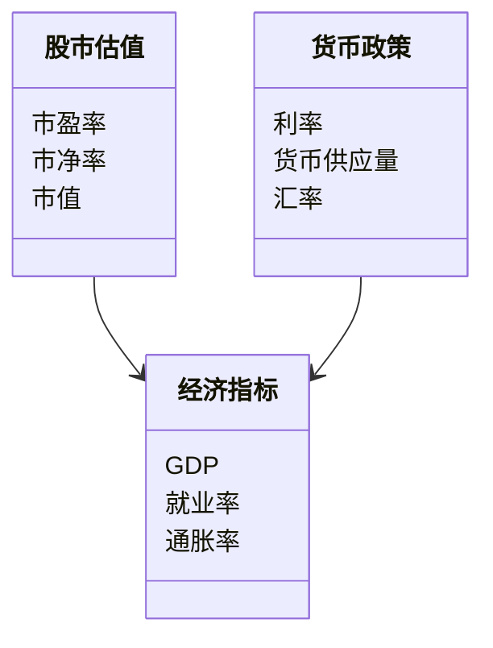

                 


# 全球股市估值与货币政策的关系

## 关键词：全球股市估值、货币政策、经济指标、数学模型、系统架构

## 摘要：本文探讨全球股市估值与货币政策之间的复杂关系，分析货币政策如何影响股市估值，并通过数学模型和系统架构设计提供深入的见解。文章从背景介绍、核心概念、数学模型、系统架构、项目实战等方面进行详细分析，最后总结最佳实践和未来研究方向。

---

## 第一部分: 全球股市估值与货币政策关系的背景与核心概念

---

### 第1章: 全球股市估值与货币政策关系的背景介绍

#### 1.1 问题背景与定义
股票市场估值是衡量市场整体价值的重要指标，通常通过市盈率（P/E）、市净率（P/B）等指标来衡量。货币政策是政府通过调整利率、货币供应量等工具来影响经济活动的政策。两者之间的关系复杂，但货币政策的变化往往会影响股市估值。

#### 1.2 核心概念的结构与组成
股市估值的核心指标包括：
- 市盈率（P/E）：股价与每股收益的比率。
- 市净率（P/B）：股价与每股净资产的比率。
- 市值：所有流通股的总市值。

货币政策的核心工具包括：
- 利率：中央银行调整基准利率。
- 货币供应量：通过货币政策工具调节货币流通量。
- 汇率：本国货币与外国货币的兑换比率。

#### 1.3 问题解决的边界与外延
本文研究的边界包括主要经济体（如美国、欧洲、日本）的股市估值和货币政策，外延则不包括新兴市场或区域市场的特殊情况。

---

### 第2章: 股市估值与货币政策的核心概念对比

#### 2.1 核心概念的属性特征对比
| 属性 | 股市估值 | 货币政策 |
|------|---------|----------|
| 目标 | 反映市场整体价值 | 影响经济活动 |
| 工具 | 市盈率、市净率等 | 利率、货币供应量等 |
| 变化速度 | 较快 | 较慢 |
| 影响因素 | 经济数据、企业盈利 | 政策决策、经济指标 |

#### 2.2 股市估值与货币政策的关系模型
通过ER图展示两者的关系：


---

## 第二部分: 股市估值与货币政策关系的数学模型

---

### 第3章: 股市估值与货币政策关系的数学模型

#### 3.1 基本模型介绍
股市估值（V）与货币政策（M）、预期（E）、风险因素（R）的关系：
$$ V = f(M, E, R) $$

#### 3.2 多元回归模型
$$ V = \beta_0 + \beta_1 M + \beta_2 E + \beta_3 R + \epsilon $$

#### 3.3 案例分析与模型应用
以2020年新冠疫情为例，分析货币政策宽松对股市估值的影响。

---

## 第三部分: 股市估值与货币政策关系的系统分析与架构设计

---

### 第4章: 股市估值与货币政策关系的系统分析与架构设计

#### 4.1 系统分析与设计
通过类图展示核心概念：


#### 4.2 系统架构设计
系统架构图：


#### 4.3 接口设计与交互
系统接口设计：
- 数据获取接口：从金融数据库获取数据。
- 模型分析接口：调用回归模型进行分析。
- 结果可视化接口：生成图表并展示结果。

---

## 第四部分: 股市估值与货币政策关系的项目实战

---

### 第5章: 股市估值与货币政策关系的项目实战

#### 5.1 环境安装与配置
安装必要的Python库：
```bash
pip install numpy pandas matplotlib
```

#### 5.2 核心实现源代码
实现多元回归模型的代码：
```python
import numpy as np
import pandas as pd
from sklearn.linear_model import LinearRegression
from sklearn.metrics import mean_squared_error

# 数据准备
data = pd.DataFrame({
    'M': [1, 2, 3, 4, 5],
    'E': [6, 7, 8, 9, 10],
    'R': [11, 12, 13, 14, 15],
    'V': [200, 250, 300, 350, 400]
})

# 模型训练
model = LinearRegression()
model.fit(data[['M', 'E', 'R']], data['V'])

# 预测与评估
predictions = model.predict(data[['M', 'E', 'R']])
mse = mean_squared_error(data['V'], predictions)
print(f'MSE: {mse}')
print(f'R-squared: {model.score(data[['M', 'E', 'R']], data['V'])}')
```

#### 5.3 代码应用解读与分析
- 数据准备：构建包含货币政策、预期、风险因素和股市估值的数据集。
- 模型训练：使用线性回归模型进行拟合。
- 预测与评估：计算均方误差（MSE）和决定系数（R-squared）。

#### 5.4 案例分析与详细讲解
以实际数据为例，分析货币政策变化对股市估值的具体影响。

#### 5.5 项目小结
总结项目实现的关键步骤和成果。

---

## 第五部分: 总结与展望

---

### 第6章: 总结与展望

#### 6.1 最佳实践 tips
- 数据质量：确保数据来源可靠。
- 模型选择：根据实际情况选择合适的模型。
- 风险控制：注意模型的局限性和数据的适用性。

#### 6.2 小结
本文通过数学模型和系统架构设计，深入分析了全球股市估值与货币政策之间的关系。

#### 6.3 注意事项
- 股市估值受多种因素影响，模型仅供参考。
- 货币政策的效果可能需要时间滞后。

#### 6.4 拓展阅读
建议进一步研究其他经济指标对股市估值的影响，以及货币政策的滞后效应。

---

通过本文的系统分析，读者可以深入了解全球股市估值与货币政策之间的复杂关系，并通过实际案例和代码实现，掌握相关分析方法。

