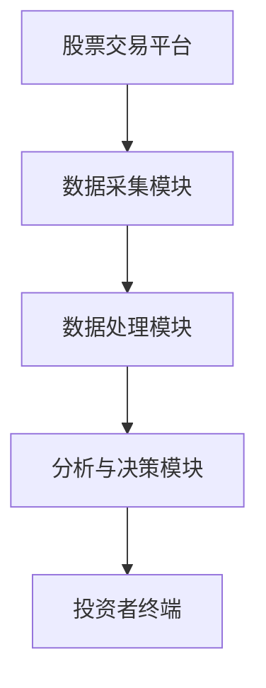

                 


# 全球股市估值与边缘计算在自动驾驶中的应用

---

## 关键词：
- 全球股市估值
- 边缘计算
- 自动驾驶
- 实时数据分析
- 投资决策支持

---

## 摘要：
本文探讨了全球股市估值与边缘计算在自动驾驶中的应用。首先，分析了全球股市估值的核心概念与方法，包括市盈率、市净率等关键指标。接着，深入探讨了边缘计算在自动驾驶中的技术架构与应用场景，重点分析了边缘计算如何通过实时数据处理和决策支持提升自动驾驶系统的性能。最后，结合实际案例，展示了边缘计算在股市估值中的应用，特别是在实时股票价格预测和自动驾驶公司估值模型中的应用。本文旨在为技术专家、投资者和汽车行业从业者提供深入的理论支持和实践指导。

---

## 第1章：引言

### 1.1 背景与重要性
自动驾驶技术的快速发展依赖于实时数据处理和高效计算能力，而边缘计算在这一领域扮演着关键角色。与此同时，股市估值作为投资决策的核心依据，也需要借助先进的技术手段来提升分析精度。本文将探讨这两者如何在技术与应用层面相互关联。

---

## 第2章：全球股市估值的核心概念与方法

### 2.1 核心概念
股市估值是通过对公司财务数据和市场因素的分析，评估其内在价值的过程。主要指标包括：
- **市盈率（P/E）**：股价与每股收益的比率。
- **市净率（P/B）**：股价与每股净资产的比率。
- **股息率**：每股股息与股价的比率。

### 2.2 股市估值的方法
#### 2.2.1 基本分析法
基本分析法通过分析公司的财务报表和行业地位，评估其内在价值。常用公式：
$$ \text{内在价值} = \frac{\text{净利润}}{\text{资本成本} - \text{增长率}} $$

#### 2.2.2 技术分析法
技术分析法通过分析历史价格和成交量数据，预测未来价格走势。常用指标包括移动平均线、相对强弱指数（RSI）等。

#### 2.2.3 财务指标分析法
通过分析ROE（净资产收益率）、ROA（资产收益率）等指标，评估公司的盈利能力。

---

## 第3章：边缘计算在自动驾驶中的技术架构

### 3.1 边缘计算的定义与特点
边缘计算是一种分布式计算模式，将数据处理能力推向数据源端，减少延迟并提高实时性。其特点包括：
- **低延迟**：数据在本地处理，减少传输时间。
- **高实时性**：适用于需要快速响应的场景，如自动驾驶中的环境感知和决策。

### 3.2 边缘计算在自动驾驶中的应用场景
#### 3.2.1 环境感知
通过边缘计算实时处理来自摄像头、激光雷达等传感器的数据，实现对周围环境的精准感知。

#### 3.2.2 路径规划
基于实时数据，边缘计算能够快速优化车辆的行驶路径，确保安全与效率。

#### 3.2.3 实时决策
在复杂的交通环境中，边缘计算能够快速做出决策，如紧急制动或变道。

---

## 第4章：边缘计算与全球股市估值的结合

### 4.1 边缘计算在股市分析中的应用
#### 4.1.1 实时数据处理
边缘计算能够实时处理股票市场的高频数据，为投资者提供即时的市场洞察。

#### 4.1.2 投资决策支持
通过分析历史数据和市场趋势，边缘计算可以帮助投资者制定更科学的投资策略。

### 4.2 案例分析：实时股票价格预测
#### 4.2.1 数据采集与预处理
从股票交易平台获取实时数据，进行清洗和特征提取。

#### 4.2.2 模型构建与训练
使用LSTM（长短期记忆网络）模型进行时间序列预测。

#### 4.2.3 模型部署与应用
将训练好的模型部署到边缘计算节点，实现实时预测。

---

## 第5章：系统分析与架构设计

### 5.1 系统功能模块设计
#### 5.1.1 数据采集模块
负责从股票交易平台获取实时数据。

#### 5.1.2 数据处理模块
对数据进行清洗、转换和特征提取。

#### 5.1.3 分析与决策模块
基于处理后的数据，进行估值分析和投资决策。

### 5.2 系统架构设计
使用微服务架构，各模块通过API进行交互。系统架构图如下：



---

## 第6章：项目实战与代码实现

### 6.1 环境安装
安装Python和相关库：
```
pip install numpy pandas tensorflow
```

### 6.2 核心代码实现
#### 数据预处理
```python
import pandas as pd
import numpy as np

# 加载数据
data = pd.read_csv('stock_data.csv')

# 数据清洗
data = data.dropna()
data['date'] = pd.to_datetime(data['date'])
```

#### LSTM模型实现
```python
from tensorflow.keras.models import Sequential
from tensorflow.keras.layers import LSTM, Dense

# 模型构建
model = Sequential()
model.add(LSTM(64, input_shape=(timesteps, features)))
model.add(Dense(1))
model.compile(loss='mean_squared_error', optimizer='adam')
```

### 6.3 案例分析
以某自动驾驶公司为例，分析其股票估值模型的实现与效果。

---

## 第7章：总结与展望

### 7.1 总结
本文探讨了全球股市估值与边缘计算在自动驾驶中的应用，通过理论分析和案例实践，展示了边缘计算在实时数据分析和投资决策支持中的重要作用。

### 7.2 展望
未来，随着边缘计算技术的不断发展，其在股市估值和自动驾驶领域的应用将更加广泛，推动相关行业的技术进步与创新。

---

## 结语
本文通过系统化的分析和实践，为读者提供了关于全球股市估值与边缘计算在自动驾驶中的应用的深入见解。希望本文能够为相关领域的研究者和从业者提供有价值的参考和启发。

