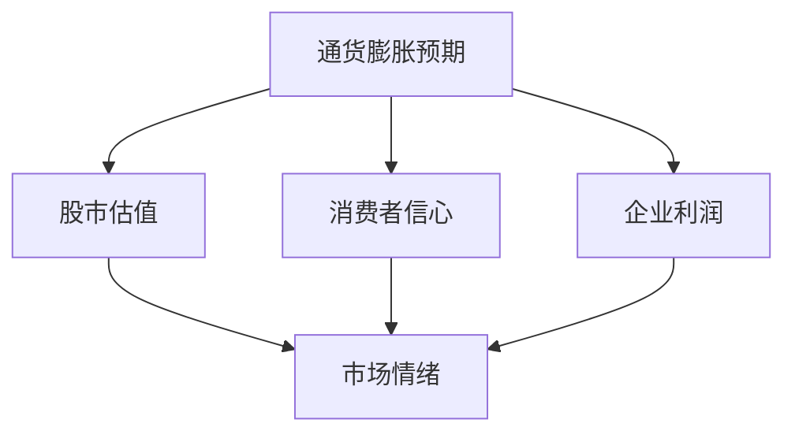
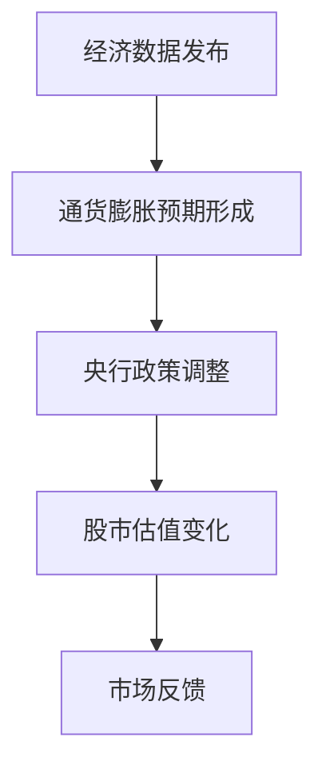

                 

# 全球股市估值与通货膨胀预期的关系

---

## 关键词：  
全球股市估值、通货膨胀预期、经济指标、市场情绪、投资策略

---

## 摘要：  
本文探讨了全球股市估值与通货膨胀预期之间的关系，分析了通货膨胀预期如何影响股市估值的计算与变化。通过系统的理论分析和实证研究，本文揭示了通货膨胀预期对股市估值的核心影响路径，并结合实际案例和数学模型，为投资者和研究者提供了深入的见解。

---

# 第1章: 背景介绍

## 1.1 股市估值与通货膨胀预期的核心概念  
### 1.1.1 股市估值的定义与计算方法  
股市估值是衡量市场整体价值的重要指标，通常通过市盈率（P/E）、市净率（P/B）和股息率（Dividend Yield）等指标来衡量。例如，市盈率 = 股价 / 每股净利润，反映了投资者对股票未来盈利能力的预期。  

### 1.1.2 通货膨胀预期的定义与衡量指标  
通货膨胀预期是指市场参与者对未来物价上涨的预期，常用通胀预期指标（如五年远期通胀.swap rate）和消费者信心指数（如密歇根大学消费者信心指数）来衡量。  

### 1.1.3 两者关系的背景与研究意义  
通货膨胀预期会影响央行货币政策，进而影响市场利率和企业盈利，最终对股市估值产生深远影响。研究这一关系对投资者制定投资策略和央行制定货币政策具有重要意义。  

## 1.2 问题背景与研究现状  
### 1.2.1 通货膨胀对股市估值的影响  
通货膨胀可能导致企业成本上升，降低利润率，但适度的通胀可能通过提升需求和企业盈利间接推动股市上涨。  

### 1.2.2 全球化背景下股市与通胀的关系  
全球化使得资本流动更加频繁，通货膨胀预期的影响因素更加复杂，不同地区股市对通胀的敏感度也存在差异。  

### 1.2.3 现有研究的不足与创新点  
现有研究多集中于单一市场的分析，本文将从全球视角出发，结合多市场数据，深入探讨通货膨胀预期对全球股市估值的综合影响。  

## 1.3 问题解决与边界条件  
### 1.3.1 问题解决的思路与方法  
本文通过构建数学模型和实证分析，量化通货膨胀预期对全球股市估值的影响。  

### 1.3.2 边界条件与假设  
本文假设市场参与者理性预期，数据为公开且可获取的市场数据。  

### 1.3.3 核心概念的结构与要素  
通货膨胀预期与股市估值的关系涉及经济政策、市场情绪和企业盈利等多个要素。  

---

# 第2章: 核心概念与联系

## 2.1 核心概念的原理与属性  
### 2.1.1 通货膨胀预期的形成机制  
通货膨胀预期由市场参与者的理性预期和非理性预期共同构成，受到经济数据、央行政策和市场情绪的综合影响。  

### 2.1.2 股市估值的影响因素  
股市估值受宏观经济、企业盈利、市场情绪等多重因素影响，其中通货膨胀预期是重要的间接影响因素。  

### 2.1.3 两者关系的属性对比  
| 属性 | 通货膨胀预期 | 股市估值 |
|------|--------------|----------|
| 时间性 | 预期性       | 当前性    |
| 影响范围 | 宏观经济     | 金融市场    |
| 可测性 | 可测量       | 可测量     |

## 2.2 核心概念的ER实体关系图  

## 2.3 核心概念的流程图  

---

# 第3章: 通货膨胀预期的形成机制与数学模型

## 3.1 通货膨胀预期的形成机制  
### 3.1.1 微观层面的预期形成  
投资者基于历史通胀数据和未来经济展望形成通胀预期，例如，消费者对未来油价和食品价格上涨的预期。  

### 3.1.2 宏观层面的预期整合  
中央银行通过货币政策框架和通胀目标制度影响市场预期，例如美联储的通胀目标为2%。  

## 3.2 通货膨胀预期的数学模型  
### 3.2.1 预期通货膨胀率公式  
$$ \pi_t^e = \alpha + \beta \cdot \pi_{t-1} + \gamma \cdot y_{t} + \epsilon_t $$  
其中，$\pi_t^e$为通胀预期，$\pi_{t-1}$为过去通胀率，$y_t$为GDP增长率，$\epsilon_t$为误差项。  

### 3.2.2 模型的假设与参数解释  
参数$\beta$和$\gamma$分别衡量过去通胀和GDP对通胀预期的影响程度。  

---

# 第4章: 股市估值的计算与影响因素

## 4.1 股市估值的计算方法  
### 4.1.1 市盈率法  
市盈率法通过比较股票价格与每股收益的比率，评估股票的相对价值。  

### 4.1.2 市净率法  
市净率法通过比较股票价格与每股净资产的比率，适用于评估银行等资产密集型行业。  

## 4.2 股市估值的影响因素  
### 4.2.1 宏观经济因素  
包括利率、通货膨胀、GDP增长等，其中通货膨胀预期通过影响利率和企业盈利间接影响股市估值。  

### 4.2.2 企业盈利状况  
企业盈利是股市估值的核心驱动因素，通货膨胀预期通过影响企业成本和利润间接影响股市估值。  

### 4.2.3 市场情绪与投资者行为  
市场情绪是股市估值的重要短期影响因素，通货膨胀预期可能通过影响市场情绪间接影响股市估值。  

---

# 第5章: 全球股市与通货膨胀的关系分析

## 5.1 全球主要股市的通货膨胀影响比较  
### 5.1.1 美国股市  
美联储的货币政策对美国股市影响显著，通胀预期上升可能导致股市估值下降。  

### 5.1.2 欧洲股市  
欧洲央行的通胀目标对欧洲股市影响较大，通胀预期下降可能导致股市估值上升。  

### 5.1.3 亚洲股市  
亚洲股市对通货膨胀预期的敏感度较低，更多受到本地经济政策的影响。  

## 5.2 不同经济周期下的关系变化  
### 5.2.1 经济衰退期  
通货膨胀预期较低，央行宽松政策可能导致股市估值上升。  

### 5.2.2 经济复苏期  
通货膨胀预期上升，企业盈利改善，股市估值上升。  

### 5.2.3 经济过热期  
通货膨胀预期过高，央行加息可能导致股市估值下降。  

## 5.3 地缘政治  
地缘政治冲突可能导致通货膨胀预期上升，进而影响全球股市估值。  

---

# 第6章: 总结与展望

## 6.1 全文总结  
通货膨胀预期是影响全球股市估值的重要因素，其影响路径复杂且多变。  

## 6.2 研究局限性  
本文主要基于公开数据进行分析，未考虑市场参与者的非理性预期。  

## 6.3 未来研究方向  
未来研究可以进一步结合大数据和机器学习技术，深入分析通货膨胀预期对全球股市估值的实时影响。  

---

**小结：**  
通过本文的系统分析，读者可以更好地理解通货膨胀预期与全球股市估值之间的关系，并能够在此基础上制定更为科学的投资策略。

