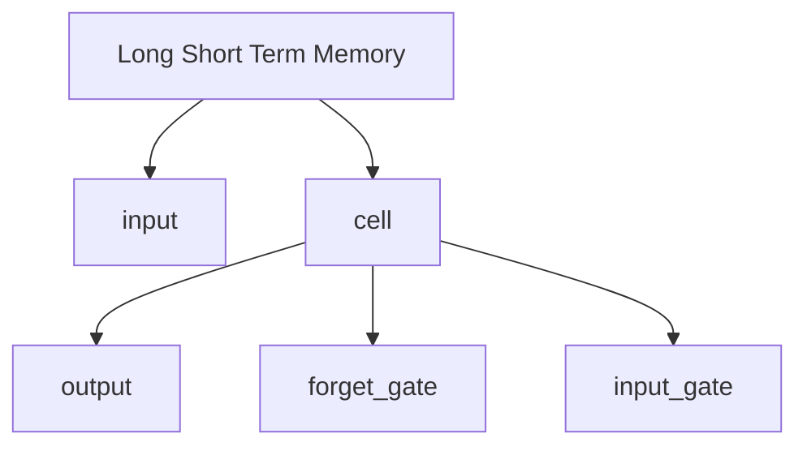

                 

# 全球股市估值与量子传感器在医疗诊断中的应用

> **关键词**：全球股市估值、量子传感器、医疗诊断、大数据分析、人工智能、量子计算

> **摘要**：  
本文探讨了全球股市估值与量子传感器在医疗诊断中的应用，分析了大数据和人工智能如何革新股市估值方法，以及量子传感器如何提升医疗诊断的精准性。文章从理论基础、算法原理到实际应用案例，深入浅出地介绍了这两个领域的最新进展，并展望了它们未来的发展方向。

---

## 第一部分：全球股市估值的理论与实践

### 第1章：全球股市估值的背景与挑战

#### 1.1 股市估值的核心概念

股市估值是通过对公司财务数据、市场趋势和宏观经济指标的分析，评估公司股票的内在价值。传统估值方法包括市盈率（P/E）、市净率（P/B）和股息率等指标。然而，这些方法在面对复杂市场环境时，往往显得力不从心，尤其是在数据量爆炸增长的今天，传统方法难以捕捉市场的动态变化。

#### 1.2 传统估值方法的局限性

传统的估值方法依赖于历史数据和简单统计模型，难以应对以下挑战：
- **数据复杂性**：金融市场数据呈现高度非线性特征，传统模型难以捕捉。
- **市场波动性**：突发事件和市场情绪变化对股价影响巨大，传统模型难以实时调整。
- **多因素影响**：宏观经济指标、行业趋势和公司基本面等多重因素交织，增加了估值的难度。

#### 1.3 大数据与AI在股市估值中的作用

大数据和人工智能技术的引入，为股市估值带来了新的可能性：
- **数据处理能力**：AI能够处理海量数据，发现传统方法难以察觉的模式。
- **实时性**：通过实时数据分析，AI可以在市场变化中快速调整估值模型。
- **复杂性建模**：深度学习模型能够捕捉数据中的非线性关系，提高估值的准确性。

---

### 第2章：基于大数据的股市估值模型

#### 2.1 数据驱动的估值方法

数据驱动的估值方法依赖于大量历史数据和实时市场数据，通过机器学习算法进行分析。以下是几种常用的算法：

##### 2.1.1 线性回归模型

线性回归是一种简单而有效的统计方法，适用于线性关系的分析。其基本公式为：
$$ y = \beta_0 + \beta_1x + \epsilon $$
其中，$y$ 是目标变量（股票价格），$x$ 是自变量（如市盈率），$\beta_0$ 和 $\beta_1$ 是回归系数，$\epsilon$ 是误差项。

##### 2.1.2 支持向量机（SVM）

SVM通过构建超平面将数据点分到不同类别中。在股票估值中，SVM可以用于分类问题，如判断股票是否被高估或低估。SVM的数学模型如下：
$$ \text{minimize } \frac{1}{2}||\mathbf{w}||^2 $$
$$ \text{subject to } y_i(\mathbf{w} \cdot \mathbf{x_i} + b) \geq 1, \forall i $$

##### 2.1.3 随机森林与神经网络

随机森林通过构建多个决策树并进行投票，提高模型的泛化能力。神经网络则通过多层结构模拟人脑的思维方式，能够处理复杂的非线性关系。

---

#### 2.2 常见的股市估值算法

##### 2.2.1 ARIMA模型

ARIMA模型是一种常用的时间序列分析方法，适用于预测股票价格的变化趋势。其基本公式为：
$$ \phi(\mathbb{B})X_t = \theta(\mathbb{B})\epsilon_t $$

##### 2.2.2 LSTM网络

LSTM（长短期记忆网络）通过记忆单元和遗忘门，有效捕捉时间序列中的长期依赖关系。其结构如下图所示：

##### 2.2.3 趋势分析与异常检测

趋势分析通过移动平均线和MACD指标，判断市场的买卖信号。异常检测则通过统计方法识别市场中的突发事件，如市场崩盘。

---

### 第3章：量子计算在金融分析中的应用

#### 3.1 量子计算的基本原理

量子计算利用量子叠加和量子纠缠的特性，能够在指数级时间内完成复杂计算。其核心算法包括量子傅里叶变换和量子线性方程组求解。

##### 3.1.1 量子叠加

量子叠加允许量子位同时处于多个状态，这在金融建模中可以同时分析多种市场情景。

##### 3.1.2 量子纠缠

量子纠缠使得量子位之间的状态相互依赖，能够提高计算的并行性。

---

#### 3.2 量子计算在股市估值中的优势

量子计算在以下方面具有显著优势：
- **计算速度**：量子算法可以在多项式时间内解决NP难问题。
- **数据处理能力**：量子传感器能够实时采集和处理海量数据，提高估值的准确性。

---

## 第二部分：量子传感器在医疗诊断中的应用

### 第4章：量子传感器的基本原理与技术

#### 4.1 量子传感器的核心概念

量子传感器通过测量量子系统的状态变化，实现对目标对象的精确感知。其核心优势在于高灵敏度和高精度。

##### 4.1.1 量子干涉

量子干涉通过测量光波干涉图样，获取目标物体的形状和结构信息。

##### 4.1.2 量子测量

量子测量通过测量量子位的状态，实现对目标参数的精确测量。

---

#### 4.2 量子传感器在医疗中的应用

量子传感器在医疗诊断中的应用主要体现在：
- **疾病检测**：通过检测生物分子的量子特性，实现疾病的早期诊断。
- **精准医疗**：通过个性化检测，制定精准的治疗方案。

---

### 第5章：量子传感器与医疗诊断的结合

#### 5.1 量子传感器在疾病检测中的应用

通过量子传感器，可以实现对疾病标志物的高灵敏度检测。例如，在癌症早期检测中，量子传感器能够检测血液中的微量生物标记物。

#### 5.2 量子传感器在精准医疗中的应用

量子传感器可以用于个性化医疗，通过精确测量患者生理参数，制定个性化的治疗方案。

---

## 第三部分：总结与展望

### 第6章：总结

本文探讨了全球股市估值与量子传感器在医疗诊断中的应用，分析了大数据和人工智能如何革新股市估值方法，以及量子传感器如何提升医疗诊断的精准性。

### 第7章：未来展望

未来，随着量子计算和量子传感器技术的进一步发展，股市估值和医疗诊断将变得更加精准和高效。量子技术与传统技术的结合，将推动金融和医疗领域的技术革命。

---

通过本文的分析，我们可以看到，全球股市估值与量子传感器在医疗诊断中的应用，不仅推动了技术的进步，也为人类社会带来了巨大的价值。

