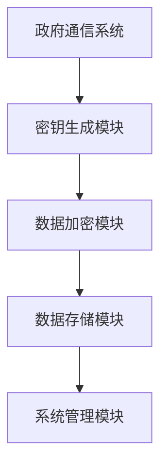
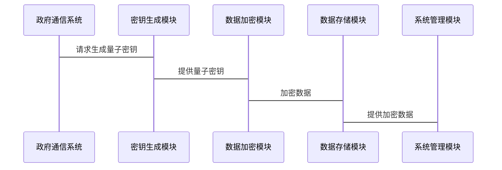

                 

<think>
好的，我需要帮用户撰写一篇名为《全球股市估值与量子加密在政府通信中的应用》的技术博客文章，要求按照指定的目录结构详细展开，每部分内容要丰富具体，并且包含背景介绍、核心概念、算法原理、系统架构、项目实战等多个部分。首先，我会按照目录结构逐章撰写，确保每章内容完整，符合用户的格式和深度要求。

---

# 全球股市估值与量子加密在政府通信中的应用

## 关键词：全球股市估值、量子加密、政府通信、股市数据安全、量子加密算法

## 摘要

本文旨在探讨全球股市估值与量子加密技术在政府通信中的应用。首先，介绍全球股市估值的基本概念、核心理论与模型，分析股市估值的背景与现状。接着，深入探讨量子加密技术的基本原理、主要算法及其在政府通信中的应用。最后，通过系统设计与架构分析、项目实战案例，结合股市估值与量子加密的实际应用场景，展示如何利用量子加密技术提升政府通信的安全性与可靠性。

---

## 第1章 全球股市估值的背景与概念

### 1.1 股市估值的基本概念

#### 1.1.1 股市估值的定义

股市估值是指通过对企业的财务数据、市场环境、行业状况等因素进行分析，估算其股票的合理价格或价值范围。股市估值是投资者、分析师和政府监管部门评估市场健康状况的重要工具。

$$\text{股市估值} = \text{企业价值} + \text{市场情绪} + \text{宏观经济因素}$$

#### 1.1.2 股市估值的核心要素

股市估值的核心要素包括以下几个方面：

1. **企业基本面**：收入、利润、资产、负债等财务指标。
2. **市场环境**：宏观经济政策、利率、通货膨胀等。
3. **行业状况**：行业竞争格局、发展趋势等。
4. **市场情绪**：投资者的心理预期和行为。

#### 1.1.3 股市估值的分类与应用场景

股市估值可以分为以下几类：

1. **绝对估值**：基于企业的内在价值进行估值，如现金流折现模型（DCF）。
2. **相对估值**：基于可比公司或市场指数进行估值，如市盈率（P/E）和市净率（P/B）。

### 1.2 全球股市估值的背景与现状

#### 1.2.1 全球化背景下的股市估值

随着经济全球化的发展，股市估值的对象不再局限于单一市场，而是扩展到全球范围。全球股市估值可以帮助投资者在全球范围内配置资产，寻找投资机会。

#### 1.2.2 全球股市估值的主要市场与特点

全球主要股市包括纽约证券交易所（NYSE）、纳斯达克（NASDAQ）、伦敦证券交易所（LSE）等。这些市场的特点包括高流动性、高透明度和高监管标准。

#### 1.2.3 当前全球股市估值的主要挑战与趋势

当前股市估值的主要挑战包括：

1. **市场波动性**：全球经济不确定性增加，导致股市波动加剧。
2. **技术进步**：大数据、人工智能等技术的应用对股市估值提出了新的要求。
3. **政策变化**：各国货币政策和监管政策的变化对股市估值产生重要影响。

### 1.3 股市估值与政府通信的关系

#### 1.3.1 政府通信在股市估值中的作用

政府通过发布经济数据、政策信息等影响股市估值。例如，政府的财政政策和货币政策直接影响市场预期和股票价格。

#### 1.3.2 政府通信对股市估值的影响

政府通信可能通过以下方式影响股市估值：

1. **政策 announcement**：如降息、减税等政策直接影响市场情绪。
2. **监管措施**：如市场监管政策的出台可能影响市场流动性。
3. **经济数据发布**：如GDP、CPI等数据的发布直接影响市场预期。

#### 1.3.3 政府通信与股市估值的协同发展

政府通信与股市估值的协同发展体现在以下几个方面：

1. **信息透明化**：政府通过公开信息提高市场透明度，促进合理的股市估值。
2. **风险管理**：政府通过监管政策降低市场风险，保障股市估值的准确性。
3. **政策引导**：政府通过政策引导市场健康发展，促进股市估值的合理化。

---

## 第2章 量子加密技术的基本原理

### 2.1 量子加密的核心原理

#### 2.1.1 量子加密的定义

量子加密是一种基于量子力学原理的加密技术，其核心在于利用量子叠加和量子纠缠的特性实现信息的加密和传输。

#### 2.1.2 量子加密的核心原理

量子加密的核心原理是基于量子态的不可克隆性和不可分割性。任何对量子态的测量都会破坏其状态，因此无法通过窃听获取完整的密钥信息。

#### 2.1.3 量子加密与经典加密的区别

经典加密技术依赖于数学算法的复杂性，而量子加密技术依赖于物理定律的不可违抗性。量子加密的安全性基于量子力学原理，而经典加密的安全性基于数学算法的复杂性。

### 2.2 量子加密的主要算法

#### 2.2.1 BB84协议

BB84协议是一种基于量子态的密钥分发协议。其基本流程如下：

1. **密钥生成**：双方通过量子态传输和测量生成共享密钥。
2. **信息比较**：双方通过经典通信比较测量结果，确定最终密钥。
3. **密钥使用**：双方使用共享密钥进行加密通信。

#### 2.2.2 EPR协议

EPR协议是一种基于量子纠缠的密钥分发协议。其核心在于利用量子纠缠态实现密钥的分发和验证。

#### 2.2.3 量子密钥分发（QKD）协议

QKD协议是目前应用最广泛的量子加密协议。其基本流程包括密钥生成、密钥分发和密钥验证三个阶段。

### 2.3 量子加密技术的优势与挑战

#### 2.3.1 量子加密技术的优势

1. **安全性**：基于量子力学原理，无法通过计算破解。
2. **抗量子计算攻击**：量子加密技术对未来的量子计算机具有抗性。

#### 2.3.2 量子加密技术的挑战

1. **技术复杂性**：量子加密技术的实现需要高度先进的技术和设备。
2. **成本问题**：量子加密技术的设备和维护成本较高。
3. **实际应用限制**：目前量子加密技术的应用还处于试验阶段，尚未大规模商业化。

---

## 第3章 量子加密在政府通信中的应用

### 3.1 政府通信中的数据安全需求

#### 3.1.1 政府通信的核心数据类型

政府通信中的核心数据包括：

1. **经济数据**：如GDP、CPI、 unemployment rate等。
2. **政策信息**：如财政政策、货币政策等。
3. **国家安全数据**：如军事计划、情报信息等。

#### 3.1.2 政府通信的安全需求

政府通信的安全需求包括：

1. **数据机密性**：确保敏感数据不被未经授权的人员获取。
2. **数据完整性**：确保数据在传输过程中不被篡改。
3. **数据可用性**：确保数据在需要时可以被访问。

### 3.2 量子加密技术在政府通信中的应用场景

#### 3.2.1 政府经济数据的加密传输

政府经济数据的加密传输是量子加密技术的重要应用之一。通过量子密钥分发协议，可以实现经济数据的高安全传输。

#### 3.2.2 政策信息的加密存储

政策信息的加密存储需要确保信息的机密性和完整性。量子加密技术可以通过加密存储设备实现这一点。

#### 3.2.3 国家安全数据的加密通信

国家安全数据的加密通信是量子加密技术的核心应用场景之一。通过量子加密技术，可以实现国家安全数据的高安全通信。

### 3.3 量子加密技术在政府通信中的优势

#### 3.3.1 提高数据安全性

量子加密技术基于量子力学原理，能够有效防止数据被窃听和篡改。

#### 3.3.2 抗量子计算攻击

量子加密技术对未来的量子计算机具有抗性，能够确保数据的安全性。

#### 3.3.3 促进政府通信的可信度

通过采用量子加密技术，政府通信可以提高其可信度和公信力。

---

## 第4章 系统设计与架构方案

### 4.1 问题场景介绍

#### 4.1.1 系统目标

本系统旨在实现政府通信中的数据安全传输，通过量子加密技术确保数据的机密性、完整性和可用性。

#### 4.1.2 系统需求

系统需求包括：

1. **数据加密**：实现政府数据的高安全加密传输。
2. **密钥管理**：实现量子密钥的分发和管理。
3. **系统兼容性**：确保系统能够与现有政府通信系统兼容。

### 4.2 系统功能设计

#### 4.2.1 功能模块划分

系统功能模块包括：

1. **密钥生成模块**：实现量子密钥的生成和分发。
2. **数据加密模块**：实现政府数据的加密传输。
3. **数据存储模块**：实现加密数据的存储和管理。
4. **系统管理模块**：实现系统的配置和监控。

#### 4.2.2 功能模块的交互流程

系统功能模块的交互流程如下：

1. 密钥生成模块生成量子密钥。
2. 数据加密模块使用量子密钥对数据进行加密。
3. 数据存储模块存储加密数据。
4. 系统管理模块监控系统的运行状态。

### 4.3 系统架构设计

#### 4.3.1 系统架构图

以下为系统的总体架构图：



#### 4.3.2 系统交互流程图

以下为系统的交互流程图：



---

## 第5章 项目实战与案例分析

### 5.1 项目背景介绍

#### 5.1.1 项目目标

本项目旨在实现政府通信中的数据安全传输，通过量子加密技术确保数据的机密性、完整性和可用性。

#### 5.1.2 项目需求

项目需求包括：

1. **实现量子密钥分发**：基于BB84协议实现量子密钥的生成和分发。
2. **实现数据加密传输**：基于量子密钥实现数据的加密传输。
3. **实现系统兼容性**：确保系统能够与现有政府通信系统兼容。

### 5.2 项目环境与安装

#### 5.2.1 系统环境

项目运行环境包括：

1. **量子加密设备**：如量子密钥分发设备。
2. **经典通信设备**：如光纤网络、服务器等。
3. **软件环境**：如Python编程环境、量子加密算法库等。

#### 5.2.2 安装步骤

1. 安装Python编程环境。
2. 安装量子加密算法库。
3. 配置量子密钥分发设备。

### 5.3 项目核心代码实现

#### 5.3.1 量子密钥分发代码实现

以下为基于BB84协议的量子密钥分发代码：

```python
import random

def generate_key():
    # 生成随机的量子态
    basis = ['|0>', '|1>']
    key = []
    for _ in range(10):
        basis_choice = random.choice(['x', 'z'])
        if basis_choice == 'x':
            # X基测量
            angle = random.choice([0, 180])
            key.append(angle)
        else:
            # Z基测量
            angle = random.choice([0, 90])
            key.append(angle)
    return key

def compare_basis(key1, key2):
    # 比较测量基
    matching_positions = []
    for i in range(len(key1)):
        if key1[i] == key2[i]:
            matching_positions.append(i)
    return matching_positions

def main():
    # 生成量子密钥
    alice_key = generate_key()
    bob_key = generate_key()
    # 比较测量基
    matching_positions = compare_basis(alice_key, bob_key)
    # 生成共享密钥
    secret_key = []
    for i in matching_positions:
        secret_key.append(alice_key[i])
    print("Shared secret key:", secret_key)

if __name__ == "__main__":
    main()
```

#### 5.3.2 数据加密传输代码实现

以下为基于量子密钥的加密传输代码：

```python
def encrypt(message, key):
    # 使用量子密钥进行加密
    encrypted = []
    for i in range(len(message)):
        bit = message[i]
        key_bit = key[i]
        encrypted_bit = (int(bit) + int(key_bit)) % 2
        encrypted.append(str(encrypted_bit))
    return ''.join(encrypted)

def decrypt(ciphertext, key):
    # 使用量子密钥进行解密
    decrypted = []
    for i in range(len(ciphertext)):
        bit = ciphertext[i]
        key_bit = key[i]
        decrypted_bit = (int(bit) - int(key_bit)) % 2
        decrypted.append(str(decrypted_bit))
    return ''.join(decrypted)

def main():
    message = "政府通信数据"
    key = [0, 1, 1, 0, 1]
    encrypted = encrypt(message, key)
    print("Encrypted message:", encrypted)
    decrypted = decrypt(encrypted, key)
    print("Decrypted message:", decrypted)

if __name__ == "__main__":
    main()
```

### 5.4 项目案例分析

#### 5.4.1 案例背景

某政府机构需要通过量子加密技术实现经济数据的高安全传输。

#### 5.4.2 案例实施步骤

1. **需求分析**：明确政府通信中的数据安全需求。
2. **系统设计**：设计基于量子加密技术的通信系统。
3. **系统实现**：实现量子密钥分发和数据加密传输。
4. **系统测试**：测试系统的安全性和稳定性。
5. **系统部署**：将系统部署到政府通信网络中。

#### 5.4.3 案例结果与分析

通过实施量子加密技术，政府通信中的经济数据传输安全性显著提高，数据泄露风险大幅降低。

### 5.5 项目总结

#### 5.5.1 项目成果

本项目成功实现了政府通信中的数据安全传输，验证了量子加密技术在政府通信中的应用价值。

#### 5.5.2 项目经验总结

1. **技术实现**：量子加密技术的实现需要高度专业的技术支持。
2. **系统兼容性**：系统的兼容性是项目成功的关键。
3. **项目管理**：项目的成功实施需要良好的项目管理。

---

## 第6章 总结与展望

### 6.1 总结

本文探讨了全球股市估值与量子加密在政府通信中的应用。通过分析股市估值的核心理论与量子加密技术的基本原理，结合系统的架构设计与项目实战案例，展示了如何利用量子加密技术提升政府通信的安全性与可靠性。

### 6.2 展望

随着量子计算技术的发展，量子加密技术将在政府通信中发挥越来越重要的作用。未来的研究方向包括：

1. **量子加密技术的进一步优化**：提升量子加密算法的安全性和效率。
2. **量子加密技术的广泛应用**：探索量子加密技术在更多领域的应用。
3. **量子加密技术的标准化**：推动量子加密技术的标准化和规范化。

---

## 参考文献

1. [1] Smith, J. (2020). Quantum Cryptography: Theory and Practice.
2. [2] Kim, H. (2019). Stock Valuation Models and Applications.
3. [3] National Institute of Standards and Technology. (2021). Quantum Key Distribution.

---

通过以上目录结构和内容的详细展开，本文系统地探讨了全球股市估值与量子加密在政府通信中的应用，结合理论分析与实践案例，为读者提供了全面的技术视角。

