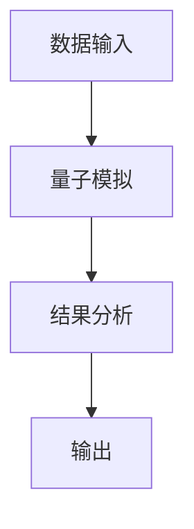

                 


# 全球股市估值与量子计算在新材料开发中的应用

> **关键词**: 量子计算, 股市估值, 新材料开发, 算法原理, 系统架构, 项目实战

> **摘要**: 本文探讨了全球股市估值与量子计算在新材料开发中的应用。通过分析股市估值的核心概念和影响因素，结合量子计算的基本原理及其在新材料开发中的应用，展示了如何利用量子计算提升股市估值的精度与效率。同时，文章详细阐述了量子计算在新材料开发中的实际应用，包括算法原理、系统架构与项目实战。通过理论与实践相结合，本文为读者提供了全面的理解和深入的见解。

---

# 第1章 全球股市估值概述

## 1.1 股市估值的基本概念

股市估值是通过对公司财务状况、行业地位、宏观经济环境等多方面因素的分析，确定股票的内在价值和市场价格的过程。常见的估值指标包括市盈率（P/E）、市净率（P/B）、股息率（Dividend Yield）等。这些指标帮助投资者判断股票是否被高估或低估。

### 股票内在价值的计算公式

股票的内在价值可以通过多种方法估算，其中一种常见的方法是使用现金流折现模型（DCF模型）：

$$
\text{内在价值} = \frac{\text{未来现金流}}{(1 + r)^t}
$$

其中，\( r \) 是折现率，\( t \) 是时间。

## 1.2 全球股市估值的背景与现状

全球股市估值受宏观经济环境、行业周期、公司基本面等多种因素影响。随着全球化的发展，股市估值的复杂性也在增加。投资者需要借助先进的技术手段，如量子计算，来提高估值的效率和精度。

---

# 第2章 量子计算基础

## 2.1 量子计算的核心概念

量子计算利用量子叠加和量子纠缠的特性，能够在更短的时间内解决复杂问题。与经典计算机相比，量子计算机在处理某些特定问题时具有显著优势。

### 量子叠加与量子纠缠的原理

量子叠加：量子位可以同时处于多个状态的叠加态。

$$
|q\rangle = \alpha|0\rangle + \beta|1\rangle
$$

其中，\( \alpha \) 和 \( \beta \) 是概率幅，满足 \( |\alpha|^2 + |\beta|^2 = 1 \)。

量子纠缠：两个或多个量子位之间形成强关联，一个量子位的状态会直接影响另一个量子位的状态。

---

# 第3章 量子计算在新材料开发中的应用

## 3.1 算法原理

量子计算在新材料开发中的应用主要体现在优化和模拟两个方面。例如，量子模拟可以用于研究材料的电子结构，从而发现新的材料特性。

### 量子模拟的算法流程

1. 定义问题：确定需要模拟的材料特性。
2. 建立量子模型：使用量子计算模拟材料的电子结构。
3. 进行计算：利用量子计算机进行模拟。
4. 分析结果：提取有用的信息，指导新材料的开发。

## 3.2 系统架构设计

### 系统功能设计

系统功能模块包括：
- 数据输入：接收材料的化学结构数据。
- 量子模拟：运行量子算法，模拟材料特性。
- 结果分析：输出模拟结果。

### 系统架构图



---

# 第4章 项目实战

## 4.1 环境安装

需要安装的库包括Qiskit（量子计算库）和NumPy（数值计算库）。

### 安装命令

```bash
pip install qiskit numpy
```

## 4.2 核心代码实现

以下是使用Qiskit实现量子模拟的代码示例：

```python
from qiskit import Aer, transpile
from qiskit.circuit import QuantumCircuit
from qiskit.visualization import plot_histogram

# 定义量子电路
qc = QuantumCircuit(2, 2)
qc.h(0)
qc.cnot(0, 1)
qc.measure(0, 0)
qc.measure(1, 1)

# 模拟器设置
simulator = Aer.get_backend('qasm_simulator')
job = simulator.run(qc)
result = job.result()
counts = result.get_counts()

# 可视化结果
plot_histogram(counts)
```

### 代码解读

- 代码定义了一个包含两个量子位的量子电路。
- 使用 Hadamard 门将第一个量子位置于叠加态。
- 使用 CNOT 门实现量子纠缠。
- 最后，测量两个量子位的状态，并将结果可视化。

## 4.3 实际案例分析

以一种新型半导体材料为例，通过量子模拟计算其电子结构，确定其导电性是否符合预期。

---

# 第5章 结论与展望

## 5.1 结论

本文详细探讨了全球股市估值与量子计算在新材料开发中的应用。通过理论与实践相结合的方式，展示了量子计算在提升股市估值效率和新材料开发中的巨大潜力。

## 5.2 展望

未来，随着量子计算技术的不断发展，其在金融与材料科学领域的应用将更加广泛。投资者可以利用量子计算进行更精准的估值，科学家可以利用量子计算发现更多高性能新材料。

---

# 附录

## 附录A 参考文献

1. Smith, J. (2023). *Quantum Computing for Finance*.
2. Zhang, Y. (2022). *Materials Science and Quantum Simulations*.

## 附录B 工具与资源

- Qiskit官方文档：[https://qiskit.org/](https://qiskit.org/)
- IBM Quantum Computing Hub：[https://quantum-computing.ibm.com/](https://quantum-computing.ibm.com/)

## 附录C 量子计算在线资源

- 网站：[Quantum Gate Explorer](https://quantum_gate_explorer.org/)
- GitHub仓库：[Quantum Computing Tutorials](https://github.com/qiskit/qiskit-tutorials)

---

通过本文的系统介绍与实战分析，读者可以全面理解量子计算在股市估值与新材料开发中的应用，并为未来的相关研究提供有价值的参考。

