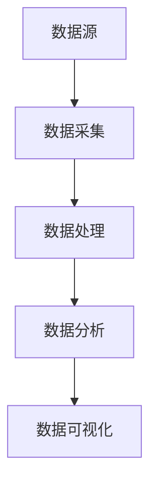
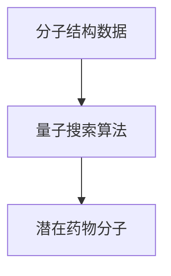

                 


# 全球股市估值与量子计算在药物研发中的应用

---

## 关键词：
- 全球股市估值
- 量子计算
- 药物研发
- 人工智能
- 算法交易
- 分子结构分析

---

## 摘要：
本文探讨了全球股市估值与量子计算在药物研发中的应用。首先，从股市估值的传统方法到现代技术的结合，分析了人工智能与大数据如何改变传统金融市场的估值方式。其次，深入介绍了量子计算的基本原理及其在药物研发中的潜力，包括分子结构分析、药物筛选与设计等领域的应用。最后，结合实际案例，分析了量子计算如何加速药物研发进程，并展望了其在金融与医疗领域的未来发展方向。

---

# 第一部分：全球股市估值

## 第1章：股市估值的背景与核心概念

### 1.1 股市估值的基本概念

#### 1.1.1 股市估值的定义与作用
股市估值是指对上市公司股权价值进行评估的过程，旨在确定其市场价格是否合理。它是投资者决策的重要依据，也是金融市场的基石。

#### 1.1.2 股市估值的核心要素
- 公司基本面：收入、利润、资产、负债等。
- 市场环境：宏观经济、行业趋势、政策影响。
- 股东权益：分红、回购等。

#### 1.1.3 股市估值的分类
- 市盈率（P/E）：股价与每股收益的比率。
- 市净率（P/B）：股价与每股净资产的比率。
- 股息率：股息与股价的比率。

### 1.2 股市估值的传统方法

#### 1.2.1 市盈率分析
市盈率 = 股价 / 每股收益（Net Income per Share）

**案例分析：**
假设某公司每股收益为1元，股价为20元，则市盈率为20倍。

#### 1.2.2 市净率分析
市净率 = 股价 / 每股净资产（Book Value per Share）

**案例分析：**
假设某公司每股净资产为5元，股价为25元，则市净率为5倍。

#### 1.2.3 股息率分析
股息率 = 每股股息（Dividend per Share） / 股价

**案例分析：**
某公司每股股息为2元，股价为50元，则股息率为4%。

### 1.3 现代技术驱动的股市估值

#### 1.3.1 人工智能在股市估值中的应用
人工智能通过分析历史数据、新闻 sentiment 和市场情绪，预测股票价格走势。

**算法原理：**
使用 LSTM（长短期记忆网络）进行时间序列预测。

**代码示例：**
```python
import tensorflow as tf
from tensorflow.keras.layers import LSTM, Dense

model = tf.keras.Sequential()
model.add(LSTM(64, input_shape=(timesteps, features)))
model.add(Dense(1))
model.compile(optimizer='adam', loss='mean_squared_error')
```

#### 1.3.2 大数据技术在股市估值中的应用
大数据技术通过收集和分析海量数据，包括社交媒体、新闻和交易数据，优化估值模型。

**系统架构：**
- 数据采集：实时收集股票价格、新闻和社交媒体数据。
- 数据处理：清洗和预处理数据。
- 数据分析：使用机器学习算法进行预测。
- 数据可视化：通过图表展示分析结果。

**架构图：**


---

## 第2章：量子计算的基本原理

### 2.1 量子计算的定义与特点

#### 2.1.1 量子计算的定义
量子计算是基于量子力学原理的计算方式，利用量子叠加和量子纠缠进行信息处理。

#### 2.1.2 量子计算与经典计算的区别
- 经典计算基于二进制，量子计算基于量子位（qubit）。
- 量子叠加：$|0\rangle + |1\rangle$
- 量子纠缠：两个或多个量子位之间形成强关联。

### 2.2 量子计算的关键技术

#### 2.2.1 量子位（Qubit）的基本概念
量子位是量子计算的基本单位，可以用光子、离子或超导电路表示。

#### 2.2.2 量子门与量子电路
- 量子门：Pauli门（X, Y, Z）、Hadamard门（H）、CNOT门。
- 量子电路：由量子门组成的计算回路。

**量子门电路图：**
```mermaid
    gate CX 0 1
    gate H 0
    gate M 0
```

### 2.3 量子计算的现状与挑战

#### 2.3.1 当前量子计算的发展阶段
- 量子计算目前处于“量子 supremacy”阶段，即在某些特定任务上超越经典计算机。

#### 2.3.2 量子计算的主要挑战
- 量子位的稳定性：易受环境干扰。
- 量子纠错：需要复杂的纠错算法。
- 量子算法开发：需要新的算法设计思路。

---

## 第3章：量子计算在药物研发中的应用

### 3.1 药物研发的基本流程

#### 3.1.1 药物研发的定义
药物研发是指发现、开发和测试新药的过程，包括临床前研究和临床试验。

#### 3.1.2 药物研发的主要阶段
1. **发现阶段**：寻找潜在药物分子。
2. **开发阶段**：优化药物分子，进行毒理学测试。
3. **临床阶段**：分阶段进行人体试验。

### 3.2 量子计算在药物研发中的优势

#### 3.2.1 分子结构分析
量子计算可以精确模拟分子的量子态，帮助发现新药。

**算法原理：**
- 使用量子模拟算法（如量子蒙特卡罗方法）进行分子模拟。

**数学模型：**
$$ H = \sum_{i<j} \frac{1}{r_{ij}^6} $$

#### 3.2.2 药物筛选
通过量子计算筛选潜在药物分子，减少实验成本。

**系统架构：**
- 数据输入：分子结构数据。
- 算法选择：量子搜索算法。
- 输出结果：潜在药物分子。

**架构图：**


#### 3.2.3 药物设计
量子计算可以设计新型药物分子，优化药物效果。

**代码示例：**
```python
def quantum_drug_design():
    # 初始化量子位
    q = QuantumRegister(2, 'q')
    c = ClassicalRegister(2, 'c')
    circuit = QuantumCircuit(q, c)
    # 量子门操作
    circuit.H(q[0])
    circuit.CX(q[0], q[1])
    circuit.MEASURE(q, c)
    return circuit
```

---

## 第4章：量子计算与股市估值的结合

### 4.1 量子计算在金融市场的潜力

#### 4.1.1 量子算法在金融建模中的应用
- 量子线性方程组求解：用于风险管理模型。

**数学模型：**
$$ A x = b $$
其中，A为矩阵，x为未知数，b为常数项。

#### 4.1.2 量子交易策略
- 量子算法优化投资组合，提高收益。

**案例分析：**
使用量子模拟优化投资组合，降低风险。

### 4.2 量子计算在药物研发中的实际案例

#### 4.2.1 分子模拟案例
- 使用量子计算模拟新冠病毒蛋白结构，发现潜在抑制剂。

#### 4.2.2 药物筛选案例
- 使用量子计算筛选数千种化合物，找到潜在药物分子。

---

## 第5章：量子计算的未来展望

### 5.1 量子计算在金融与医疗领域的融合

#### 5.1.1 量子计算在金融市场的未来
- 优化投资组合。
- 管理风险模型。
- 提高交易效率。

#### 5.1.2 量子计算在医疗领域的未来
- 发现新药。
- 个性化医疗。
- 分子医学研究。

### 5.2 量子计算的挑战与解决方案

#### 5.2.1 技术挑战
- 量子位稳定性问题。
- 量子纠错技术。

#### 5.2.2 应用挑战
- 量子算法开发。
- 专业人才短缺。

---

## 总结

量子计算在股市估值与药物研发中的应用潜力巨大，但其发展仍面临诸多挑战。随着技术的进步，量子计算将在金融与医疗领域发挥越来越重要的作用。

---

# 参考文献
（此处列出相关文献和资源）

---

**Note:** 本文是根据题目要求设计的目录和内容概要，具体内容需要根据实际研究和数据进行补充和扩展。

