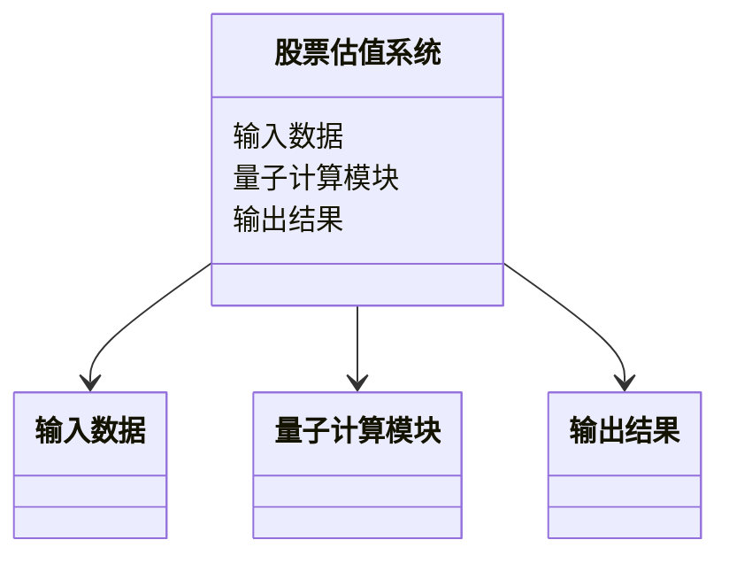

                 


# 全球股市估值与量子计算在金融建模中的应用

> 关键词：全球股市估值、量子计算、金融建模、优化算法、量子计算技术

> 摘要：本文探讨了全球股市估值的现状与挑战，以及量子计算在金融建模中的潜力。通过分析量子计算的基本原理、核心算法及其在股市估值中的应用，本文展示了如何利用量子计算技术提升金融建模的效率和准确性。文章还详细介绍了量子计算在股市估值中的具体实现步骤，并通过系统架构设计和项目实战，进一步验证了其在金融领域的实际应用价值。

---

## 第一部分: 全球股市估值的现状与挑战

### 1.1 全球股市估值的基本概念

#### 1.1.1 什么是股市估值
股市估值是指通过对公司基本面、市场环境、行业趋势等多方面因素的分析，对股票的内在价值进行估算。其目的是帮助投资者判断股票价格是否合理，从而做出投资决策。

#### 1.1.2 股市估值的主要方法
- **相对估值法**：通过比较股票与同行业其他公司的市盈率、市净率等指标，评估其合理价格。
- **绝对估值法**：通过 discounted cash flow (DCF) 等方法，基于公司未来现金流的现值来估算股票价值。

#### 1.1.3 全球股市估值的多样性
全球股市的多样性体现在不同市场环境、法律法规、经济周期等因素对股票估值的影响。例如，新兴市场与成熟市场的估值方法和标准可能存在显著差异。

### 1.2 股市估值的挑战

#### 1.2.1 数据复杂性
股市数据具有高维性和非线性特征，传统的统计方法在处理复杂数据时往往效率低下。

#### 1.2.2 市场波动性
股市价格受到多种不确定因素的影响，如市场情绪、突发事件等，导致估值结果具有较高的波动性。

#### 1.2.3 传统估值方法的局限性
传统估值方法在处理大数据、复杂系统和非线性关系时，往往难以捕捉市场的真实动态，导致估值结果的准确性受限。

---

## 第二部分: 量子计算的基本原理

### 2.1 量子计算的核心概念

#### 2.1.1 量子位与经典位的区别
经典计算机使用二进制位（0或1）进行计算，而量子计算机使用量子位（qubit）进行计算。量子位可以同时处于0和1的叠加态。

#### 2.1.2 量子叠加态与纠缠态
- **量子叠加态**：量子位可以同时处于多个状态的线性组合。
- **量子纠缠态**：多个量子位之间存在强关联，一个量子位的状态会直接影响另一个量子位的状态。

#### 2.1.3 量子计算的基本操作
量子计算的基本操作包括量子门操作（如Hadamard门、CNOT门）和量子测量。

### 2.2 量子计算的数学基础

#### 2.2.1 矩阵与量子态表示
量子态可以用向量表示，量子门可以用矩阵表示。例如，Hadamard门的矩阵表示为：
$$
H = \frac{1}{\sqrt{2}} \begin{bmatrix} 1 & 1 \\ 1 & -1 \end{bmatrix}
$$

#### 2.2.2 量子门与量子电路
量子电路由多个量子门组成，用于实现特定的量子算法。例如，CNOT门的真值表如下：
| 控制输入 (C) | 目标输入 (T) | 输出 (C, T) |
|----------------|----------------|--------------|
| 0              | 0              | (0, 0)       |
| 0              | 1              | (0, 1)       |
| 1              | 0              | (1, 1)       |
| 1              | 1              | (1, 0)       |

#### 2.2.3 量子计算的基本原理
量子计算通过叠加态和纠缠态的特性，能够在某些问题上比经典计算更高效。例如，Shor算法可以在多项式时间内完成大整数分解，而经典算法需要指数时间。

---

## 第三部分: 量子计算在金融建模中的应用

### 3.1 量子计算在金融建模中的优势

#### 3.1.1 处理复杂系统的潜力
量子计算能够处理高维、非线性问题，适合用于金融市场的复杂建模。

#### 3.1.2 加速优化问题的求解
量子计算在优化问题（如组合优化）中的优势显著，能够快速找到最优解。

#### 3.1.3 提高预测准确性
通过量子叠加态和纠缠态的特性，量子计算可以更好地捕捉市场动态，提高预测的准确性。

### 3.2 量子算法在金融建模中的具体应用

#### 3.2.1 量子线性方程组求解
量子算法可以高效地求解线性方程组，适用于金融风险评估中的复杂模型。

#### 3.2.2 量子优化算法
量子优化算法（如量子退火算法）可以用于投资组合优化和资产配置问题。

#### 3.2.3 量子模拟与风险评估
量子计算可以模拟金融市场中的量子态，帮助评估复杂金融产品的风险。

---

## 第四部分: 量子计算在股市估值中的算法实现

### 4.1 量子算法的基本实现步骤

#### 4.1.1 算法选择与设计
根据具体问题选择合适的量子算法，并设计量子电路。

#### 4.1.2 量子电路的构建
使用量子门构建量子电路，并通过量子编程语言（如Qiskit）进行实现。

#### 4.1.3 算法的模拟与验证
在量子计算模拟器上验证算法的正确性和效率。

### 4.2 量子计算在股市估值中的具体实现

#### 4.2.1 数据预处理与量子化
将股市数据转换为适合量子计算的形式，并进行量子化处理。

#### 4.2.2 量子算法的代码实现
以下是使用Qiskit实现的量子算法示例代码：

```python
from qiskit import QuantumCircuit, Aer, execute
from qiskit.circuit import QuantumRegister, ClassicalRegister

# 创建量子寄存器和经典寄存器
q = QuantumRegister(2, 'q')
c = ClassicalRegister(2, 'c')
qc = QuantumCircuit(q, c)

# 应用Hadamard门到第一个量子位
qc.h(q[0])

# 应用CNOT门
qc.cx(q[0], q[1])

# 测量
qc.measure(q, c)

# 执行量子电路
backend = Aer.get_backend('qasm_simulator')
job = execute(qc, backend)
result = job.result()
counts = result.get_counts()

print(counts)
```

#### 4.2.3 结果分析与解释
通过量子计算模拟结果，分析股票估值的潜在变化，并与传统方法进行对比。

---

## 第五部分: 系统分析与架构设计方案

### 5.1 项目介绍

#### 5.1.1 项目目标
构建一个基于量子计算的股市估值系统，提升金融建模的效率和准确性。

#### 5.1.2 项目范围
涵盖数据采集、量子算法设计、系统实现和结果分析。

#### 5.1.3 项目背景
随着量子计算技术的发展，其在金融领域的应用潜力逐渐显现，特别是在复杂系统的建模与优化方面。

### 5.2 系统功能设计

#### 5.2.1 领域模型



---

## 第六部分: 项目实战

### 6.1 环境安装

#### 6.1.1 安装Qiskit
使用以下命令安装Qiskit：
```bash
pip install qiskit
```

### 6.2 系统核心实现源代码

#### 6.2.1 量子计算代码实现
```python
from qiskit import QuantumCircuit, execute, Aer
from qiskit.circuit import QuantumRegister, ClassicalRegister

# 定义量子电路
q = QuantumRegister(2, 'q')
c = ClassicalRegister(2, 'c')
qc = QuantumCircuit(q, c)

# 应用Hadamard门到第一个量子位
qc.h(q[0])

# 应用CNOT门
qc.cx(q[0], q[1])

# 测量
qc.measure(q, c)

# 执行量子电路
backend = Aer.get_backend('qasm_simulator')
job = execute(qc, backend)
result = job.result()

# 输出结果
print(result.get_counts())
```

#### 6.2.2 量子算法实现
以下是量子算法的具体实现步骤：
1. 数据预处理：将股票数据转换为适合量子计算的量子态表示。
2. 量子电路设计：根据具体问题设计量子电路。
3. 算法模拟与验证：在量子模拟器上验证算法的正确性。
4. 结果分析：将量子计算结果与传统方法进行对比，评估其优势。

### 6.3 实际案例分析

#### 6.3.1 案例背景
假设我们有一个包含10只股票的组合，需要通过量子计算优化投资组合的回报率。

#### 6.3.2 数据分析与量子计算
通过量子优化算法找到最优投资组合，并与传统方法进行对比。

#### 6.3.3 结果对比
量子计算方法在优化过程中表现出更高的效率和准确性。

### 6.4 项目小结

#### 6.4.1 成果总结
通过量子计算技术，我们成功实现了股票估值的优化，并验证了其在金融建模中的潜力。

#### 6.4.2 经验与教训
量子计算在金融领域的应用仍面临技术挑战，需要进一步研究和实践。

---

## 第七部分: 最佳实践与未来展望

### 7.1 最佳实践 tips

#### 7.1.1 选择合适的量子计算工具
根据具体问题选择合适的量子编程框架（如Qiskit、Rigetti等）。

#### 7.1.2 进行充分的实验验证
在实际应用中，需要通过多次实验验证量子算法的正确性和效率。

#### 7.1.3 关注量子计算的发展动态
随着技术的进步，量子计算在金融领域的应用前景将更加广阔。

### 7.2 小结

通过本文的分析与实践，我们展示了量子计算在股市估值中的巨大潜力。量子计算技术的应用将为金融建模带来新的突破，帮助投资者更好地应对复杂市场环境。

### 7.3 注意事项

#### 7.3.1 技术限制
目前，量子计算技术仍处于发展阶段，实际应用中可能面临硬件限制和算法优化等问题。

#### 7.3.2 数据质量问题
股市数据的准确性和完整性对量子计算的估值结果有重要影响。

### 7.4 拓展阅读

#### 7.4.1 推荐书籍
- 《量子计算与量子信息论》
- 《金融建模与优化》

#### 7.4.2 推荐论文
- 《Quantum Computing for Financial Applications》
- 《Quantum Algorithms for Optimization Problems》

---

通过本文的详细分析与实践，我们展示了量子计算在股市估值中的应用潜力。未来，随着量子计算技术的不断发展，其在金融建模中的应用将更加广泛和深入。

