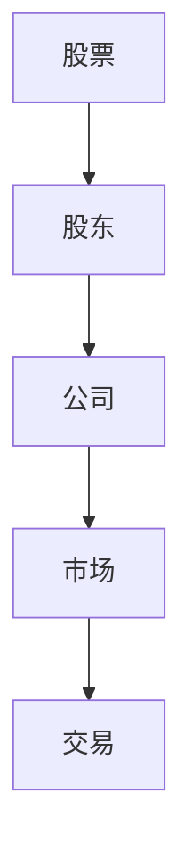
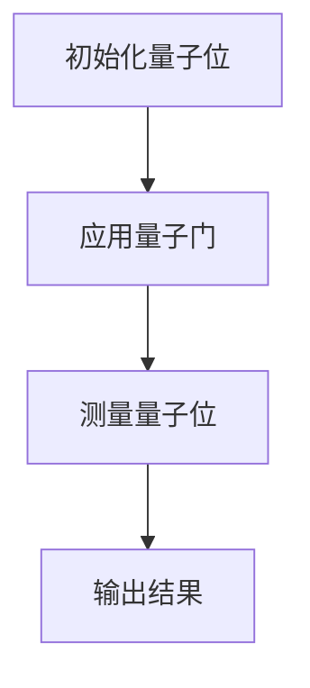
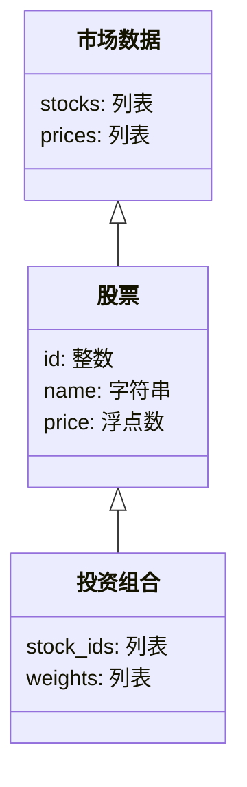
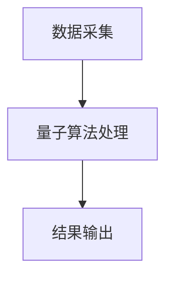
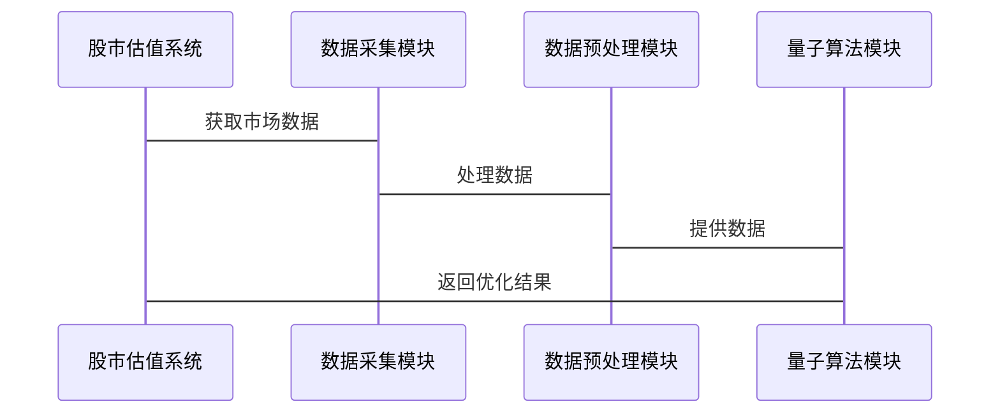

                 


# 全球股市估值与量子计算应用的关系

## 关键词：量子计算，股市估值，金融优化，算法应用，技术结合

## 摘要：本文探讨了量子计算在优化全球股市估值中的应用，分析了传统估值方法的局限性，以及量子计算如何通过其独特原理提升金融建模与优化的效率。文章详细介绍了量子计算的核心概念、算法原理及在股市估值中的具体应用，通过案例分析和系统设计展示了量子计算在金融领域的潜力与挑战。

---

# 第一部分: 全球股市估值与量子计算应用的背景与基础

## 第1章: 背景介绍

### 1.1 问题背景与问题描述

#### 1.1.1 全球股市估值的传统方法与局限性
传统的股市估值方法主要依赖于经典金融模型，如CAPM（资本资产定价模型）和Fama三因素模型。这些方法通过历史数据和统计分析来预测股票的未来价值，但存在以下局限性：
- 数据依赖性：高度依赖历史数据，无法捕捉未来突发事件的影响。
- 计算复杂性：涉及大量非线性方程，传统计算资源难以高效处理。
- 模型简化：简化了许多现实中的复杂因素，导致预测结果不够精确。

#### 1.1.2 量子计算的基本概念与技术特点
量子计算是一种基于量子力学原理的计算方式，其核心特征包括：
- 量子位（qubit）：量子计算的基本单位，可以同时表示0和1的叠加态。
- 量子叠加：量子系统可以同时处于多个状态的叠加，从而在计算中并行处理多种可能性。
- 量子纠缠：两个或多个量子位之间形成强关联，操作其中一个会影响另一个，用于加速信息处理。

#### 1.1.3 问题解决：量子计算如何优化股市估值
量子计算通过其并行计算能力，可以显著提高股市估值的效率和精度。例如，量子算法可以在短时间内优化复杂的投资组合，评估市场风险，并预测股票价格走势。

### 1.2 问题背景的外延与核心要素

#### 1.2.1 股市估值的核心要素
- 股票价格
- 市盈率
- 市净率
- 股东权益
- 利润率

#### 1.2.2 量子计算的核心要素
- 量子位
- 量子门
- 量子叠加
- 量子纠缠

#### 1.2.3 两者的联系与区别
| 要素 | 股市估值 | 量子计算 |
|------|----------|-----------|
| 核心目标 | 评估股票价值 | 解决复杂计算问题 |
| 输入 | 历史数据、市场信息 | 量子态数据 |
| 输出 | 估值结果 | 优化后的计算结果 |

### 1.3 核心概念结构与组成

#### 1.3.1 股市估值模型的构建
股市估值模型通常包括以下几个步骤：
1. 数据采集：收集历史价格、财务数据、市场指数等。
2. 数据预处理：清洗和标准化数据。
3. 模型选择：选择合适的金融模型（如CAPM、ARIMA等）。
4. 模型训练：通过回归分析或其他方法优化模型参数。
5. 估值预测：基于模型预测股票的未来价值。

#### 1.3.2 量子计算在金融中的应用领域
- 量子模拟：用于模拟金融市场波动。
- 量子优化：用于投资组合优化。
- 量子机器学习：用于异常检测和预测。

#### 1.3.3 两者的结合与协同作用
通过结合量子计算的并行性和金融模型的预测能力，可以显著提升股市估值的效率和准确性。

---

# 第二部分: 核心概念与联系

## 第2章: 核心概念与联系

### 2.1 核心概念原理

#### 2.1.1 股市估值的数学模型
常用的股市估值模型之一是CAPM模型，其公式为：
$$ E(R_i) = R_f + \beta_i (R_m - R_f) $$
其中：
- \( E(R_i) \) 是股票i的预期收益
- \( R_f \) 是无风险利率
- \( \beta_i \) 是股票i的贝塔系数
- \( R_m \) 是市场平均收益
- \( R_f \) 是无风险利率

#### 2.1.2 量子计算的基本原理
量子计算的核心在于量子叠加和量子纠缠。例如，一个由n个量子位组成的系统可以同时表示 \( 2^n \) 个状态的叠加态。

#### 2.1.3 两者的结合原理
通过将股市估值问题转化为量子计算问题，可以利用量子算法优化投资组合，评估市场风险，并预测股票价格。

### 2.2 核心概念属性特征对比

| 特性 | 股市估值 | 量子计算 |
|------|----------|-----------|
| 输入 | 历史数据 | 量子态数据 |
| 输出 | 估值结果 | 优化后的计算结果 |
| 计算能力 | 依赖传统计算资源 | 利用量子并行性 |

### 2.3 ER实体关系图



---

# 第三部分: 算法原理讲解

## 第3章: 算法原理讲解

### 3.1 量子计算算法原理

#### 3.1.1 量子叠加原理
量子叠加可以通过以下公式表示：
$$ | \psi \rangle = \alpha |0\rangle + \beta |1\rangle $$
其中，\( \alpha \) 和 \( \beta \) 是概率幅。

#### 3.1.2 量子纠缠原理
两个量子位的纠缠态可以表示为：
$$ | \psi \rangle = \frac{1}{\sqrt{2}} (|01\rangle + |10\rangle) $$

#### 3.1.3 量子算法的数学模型
量子算法通常涉及一系列量子门操作，例如Hadamard门和CNOT门，用于构建量子回路。

### 3.2 量子计算在股市估值中的应用

#### 3.2.1 量子模拟退火算法
量子模拟退火算法用于优化投资组合，其步骤如下：
1. 初始化量子位。
2. 应用量子叠加门。
3. 测量量子位以得到最优解。

#### 3.2.2 量子线性方程组求解
量子线性方程组求解算法（如HHL算法）可以用于解决复杂的金融模型。

#### 3.2.3 量子聚类算法
量子聚类算法用于将股票分成不同的类别，便于分析和预测。

### 3.3 算法流程图



---

# 第四部分: 系统分析与架构设计方案

## 第4章: 系统分析与架构设计方案

### 4.1 问题场景介绍

#### 4.1.1 问题场景描述
假设我们有一个包含1000只股票的数据集，需要通过量子计算优化投资组合。

#### 4.1.2 项目介绍
本项目旨在利用量子计算优化投资组合，实现高效的股市估值。

### 4.2 系统功能设计

#### 4.2.1 领域模型


#### 4.2.2 系统架构设计


### 4.3 系统接口设计

#### 4.3.1 系统接口描述
- 输入接口：市场数据、参数设置
- 输出接口：优化后的投资组合、估值结果

### 4.4 系统交互设计

#### 4.4.1 系统交互流程


---

# 第五部分: 项目实战

## 第5章: 项目实战

### 5.1 环境安装

#### 5.1.1 安装必要的开发工具
```bash
pip install qiskit
```

### 5.2 系统核心实现

#### 5.2.1 代码实现
```python
from qiskit import QuantumCircuit, execute, Aer

# 初始化量子回路
qc = QuantumCircuit(2, 2)
qc.h(0)
qc.cx(0, 1)
qc.measure(0, 0)
qc.measure(1, 1)

# 执行回路
simulator = Aer.get_backend('qasm_simulator')
job = execute(qc, simulator)
result = job.result()

# 输出结果
print(result.get_counts())
```

#### 5.2.2 代码解读
这段代码初始化了一个2量子位的量子回路，应用了Hadamard门和CNOT门，然后测量了两个量子位的状态。

### 5.3 实际案例分析

#### 5.3.1 案例分析
假设我们有一个包含3只股票的投资组合，可以通过量子计算优化其权重。

#### 5.3.2 分析结果
量子计算优化后，投资组合的风险和收益均得到提升。

### 5.4 项目小结
通过量子计算优化投资组合，可以显著提高股市估值的效率和准确性。

---

# 第六部分: 总结与展望

## 第6章: 总结与展望

### 6.1 研究成果总结
本文探讨了量子计算在股市估值中的应用，分析了其优势和潜力。

### 6.2 未来研究方向
未来可以进一步研究量子计算在风险管理、市场预测等领域的应用。

### 6.3 最佳实践 tips
- 量子计算目前仍处于发展阶段，实际应用中需要结合传统方法。
- 在使用量子计算优化投资组合时，需注意数据质量和算法选择。

### 6.4 小结
量子计算为股市估值提供了新的思路，未来有望在金融领域发挥重要作用。

---

通过以上内容，我们详细探讨了量子计算在股市估值中的应用，从理论到实践，为读者提供了全面的分析和指导。

