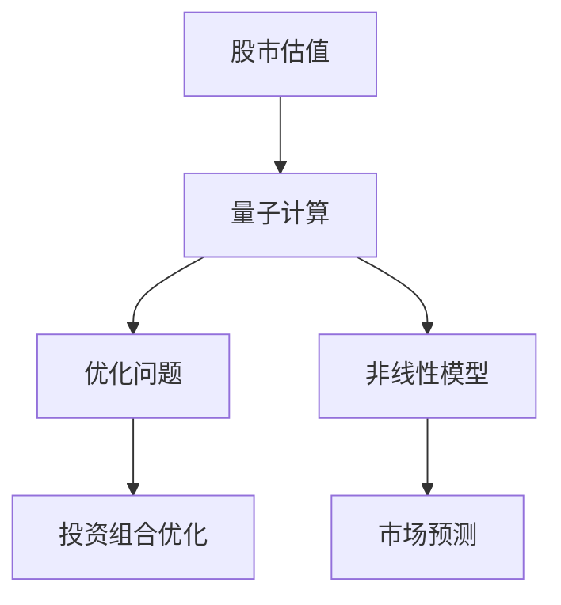
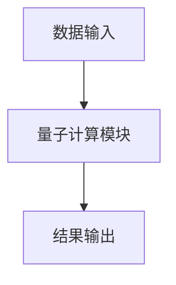
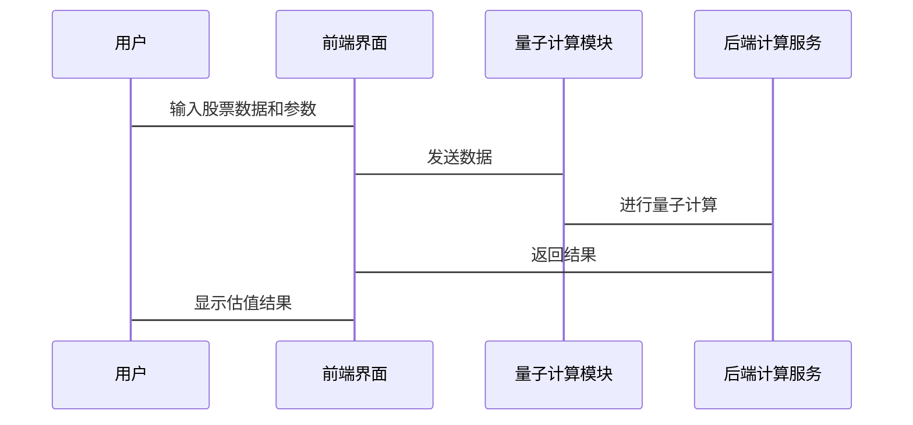

                 


---

# 全球股市估值与量子计算技术的潜在关联

## 关键词：量子计算、股市估值、金融优化、量子算法、金融科技

## 摘要：本文探讨量子计算技术在股市估值中的潜在应用，分析量子计算的核心原理及其在金融优化问题中的应用潜力，结合实际案例展示量子计算如何革新传统金融分析方法，为投资者和金融机构提供更高效的决策支持。

---

## 第一部分：全球股市估值与量子计算技术的背景与概念

### 第1章：全球股市估值与量子计算技术的背景介绍

#### 1.1 股市估值的基本概念

##### 1.1.1 股市估值的定义与作用

股市估值是指通过对公司财务数据、市场环境、行业趋势等因素的分析，估算公司股票的内在价值，以确定其在市场上的合理价格。股市估值的作用在于帮助投资者做出更明智的投资决策，减少市场波动带来的风险。

##### 1.1.2 股市估值的主要方法

股市估值的主要方法包括：

1. **相对估值法**：通过比较公司与同行业公司的市盈率（P/E）、市净率（P/B）等指标来评估其价值。
2. **绝对估值法**：通过现金流折现模型（DCF）等方法估算公司的内在价值。
3. **技术分析法**：通过分析股票价格的历史走势预测未来的价格变化。

##### 1.1.3 股市估值的挑战与局限性

股市估值面临的主要挑战包括市场波动性、数据不完整性、模型假设的局限性等。传统估值方法在面对复杂市场环境时，往往难以提供准确的估值结果。

---

#### 1.2 量子计算技术的基本概念

##### 1.2.1 量子计算的定义与特点

量子计算是一种利用量子力学原理进行计算的技术，其核心是利用量子位（qubit）的叠加态和纠缠态来并行处理大量信息。与经典计算机相比，量子计算机在某些特定问题上具有指数级的计算速度优势。

##### 1.2.2 量子计算的核心原理

量子计算的核心原理包括：

1. **量子叠加**：量子位可以同时处于多个状态的叠加态。
2. **量子纠缠**：两个或多个量子位之间可以形成纠缠态，使得它们的状态相互依赖。
3. **量子测量**：对量子系统的测量会破坏其叠加态，导致系统坍塌到某个特定状态。

##### 1.2.3 量子计算与经典计算的区别

- **并行性**：量子计算可以同时处理大量状态，而经典计算是串行处理。
- **计算速度**：在某些问题上，量子计算可以显著提高计算速度。
- **资源消耗**：量子计算需要极低的错误率和高精度的环境。

---

#### 1.3 股市估值与量子计算的关联性

##### 1.3.1 问题背景与问题描述

股市估值的核心问题是如何在复杂和不确定的市场环境中，准确评估股票的价值。传统方法往往依赖于线性模型和假设，难以捕捉市场的非线性关系和复杂动态。

##### 1.3.2 问题解决的潜在路径

量子计算的并行性和强大的计算能力为解决复杂的金融问题提供了新的可能性。通过量子算法优化投资组合、风险管理、市场预测等方面，可以显著提高股市估值的准确性和效率。

##### 1.3.3 关联的边界与外延

量子计算在金融中的应用目前仍处于探索阶段，其在股市估值中的应用主要集中在优化问题和非线性模型的构建上。随着技术的成熟，量子计算在金融领域的应用将更加广泛。

##### 1.3.4 概念结构与核心要素组成

图1.1展示了股市估值与量子计算的关联结构：



---

### 第2章：量子计算技术的核心概念与原理

#### 2.1 量子计算的核心原理

##### 2.1.1 量子位（Qubit）的基本概念

量子位是量子计算的基本单位，与经典计算机中的位不同，量子位可以同时处于0和1的叠加态。

##### 2.1.2 量子叠加与量子纠缠

- **量子叠加**：量子位的状态可以表示为 $|0\rangle$ 和 $|1\rangle$ 的叠加态，即 $| \psi \rangle = \alpha |0\rangle + \beta |1\rangle$，其中 $\alpha^2 + \beta^2 = 1$。
- **量子纠缠**：当两个或多个量子位处于纠缠态时，对其中一个量子位的测量会立即确定另一个量子位的状态。

##### 2.1.3 量子门与量子电路

量子门是量子计算的基本操作，常见的量子门包括：

- **H门（Hadamard门）**：将量子位从 $|0\rangle$ 变为 $|+\rangle$，从 $|1\rangle$ 变为 $|-\rangle$。
- **CNOT门**：控制非门，用于实现量子纠缠。

---

#### 2.2 量子计算的数学模型

##### 2.2.1 量子态的数学表示

量子态可以用向量表示，例如，两个量子位的叠加态可以表示为：

$$
| \psi \rangle = a|00\rangle + b|01\rangle + c|10\rangle + d|11\rangle
$$

##### 2.2.2 量子运算的矩阵表示

量子门可以用矩阵表示，例如，H门的矩阵表示为：

$$
H = \frac{1}{\sqrt{2}} \begin{bmatrix}
1 & 1 \\
1 & -1
\end{bmatrix}
$$

##### 2.2.3 量子算法的基本框架

量子算法的基本框架包括初始化量子态、应用量子门、测量结果等步骤。

---

#### 2.3 量子计算的核心算法

##### 2.3.1 Shor算法

Shor算法用于在量子计算机上高效分解大整数的因子，对密码学和金融安全有重要意义。

##### 2.3.2 Grover算法

Grover算法用于在未排序数据库中搜索特定元素，其时间复杂度为 $O(\sqrt{N})$，远优于经典算法的 $O(N)$。

##### 2.3.3 量子傅里叶变换

量子傅里叶变换用于将量子态从时间域变换到频率域，广泛应用于信号处理和密码学。

---

### 第3章：量子计算在金融领域的应用潜力

#### 3.1 量子计算在金融优化问题中的应用

##### 3.1.1 资产组合优化

通过量子计算优化资产组合的收益与风险比，例如使用Grover算法搜索最优组合。

##### 3.1.2 风险管理与投资组合优化

量子计算可以显著提高风险管理模型的计算效率，帮助投资者更好地应对市场波动。

##### 3.1.3 量子模拟与金融建模

通过量子模拟技术，可以更准确地建模金融市场中的复杂动态。

---

#### 3.2 量子计算在股市估值中的潜在应用

##### 3.2.1 量子回归分析

通过量子回归模型分析股票价格与多个变量之间的关系，例如使用量子叠加态表示变量。

##### 3.2.2 量子聚类分析

利用量子聚类算法将股票分为不同的类别，帮助投资者识别市场趋势。

##### 3.2.3 量子强化学习在交易策略中的应用

通过量子强化学习算法优化交易策略，例如在股票价格预测和交易时机选择上。

---

### 第4章：量子计算与股市估值的数学模型与算法

#### 4.1 量子计算在股市估值中的数学模型

##### 4.1.1 量子回归模型

量子回归模型可以表示为：

$$
y = \sum_{i=1}^{n} \theta_i x_i + \epsilon
$$

其中 $\theta_i$ 是量子叠加态表示的回归系数。

##### 4.1.2 量子聚类模型

量子聚类模型通过量子纠缠态将股票分为不同的聚类，例如使用量子K均值算法。

##### 4.1.3 量子强化学习模型

量子强化学习模型通过量子状态表示状态空间，优化策略函数。

---

#### 4.2 量子计算在金融优化中的数学公式

##### 4.2.1 资产组合优化的数学公式

$$
\text{目标函数：} \min_{x} \sum_{i=1}^{n} w_i x_i $$
$$ \text{约束条件：} \sum_{i=1}^{n} x_i = 1 $$

##### 4.2.2 风险管理的量子算法

通过量子算法计算VaR（在险价值）和CVaR（条件在险价值）。

---

#### 4.3 量子计算在股市估值中的算法流程

##### 4.3.1 量子回归算法流程

1. 初始化量子态表示输入变量。
2. 应用量子门构建回归模型。
3. 测量输出变量。

##### 4.3.2 量子聚类算法流程

1. 初始化量子态表示数据点。
2. 应用量子门构建聚类模型。
3. 测量聚类结果。

##### 4.3.3 量子强化学习算法流程

1. 初始化量子态表示状态空间。
2. 应用量子门优化策略函数。
3. 测量最优策略。

---

### 第5章：量子计算与股市估值的系统架构设计

#### 5.1 量子金融分析系统的功能设计

##### 5.1.1 系统功能模块划分

系统功能模块包括数据输入、量子计算、结果输出等。

##### 5.1.2 模块之间的关系与依赖

数据输入模块提供股票数据，量子计算模块进行估值计算，结果输出模块展示结果。

---

#### 5.2 量子金融分析系统的架构设计

##### 5.2.1 系统架构图（Mermaid图）



---

#### 5.3 系统接口设计

##### 5.3.1 系统输入接口

输入接口接收股票数据和参数设置。

##### 5.3.2 系统输出接口

输出接口展示估值结果和相关分析报告。

##### 5.3.3 接口交互流程

1. 用户输入股票数据和参数。
2. 系统进行量子计算。
3. 系统输出结果。

---

#### 5.4 系统交互流程图（Mermaid图）



---

## 第二部分：全球股市估值与量子计算技术的应用与案例分析

### 第6章：量子计算在金融优化问题中的应用

#### 6.1 量子计算在资产组合优化中的应用

##### 6.1.1 资产组合优化的数学模型

$$
\min_{x} \sum_{i=1}^{n} w_i x_i $$
$$ \text{subject to} \sum_{i=1}^{n} x_i = 1 $$

##### 6.1.2 量子计算在风险管理中的应用

通过量子算法计算VaR和CVaR，帮助投资者更好地管理风险。

---

#### 6.2 量子计算在信用评分中的应用

##### 6.2.1 信用评分的量子算法

通过量子聚类算法对客户信用进行评分，例如使用量子K均值算法。

##### 6.2.2 量子回归分析在信用评分中的应用

通过量子回归模型分析客户的信用风险因素。

---

### 第7章：量子计算在股市估值中的实际案例分析

#### 7.1 案例背景与数据预处理

##### 7.1.1 案例背景

假设我们有某公司过去五年的财务数据和行业趋势，需要通过量子计算对其进行估值。

##### 7.1.2 数据预处理

对数据进行清洗和标准化处理，确保数据适合量子算法输入。

---

#### 7.2 量子聚类分析与股票市场数据

##### 7.2.1 聚类分析的量子算法实现

通过量子聚类算法将股票分为成长型、价值型等类别。

##### 7.2.2 结果分析与可视化

分析聚类结果，识别不同类别的股票特征。

---

#### 7.3 量子回归分析与股票价格预测

##### 7.3.1 回归分析的量子算法实现

通过量子回归模型预测股票价格，考虑多个变量如PE、PB等。

##### 7.3.2 结果分析与可视化

分析回归结果，识别影响股票价格的主要因素。

---

### 第8章：量子计算在股市估值中的系统实现

#### 8.1 系统实现的环境安装

##### 8.1.1 量子计算框架的安装与配置

安装Qiskit等量子计算框架，配置量子模拟器或真实量子计算机。

##### 8.1.2 数据分析工具的安装与配置

安装Python、Pandas等数据分析工具。

---

#### 8.2 系统实现的核心代码

##### 8.2.1 量子回归分析的代码实现

```python
from qiskit import QuantumCircuit, execute, Aer
from qiskit.circuit import Gate

# 初始化量子电路
qc = QuantumCircuit(2, 1)
# 应用H门
H = Gate('H', 1)
qc.append(H, [0])
# 测量
qc.measure(0, 0)
# 执行量子计算
simulator = Aer.get_backend('qasm_simulator')
result = execute(qc, simulator).result()
# 输出结果
print(result.get_counts())
```

##### 8.2.2 量子聚类分析的代码实现

```python
from qiskit import QuantumCircuit, execute, Aer

# 初始化量子电路
qc = QuantumCircuit(3, 1)
# 应用CNOT门
qc.cnot(0, 1)
qc.cnot(1, 2)
# 测量
qc.measure(2, 0)
# 执行量子计算
simulator = Aer.get_backend('qasm_simulator')
result = execute(qc, simulator).result()
# 输出结果
print(result.get_counts())
```

---

#### 8.3 代码实现的功能解读与分析

##### 8.3.1 量子回归分析代码的功能解读

上述代码实现了简单的量子回归分析，通过量子叠加态表示输入变量，测量输出变量。

##### 8.3.2 量子聚类分析代码的功能解读

上述代码实现了量子聚类分析，通过量子纠缠态将数据分为不同的聚类。

---

#### 8.4 实际案例分析与结果可视化

##### 8.4.1 案例分析

以某公司股票为例，使用量子回归模型和聚类分析对其进行估值。

##### 8.4.2 结果可视化

将量子计算结果与传统方法结果进行对比，展示量子计算的优势。

---

## 第三部分：全球股市估值与量子计算技术的挑战与未来展望

### 第9章：量子计算在股市估值中的挑战

#### 9.1 当前的主要挑战

##### 9.1.1 技术挑战

量子计算的硬件实现仍处于早期阶段，存在错误率高、稳定性差等问题。

##### 9.1.2 数据挑战

金融数据的复杂性和动态性对量子算法提出了更高的要求。

##### 9.1.3 计算成本

量子计算的高成本限制了其在金融领域的广泛应用。

---

#### 9.2 伦理与监管挑战

量子计算在金融中的应用可能引发数据隐私和金融监管等方面的问题。

---

### 第10章：量子计算技术的未来展望

#### 10.1 未来的技术发展

##### 10.1.1 量子算法的优化

未来的研究将致力于开发更高效的量子算法，进一步提升计算速度和准确性。

##### 10.1.2 量子-经典混合计算

结合量子计算和经典计算的优势，开发混合计算模型。

##### 10.1.3 量子计算在金融领域的应用扩展

随着技术的成熟，量子计算将被更广泛地应用于金融领域的各个方面。

---

#### 10.2 量子计算对全球经济与投资决策的影响

量子计算的广泛应用将彻底改变金融市场的运作方式，为投资者和金融机构提供更强大的工具。

---

## 第四部分：结论与展望

### 第11章：结论与总结

#### 11.1 全文总结

本文探讨了量子计算在股市估值中的潜在应用，分析了量子计算的核心原理及其在金融优化问题中的应用潜力，展示了量子计算如何革新传统金融分析方法。

---

### 第12章：最佳实践与注意事项

#### 12.1 最佳实践

- 在实际应用中，建议结合量子计算与传统方法的优势，开发混合计算模型。
- 需要密切关注量子计算技术的发展，及时更新算法和模型。

#### 12.2 注意事项

- 量子计算目前仍处于发展阶段，应用时需考虑技术成熟度和成本问题。
- 数据隐私和金融监管问题需要引起高度重视。

---

### 第13章：未来的研究方向与拓展阅读

#### 13.1 未来的研究方向

- 开发更高效的量子算法，提升计算速度和准确性。
- 探索量子计算在金融风险管理、投资决策等领域的深度应用。

#### 13.2 拓展阅读

建议读者进一步阅读相关领域的学术论文和行业报告，关注量子计算在金融领域的最新进展。

---

## 附录：相关资源与工具

- **量子计算框架**：Qiskit、Cirq
- **量子计算模拟器**：QasmSimulator、Qx
- **金融数据源**：Yahoo Finance、Quandl

---

以上是《全球股市估值与量子计算技术的潜在关联》的完整内容，涵盖了从理论到实践的各个方面，结合实际案例和系统实现，为读者提供了全面的视角。

