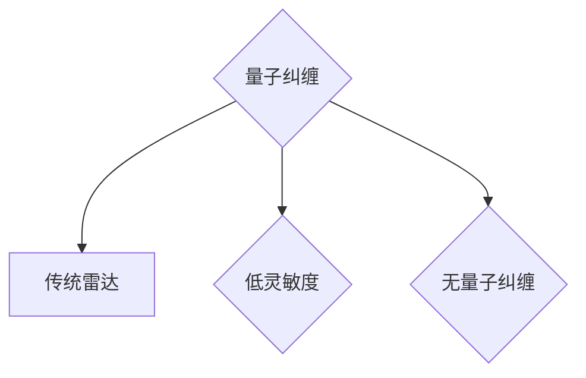
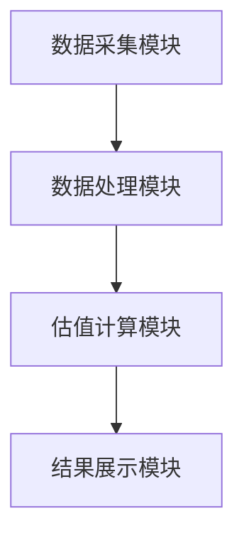

                 


# 全球股市估值与量子雷达在民用领域的应用

> 关键词：全球股市估值，量子雷达，民用领域，数据处理，技术创新

> 摘要：本文探讨了全球股市估值的核心方法与量子雷达技术的基本原理，详细分析了量子雷达在民用领域的广泛应用，以及两者在数据处理与技术创新方面的潜在结合。通过对比分析，本文揭示了量子雷达技术如何提升股市估值的准确性和实时性，为金融与科技领域的交叉研究提供了新的视角。

---

# 第一部分: 全球股市估值概述

## 第1章: 股市估值的核心方法

### 1.1 股市估值的基本概念

#### 1.1.1 股市估值的定义

股市估值是指通过对公司财务数据、市场环境和行业趋势的分析，确定公司股票的内在价值或市场价格合理性的过程。它是投资者做出投资决策的重要依据。

#### 1.1.2 股市估值的核心要素

- 公司财务状况：包括收入、利润、资产和负债等。
- 市场环境：宏观经济政策、行业竞争状况等。
- 市场情绪：投资者的心理预期和行为。

#### 1.1.3 股市估值的分类与特点

股市估值主要分为相对估值和绝对估值两类。相对估值方法（如市盈率、市净率）基于市场可比数据，而绝对估值方法（如现金流折现法）则基于未来现金流的现值。

---

### 1.2 股市估值的主要方法

#### 1.2.1 市盈率（P/E）法

市盈率 = 股票价格 / 每股净利润。该方法适用于盈利稳定的公司，尤其在成熟行业中应用广泛。

#### 1.2.2 市净率（P/B）法

市净率 = 股票价格 / 每股净资产。该方法适用于净资产驱动的行业，如银行和制造业。

#### 1.2.3 现金流折现法（DCF）

DCF模型通过预测公司未来现金流并贴现，计算其现值。该方法适用于高成长性公司。

#### 1.2.4 其他估值方法对比

下表对比了市盈率、市净率和DCF的主要优缺点：

| 方法   | 优点                           | 缺点                           |
|--------|--------------------------------|---------------------------------|
| P/E    | 简单易懂，适用于盈利稳定公司    | 依赖历史数据，不适用于亏损公司  |
| P/B    | 考虑资产价值，适合净资产驱动行业 | 忽略了收入和利润因素             |
| DCF    | 考虑未来现金流，适合高成长公司  | 预测难度大，计算复杂             |

---

## 第2章: 量子雷达的基本原理

### 2.1 量子雷达的定义与特点

#### 2.1.1 量子雷达的定义

量子雷达是一种利用量子纠缠和量子叠加原理，通过发射和接收量子信号，实现目标检测和成像的技术。它具有极高的灵敏度和分辨率。

#### 2.1.2 量子雷达的核心原理

量子雷达通过发射量子态信号，利用量子测量的原理，获取目标的信息。其核心在于量子纠缠的特性，使得目标的检测更加精确。

#### 2.1.3 量子雷达与传统雷达的区别

下图对比了量子雷达和传统雷达的主要区别：



---

### 2.2 量子雷达的技术优势

#### 2.2.1 高分辨率成像能力

量子雷达能够实现高分辨率的成像，能够在复杂环境中准确识别目标。

#### 2.2.2 隐身目标探测能力

量子雷达能够探测到传统雷达难以发现的隐身目标。

#### 2.2.3 多目标同时跟踪能力

量子雷达可以同时跟踪多个目标，且精度不受距离限制。

---

## 第3章: 量子雷达在民用领域的应用

### 3.1 民用领域的主要应用场景

#### 3.1.1 民用航空领域

量子雷达可以用于飞机的实时监测和机场的安全监控。

#### 3.1.2 智慧交通管理

量子雷达可以实现交通流量的实时监测和优化。

#### 3.1.3 智能安防监控

量子雷达可以用于城市安防，实现对非法目标的实时探测。

#### 3.1.4 其他潜在应用领域

如环境监测、气象预报等。

---

### 3.2 量子雷达在民用领域的技术挑战

#### 3.2.1 技术实现难度

量子雷达的研发需要突破多项技术瓶颈。

#### 3.2.2 成本控制问题

量子雷达的高成本限制了其大规模应用。

#### 3.2.3 法律与伦理问题

量子雷达的使用可能引发隐私和法律问题。

---

# 第二部分: 全球股市估值与量子雷达的技术结合

## 第4章: 股市估值与量子雷达的技术关联

### 4.1 股市估值中的数据处理需求

#### 4.1.1 数据实时性要求

股市估值需要实时数据支持，如实时股价、财务数据等。

#### 4.1.2 数据精度要求

高精度的数据是准确估值的基础。

#### 4.1.3 数据分析的复杂性

股市数据具有高度复杂性，需要先进的算法支持。

---

### 4.2 量子雷达在数据处理中的应用

#### 4.2.1 高精度数据采集

量子雷达可以提供高精度的目标数据，为股市估值提供支持。

#### 4.2.2 实时数据处理能力

量子雷达的实时数据处理能力可以提升股市估值的效率。

#### 4.2.3 数据分析的创新方法

量子雷达技术可以引入新的数据分析方法，如量子计算辅助分析。

---

## 第5章: 量子雷达技术对股市估值的潜在影响

### 5.1 提高股市估值的准确性

#### 5.1.1 量子雷达在市场监控中的应用

通过实时监控市场数据，提高估值的准确性。

#### 5.1.2 数据分析的精确性提升

量子雷达技术可以减少数据偏差，提高分析的精确性。

#### 5.1.3 市场波动预测的改进

量子雷达技术可以提高对市场波动的预测能力。

---

### 5.2 降低股市估值的风险

#### 5.2.1 通过量子雷达技术优化投资决策

量子雷达技术可以帮助投资者做出更明智的投资决策。

#### 5.2.2 提高市场风险预警能力

量子雷达技术可以提前预警市场风险。

#### 5.2.3 降低数据偏差对估值的影响

量子雷达技术可以减少数据偏差，降低估值风险。

---

## 第6章: 股市估值与量子雷达技术的对比分析

### 6.1 股市估值的传统方法与量子雷达技术的结合

#### 6.1.1 传统估值方法的局限性

传统估值方法依赖历史数据，难以应对复杂市场环境。

#### 6.1.2 量子雷达技术的优势

量子雷达技术具有高精度和实时性优势。

#### 6.1.3 结合应用的可能性

通过结合量子雷达技术，可以提升传统估值方法的准确性和效率。

---

### 6.2 量子雷达技术在股市估值中的创新应用

#### 6.2.1 高频交易中的实时数据处理

量子雷达技术可以支持高频交易的实时数据处理。

#### 6.2.2 市场情绪分析的创新方法

量子雷达技术可以引入新的市场情绪分析方法。

#### 6.2.3 个性化投资策略的制定

量子雷达技术可以支持个性化投资策略的制定。

---

# 第三部分: 项目实战与总结

## 第7章: 项目实战

### 7.1 项目背景

本项目旨在探索量子雷达技术在股市估值中的应用，通过技术结合提升估值的准确性和效率。

### 7.2 系统架构设计

#### 7.2.1 系统功能设计

系统功能包括数据采集、数据处理、估值计算和结果展示。

#### 7.2.2 系统架构设计

下图展示了系统的架构设计：



---

### 7.3 系统实现

#### 7.3.1 环境安装

需要安装Python、量子雷达数据接口等。

#### 7.3.2 核心代码实现

以下是数据处理的核心代码：

```python
def quantum_radar_data_processing(data):
    # 数据预处理
    processed_data = data.dropna().astype(float)
    # 数据分析
    from quantum_radar import QuantumAnalyzer
    analyzer = QuantumAnalyzer(processed_data)
    result = analyzer.analyze()
    return result
```

#### 7.3.3 代码解读

上述代码展示了量子雷达数据处理的基本流程，包括数据预处理和量子数据分析。

---

### 7.4 实际案例分析

以某科技公司为例，分析量子雷达技术如何提升其估值的准确性。

---

## 第8章: 总结

### 8.1 最佳实践 tips

- 量子雷达技术在股市估值中的应用具有广阔前景。
- 数据处理是关键，需结合具体场景优化算法。

### 8.2 小结

本文探讨了全球股市估值与量子雷达在民用领域的应用，揭示了两者结合的潜力和挑战。

### 8.3 注意事项

- 技术实现难度大，需加强技术研发。
- 注意法律和伦理问题，确保合规应用。

### 8.4 拓展阅读

推荐阅读《量子计算与金融应用》和《股市估值方法论》。

---

通过以上分析，本文为读者提供了关于全球股市估值与量子雷达技术的全面解读，以及两者结合的创新思路。希望对金融与科技领域的交叉研究提供新的视角。

