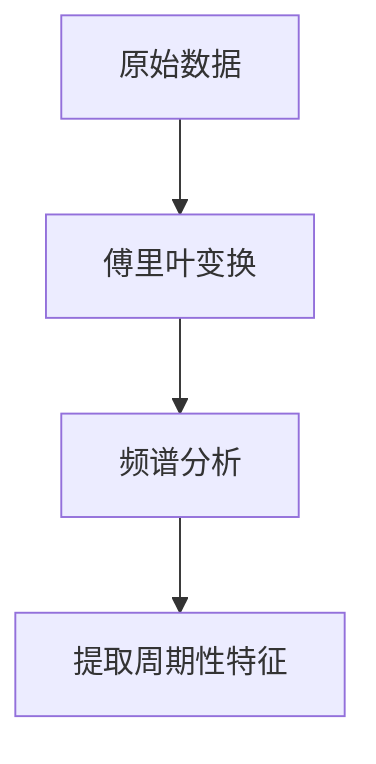
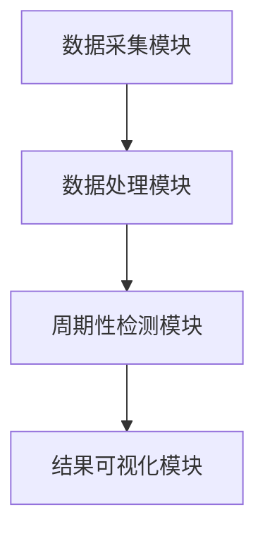
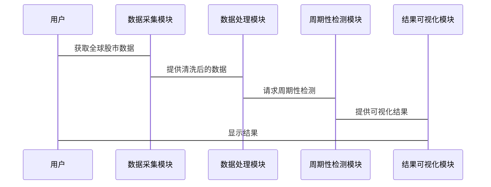

                 


# 全球股市估值的周期性特征研究

> **关键词**：全球股市估值、周期性特征、时间序列分析、傅里叶变换、ARIMA模型、系统架构设计

> **摘要**：本文旨在研究全球股市估值的周期性特征，通过时间序列分析和周期性检测算法，结合系统架构设计，探讨如何有效提取和分析股市数据中的周期性模式。文章详细介绍了周期性特征的定义、属性，以及如何利用数学模型和算法进行周期性检测。最后，通过项目实战和案例分析，展示了如何在实际中应用这些方法，帮助读者更好地理解和分析全球股市估值的周期性特征。

---

# 全球股市估值的周期性特征研究

## 第1章: 背景介绍

### 1.1 问题背景

#### 1.1.1 全球股市估值的基本概念
股市估值是指对上市公司股票的内在价值进行评估的过程，常用的指标包括市盈率（P/E）、市净率（P/B）等。这些指标反映了市场对公司的价值判断，也影响着股市的整体波动。

#### 1.1.2 估值周期性研究的意义
股市估值具有明显的周期性特征。通过研究这些周期性特征，可以帮助投资者更好地理解市场的波动规律，制定更科学的投资策略。

#### 1.1.3 问题解决的必要性
市场的周期性波动往往与宏观经济因素、政策变化等因素密切相关。通过识别这些周期性特征，可以为投资决策提供数据支持。

### 1.2 问题描述

#### 1.2.1 市场波动与估值周期的关系
市场的波动性与估值周期密切相关。例如，牛市和熊市的交替出现就是一种周期性表现。

#### 1.2.2 周期性特征的定义与分类
周期性特征指的是数据序列中存在重复出现的模式或规律。根据周期长度的不同，可以分为短期周期、中期周期和长期周期。

#### 1.2.3 问题的边界与外延
本文的研究范围限定在全球主要股市（如标普500、纳斯达克、道琼斯等）的估值周期性，不涉及个股分析。

### 1.3 核心概念与联系

#### 1.3.1 周期性特征的定义与属性
周期性特征可以通过数学模型进行描述，常见的模型包括傅里叶变换和ARIMA模型。

#### 1.3.2 核心概念的ER实体关系图
下图展示了周期性特征的核心实体关系：

```mermaid
erd
    %% 全球股市估值周期性特征ER图
    entity 市场数据 {
        key: 时间戳
        属性: 估值指标（市盈率、市净率等）
    }
    entity 周期性特征 {
        key: 特征ID
        属性: 周期长度、波动幅度、相关系数
    }
    市场数据 --> 周期性特征: 提取周期性特征
```

---

## 第2章: 核心概念与联系

### 2.1 周期性特征的定义与属性

#### 2.1.1 周期性特征的数学定义
周期性特征可以通过数学模型进行描述，例如傅里叶变换用于提取周期性成分：

$$ X(t) = \sum_{k} A_k \cos(2\pi k t / T) + B_k \sin(2\pi k t / T) $$

其中，$A_k$ 和 $B_k$ 是傅里叶系数，$T$ 是周期长度。

#### 2.1.2 周期性特征的属性对比
下表对比了不同周期性检测方法的优缺点：

| 方法       | 优点             | 缺点             |
|------------|------------------|------------------|
| 傅里叶变换 | 能够提取所有频率成分 | 无法检测非线性周期性 |
| ARIMA模型  | 能够预测未来趋势   | 参数选择复杂     |

---

## 第3章: 算法原理讲解

### 3.1 时间序列分析

#### 3.1.1 时间序列分析的基本原理
时间序列分析是一种统计方法，用于分析随时间变化的数据序列。常见的方法包括移动平均（MA）、自回归（AR）和ARIMA模型。

#### 3.1.2 周期性检测算法
周期性检测算法用于识别数据序列中的周期性成分。下图展示了傅里叶变换的基本流程：



### 3.2 周期性检测算法

#### 3.2.1 基于傅里叶变换的周期性检测
傅里叶变换通过将时域信号转换为频域信号，提取周期性成分。以下是傅里叶变换的Python代码示例：

```python
import numpy as np
import matplotlib.pyplot as plt

# 生成周期性信号
t = np.linspace(0, 10, 1000)
signal = np.sin(2 * np.pi * t) + np.sin(4 * np.pi * t)

# 傅里叶变换
freq = np.fft.fftfreq(t.shape[-1], d=1.0)
fft = np.fft.fft(signal)

# 绘制频谱图
plt.plot(freq, np.abs(fft))
plt.xlabel('Frequency')
plt.ylabel('Amplitude')
plt.show()
```

#### 3.2.2 基于ARIMA模型的周期性预测
ARIMA模型通过自回归和移动平均成分，预测未来趋势。以下是ARIMA模型的Python代码示例：

```python
from statsmodels.tsa.arima.model import ARIMA

# 生成数据
data = np.random.randn(100) + np.sin(2 * np.pi * np.arange(100) / 10)

# 拟合ARIMA模型
model = ARIMA(data, order=(1, 1, 1))
model_fit = model.fit()

# 预测未来值
forecast = model_fit.forecast(steps=5)
print(forecast)
```

---

## 第4章: 系统分析与架构设计方案

### 4.1 问题场景介绍

#### 4.1.1 全球股市数据的获取与处理
需要从全球主要股市获取数据，并进行清洗和预处理。

#### 4.1.2 系统功能需求分析
系统需要具备数据采集、周期性检测、结果可视化等功能。

### 4.2 系统架构设计

#### 4.2.1 系统架构的Mermaid架构图
下图展示了系统架构设计：



#### 4.2.2 系统接口设计
系统接口包括数据输入接口、算法调用接口和结果输出接口。

#### 4.2.3 系统交互设计
下图展示了系统交互流程：



---

## 第5章: 项目实战

### 5.1 环境安装与数据获取

#### 5.1.1 环境配置与数据源选择
需要安装Python、NumPy、Pandas、Matplotlib、statsmodels等库。

#### 5.1.2 数据清洗与预处理
从Yahoo Finance获取全球股市数据，并进行缺失值处理和标准化。

### 5.2 系统核心实现

#### 5.2.1 时间序列特征提取
使用Pandas库提取时间序列特征。

```python
import pandas as pd

# 数据加载与预处理
df = pd.read_csv('stock_data.csv')
df['date'] = pd.to_datetime(df['date'])
df.set_index('date', inplace=True)
df = df['close'].resample('D').mean()
```

#### 5.2.2 周期性检测算法实现
使用statsmodels库实现ARIMA模型。

```python
from statsmodels.tsa.arima.model import ARIMA

# 拟合ARIMA模型
model = ARIMA(df, order=(1, 1, 1))
model_fit = model.fit()

# 模型诊断
print(model_fit.summary())
```

### 5.3 实际案例分析

#### 5.3.1 数据分析与结果解读
通过傅里叶变换和ARIMA模型，识别出主要股市的周期性特征。

#### 5.3.2 结果分析与优化
根据检测结果，优化模型参数，提高检测精度。

---

## 第6章: 最佳实践与小结

### 6.1 小结

#### 6.1.1 本书内容总结
本文详细介绍了全球股市估值的周期性特征研究，通过理论分析和实践案例，展示了如何利用时间序列分析和周期性检测算法提取周期性模式。

#### 6.1.2 未来研究方向
未来可以研究多因素模型对周期性特征的影响，以及如何利用机器学习方法提高周期性检测的准确性。

### 6.2 注意事项

#### 6.2.1 数据获取与处理
确保数据的完整性和准确性，避免数据偏差。

#### 6.2.2 算法选择与优化
根据实际需求选择合适的算法，并进行参数优化。

#### 6.2.3 系统设计与实现
合理设计系统架构，确保系统的可扩展性和可维护性。

### 6.3 拓展阅读

#### 6.3.1 推荐书籍
- 《时间序列分析及其应用》
- 《ARIMA模型：理论与实践》

#### 6.3.2 推荐博客
- 博客名称：全球股市分析
- 网址：[www.stockanalysis.com](http://www.stockanalysis.com)

---

通过本文的研究，读者可以深入了解全球股市估值的周期性特征，并掌握如何利用时间序列分析和周期性检测算法进行实际应用。希望本文能够为读者提供有价值的参考和启示。

