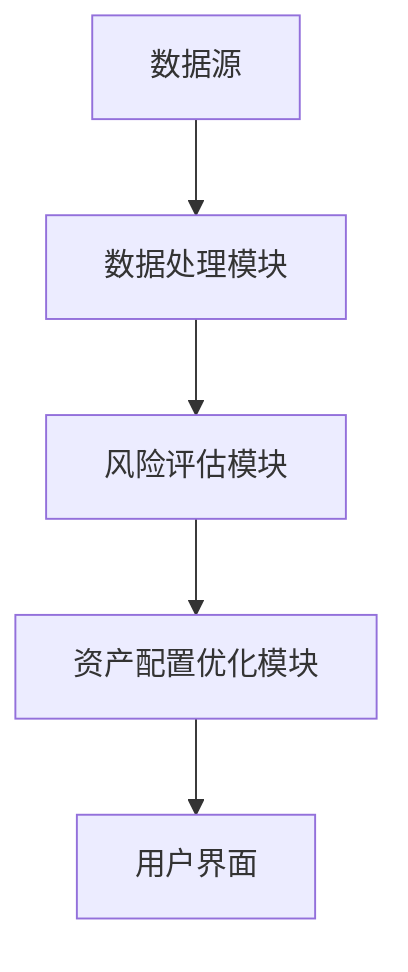
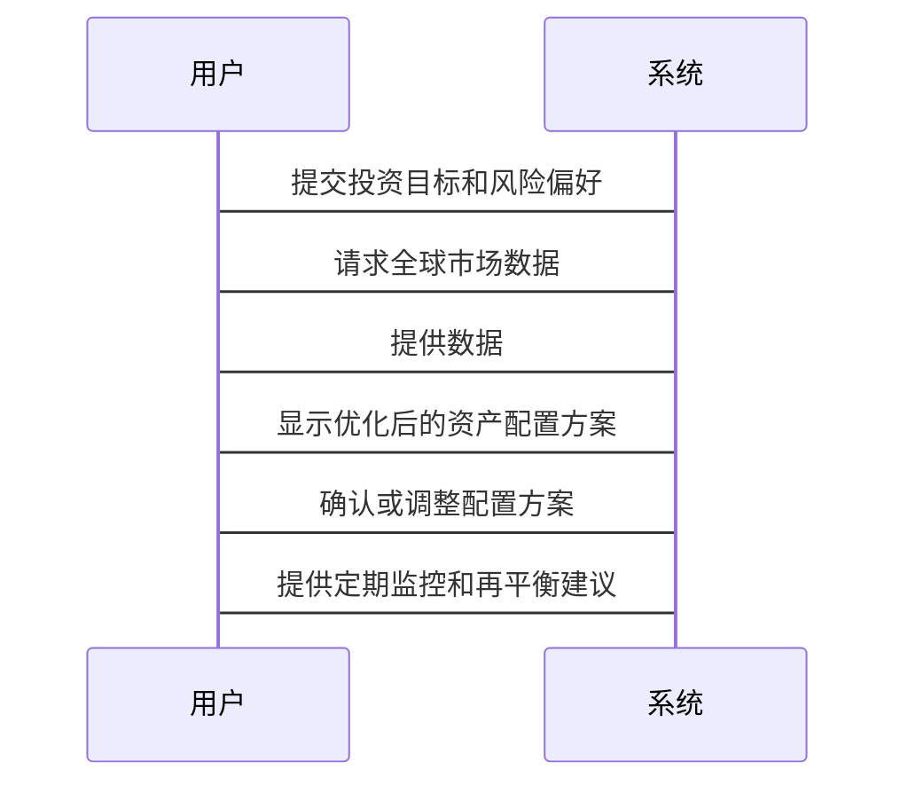

                 


# 全球资产配置：分散投资降低国别风险

> 关键词：资产配置，国别风险，分散投资，现代投资组合理论，风险对冲，资产组合优化

> 摘要：  
全球资产配置是降低投资风险的重要策略，通过分散投资不同国家和地区的资产，可以有效降低国别风险。本文将从资产配置的基本概念、国别风险的影响、资产配置的数学模型、系统架构设计以及实际案例等方面，深入分析全球资产配置的原理和实践方法，帮助投资者更好地理解如何通过分散投资来降低风险，实现长期稳健的投资收益。

---

# 第一部分: 全球资产配置的背景与核心概念

## 第1章: 全球资产配置概述

### 1.1 资产配置的基本概念

#### 1.1.1 资产配置的定义与分类
资产配置是指将资金分配到不同的资产类别（如股票、债券、房地产、商品等）中，以实现投资目标的过程。资产配置的核心在于通过多样化投资来分散风险，避免将所有资金集中在单一资产或市场。

#### 1.1.2 全球资产配置的背景与意义
随着全球经济一体化的加深，投资者越来越关注跨国投资的机会。通过在全球范围内配置资产，投资者可以利用不同国家和地区的市场差异，降低因单一市场波动带来的风险。全球资产配置不仅是全球化时代的必然选择，也是实现风险分散和收益优化的重要策略。

#### 1.1.3 资产配置的核心目标与原则
资产配置的核心目标是实现风险与收益的平衡。投资者需要根据自身的风险承受能力、投资目标和市场环境，制定合理的资产配置策略。资产配置的原则包括分散化、风险匹配和长期投资。

### 1.2 国别风险的概念与影响

#### 1.2.1 国别风险的定义
国别风险是指由于特定国家的政治、经济、社会或环境因素导致投资者资产损失的风险。这种风险通常与国家的信用状况、政策稳定性、法律环境等因素密切相关。

#### 1.2.2 国别风险的主要影响因素
- **经济因素**：包括GDP增长率、通货膨胀率、财政赤字、债务水平等。
- **政治因素**：包括政府稳定性、政策透明度、政治冲突等。
- **社会因素**：包括社会动荡、基础设施状况等。
- **法律因素**：包括税收政策、外汇管制、知识产权保护等。

#### 1.2.3 国别风险的度量与分类
国别风险的度量通常通过信用评级、风险溢价和波动率等指标进行评估。根据风险程度，国别风险可以分为高风险、中风险和低风险三类。

### 1.3 全球资产配置与国别风险的关系

#### 1.3.1 资产配置如何降低国别风险
通过在全球范围内分散投资，投资者可以减少因单一国家或地区的市场波动或政策变化带来的风险。例如，如果投资者将资金分配到多个国家，即使某个国家出现政治动荡，其他地区的资产仍然可以保持稳定。

#### 1.3.2 国别风险对资产配置的影响
国别风险是资产配置的重要考量因素。在制定资产配置策略时，投资者需要对不同国家的国别风险进行评估和排序，避免过度集中于高风险地区。

#### 1.3.3 全球化视角下的资产配置策略
在全球化背景下，资产配置需要考虑全球经济趋势、区域市场差异和国际政治经济环境。投资者可以通过配置跨国公司股票、全球债券基金和黄金等避险资产，来降低国别风险。

---

## 第2章: 资产配置的核心原理

### 2.1 现代投资组合理论

#### 2.1.1 马科维茨的有效前沿理论
现代投资组合理论（MPT）是资产配置的理论基础。马科维茨提出，通过合理配置不同资产，可以在给定风险水平下实现收益最大化，或者在给定收益下实现风险最小化。这种优化配置的组合位于“有效前沿”上。

#### 2.1.2 风险与收益的平衡
资产配置的核心在于平衡风险与收益。投资者需要根据自身的风险偏好和收益目标，选择合适的资产组合。例如，风险厌恶的投资者可能会选择债券比例较高的配置，而风险寻求的投资者则可能选择股票比例较高的配置。

#### 2.1.3 投资组合的分散化效应
分散化是降低投资风险的重要策略。通过将资金分配到不同资产类别、行业和国家，投资者可以减少因单一资产或市场波动带来的风险。分散化的效果取决于资产的相关性，相关性越低，分散化的效果越好。

### 2.2 资产配置的数学模型

#### 2.2.1 投资组合优化的数学公式
现代投资组合理论的核心是优化投资组合的风险和收益。数学模型通常涉及以下几个方面：
- **收益与风险的度量**：收益可以用资产的预期回报率表示，风险可以用方差或标准差表示。
- **优化目标**：在给定风险下最大化收益，或在给定收益下最小化风险。
- **权重分配**：确定每种资产在组合中的权重。

#### 2.2.2 风险调整后的收益计算
为了比较不同资产或组合的风险调整后收益，投资者可以使用夏普比率、特雷诺比率等指标。这些指标可以帮助投资者在不同风险水平下比较不同资产或组合的收益表现。

#### 2.2.3 资产配置权重的确定方法
资产配置权重的确定通常基于投资者的风险偏好、投资目标和市场环境。常见的方法包括：
- **恒定权重法**：根据投资者对不同资产的偏好，设定固定的权重。
- **动态调整法**：根据市场变化和投资者目标的调整，定期优化权重。

### 2.3 资产配置与风险分散的关系

#### 2.3.1 不同资产类别对风险分散的贡献
不同资产类别具有不同的风险和收益特征。例如，股票的风险较高，但长期收益较好；债券的风险较低，收益相对稳定。通过将资金分配到不同资产类别，投资者可以降低整体组合的风险。

#### 2.3.2 地区分散化对国别风险的降低作用
通过在不同国家和地区配置资产，投资者可以降低因单一国家的政治或经济波动带来的风险。例如，如果投资者将资金分配到多个新兴市场国家，可以减少因某一国家政策变化带来的影响。

#### 2.3.3 资产配置中的风险对冲策略
风险对冲是通过衍生品（如期货、期权）来降低投资组合的风险。例如，投资者可以通过购买外汇期货来对冲汇率波动的风险。

---

## 第3章: 全球资产配置的实践框架

### 3.1 资产配置的步骤与流程

#### 3.1.1 确定投资目标与风险承受能力
投资者需要明确自己的投资目标（如保值、增值）和风险承受能力。风险承受能力取决于投资者的财务状况、投资期限和心理承受能力。

#### 3.1.2 收集与分析全球市场数据
投资者需要收集不同国家和地区的市场数据，包括经济指标、政治风险、市场流动性等。这些数据可以通过专业机构提供的报告或数据平台获取。

#### 3.1.3 构建初步资产配置方案
基于收集的数据和投资者的目标，构建初步的资产配置方案。例如，投资者可以根据风险偏好选择将60%的资金投资于股票，20%投资于债券，20%投资于黄金。

#### 3.1.4 调整与优化配置方案
根据市场变化和投资者目标的调整，优化配置方案。例如，如果某一国家的政治风险上升，投资者可以减少对该国资产的配置。

#### 3.1.5 定期监控与再平衡
投资者需要定期监控市场变化和投资组合的表现，并进行再平衡。例如，每年对投资组合进行一次调整，以保持最初的权重。

### 3.2 资产配置中的关键因素

#### 3.2.1 经济周期对资产配置的影响
经济周期对资产配置有重要影响。在经济衰退期，债券和现金可能表现较好；在经济复苏期，股票和房地产可能表现较好。

#### 3.2.2 政治风险与地缘政治因素
政治风险是影响资产配置的重要因素。投资者需要关注国际政治局势、贸易摩擦和地缘政治冲突等因素。

#### 3.2.3 市场流动性与波动性分析
市场流动性影响资产的买卖价格和交易成本。波动性高的市场风险较高，需要谨慎配置。

#### 3.2.4 货币政策与汇率波动的影响
货币政策（如利率调整）和汇率波动对资产配置有直接影响。例如，加息可能导致债券价格下跌，而本币贬值可能导致外币资产升值。

### 3.3 资产配置的动态调整策略

#### 3.3.1 定期评估与再平衡的必要性
市场环境和投资者目标可能发生变化，因此需要定期评估投资组合的表现，并进行必要的调整。

#### 3.3.2 根据市场变化调整权重
如果某一资产的表现不佳，投资者可以减少对该资产的配置；如果某一资产表现优异，可以增加对该资产的配置。

#### 3.3.3 应对突发事件的应急策略
在突发事件（如自然灾害、政治动荡）发生时，投资者需要迅速调整资产配置，以降低潜在风险。

#### 3.3.4 长期与短期目标的平衡
投资者需要在长期目标（如退休储蓄）和短期目标（如应急资金）之间找到平衡。

### 3.4 本章小结

---

## 第4章: 国别风险评估与资产配置

### 4.1 国别风险的评估指标

#### 4.1.1 经济指标：GDP增长率、通货膨胀率
- GDP增长率：反映国家经济发展状况。
- 通货膨胀率：影响国家的货币政策和投资环境。

#### 4.1.2 政治指标：政治稳定性、政策透明度
- 政治稳定性：国家政治环境的稳定性。
- 政策透明度：政府政策的透明度和可预测性。

#### 4.1.3 社会指标：社会稳定性、基础设施水平
- 社会稳定性：社会环境的稳定性和安全性。
- 基础设施水平：国家的基础设施建设情况。

#### 4.1.4 财政指标：政府债务、财政赤字
- 政府债务：国家的债务水平和偿债能力。
- 财政赤字：政府财政支出超过收入的部分。

### 4.2 国别风险的分类与排序

#### 4.2.1 高风险国家的特征与表现
高风险国家通常具有较高的政治风险、经济不稳定性和社会动荡。这些国家的投资风险较高，但潜在回报也可能较高。

#### 4.2.2 中风险国家的特征与表现
中风险国家具有中等程度的政治和经济风险。这些国家的投资风险相对较低，但回报也较为平稳。

#### 4.2.3 低风险国家的特征与表现
低风险国家具有较低的政治和经济风险，市场环境稳定，法律和政策透明。这些国家的投资风险较低，但回报也相对较低。

---

## 第5章: 全球资产配置的系统架构与实现

### 5.1 系统架构设计

#### 5.1.1 系统功能设计
- 数据收集与处理：收集全球市场数据，包括经济指标、政治风险、市场流动性等。
- 风险评估与分析：评估不同国家和地区的国别风险。
- 资产配置优化：基于风险评估结果，优化资产配置方案。
- 用户界面设计：提供直观的用户界面，供投资者查看和调整配置方案。

#### 5.1.2 系统架构图


### 5.2 系统实现

#### 5.2.1 环境安装
- 数据处理工具：Python、Pandas、NumPy
- 风险评估工具：Python、Scikit-learn
- 用户界面：Dash框架

#### 5.2.2 核心代码实现
```python
import pandas as pd
import numpy as np
from sklearn.metrics import pairwise_distances

# 数据处理模块
def load_data():
    # 加载全球市场数据
    data = pd.read_csv('global_market.csv')
    return data

def preprocess_data(data):
    # 数据预处理
    data = data.dropna()
    return data

# 风险评估模块
def calculate_risk(data):
    # 计算国别风险指标
    risk = data['国别风险'].values
    return risk

def optimize_portfolio(weights, returns):
    # 资产配置优化
    return np.dot(weights, returns)

# 用户界面模块
def display_results(weights, returns):
    # 显示优化结果
    print("最优资产配置权重：", weights)
    print("预期收益：", returns)
```

#### 5.2.3 系统交互流程


---

## 第6章: 项目实战——全球资产配置案例分析

### 6.1 案例背景
假设我们有一个机构投资者，希望在全球范围内配置资产，以降低国别风险。投资者的风险承受能力较高，目标是实现长期稳健的收益。

### 6.2 数据收集与分析
- 数据来源：全球市场数据、国别风险指标。
- 数据预处理：清洗数据，处理缺失值。

### 6.3 资产配置优化
- 使用现代投资组合理论优化资产配置权重。
- 考虑不同国家和地区的国别风险，调整权重。

### 6.4 结果分析
- 优化后的资产配置权重：股票40%，债券30%，黄金20%，房地产10%。
- 预期收益：年化收益率8%。
- 风险水平：标准差5%。

### 6.5 小结
通过在全球范围内配置资产，投资者成功降低了国别风险，并实现了风险与收益的平衡。

---

## 第7章: 最佳实践与总结

### 7.1 小结
本文详细介绍了全球资产配置的背景、核心概念、数学模型、系统架构和实际案例。通过分散投资不同国家和地区的资产，投资者可以有效降低国别风险，实现长期稳健的投资收益。

### 7.2 最佳实践 tips
- 定期监控和调整资产配置。
- 选择专业的投资工具和平台。
- 注意市场波动和突发事件的影响。

### 7.3 未来研究方向
- 研究更多国别风险的度量方法。
- 探索更复杂的资产配置模型。
- 开发智能化的资产配置系统。

### 7.4 注意事项
- 资产配置需要根据市场变化和投资者目标进行动态调整。
- 注意政策和市场环境的变化，及时调整配置策略。

---

## 第8章: 结语

全球资产配置是降低国别风险的重要策略。通过分散投资不同国家和地区的资产，投资者可以有效降低风险，实现长期稳健的收益。本文为投资者提供了理论支持和实践指导，希望对读者有所帮助。

---

通过以上结构，我们可以全面理解全球资产配置的重要性和实现方法，帮助投资者在复杂多变的全球经济环境中做出明智的投资决策。

