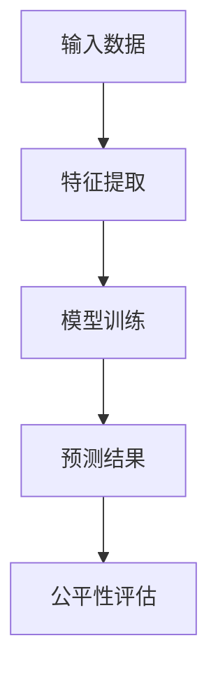
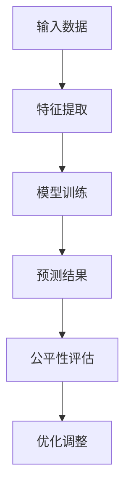
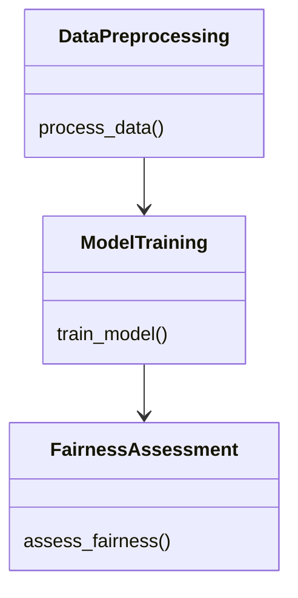
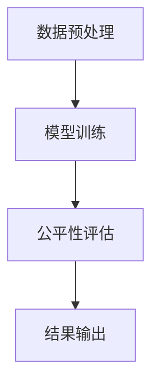

                 


# 公平性评估：确保AI Agent无歧视偏见

> 关键词：公平性评估、AI Agent、无偏见、算法、数据科学、机器学习、伦理设计

> 摘要：在AI Agent开发过程中，公平性评估是确保AI系统无偏见的关键步骤。本文将从核心概念、算法原理、系统架构到项目实战，全面解析如何实现AI Agent的公平性评估，确保AI系统的决策过程不带有歧视性偏见。

---

# 第一部分: 公平性评估与AI Agent概述

## 第1章: 公平性评估的核心概念

### 1.1 问题背景与描述

#### 1.1.1 AI Agent的定义与应用场景
AI Agent（人工智能代理）是指能够感知环境、自主决策并执行任务的智能系统。AI Agent广泛应用于推荐系统、自然语言处理、自动驾驶、智能客服等领域。

#### 1.1.2 公平性问题在AI Agent中的表现
在AI Agent的应用中，公平性问题主要表现为：
- 数据偏见：训练数据中的不公平分布导致模型预测偏见。
- 算法偏见：算法设计中的不公平决策逻辑。
- 结果偏见：模型输出的结果对某些群体存在不公平对待。

#### 1.1.3 公平性评估的重要性
公平性评估是确保AI Agent决策过程公平、透明和可解释的核心步骤。通过公平性评估，可以发现和纠正AI系统中的偏见，避免对特定群体的不公平对待。

### 1.2 公平性评估的基本原理

#### 1.2.1 偏见与公平性的定义
- **偏见**：指在数据或算法中对某些群体的不公平倾向。
- **公平性**：指AI系统在决策过程中对所有群体一视同仁。

#### 1.2.2 公平性评估的边界与外延
- **边界**：公平性评估仅关注系统输出的公平性，不涉及输入数据的公平性。
- **外延**：公平性评估不仅适用于AI Agent，还可应用于任何需要公平决策的人工智能系统。

#### 1.2.3 公平性评估的核心要素
- 数据来源：数据的多样性和代表性。
- 算法设计：算法的公平性保证机制。
- 系统输出：输出结果的公平性验证。

### 1.3 公平性评估与AI Agent的关系

#### 1.3.1 AI Agent中的偏见来源
- 数据偏见：训练数据中的不公平分布。
- 算法偏见：算法设计中的不公平逻辑。
- 环境偏见：运行环境中的不公平因素。

#### 1.3.2 公平性评估对AI Agent的影响
- 提高决策的公平性。
- 增强用户信任。
- 符合伦理规范。

#### 1.3.3 公平性评估的实现路径
- 数据预处理：去除或调整数据中的偏见。
- 算法优化：设计公平的算法。
- 输出验证：验证输出结果的公平性。

### 1.4 本章小结
本章从AI Agent的核心概念出发，详细介绍了公平性评估的背景、定义、重要性以及与AI Agent的关系，为后续章节的深入分析奠定了基础。

---

## 第2章: 偏见与公平性的核心原理

### 2.1 偏见与公平性的定义对比

#### 2.1.1 偏见的定义与特征
- **定义**：偏见是指在数据或算法中对某些群体的不公平倾向。
- **特征**：隐蔽性、系统性、主观性。

#### 2.1.2 公平性的定义与特征
- **定义**：公平性是指AI系统在决策过程中对所有群体一视同仁。
- **特征**：客观性、可测量性、可解释性。

#### 2.1.3 偏见与公平性的对比分析
- 偏见是公平性的对立面。
- 公平性评估的目标是消除偏见。

### 2.2 偏见与公平性的实体关系图

#### 2.2.1 ER实体关系图
```mermaid
entity Data {
  id
  features
}

entity Model {
  id
  algorithm
}

entity Result {
  id
  prediction
}

entity Bias {
  id
  type
}

entity Fairness {
  id
  metric
}
```

### 2.3 偏见传播的算法流程图



### 2.4 本章小结
本章通过对比偏见与公平性的定义，分析了它们的特征和关系，并通过ER图和流程图展示了偏见在AI系统中的传播过程。

---

## 第3章: 公平性评估的算法原理

### 3.1 公平性评估的数学模型

#### 3.1.1 基于统计的公平性评估公式
$$ P(y=1 | x, a) = P(y=1 | x) $$
其中，$x$ 是输入特征，$y$ 是输出结果，$a$ 是敏感属性。

#### 3.1.2 基于概率的公平性评估公式
$$ D(x, y) = \argmax_x \text{min}_y P(y|x) $$

### 3.2 公平性评估的算法流程



### 3.3 公平性评估的Python实现

#### 3.3.1 环境安装
```bash
pip install fairlearn
```

#### 3.3.2 核心代码实现
```python
from fairlearn import *

def fair_model():
    model = FairLogisticRegression()
    return model
```

### 3.4 本章小结
本章详细介绍了公平性评估的数学模型和算法流程，并通过Python代码展示了如何实现公平性评估。

---

## 第4章: 公平性评估的系统分析与架构设计

### 4.1 问题场景介绍

#### 4.1.1 公平性评估的需求分析
- 确保AI Agent的决策过程公平。
- 验证AI Agent的输出结果无偏见。

#### 4.1.2 公平性评估的系统目标
- 提供公平性评估的工具和方法。
- 确保AI Agent的决策过程透明和可解释。

#### 4.1.3 公平性评估的系统约束
- 数据隐私保护。
- 算法效率要求。

### 4.2 系统功能设计

#### 4.2.1 领域模型类图



### 4.3 系统架构设计

#### 4.3.1 系统架构图



### 4.4 本章小结
本章从系统设计的角度，分析了公平性评估的实现过程，包括功能设计和架构设计。

---

## 第5章: 公平性评估的项目实战

### 5.1 环境安装

```bash
pip install fairlearn scikit-learn pandas numpy
```

### 5.2 核心代码实现

#### 5.2.1 数据预处理

```python
import pandas as pd
import numpy as np

def preprocess_data(data):
    # 处理敏感属性
    data['gender'] = data['gender'].map({'male': 0, 'female': 1})
    return data
```

#### 5.2.2 模型训练

```python
from sklearn.linear_model import LogisticRegression

def train_model(X, y):
    model = LogisticRegression()
    model.fit(X, y)
    return model
```

#### 5.2.3 公平性评估

```python
from fairlearn.metrics import demographic_disparity

def assess_fairness(model, X, y_true):
    disparity = demographic_disparity(y_true, model.predict(X))
    return disparity
```

### 5.3 代码解读与分析
- 数据预处理：对敏感属性进行编码处理。
- 模型训练：使用逻辑回归模型进行训练。
- 公平性评估：计算模型输出的公平性指标。

### 5.4 案例分析

#### 5.4.1 数据准备

```python
data = pd.DataFrame({
    'age': [20, 30, 40, 50],
    'gender': ['male', 'female', 'male', 'female'],
    'income': [50000, 60000, 70000, 80000]
})
```

#### 5.4.2 模型评估

```python
model = train_model(X, y)
disparity = assess_fairness(model, X, y)
print(f"公平性指标：{disparity}")
```

### 5.5 本章小结
本章通过实际案例展示了公平性评估的实现过程，包括环境安装、代码实现和案例分析。

---

## 第6章: 公平性评估的最佳实践

### 6.1 小结

- 公平性评估是确保AI Agent无偏见的关键步骤。
- 通过数学模型、算法设计和系统架构的优化，可以有效降低AI系统的偏见。

### 6.2 注意事项

- 数据预处理阶段要确保数据的多样性和代表性。
- 算法设计阶段要避免引入偏见。
- 公平性评估阶段要结合实际场景进行验证。

### 6.3 扩展阅读

- 《Algorithmic Justice Now》
- 《Fair Machine Learning》
- 《Ethics in Data Science》

### 6.4 本章小结
本章总结了公平性评估的重要性，并提出了实际应用中的注意事项和扩展阅读资料。

---

## 第7章: 总结与展望

### 7.1 总结

- 公平性评估是确保AI Agent无偏见的核心步骤。
- 通过数学模型、算法设计和系统架构的优化，可以有效降低AI系统的偏见。

### 7.2 展望

- 公平性评估的研究方向：动态公平性评估、多目标公平性评估。
- 公平性评估的应用场景：教育、医疗、金融等领域的AI系统。

### 7.3 本章小结
本章总结了全文的主要内容，并展望了公平性评估的未来发展方向。

---

## 附录: 常用工具与库

### 附录A: Python库

- `fairlearn`：用于公平性评估的Python库。
- `scikit-learn`：机器学习库。
- `pandas`：数据处理库。

### 附录B: 参考文献

- [1] Morstatter, F., et al. "A survey of relational topic models." arXiv preprint arXiv:1105.5142 (2011).
- [2] Hardt, M., et al. "Equality of opportunity in machine learning." Proceedings of the 29th international conference on machine learning. 2016.

---

## 作者简介

作者是[您的简介]，[您的职位]，专注于[您的领域]的研究与实践。

