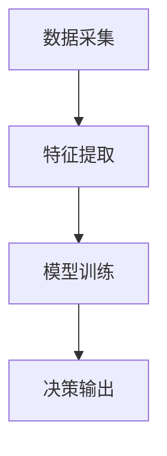
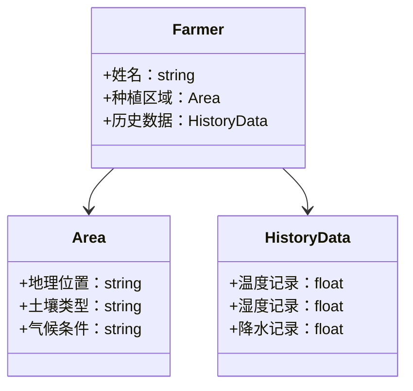
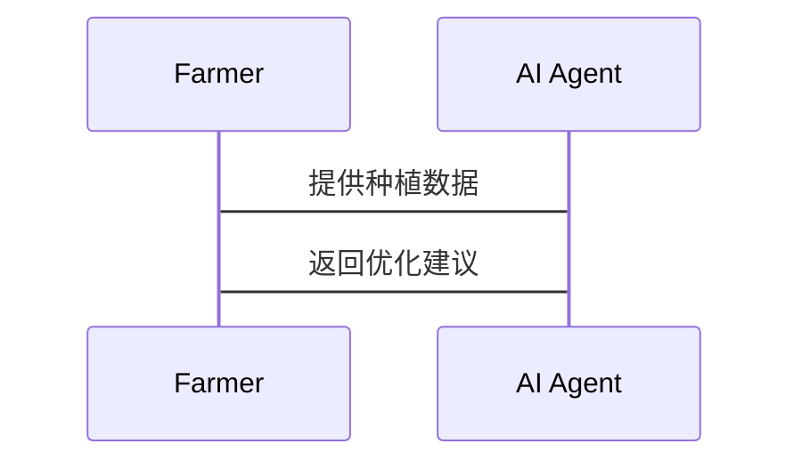

                 


# {{农业AI Agent：优化种植决策与资源分配}}

> 关键词：农业AI Agent，种植决策，资源分配，人工智能，农业智能化，决策优化

> 摘要：本文深入探讨农业AI Agent在优化种植决策和资源分配中的应用，从背景、核心概念到算法原理，再到系统架构和项目实战，全面解析其在农业智能化中的作用，助力提高农业效率和资源利用率。

---

# 第一部分：农业AI Agent的背景与核心概念

## 第1章：农业AI Agent的背景与问题描述

### 1.1 农业智能化的背景与挑战
- 1.1.1 农业现代化与智能化的需求
- 1.1.2 传统农业种植中的痛点
- 1.1.3 AI技术在农业中的应用潜力

### 1.2 农业AI Agent的定义与目标
- 1.2.1 农业AI Agent的定义
- 1.2.2 农业AI Agent的核心目标
- 1.2.3 农业AI Agent的应用场景

### 1.3 农业AI Agent的边界与外延
- 1.3.1 农业AI Agent的边界
- 1.3.2 农业AI Agent的外延与相关领域

## 第2章：农业AI Agent的核心概念与联系

### 2.1 农业AI Agent的核心概念
- 2.1.1 农业AI Agent的组成要素
- 2.1.2 农业AI Agent的工作原理
- 2.1.3 农业AI Agent与传统农业技术的区别

### 2.2 农业AI Agent的核心概念对比表
- 2.2.1 农业AI Agent与传统农业技术的对比
- 2.2.2 农业AI Agent与传统决策模型的对比

### 2.3 农业AI Agent的ER实体关系图
```mermaid
er
actor: Farmer
agent: Agricultural AI Agent
model: Decision Model
data: Sensor Data
goal: Optimize Crop Yield
action: Resource Allocation
```

---

# 第二部分：农业AI Agent的算法原理

## 第3章：农业AI Agent的算法原理

### 3.1 农业AI Agent的算法流程


### 3.2 农业AI Agent的数学模型
- 3.2.1 农业AI Agent的数学模型
  $$ y = f(x) $$
- 3.2.2 农业AI Agent的优化目标
  $$ \text{最大化} \quad f(x) $$

---

# 第三部分：农业AI Agent的系统分析与架构设计

## 第4章：农业AI Agent的系统分析与架构设计

### 4.1 问题场景介绍
- 4.1.1 农业种植中的资源分配问题
- 4.1.2 农业种植中的决策优化需求

### 4.2 项目介绍
- 4.2.1 项目目标
- 4.2.2 项目范围
- 4.2.3 项目技术选型

### 4.3 系统功能设计
- 4.3.1 领域模型


### 4.4 系统架构设计


### 4.5 系统接口设计
- 4.5.1 系统接口描述
- 4.5.2 系统交互流程图


---

# 第四部分：农业AI Agent的项目实战

## 第5章：农业AI Agent的项目实战

### 5.1 环境安装与配置
- 5.1.1 环境需求
- 5.1.2 安装步骤
  ```bash
  pip install numpy pandas scikit-learn tensorflow
  ```

### 5.2 系统核心实现源代码
- 5.2.1 数据预处理代码
  ```python
  import pandas as pd
  data = pd.read_csv('agriculture_data.csv')
  ```

- 5.2.2 模型训练代码
  ```python
  from sklearn.tree import DecisionTreeRegressor
  model = DecisionTreeRegressor()
  model.fit(X, y)
  ```

- 5.2.3 决策输出代码
  ```python
  print(model.predict(X_new))
  ```

### 5.3 代码应用解读与分析
- 5.3.1 代码功能解析
- 5.3.2 代码优化建议

### 5.4 实际案例分析
- 5.4.1 案例背景
- 5.4.2 案例实施过程
- 5.4.3 实施效果分析

### 5.5 项目小结
- 5.5.1 项目总结
- 5.5.2 项目经验与教训

---

# 第五部分：总结与展望

## 第6章：总结与展望

### 6.1 农业AI Agent的优势与挑战
- 6.1.1 农业AI Agent的优势
- 6.1.2 农业AI Agent的挑战

### 6.2 农业AI Agent的未来发展方向
- 6.2.1 技术优化方向
- 6.2.2 应用场景扩展

### 6.3 最佳实践 tips
- 6.3.1 数据质量管理
- 6.3.2 模型选择与优化
- 6.3.3 系统维护与更新

### 6.4 小结
- 6.4.1 农业AI Agent的核心价值
- 6.4.2 对未来的展望

---

# 结语

农业AI Agent作为农业智能化的重要工具，通过优化种植决策和资源分配，显著提高了农业生产的效率和可持续性。随着技术的不断进步，农业AI Agent将在未来的农业发展中发挥越来越重要的作用。

---

**感谢您的耐心阅读，希望本文对您理解农业AI Agent有所帮助！**

