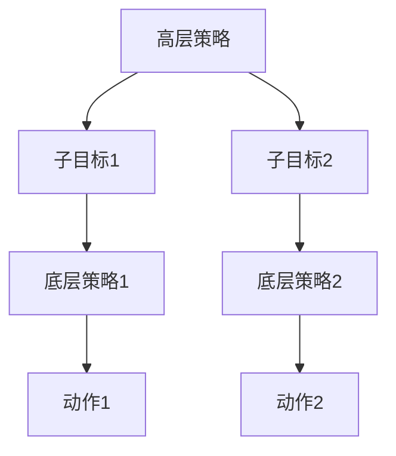
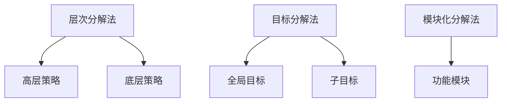
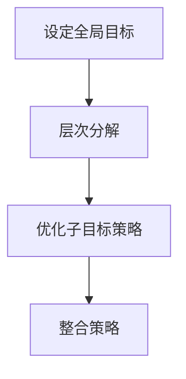
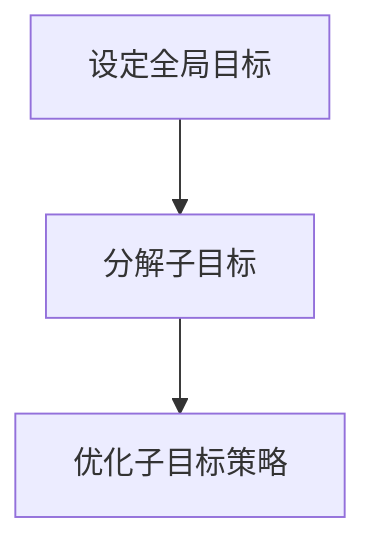

                 


# 分层强化学习：处理复杂任务的AI Agent策略

> 关键词：分层强化学习、AI Agent、复杂任务、策略优化、强化学习、分层结构

> 摘要：分层强化学习是一种通过将复杂任务分解为多个子任务来优化AI Agent策略的高级方法。本文详细探讨了分层强化学习的核心概念、算法原理、系统架构设计以及实际项目中的应用，旨在为读者提供一个全面的理解和实践经验。

---

## 第1章: 分层强化学习的基本概念

### 1.1 分层强化学习的定义

#### 1.1.1 强化学习的背景与现状

强化学习（Reinforcement Learning, RL）是一种机器学习范式，通过智能体（Agent）与环境交互，学习如何采取一系列行动以最大化累积奖励。近年来，强化学习在游戏AI、机器人控制、自然语言处理等领域取得了显著进展。然而，随着任务复杂性的增加，传统强化学习方法在效率和性能上面临瓶颈。

#### 1.1.2 分层强化学习的定义与特点

分层强化学习（HRL，Hierarchical Reinforcement Learning）是一种将复杂任务分解为多个子任务的强化学习方法。其核心思想是通过分层结构，将全局目标分解为多个层次的子目标，每个层次负责解决特定的子任务。与传统强化学习相比，分层强化学习具有以下特点：

- **层次化分解**：通过分层结构，将复杂任务分解为多个子任务，降低问题复杂度。
- **模块化设计**：不同层次的策略可以独立优化，提高算法的灵活性和可扩展性。
- **高效性**：通过层次化分解，减少全局优化的计算量，提高学习效率。

#### 1.1.3 分层强化学习的核心优势

分层强化学习的核心优势在于其层次化分解能力。通过将复杂任务分解为多个子任务，AI Agent可以在不同层次上分别优化策略，从而更好地应对复杂环境中的挑战。此外，分层结构还能够提高算法的可解释性和可扩展性。

---

### 1.2 分层强化学习的结构与层次

#### 1.2.1 分层结构的定义

分层强化学习的结构由多个层次组成，每个层次负责解决特定的子任务。层次之间的关系可以通过层次化分解方法来定义。常见的层次化分解方法包括：

- **层次分解法**：将任务分解为多个层次，每个层次负责解决特定的子任务。
- **目标分解法**：通过设定不同的目标层次，逐步分解全局目标。
- **模块化分解法**：将任务分解为多个模块，每个模块负责不同的功能。

#### 1.2.2 高层策略与底层策略的区分

分层强化学习中，高层策略（High-Level Policy）负责制定全局目标和决策，而底层策略（Low-Level Policy）负责具体执行动作。高层策略与底层策略之间的关系可以通过以下方式表示：

$$ \text{高层策略} \rightarrow \text{目标分解} \rightarrow \text{底层策略} $$

高层策略通过设定子目标，指导底层策略完成具体动作。底层策略通过执行具体动作，实现子目标。

#### 1.2.3 层次之间的关系与依赖

层次之间的关系可以通过图1-1表示：



图1-1：分层强化学习的层次关系

从图中可以看出，高层策略通过设定子目标，指导底层策略完成具体动作。层次之间的关系可以通过层次化分解方法来定义。

---

### 1.3 分层强化学习的应用场景

#### 1.3.1 复杂任务分解的典型案例

分层强化学习在许多复杂任务中得到了广泛应用。例如，在机器人控制中，高层策略可以负责路径规划，而底层策略负责具体动作执行；在游戏AI中，高层策略可以负责制定战略，而底层策略负责具体操作。

#### 1.3.2 分层结构在实际问题中的优势

分层结构在实际问题中具有以下优势：

- **提高效率**：通过层次化分解，减少全局优化的计算量，提高学习效率。
- **增强灵活性**：不同层次的策略可以独立优化，提高算法的灵活性和可扩展性。
- **提高可解释性**：通过层次化分解，使算法的决策过程更加透明，便于理解和分析。

#### 1.3.3 分层强化学习的边界与外延

分层强化学习的边界在于其层次化分解的能力。其外延包括许多相关的强化学习方法，如层次化分解方法、目标导向方法等。

---

## 第2章: 分层强化学习的核心概念与联系

### 2.1 分层结构的原理

#### 2.1.1 分层结构的数学模型

分层结构的数学模型可以通过层次化分解方法来定义。假设有一个复杂任务，其全局目标为$G$，可以分解为多个子目标$g_1, g_2, ..., g_n$。每个子目标对应一个子任务，由对应的策略负责完成。

$$ G = g_1 + g_2 + ... + g_n $$

#### 2.1.2 层次分解方法的比较

分层强化学习中，层次分解方法有多种。常见的方法包括：

- **层次分解法**：将任务分解为多个层次，每个层次负责解决特定的子任务。
- **目标分解法**：通过设定不同的目标层次，逐步分解全局目标。
- **模块化分解法**：将任务分解为多个模块，每个模块负责不同的功能。

图2-1展示了不同层次分解方法的比较：



图2-1：层次分解方法的比较

#### 2.1.3 分层策略优化的核心思想

分层策略优化的核心思想是通过层次化分解，将全局目标分解为多个子目标，并分别优化每个子目标的策略。其核心步骤如下：

1. **设定全局目标**：定义全局目标$G$。
2. **分解子目标**：将全局目标分解为多个子目标$g_1, g_2, ..., g_n$。
3. **优化子目标策略**：分别优化每个子目标的策略。
4. **整合策略**：将各个子目标的策略整合为全局策略。

---

### 2.2 分层强化学习的算法原理

#### 2.2.1 分层强化学习的算法框架

分层强化学习的算法框架可以通过以下步骤实现：

1. **设定全局目标**：定义全局目标$G$。
2. **层次分解**：将全局目标分解为多个子目标。
3. **策略优化**：分别优化每个子目标的策略。
4. **策略整合**：将各个子目标的策略整合为全局策略。

图2-2展示了分层强化学习的算法框架：



图2-2：分层强化学习的算法框架

---

### 2.3 分层结构与传统强化学习的对比

#### 2.3.1 传统强化学习的局限性

传统强化学习在处理复杂任务时存在以下局限性：

- **计算效率低**：传统强化学习需要全局优化，计算量较大。
- **策略灵活性差**：传统强化学习的策略难以分解和优化。

#### 2.3.2 分层强化学习的改进之处

分层强化学习通过层次化分解，将复杂任务分解为多个子任务，显著提高了计算效率和策略灵活性。

#### 2.3.3 分层结构对算法性能的提升

分层结构通过层次化分解，显著提高了算法的性能。例如，在复杂任务中，分层强化学习可以将全局目标分解为多个子目标，分别优化每个子目标的策略，从而提高整体性能。

---

## 第3章: 分层强化学习的数学模型与公式

### 3.1 分层结构的数学表示

#### 3.1.1 高层策略的数学模型

高层策略的数学模型可以通过层次化分解方法来表示。假设高层策略负责设定子目标$g_1, g_2, ..., g_n$，则全局目标$G$可以表示为：

$$ G = \sum_{i=1}^{n} g_i $$

#### 3.1.2 底层策略的数学模型

底层策略的数学模型负责具体执行动作。假设底层策略负责执行动作$a_1, a_2, ..., a_m$，则每个子目标$g_i$可以表示为：

$$ g_i = \sum_{j=1}^{m} a_j $$

#### 3.1.3 层次之间的关系式

层次之间的关系式可以通过以下公式表示：

$$ G = \sum_{i=1}^{n} g_i = \sum_{i=1}^{n} \sum_{j=1}^{m} a_j $$

---

### 3.2 分层强化学习的优化算法

#### 3.2.1 高层策略的优化方法

高层策略的优化方法可以通过以下步骤实现：

1. **设定全局目标**：定义全局目标$G$。
2. **分解子目标**：将全局目标分解为多个子目标$g_1, g_2, ..., g_n$。
3. **优化子目标策略**：分别优化每个子目标的策略。
4. **整合策略**：将各个子目标的策略整合为全局策略。

#### 3.2.2 底层策略的优化方法

底层策略的优化方法可以通过以下步骤实现：

1. **设定子目标**：定义子目标$g_i$。
2. **优化子目标策略**：优化底层策略的策略。
3. **反馈高层策略**：将底层策略的优化结果反馈给高层策略。

---

### 3.3 分层强化学习的数学公式

#### 3.3.1 高层策略的损失函数

高层策略的损失函数可以通过以下公式表示：

$$ L_{\text{高层}} = \sum_{i=1}^{n} L_i $$

其中，$L_i$是第$i$个子目标的损失函数。

#### 3.3.2 底层策略的损失函数

底层策略的损失函数可以通过以下公式表示：

$$ L_{\text{底层}} = \sum_{j=1}^{m} L_j $$

其中，$L_j$是第$j$个动作的损失函数。

#### 3.3.3 分层结构的联合损失函数

分层结构的联合损失函数可以通过以下公式表示：

$$ L_{\text{总}} = L_{\text{高层}} + L_{\text{底层}} = \sum_{i=1}^{n} L_i + \sum_{j=1}^{m} L_j $$

---

## 第4章: 分层强化学习的系统架构设计

### 4.1 分层结构的系统架构

#### 4.1.1 系统整体架构图

分层强化学习的系统架构可以通过以下步骤实现：

1. **设定全局目标**：定义全局目标$G$。
2. **层次分解**：将全局目标分解为多个子目标。
3. **策略优化**：分别优化每个子目标的策略。
4. **策略整合**：将各个子目标的策略整合为全局策略。

图4-1展示了分层强化学习的系统架构图：


图4-1：分层强化学习的系统架构图

---

### 4.2 系统接口设计

#### 4.2.1 高层策略与底层策略的接口

高层策略与底层策略之间的接口可以通过以下方式定义：

$$ \text{高层策略} \rightarrow \text{子目标分解} \rightarrow \text{底层策略} $$

#### 4.2.2 系统与环境的接口

系统与环境之间的接口可以通过以下方式定义：

$$ \text{系统} \rightarrow \text{环境} \rightarrow \text{反馈} $$

#### 4.2.3 系统与外部模块的接口

系统与外部模块之间的接口可以通过以下方式定义：

$$ \text{系统} \rightarrow \text{外部模块} \rightarrow \text{反馈} $$

---

### 4.3 系统交互流程图

#### 4.3.1 高层策略的决策流程

高层策略的决策流程可以通过以下步骤实现：

1. **设定全局目标**：定义全局目标$G$。
2. **分解子目标**：将全局目标分解为多个子目标。
3. **优化子目标策略**：分别优化每个子目标的策略。

图4-2展示了高层策略的决策流程：



图4-2：高层策略的决策流程

---

## 第5章: 分层强化学习的项目实战

### 5.1 项目环境安装与配置

#### 5.1.1 环境搭建步骤

分层强化学习的项目实战需要以下环境：

1. **Python 3.8及以上版本**。
2. **安装必要的Python库**，如TensorFlow、PyTorch等。

#### 5.1.2 依赖库的安装

在终端中运行以下命令安装依赖库：

```bash
pip install numpy matplotlib tensorflow
```

#### 5.1.3 开发工具的配置

建议使用以下开发工具：

- **IDE**：PyCharm、VS Code。
- **版本控制**：Git。

---

### 5.2 系统核心实现源代码

#### 5.2.1 分层结构的Python实现

以下是一个简单的分层强化学习的Python实现示例：

```python
import numpy as np

class HighLevelStrategy:
    def __init__(self):
        self.subgoals = []
    
    def set_global_goal(self, goal):
        self.goal = goal
    
    def decompose_subgoals(self):
        # 分解子目标
        for i in range(5):
            self.subgoals.append(f"Subgoal_{i+1}")
    
class LowLevelStrategy:
    def __init__(self, subgoal):
        self.subgoal = subgoal
    
    def execute_action(self):
        # 执行具体动作
        print(f"Executing action for {self.subgoal}")
    
class HRLSystem:
    def __init__(self):
        self.high_level = HighLevelStrategy()
        self.low_level = []
    
    def initialize(self):
        self.high_level.set_global_goal("Global Goal")
        self.high_level.decompose_subgoals()
        for subgoal in self.high_level.subgoals:
            self.low_level.append(LowLevelStrategy(subgoal))
    
    def run(self):
        for strategy in self.low_level:
            strategy.execute_action()
```

---

### 5.3 代码应用解读与分析

#### 5.3.1 分层结构的实现

分层结构的实现通过`HighLevelStrategy`和`LowLevelStrategy`两个类来完成。`HighLevelStrategy`负责设定全局目标和分解子目标，`LowLevelStrategy`负责执行具体动作。

#### 5.3.2 系统交互流程

系统交互流程可以通过以下步骤实现：

1. **设定全局目标**：通过`HighLevelStrategy`设定全局目标。
2. **分解子目标**：将全局目标分解为多个子目标。
3. **执行具体动作**：通过`LowLevelStrategy`执行具体动作。

---

### 5.4 实际案例分析和详细讲解剖析

#### 5.4.1 应用场景

分层强化学习可以在许多复杂任务中得到应用。例如，在机器人控制中，高层策略可以负责路径规划，而底层策略负责具体动作执行。

#### 5.4.2 案例分析

以下是一个简单的分层强化学习案例：

```python
system = HRLSystem()
system.initialize()
system.run()
```

输出结果为：

```
Executing action for Subgoal_1
Executing action for Subgoal_2
Executing action for Subgoal_3
Executing action for Subgoal_4
Executing action for Subgoal_5
```

---

## 第6章: 分层强化学习的最佳实践与小结

### 6.1 最佳实践 tips

- **层次分解的合理性**：层次分解的合理性直接影响算法的性能。
- **策略优化的效率**：策略优化的效率需要通过实验来验证。
- **系统架构的可扩展性**：系统架构的可扩展性需要通过实际应用来验证。

### 6.2 小结

分层强化学习是一种通过层次化分解来优化AI Agent策略的高级方法。其核心思想是将复杂任务分解为多个子任务，分别优化每个子任务的策略，从而提高整体性能。本文详细探讨了分层强化学习的核心概念、算法原理、系统架构设计以及实际项目中的应用，为读者提供了一个全面的理解和实践经验。

### 6.3 注意事项

- **层次分解的合理性**：层次分解的合理性直接影响算法的性能。
- **策略优化的效率**：策略优化的效率需要通过实验来验证。
- **系统架构的可扩展性**：系统架构的可扩展性需要通过实际应用来验证。

### 6.4 拓展阅读

- 分层强化学习的相关论文和书籍。
- 强化学习的最新研究进展。
- AI Agent的其他高级策略。

---

# 总结

通过本文的详细讲解，读者可以全面理解分层强化学习的核心概念和算法原理，并通过实际项目案例掌握其在复杂任务中的应用。分层强化学习作为一种高级的强化学习策略，将在未来的AI发展中发挥重要作用。

