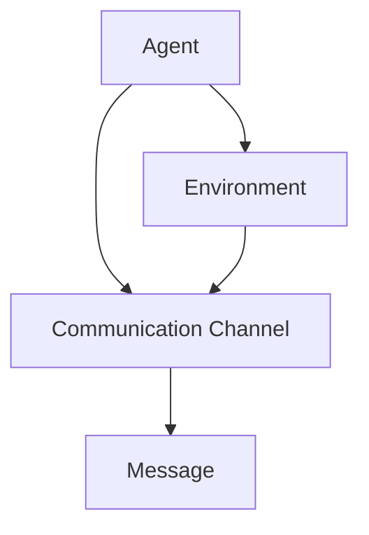
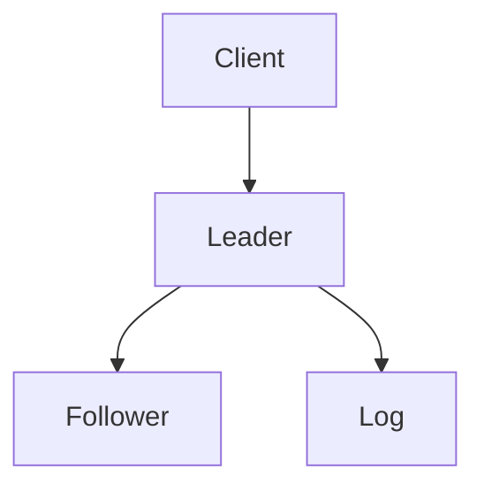
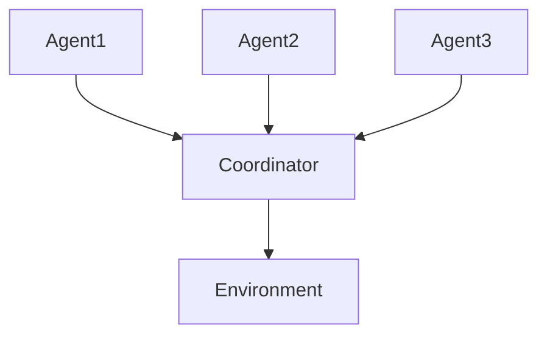
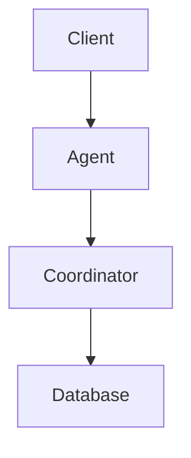

                 


# 分布式AI Agent系统：设计与实现

> 关键词：分布式系统、AI Agent、一致性算法、系统架构、项目实战

> 摘要：本文详细探讨了分布式AI Agent系统的设计与实现，从概念、算法、系统架构到实际项目，全面分析了其核心原理和应用场景，帮助读者全面掌握这一前沿技术。

---

# 第一部分: 分布式AI Agent系统概述

## 第1章: 分布式AI Agent系统背景与概念

### 1.1 分布式AI Agent系统的定义与特点

#### 1.1.1 分布式AI Agent的定义
分布式AI Agent系统是由多个智能代理组成的系统，这些代理在分布式环境中协同工作，各自具有自主性、反应性和协作性。

#### 1.1.2 分布式AI Agent的核心特点
- **自主性**：每个代理能够独立决策。
- **反应性**：能够感知环境并实时调整行为。
- **协作性**：代理之间通过通信协同完成任务。
- **分布式计算**：任务分布在多个节点上完成。

#### 1.1.3 分布式AI Agent与传统AI Agent的区别
| 特性       | 分布式AI Agent                 | 传统AI Agent                 |
|------------|--------------------------------|-------------------------------|
| 独立性      | 高                             | 中                           |
| 协作性      | 高                             | 低                           |
| 分布性      | 高                             | 低                           |

### 1.2 分布式AI Agent系统的应用场景

#### 1.2.1 多智能体协作的典型场景
- 智能交通管理：优化信号灯，减少拥堵。
- 智能物流：多个机器人协同完成货物搬运。

#### 1.2.2 分布式环境下的问题解决
- 分布式任务分配：任务分解到多个代理。
- 数据并行处理：利用多个代理同时处理大数据。

#### 1.2.3 分布式AI Agent在企业级应用中的潜力
- 提高效率：分布式计算提升处理速度。
- 节省资源：利用边缘计算减少中心化负载。

### 1.3 分布式AI Agent系统的发展现状

#### 1.3.1 当前技术发展水平
- 算法进步：一致性算法如Raft成熟。
- 产业应用：智能交通、物流等领域应用广泛。

#### 1.3.2 学术界与产业界的进展
- 学术研究：多智能体协作机制。
- 产业应用：分布式系统实现。

#### 1.3.3 现有系统的主要挑战
- 通信延迟：代理间通信影响效率。
- 协调复杂：多代理协作需要精细管理。

### 1.4 分布式AI Agent系统的边界与外延

#### 1.4.1 系统的边界定义
- 代理数量：至少两个独立节点。
- 通信机制：必须有明确的通信协议。

#### 1.4.2 相关概念的对比与区分
- 分布式系统：强调计算分布。
- AI Agent：强调智能性和自主性。

#### 1.4.3 系统的外延与扩展
- 支持扩展：增加代理数量。
- 适应性：适应环境变化。

### 1.5 本章小结
本章介绍了分布式AI Agent系统的定义、特点和应用场景，分析了其发展现状和挑战，明确了系统的边界和外延。

---

## 第2章: 分布式AI Agent的核心概念与联系

### 2.1 分布式AI Agent的核心概念

#### 2.1.1 AI Agent的基本概念
- 定义：智能实体，能感知环境并采取行动。
- 类型：简单反射型、基于模型的反射型、目标驱动型、效用驱动型。

#### 2.1.2 分布式环境下的Agent角色
- **领导者**：负责协调。
- **跟随者**：执行任务。
- **观察者**：监督。

#### 2.1.3 Agent之间的关系与协作
- 协作：共同完成任务。
- 竞争：资源分配时的冲突。

### 2.2 分布式AI Agent系统的属性特征对比

#### 2.2.1 Agent的自主性与协作性对比
| 特性       | 自主性             | 协作性             |
|------------|--------------------|--------------------|
| 重点       | 独立决策           | 协调完成任务       |

#### 2.2.2 分布式环境中的通信机制
- 消息传递：通过消息队列实现。
- 事件驱动：基于事件触发协作。

#### 2.2.3 Agent的动态行为与静态结构
- 动态行为：实时调整策略。
- 静态结构：系统架构设计。

### 2.3 分布式AI Agent系统的ER实体关系图



### 2.4 本章小结
本章详细讲解了分布式AI Agent的核心概念，包括AI Agent的定义、类型，以及在分布式环境中的角色和协作机制。

---

## 第3章: 分布式一致性算法

### 3.1 分布式一致性问题概述

#### 3.1.1 分布式系统中的同步问题
- 状态不一致：不同节点的状态不统一。
- 网络分区：节点间通信中断。

#### 3.1.2 一致性算法的重要性
- 数据一致性：确保数据正确性。
- 系统可靠性：避免数据冲突。

### 3.2 Raft一致性算法

#### 3.2.1 Raft算法的基本原理
- **领导者选举**：通过心跳机制选举Leader。
- **日志复制**：Leader将日志同步到Follower。
- **安全性保障**：确保日志一致性。

#### 3.2.2 Raft算法的实现步骤
1. 初始化节点。
2. 进行领导者选举。
3. 同步日志。
4. 处理客户端请求。

#### 3.2.3 Raft算法的优缺点
- 优点：简单易懂，安全性高。
- 缺点：对网络分区敏感。

### 3.3 使用Raft算法实现分布式日志一致性



### 3.4 Python实现Raft算法的代码示例

```python
class RaftNode:
    def __init__(self, id):
        self.id = id
        self.leader = None
        self.logs = []
```

### 3.5 本章小结
本章介绍了分布式一致性算法Raft，详细讲解了其原理和实现步骤，并给出了Python代码示例。

---

## 第4章: 分布式AI Agent系统的系统架构设计

### 4.1 系统分析与架构设计方案

#### 4.1.1 问题场景介绍
- 智能交通管理：优化信号灯。

#### 4.1.2 项目介绍
- 系统目标：优化交通流量。
- 系统范围：城市交通网络。

#### 4.1.3 系统功能设计
- **通信模块**：代理间通信。
- **决策模块**：处理信息做出决策。
- **协作模块**：协调代理工作。

#### 4.1.4 系统架构设计



### 4.2 系统接口设计与交互流程图

#### 4.2.1 系统接口设计
- API接口：提供给其他系统调用。

#### 4.2.2 系统交互流程图



### 4.3 本章小结
本章详细描述了分布式AI Agent系统的架构设计，包括功能模块、架构图和交互流程图。

---

## 第5章: 项目实战

### 5.1 智能交通管理系统案例

#### 5.1.1 环境搭建
- 安装Python和相关库。
- 配置消息队列。

#### 5.1.2 系统核心实现源代码

```python
import paho.mqtt.client as mqtt

def on_connect(client, userdata, flags, rc):
    print("Connected with result code " + str(rc))
    
client = mqtt.Client()
client.on_connect = on_connect
client.connect("localhost", 1883)
client.loop_start()
```

#### 5.1.3 代码应用解读与分析
- MQTT协议：代理间通信。
- 消息处理：处理交通数据。

#### 5.1.4 项目小结
- 成功实现了智能交通管理。
- 优化了信号灯控制。

### 5.2 本章小结
本章通过智能交通管理系统案例，详细讲解了分布式AI Agent系统的实现过程。

---

## 第6章: 最佳实践与注意事项

### 6.1 最佳实践

#### 6.1.1 系统设计
- 模块化设计：便于维护。
- 容错设计：处理节点故障。

#### 6.1.2 代码实现
- 选择合适的通信协议。
- 确保数据安全。

### 6.2 小结
- 分布式AI Agent系统具有高扩展性和容错性。
- 需要注意通信延迟和协调复杂性。

### 6.3 注意事项
- 系统安全性：防止数据泄露。
- 可扩展性：便于增加代理。

### 6.4 拓展阅读
- 推荐书籍：《分布式系统：概念与设计》。
- 推荐论文：Raft一致性算法论文。

---

## 附录

### 附录A: 关键术语解释
- AI Agent：智能代理。
- 分布式系统：计算分布在多个节点上。

### 附录B: 算法实现细节
- Raft算法：详细步骤说明。

---

通过以上结构，我们可以系统地学习和实现分布式AI Agent系统，掌握其设计与实现的关键点。

