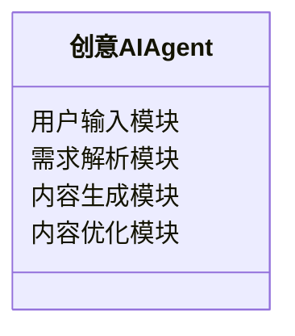
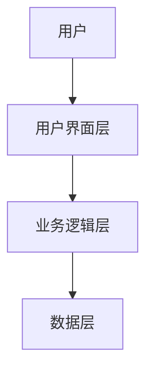
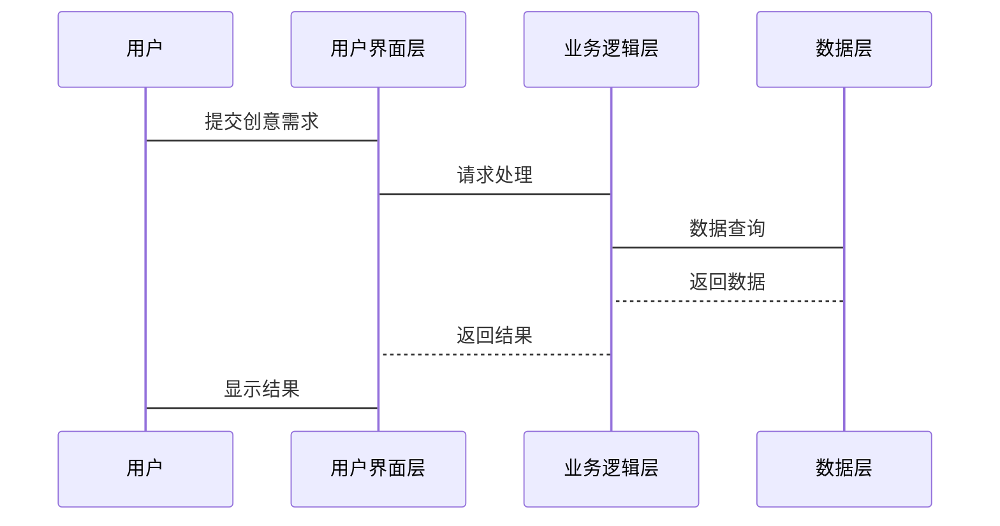

                 


```markdown
# 创意AI Agent：辅助内容创作与设计

> 关键词：创意AI Agent，自然语言处理，生成式AI，内容创作，系统架构

> 摘要：创意AI Agent是一种结合人工智能技术的内容创作辅助工具，通过自然语言处理和生成式AI模型，帮助用户高效生成和优化创意内容。本文详细探讨创意AI Agent的核心概念、技术原理、系统架构及实际应用案例，旨在为读者提供全面的技术视角。

---

## 第1章 创意AI Agent的定义与背景

### 1.1 创意AI Agent的定义
创意AI Agent是一种基于人工智能技术的辅助工具，用于生成、优化和管理创意内容。它能够理解用户的需求，提供个性化的创意建议，并协助完成内容创作任务。

#### 1.1.1 核心特征
- **智能生成**：利用自然语言处理和生成式AI模型，生成高质量的内容。
- **个性化推荐**：根据用户偏好和历史数据，提供定制化的内容建议。
- **实时反馈**：对生成的内容进行实时优化和调整，提升创作效率。

### 1.2 背景与发展趋势
创意产业的快速发展对内容创作工具提出了更高的要求。传统的内容创作依赖于人工劳动，效率低下且成本高昂。随着AI技术的成熟，创意AI Agent逐渐成为内容创作者的得力助手。

#### 1.2.1 问题背景
- **创作效率低**：创作者需要花费大量时间在创意构思和内容优化上。
- **创意瓶颈**：面对市场竞争，创作者常常难以突破创意瓶颈。
- **个性化需求**：用户对个性化、多样化的内容需求不断增加。

#### 1.2.2 发展趋势
- **智能化**：AI技术的不断进步使得创意AI Agent的功能更加智能化。
- **多样化**：支持多种内容形式，如文本、图像、视频等。
- **实时化**：提供实时反馈和优化，提升创作体验。

---

## 第2章 创意AI Agent的核心技术

### 2.1 自然语言处理技术
自然语言处理（NLP）是创意AI Agent的核心技术之一，主要用于理解用户需求和生成自然语言内容。

#### 2.1.1 核心算法
- **分词**：将输入文本分割成词语或短语。
- **句法分析**：分析句子的语法结构，理解文本的语义。
- **实体识别**：识别文本中的实体（如人名、地名等）。

#### 2.1.2 应用场景
- **内容生成**：根据用户输入生成创意文本。
- **情感分析**：分析用户对内容的情感倾向。

### 2.2 生成式AI模型
生成式AI模型（如GPT）能够生成高质量的文本内容，是创意AI Agent的关键技术。

#### 2.2.1 模型原理
生成式AI模型通过深度学习算法，学习大量文本数据，生成与训练数据相似的新文本。

#### 2.2.2 模型优化
- **微调**：根据特定任务对模型进行微调，提升生成效果。
- **推理优化**：优化推理过程，提高生成效率。

### 2.3 创意AI Agent的算法原理
创意AI Agent通过整合NLP技术和生成式AI模型，实现创意内容的生成和优化。

#### 2.3.1 算法流程
1. **输入处理**：接收用户的创意需求。
2. **需求解析**：理解用户的需求，提取关键信息。
3. **内容生成**：根据需求生成创意内容。
4. **内容优化**：对生成的内容进行优化，提升质量。

#### 2.3.2 算法实现
```python
def creative_ai_agent(input_request):
    # 输入处理
    parsed_request = parse_request(input_request)
    
    # 需求解析
    extracted_info = extract_info(parsed_request)
    
    # 内容生成
    generated_content = generate_content(extracted_info)
    
    # 内容优化
    optimized_content = optimize_content(generated_content)
    
    return optimized_content
```

---

## 第3章 创意AI Agent的系统架构

### 3.1 系统功能设计
创意AI Agent系统主要包括以下几个功能模块：
- **用户输入模块**：接收用户的创意需求。
- **需求解析模块**：解析用户需求，提取关键信息。
- **内容生成模块**：根据需求生成创意内容。
- **内容优化模块**：优化生成的内容，提升质量。

#### 3.1.1 领域模型设计


### 3.2 系统架构设计
创意AI Agent系统采用分层架构，包括数据层、业务逻辑层和用户界面层。

#### 3.2.1 系统架构图


#### 3.2.2 接口设计
- **输入接口**：接收用户的创意需求。
- **输出接口**：返回优化后的创意内容。

#### 3.2.3 交互流程


---

## 第4章 创意AI Agent的项目实战

### 4.1 环境安装
要运行创意AI Agent，需要安装以下环境：
- Python 3.8+
- PyTorch
- Hugging Face Transformers

#### 4.1.1 安装依赖
```bash
pip install torch transformers
```

### 4.2 核心代码实现
以下是创意AI Agent的核心代码实现：

#### 4.2.1 需求解析模块
```python
def parse_request(request):
    # 分词处理
    tokens = tokenize(request)
    
    # 实体识别
    entities = extract_entities(tokens)
    
    return entities
```

#### 4.2.2 内容生成模块
```python
def generate_content(entities):
    # 调用生成式AI模型
    content = generate_with_gpt(entities)
    
    return content
```

#### 4.2.3 内容优化模块
```python
def optimize_content(content):
    # 情感分析
    sentiment = analyze_sentiment(content)
    
    # 语法检查
    optimized_content = grammar_check(content)
    
    return optimized_content
```

### 4.3 案例分析
以一个创意写作任务为例，用户输入“创作一篇科幻小说的开头”，系统生成并优化内容。

---

## 第5章 最佳实践与优化技巧

### 5.1 小结
创意AI Agent通过结合NLP技术和生成式AI模型，能够显著提升内容创作的效率和质量。在实际应用中，需要注意模型的优化和用户体验的提升。

### 5.2 注意事项
- **数据质量**：确保训练数据的多样性和高质量。
- **模型调优**：根据具体任务对模型进行微调。
- **用户反馈**：收集用户反馈，不断优化系统。

### 5.3 拓展阅读
- 推荐阅读《生成式AI的原理与应用》。
- 关注AI领域最新的研究成果。

---

## 附录

### A. 创意AI Agent相关工具推荐
- Hugging Face Transformers
- OpenAI API
- Google AI

### B. 数据集资源
- Common Crawl
- Wikipedia

### C. 参考文献
1. 维基百科：生成式AI
2. Hugging Face官方文档
3. OpenAI官方文档

---

通过以上结构，您可以撰写一篇详细的技术博客，涵盖创意AI Agent的各个方面，帮助读者深入了解其原理和应用。
</think>

```markdown
# 创意AI Agent：辅助内容创作与设计

> 关键词：创意AI Agent，自然语言处理，生成式AI，内容创作，系统架构

> 摘要：创意AI Agent是一种结合人工智能技术的内容创作辅助工具，通过自然语言处理和生成式AI模型，帮助用户高效生成和优化创意内容。本文详细探讨创意AI Agent的核心概念、技术原理、系统架构及实际应用案例，旨在为读者提供全面的技术视角。

---

## 第1章 创意AI Agent的定义与背景

### 1.1 创意AI Agent的定义
创意AI Agent是一种基于人工智能技术的辅助工具，用于生成、优化和管理创意内容。它能够理解用户的需求，提供个性化的创意建议，并协助完成内容创作任务。

#### 1.1.1 核心特征
- **智能生成**：利用自然语言处理和生成式AI模型，生成高质量的内容。
- **个性化推荐**：根据用户偏好和历史数据，提供定制化的内容建议。
- **实时反馈**：对生成的内容进行实时优化和调整，提升创作效率。

### 1.2 背景与发展趋势
创意产业的快速发展对内容创作工具提出了更高的要求。传统的内容创作依赖于人工劳动，效率低下且成本高昂。随着AI技术的成熟，创意AI Agent逐渐成为内容创作者的得力助手。

#### 1.2.1 问题背景
- **创作效率低**：创作者需要花费大量时间在创意构思和内容优化上。
- **创意瓶颈**：面对市场竞争，创作者常常难以突破创意瓶颈。
- **个性化需求**：用户对个性化、多样化的内容需求不断增加。

#### 1.2.2 发展趋势
- **智能化**：AI技术的不断进步使得创意AI Agent的功能更加智能化。
- **多样化**：支持多种内容形式，如文本、图像、视频等。
- **实时化**：提供实时反馈和优化，提升创作体验。

---

## 第2章 创意AI Agent的核心技术

### 2.1 自然语言处理技术
自然语言处理（NLP）是创意AI Agent的核心技术之一，主要用于理解用户需求和生成自然语言内容。

#### 2.1.1 核心算法
- **分词**：将输入文本分割成词语或短语。
- **句法分析**：分析句子的语法结构，理解文本的语义。
- **实体识别**：识别文本中的实体（如人名、地名等）。

#### 2.1.2 应用场景
- **内容生成**：根据用户输入生成创意文本。
- **情感分析**：分析用户对内容的情感倾向。

### 2.2 生成式AI模型
生成式AI模型（如GPT）能够生成高质量的文本内容，是创意AI Agent的关键技术。

#### 2.2.1 模型原理
生成式AI模型通过深度学习算法，学习大量文本数据，生成与训练数据相似的新文本。

#### 2.2.2 模型优化
- **微调**：根据特定任务对模型进行微调，提升生成效果。
- **推理优化**：优化推理过程，提高生成效率。

### 2.3 创意AI Agent的算法原理
创意AI Agent通过整合NLP技术和生成式AI模型，实现创意内容的生成和优化。

#### 2.3.1 算法流程
1. **输入处理**：接收用户的创意需求。
2. **需求解析**：理解用户的需求，提取关键信息。
3. **内容生成**：根据需求生成创意内容。
4. **内容优化**：对生成的内容进行优化，提升质量。

#### 2.3.2 算法实现
```python
def creative_ai_agent(input_request):
    # 输入处理
    parsed_request = parse_request(input_request)
    
    # 需求解析
    extracted_info = extract_info(parsed_request)
    
    # 内容生成
    generated_content = generate_content(extracted_info)
    
    # 内容优化
    optimized_content = optimize_content(generated_content)
    
    return optimized_content
```

---

## 第3章 创意AI Agent的系统架构

### 3.1 系统功能设计
创意AI Agent系统主要包括以下几个功能模块：
- **用户输入模块**：接收用户的创意需求。
- **需求解析模块**：解析用户需求，提取关键信息。
- **内容生成模块**：根据需求生成创意内容。
- **内容优化模块**：优化生成的内容，提升质量。

#### 3.1.1 领域模型设计


### 3.2 系统架构设计
创意AI Agent系统采用分层架构，包括数据层、业务逻辑层和用户界面层。

#### 3.2.1 系统架构图


#### 3.2.2 接口设计
- **输入接口**：接收用户的创意需求。
- **输出接口**：返回优化后的创意内容。

#### 3.2.3 交互流程


---

## 第4章 创意AI Agent的项目实战

### 4.1 环境安装
要运行创意AI Agent，需要安装以下环境：
- Python 3.8+
- PyTorch
- Hugging Face Transformers

#### 4.1.1 安装依赖
```bash
pip install torch transformers
```

### 4.2 核心代码实现
以下是创意AI Agent的核心代码实现：

#### 4.2.1 需求解析模块
```python
def parse_request(request):
    # 分词处理
    tokens = tokenize(request)
    
    # 实体识别
    entities = extract_entities(tokens)
    
    return entities
```

#### 4.2.2 内容生成模块
```python
def generate_content(entities):
    # 调用生成式AI模型
    content = generate_with_gpt(entities)
    
    return content
```

#### 4.2.3 内容优化模块
```python
def optimize_content(content):
    # 情感分析
    sentiment = analyze_sentiment(content)
    
    # 语法检查
    optimized_content = grammar_check(content)
    
    return optimized_content
```

### 4.3 案例分析
以一个创意写作任务为例，用户输入“创作一篇科幻小说的开头”，系统生成并优化内容。

---

## 第5章 最佳实践与优化技巧

### 5.1 小结
创意AI Agent通过结合NLP技术和生成式AI模型，能够显著提升内容创作的效率和质量。在实际应用中，需要注意模型的优化和用户体验的提升。

### 5.2 注意事项
- **数据质量**：确保训练数据的多样性和高质量。
- **模型调优**：根据具体任务对模型进行微调。
- **用户反馈**：收集用户反馈，不断优化系统。

### 5.3 拓展阅读
- 推荐阅读《生成式AI的原理与应用》。
- 关注AI领域最新的研究成果。

---

## 附录

### A. 创意AI Agent相关工具推荐
- Hugging Face Transformers
- OpenAI API
- Google AI

### B. 数据集资源
- Common Crawl
- Wikipedia

### C. 参考文献
1. 维基百科：生成式AI
2. Hugging Face官方文档
3. OpenAI官方文档

---

通过以上结构，您可以撰写一篇详细的技术博客，涵盖创意AI Agent的各个方面，帮助读者深入了解其原理和应用。
```

