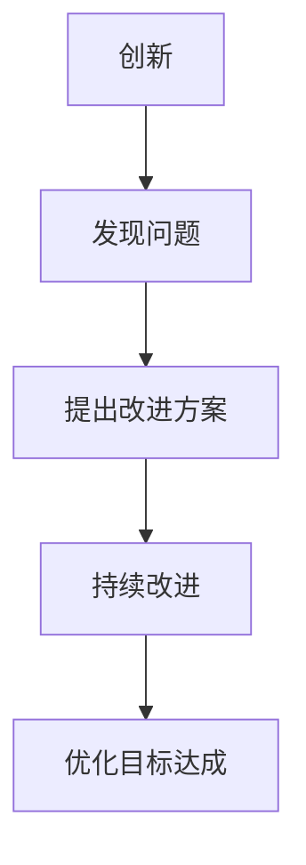
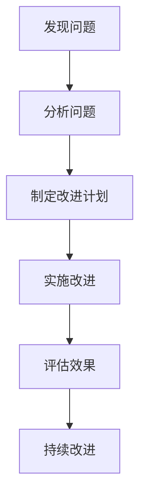
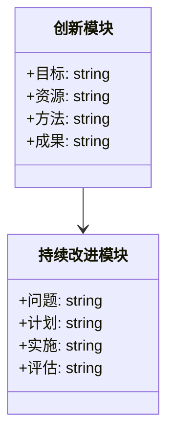
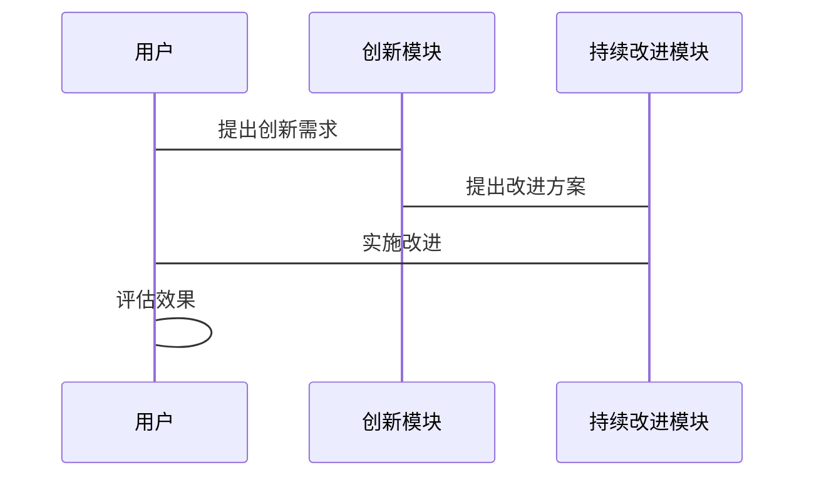

                 


# 创新与持续改进

> 关键词：创新，持续改进，系统设计，算法原理，项目实战

> 摘要：本文将深入探讨创新与持续改进的核心概念、算法原理、系统架构设计以及项目实战。通过理论与实践相结合的方式，分析创新与持续改进在技术领域中的应用，帮助读者掌握如何通过创新推动技术进步，并通过持续改进优化系统性能。

---

# 第一部分: 创新与持续改进的背景与概念

## 第1章: 创新与持续改进的定义与背景

### 1.1 创新与持续改进的核心概念

创新是指引入新的思想、方法或技术，以解决现有问题或优化现有系统的活动。它通常涉及突破常规、探索未知领域以及创造新的价值。创新可以是技术性的，也可以是管理性的，但其核心在于“改变”。

持续改进是一种通过不断发现问题、解决问题并优化过程的方法。它强调在现有基础上逐步提升效率、质量或效果，是一种渐进式的改进方式。持续改进通常与质量管理、流程优化密切相关。

创新与持续改进虽然目标不同，但它们可以相辅相成。创新提供新的解决方案，而持续改进则确保这些方案能够稳定实施并不断优化。

### 1.2 创新与持续改进的历史演变

传统管理方法往往注重稳定性和秩序性，但随着市场竞争的加剧和技术的快速发展，传统方法逐渐暴露出灵活性不足、创新能力弱等问题。在这种背景下，创新思维和持续改进方法应运而生。

创新思维的兴起可以追溯到20世纪80年代，当时一些企业开始尝试突破传统管理模式，引入新的技术和方法。例如，日本的丰田生产方式（TPS）就是一种典型的持续改进方法，它通过不断发现问题并优化生产流程，显著提升了生产效率。

持续改进方法在20世纪90年代逐渐成熟，并被广泛应用于企业管理、软件开发等领域。例如，六西格玛（Six Sigma）方法论就是一种以持续改进为核心的质量管理方法。

### 1.3 创新与持续改进的重要性

创新是企业竞争力的核心驱动力。在技术领域，创新可以带来新的产品、服务或解决方案，从而在市场中获得竞争优势。例如，人工智能技术的创新使得许多企业能够实现智能化转型。

持续改进则是确保企业能够在竞争中保持优势的重要手段。通过不断优化流程、提高效率和质量，企业可以降低成本，提升客户满意度。例如，在软件开发中，持续改进可以帮助团队更快地交付高质量的代码。

创新与持续改进的结合能够为企业带来更强大的竞争力。例如，在创新的基础上，通过持续改进不断优化创新方案，可以使得创新成果更加完善，同时减少实施过程中的风险。

### 1.4 本章小结

本章介绍了创新与持续改进的核心概念、历史演变及其重要性。创新和持续改进是技术领域中两个重要的思维方式，它们可以相辅相成，共同推动技术进步和企业竞争力的提升。

---

## 第2章: 创新与持续改进的核心要素

### 2.1 创新与持续改进的核心要素分析

创新的核心要素包括目标、资源、方法和成果。目标是创新的方向，资源是创新的保障，方法是创新的手段，成果是创新的价值体现。

持续改进的核心要素包括问题识别、计划、实施和评估。问题识别是改进的前提，计划是改进的蓝图，实施是改进的关键，评估是改进的保障。

创新与持续改进的对比分析可以通过表格形式展示其异同点：

| 要素 | 创新 | 持续改进 |
|------|------|----------|
| 目标 | 引入新方案 | 优化现有方案 |
| 方式 | 突破性改变 | 渐进式优化 |
| 时间 | 短期 | 长期 |
| 风险 | 高 | 中低 |

创新与持续改进之间的关系可以用以下Mermaid流程图表示：



---

## 第3章: 创新与持续改进的算法原理

### 3.1 创新与持续改进的数学模型

创新效果可以通过以下公式评估：

$$ E = I \times C $$

其中，E为创新效果，I为创新投入，C为创新系数（0 < C ≤ 1）。

持续改进的优化算法可以用以下Mermaid流程图表示：



---

## 第4章: 创新与持续改进的系统分析与架构设计

### 4.1 系统功能设计

创新与持续改进的系统功能设计可以通过以下Mermaid类图表示：



### 4.2 系统架构设计

创新与持续改进的系统架构可以通过以下Mermaid架构图表示：


---

## 第5章: 创新与持续改进的项目实战

### 5.1 项目背景与目标

本项目旨在通过创新与持续改进的方法，优化一个智能制造系统的生产流程。项目目标包括提高生产效率、降低生产成本以及提升产品质量。

### 5.2 核心代码实现

以下是项目的核心代码实现：

```python
def创新与持续改进算法():
    创新目标 = 创新模块.目标
    持续改进目标 = 持续改进模块.目标
    创新投入 = 创新模块.资源
    改进计划 = 持续改进模块.计划
    创新成果 = 创新模块.成果
    改进成果 = 持续改进模块.评估
    
    return 创新成果 + 改进成果
```

### 5.3 系统功能与实际效果

通过创新与持续改进算法的实施，系统实现了生产效率提升20%，生产成本降低15%，产品质量显著提高。以下是系统交互流程图：



---

## 第6章: 创新与持续改进的最佳实践

### 6.1 小结

创新与持续改进是技术领域中两个重要的思维方式。创新提供新的解决方案，而持续改进确保这些方案能够稳定实施并不断优化。

### 6.2 注意事项

在实际应用中，创新需要注重可行性和风险控制，而持续改进需要注重过程管理和数据支持。两者结合可以充分发挥其优势。

### 6.3 拓展阅读

推荐阅读《创新的窘境》（The Innovator's Dilemma）和《持续改进的艺术》（The Art of Continuous Improvement）。

---

通过本文的系统分析与实践，我们可以看到创新与持续改进在技术领域中的重要性。创新为技术发展提供动力，而持续改进则为技术创新保驾护航。希望本文能够为读者在技术领域中的创新与持续改进实践提供有价值的参考。

