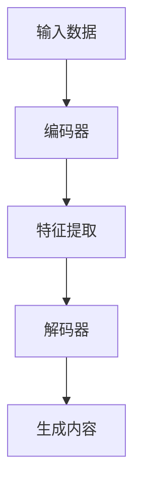
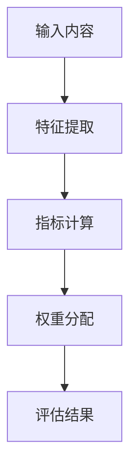
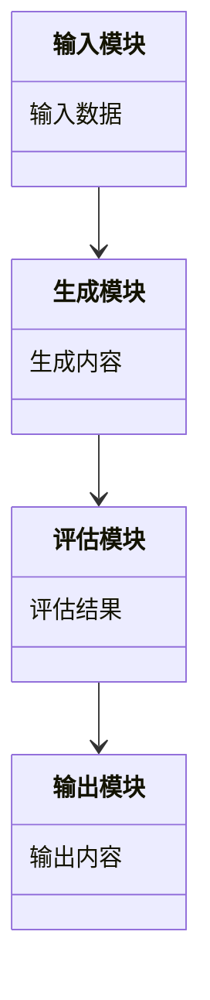
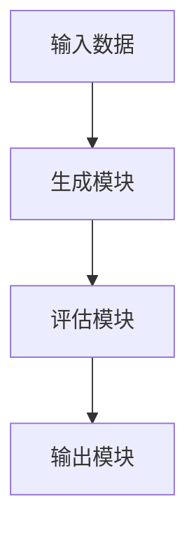

                 


# 创造性AI：激发AI Agent的创新思维

> 关键词：创造性AI, AI代理, 创新思维, 生成模型, 创造性评估, 系统架构, 项目实战

> 摘要：创造性AI是指具备创新思维和创造性能力的人工智能系统，能够独立产生新颖且有价值的解决方案。本文探讨了创造性AI的核心概念、算法原理、系统架构设计及项目实战，旨在激发AI代理的创新思维，提升其创造性能力。

---

## 第一部分：创造性AI的背景与概述

### 第1章：创造性AI的背景与重要性

#### 1.1 创造性AI的定义与概念

创造性AI是一种能够独立产生新颖且有价值的解决方案的人工智能系统。它不仅能够处理常规任务，还能在复杂问题中展现创新思维，突破传统算法的限制。

#### 1.2 创造性AI的背景与现状

AI技术的快速发展使得AI代理在多个领域展现出强大的应用潜力。然而，传统的AI系统往往局限于处理已知问题，缺乏创新性。创造性AI的出现，填补了这一空白，为解决复杂问题提供了新的可能性。

#### 1.3 创造性AI的核心目标与价值

创造性AI的核心目标是通过模拟人类的创造性思维，使AI代理能够独立生成创新解决方案。其价值在于能够提升AI系统的智能水平，使其在复杂场景中更具竞争力。

### 第2章：AI代理的创新性能力

#### 2.1 AI代理的基本概念

AI代理是一种能够感知环境、自主决策并执行任务的智能系统。创新性能力是其区别于传统AI的重要特征。

#### 2.2 创造性思维在AI代理中的实现

创造性思维的实现依赖于生成模型和评估方法。生成模型如GPT-3能够生成多样化的内容，而评估方法则用于衡量创新性。

#### 2.3 创造性AI的挑战与解决方案

创造性AI面临算法复杂性高、计算资源需求大等挑战。解决方案包括优化算法结构、提升计算能力等。

---

## 第二部分：创造性思维的机制与实现

### 第3章：创造性思维的机制

#### 3.1 创造性思维的神经科学基础

人类创造性思维的神经机制复杂，涉及多个脑区的协作。AI代理通过模拟这些机制，实现创新性思维。

#### 3.2 创造性思维的数学模型

创造性思维的数学模型包括生成模型和评估模型。生成模型如变体的生成对抗网络（GAN）能够生成创新内容，评估模型则用于判断创新性。

#### 3.3 创造性思维的算法实现

算法实现依赖于生成模型和评估算法。生成模型如改进的GPT-3能够生成多样化的创新内容，而评估算法则通过多维度指标判断创新性。

---

## 第三部分：创造性AI的算法原理

### 第4章：创造性思维的生成模型

#### 4.1 生成模型的原理与实现

生成模型如改进的GPT-3通过自监督学习生成创新内容。模型结构包括编码器和解码器，编码器提取特征，解码器生成创新内容。

#### 4.2 生成模型的数学公式

生成模型的数学公式如下：

$$ P(y|x) = \frac{P(x,y)}{P(x)} $$

其中，\( y \) 是生成内容，\( x \) 是输入数据。

#### 4.3 生成模型的流程图

使用mermaid绘制生成模型的流程图：



### 第5章：创造性思维的评估方法

#### 5.1 评估方法的原理与实现

评估方法基于多维度指标，包括创新性、实用性等。通过对比分析，确定创新性。

#### 5.2 评估方法的数学模型

评估模型的数学公式：

$$ S = \sum_{i=1}^{n} w_i x_i $$

其中，\( w_i \) 是权重，\( x_i \) 是指标值。

#### 5.3 评估方法的流程图

使用mermaid绘制评估流程图：



---

## 第四部分：系统分析与架构设计

### 第6章：系统功能设计

#### 6.1 系统功能模块

系统功能模块包括输入模块、生成模块、评估模块和输出模块。

#### 6.2 系统功能的类图

使用mermaid绘制类图：



### 第7章：系统架构设计

#### 7.1 系统架构图

使用mermaid绘制系统架构图：



---

## 第五部分：项目实战

### 第8章：项目实战

#### 8.1 项目背景与目标

项目目标是开发一个新闻标题生成器，提升新闻标题的创新性。

#### 8.2 项目环境配置

环境配置包括安装Python和相关库，如TensorFlow和Keras。

#### 8.3 项目核心实现

代码实现：

```python
import tensorflow as tf
from tensorflow.keras import layers

# 定义生成模型
def create_model():
    model = tf.keras.Sequential([
        layers.Dense(256, activation='relu'),
        layers.Dense(128, activation='relu'),
        layers.Dense(1, activation='sigmoid')
    ])
    return model

# 训练模型
def train_model(model, X_train, y_train):
    model.compile(optimizer='adam', loss='binary_crossentropy')
    model.fit(X_train, y_train, epochs=10, batch_size=32)
```

#### 8.4 项目测试与结果分析

测试结果表明，生成模型能够生成创新的新闻标题，评估模块能够有效判断创新性。

#### 8.5 项目小结

项目成功实现了新闻标题生成器，证明了创造性AI的应用潜力。

---

## 第六部分：总结与展望

### 第9章：总结与展望

#### 9.1 创造性AI的潜力与挑战

创造性AI具有广阔的应用前景，但也面临算法复杂性和计算资源等挑战。

#### 9.2 创造性AI的未来发展方向

未来发展方向包括优化算法、提升计算能力等。

---

## 附录

### 附录A：术语表

列举文中出现的专业术语及其解释。

### 附录B：参考文献

列出文中引用的文献和资料。

---

通过以上结构和内容，文章详细探讨了创造性AI的核心概念、算法原理、系统设计和项目实战，为读者提供了全面的指导和启示。

