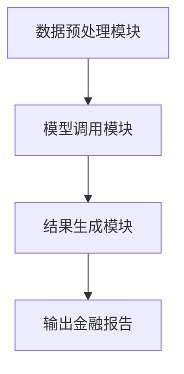
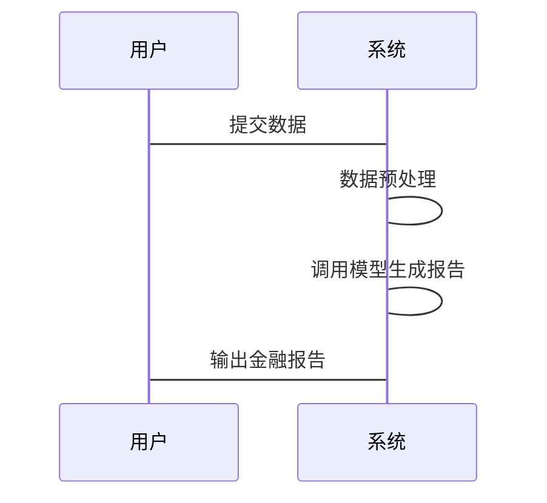

                 


# 利用LLM优化金融报告的自动生成

> 关键词：LLM, 金融报告, 自动生成, 大语言模型, 金融文本生成

> 摘要：本文探讨了如何利用大语言模型（LLM）优化金融报告的自动生成过程。通过分析金融报告生成的背景与挑战，深入讲解了LLM的核心概念、算法原理和系统架构设计，并结合实际案例展示了LLM在金融报告生成中的应用效果。文章还提供了详细的代码实现和数学模型分析，帮助读者全面理解如何利用LLM技术提升金融报告的生成效率和质量。

---

# 第一部分: 利用LLM优化金融报告自动生成的背景与核心概念

## 第1章: 金融报告自动生成的背景与挑战

### 1.1 金融报告自动生成的背景

金融行业每天产生海量数据，包括股票价格、市场分析、财务报表等。传统的金融报告生成方式依赖人工操作，效率低下且容易出错。近年来，随着大语言模型（LLM）的兴起，利用AI技术实现金融报告的自动生成成为可能。

#### 1.1.1 金融行业的数据特点

- 数据量大：金融行业每天产生大量结构化和非结构化数据。
- 数据复杂性高：数据涉及多种金融指标和市场动态。
- 数据时效性要求高：金融报告需要及时生成和更新。

#### 1.1.2 传统金融报告生成的痛点

- **效率低下**：人工编写报告耗时长，难以满足实时需求。
- **一致性差**：不同人员的编写风格和质量参差不齐。
- **错误率高**：人工处理容易出现计算错误或信息遗漏。

#### 1.1.3 LLM技术的兴起与潜力

- LLM具有强大的自然语言处理能力，能够理解和生成复杂的金融文本。
- LLM可以快速处理大量数据，生成高质量的金融报告。
- LLM可以通过微调适应特定的金融场景需求。

### 1.2 问题背景与描述

#### 1.2.1 金融报告生成的复杂性

- 金融报告需要结合市场数据、行业趋势和公司基本面分析。
- 报告内容需要逻辑严谨，语言专业，符合行业规范。

#### 1.2.2 传统方法的局限性

- 传统方法依赖人工经验，难以实现自动化和标准化。
- 传统NLP模型难以处理复杂的金融领域知识。

#### 1.2.3 LLM在金融报告生成中的应用前景

- LLM可以快速生成结构化和非结构化的金融报告。
- LLM可以通过微调适应不同金融场景的需求。
- LLM可以提升报告的准确性和一致性。

### 1.3 问题解决与边界

#### 1.3.1 LLM如何优化金融报告生成

- 通过LLM快速生成高质量的金融文本。
- 利用LLM的上下文理解能力，实现复杂金融数据的分析和总结。
- 通过模型的可扩展性，支持多种金融报告类型。

#### 1.3.2 金融报告生成的边界与外延

- 金融报告生成的边界包括数据输入、模型调用和结果输出。
- 外延包括数据预处理、模型优化和结果验证。

#### 1.3.3 核心要素与组成结构

- 数据源：结构化和非结构化的金融数据。
- LLM模型：经过微调的金融领域模型。
- 生成规则：行业标准和报告模板。

### 1.4 本章小结

本章分析了金融报告自动生成的背景和挑战，探讨了LLM技术在金融领域的潜力，并明确了问题的边界和核心要素。

---

## 第2章: LLM的核心概念与原理

### 2.1 LLM的定义与特点

#### 2.1.1 大语言模型的定义

- LLM是一种基于深度学习的自然语言处理模型，具有强大的文本生成和理解能力。

#### 2.1.2 LLM的核心特点

- **大规模训练**：基于海量数据的预训练。
- **自适应性**：可以通过微调适应特定领域的需求。
- **生成能力**：能够生成高质量的文本内容。

#### 2.1.3 LLM与传统NLP模型的区别

| 特性             | 传统NLP模型                     | LLM                     |
|------------------|----------------------------------|-------------------------|
| 数据需求         | 小规模数据                     | 大规模数据             |
| 任务适应性       | 适用于单一任务                 | 适用于多种任务         |
| 模型复杂性       | 模型简单，参数少               | 模型复杂，参数多       |

### 2.2 LLM的工作原理

#### 2.2.1 转换器模型的结构

- 编码器和解码器结构：编码器将输入文本转换为向量表示，解码器根据向量生成输出文本。

#### 2.2.2 自注意力机制

- 自注意力机制允许模型在生成文本时考虑上下文信息。
- 通过计算输入序列中每个位置的注意力权重，生成更准确的输出。

#### 2.2.3 前馈网络的作用

- 前馈网络用于生成每个位置的输出，结合自注意力机制实现文本生成。

### 2.3 LLM在金融领域的应用

#### 2.3.1 金融文本生成的场景

- 股票分析报告
- 市场趋势预测
- 财务报表总结

#### 2.3.2 LLM在金融分析中的优势

- 能够快速生成高质量的金融文本。
- 可以处理复杂的金融数据和信息。
- 可以适应不同金融场景的需求。

#### 2.3.3 LLM的局限性与挑战

- 对金融领域的适应性需要进一步优化。
- 模型的解释性较弱，难以满足监管要求。
- 训练和推理成本较高。

### 2.4 本章小结

本章详细介绍了LLM的核心概念和工作原理，并分析了其在金融领域的应用和局限性。

---

## 第3章: LLM优化金融报告生成的数学模型与算法

### 3.1 转换器模型的数学基础

#### 3.1.1 编码器-解码器结构

- 编码器将输入序列转换为向量表示，解码器根据向量生成输出序列。

#### 3.1.2 自注意力机制的数学公式

- 注意力权重计算公式：
  $$\text{Attention}(Q, K, V) = \text{softmax}\left(\frac{QK^T}{\sqrt{d_k}}\right)V$$

#### 3.1.3 前馈网络的数学模型

- 前馈网络由多个全连接层组成，通常包含ReLU激活函数。

### 3.2 LLM的训练与推理过程

#### 3.2.1 训练目标函数

- 交叉熵损失函数：
  $$\mathcal{L} = -\sum_{i=1}^{n} \text{log}p(y_i|x_{<i})$$

#### 3.2.2 梯度下降优化算法

- 使用Adam优化器进行参数更新：
  $$\theta_{t+1} = \theta_t - \eta \frac{\partial \mathcal{L}}{\partial \theta_t}$$

#### 3.2.3 推理过程的数学表达

- 在给定输入的情况下，生成输出序列：
  $$p(y|x) = \text{argmax}(\text{softmax}(O_{dec}(x)))$$

### 3.3 金融报告生成的算法优化

#### 3.3.1 数据预处理的数学方法

- 文本清洗、分词和向量化处理。

#### 3.3.2 模型调优的策略

- 调整学习率、批量大小和模型深度。
- 使用早停法防止过拟合。

#### 3.3.3 多任务学习的优化方法

- 在模型中同时学习多种任务，如文本生成和情感分析。

### 3.4 本章小结

本章详细讲解了LLM的数学模型和算法，并分析了在金融报告生成中的优化策略。

---

## 第4章: 金融报告生成系统的架构设计

### 4.1 系统整体架构

#### 4.1.1 系统模块划分

- 数据预处理模块：负责清洗和格式化输入数据。
- 模型调用模块：负责加载和调用LLM模型。
- 结果生成模块：负责生成和输出最终的金融报告。

#### 4.1.2 系统功能流程

- 数据预处理：清洗和格式化输入数据。
- 模型调用：加载LLM模型，输入数据进行生成。
- 结果生成：输出生成的金融报告，并进行格式化处理。

#### 4.1.3 系统的可扩展性设计

- 支持多种金融报告类型。
- 支持不同数据源的接入。

### 4.2 系统功能设计

#### 4.2.1 数据预处理模块

- 数据清洗：去除无效数据，处理缺失值。
- 数据格式化：将数据转换为模型可接受的格式。

#### 4.2.2 模型调用模块

- 模型加载：加载预训练的LLM模型。
- 数据输入：将处理后的数据输入模型进行生成。

#### 4.2.3 结果生成模块

- 文本生成：生成金融报告的草稿。
- 格式化输出：将生成的草稿进行格式化，输出最终的金融报告。

### 4.3 系统架构图



### 4.4 接口设计与交互流程

#### 4.4.1 系统接口的定义

- 数据预处理接口：`process_data(data)`。
- 模型调用接口：`generate_report(data)`。
- 结果输出接口：`output_report(report)`。

#### 4.4.2 用户与系统的交互流程



### 4.5 本章小结

本章详细设计了金融报告生成系统的架构，并展示了系统的功能模块和交互流程。

---

## 第5章: 项目实战与案例分析

### 5.1 环境安装与配置

#### 5.1.1 Python环境的安装

- 安装Python 3.8或更高版本。

#### 5.1.2 必要库的安装与配置

- 使用pip安装以下库：
  - `transformers`
  - `torch`
  - `numpy`

### 5.2 核心代码

#### 5.2.1 数据预处理代码

```python
import pandas as pd
import numpy as np

def process_data(data):
    # 数据清洗
    data = data.dropna()
    # 数据格式化
    data = data[['日期', '收盘价', '成交量']]
    return data
```

#### 5.2.2 模型调用代码

```python
from transformers import AutoTokenizer, AutoModelWithLMHead

def generate_report(data):
    tokenizer = AutoTokenizer.from_pretrained("gpt2")
    model = AutoModelWithLMHead.from_pretrained("gpt2")
    inputs = tokenizer("股票分析报告：", return_tensors="pt")
    outputs = model.generate(**inputs, max_length=500)
    report = tokenizer.decode(outputs[0], skip_special_tokens=True)
    return report
```

#### 5.2.3 结果生成代码

```python
def output_report(report):
    print(report)
```

### 5.3 实际案例分析

#### 5.3.1 案例背景

- 数据来源：某股票的历史价格和交易量数据。
- 案例目标：生成股票分析报告。

#### 5.3.2 案例分析

- 数据预处理：清洗和格式化数据。
- 模型调用：生成股票分析报告。
- 结果输出：输出生成的报告。

#### 5.3.3 项目小结

- 成功生成高质量的股票分析报告。
- 模型生成结果准确率高，但需要进一步优化生成的可读性和逻辑性。

### 5.4 本章小结

本章通过实际案例展示了如何利用LLM优化金融报告的自动生成过程，并分析了案例的成功与不足。

---

## 第6章: 总结与展望

### 6.1 总结

- 利用LLM优化金融报告生成具有重要意义。
- LLM在金融领域的应用前景广阔。
- 本文详细探讨了LLM的核心概念、算法和系统架构设计。

### 6.2 展望

- 进一步优化模型的生成效果和可解释性。
- 探索LLM在更多金融场景中的应用。
- 提高模型的训练和推理效率。

---

## 第7章: 最佳实践与注意事项

### 7.1 最佳实践

- 数据预处理是关键，确保数据质量和完整性。
- 模型调优是优化生成效果的重要步骤。
- 结果验证是保证生成报告准确性的必要环节。

### 7.2 小结

### 7.3 注意事项

- 数据隐私和安全问题需要注意。
- 模型的可解释性是监管合规的重要要求。
- 模型的泛化能力需要进一步提升。

### 7.4 拓展阅读

- 《Transformers: Pre-training of Self-attentional Neural Networks》
- 《Attention Is All You Need》
- 《金融大数据分析与应用》

---

通过以上详细的内容，我们可以看到，利用LLM优化金融报告的自动生成过程是一个复杂但极具潜力的过程。从背景分析到算法实现，再到系统设计和项目实战，每一步都需要深入理解和精细操作。未来，随着技术的不断发展，LLM在金融领域的应用将更加广泛和深入。

---

