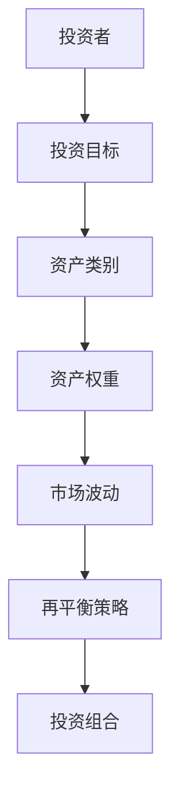
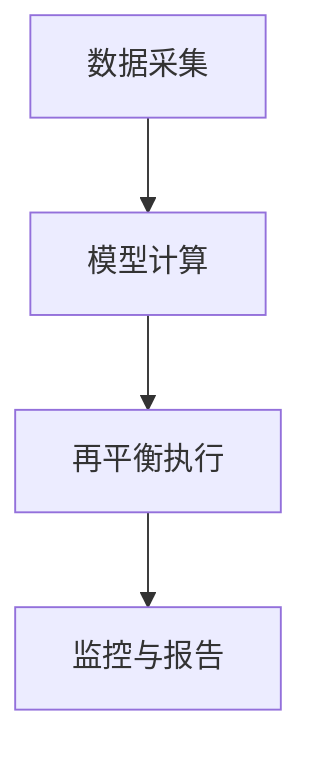
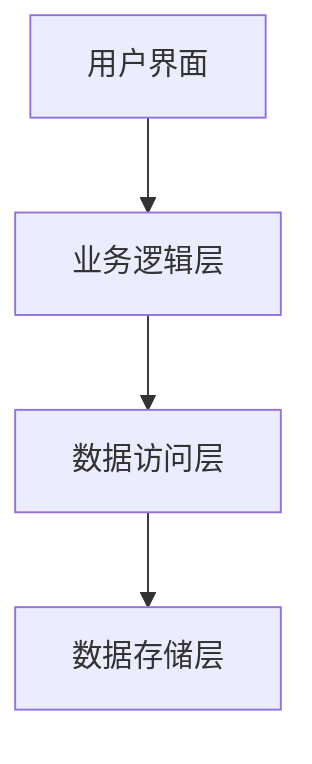

                 


# 利用市场波动重新平衡资产配置的策略

## 关键词：市场波动，资产配置，再平衡策略，投资组合优化，风险管理

## 摘要：本文探讨了在市场波动背景下，如何通过重新平衡资产配置来优化投资组合。文章详细分析了市场波动对资产配置的影响，介绍了多种再平衡策略，并通过数学模型和算法实现，结合实际案例，展示了如何在动态市场环境中有效管理资产配置，降低风险并提高收益。

---

# 第一部分: 利用市场波动重新平衡资产配置的背景与基础

## 第1章: 市场波动与资产配置概述

### 1.1 市场波动的定义与特征

#### 1.1.1 市场波动的定义  
市场波动是指金融市场中资产价格在短期内的剧烈波动，通常由市场参与者的心理预期、宏观经济因素和突发事件等多重因素引起。  

#### 1.1.2 市场波动的类型与表现形式  
市场波动可以分为以下几种类型：  
- **短期波动**：通常由市场情绪变化或突发事件引发，持续时间较短。  
- **中期波动**：由经济周期变化或政策调整引起，持续时间较长。  
- **长期波动**：受基本面因素如经济增长、技术创新等影响，持续时间最长。  

#### 1.1.3 市场波动对投资决策的影响  
市场波动会显著影响投资者的心理和行为，可能导致非理性决策。例如，市场下跌时投资者可能恐慌性抛售，市场上涨时可能过度乐观。

### 1.2 资产配置的基本概念

#### 1.2.1 资产配置的定义  
资产配置是指将资金分配到不同资产类别（如股票、债券、房地产等）以实现投资目标的过程。  

#### 1.2.2 资产配置的分类与特点  
资产配置可以分为以下几种类型：  
- **保守型配置**：以固定收益类资产为主，风险低但收益有限。  
- **平衡型配置**：股票和债券等资产按一定比例分配，兼顾风险和收益。  
- **进取型配置**：以股票等风险资产为主，收益高但风险较大。  

#### 1.2.3 资产配置与投资收益的关系  
合理的资产配置可以有效分散风险，同时提高投资收益。研究表明，资产配置对投资组合的收益贡献度通常超过60%。

### 1.3 资产配置再平衡的必要性

#### 1.3.1 再平衡的定义与目的  
再平衡是指根据市场变化和个人投资目标的调整，定期或不定期地调整资产配置比例，以维持预期的风险收益水平。  

#### 1.3.2 再平衡的常见触发条件  
- 市场波动导致某类资产比例偏离预定目标。  
- 投资目标发生变化，如风险承受能力降低。  
- 经济周期变化，如进入衰退期或复苏期。  

#### 1.3.3 再平衡对投资组合风险控制的作用  
通过再平衡，可以避免单一资产类别的过度暴露，降低整体投资组合的波动性和风险。

## 第2章: 市场波动与资产配置的关系

### 2.1 市场波动对资产配置的影响

#### 2.1.1 不同市场环境下资产配置的调整  
- **牛市**：可以增加股票等风险资产的比例，追求更高收益。  
- **熊市**：应增加债券等防御性资产的比例，降低风险。  

#### 2.1.2 市场波动对资产类别权重的影响  
市场波动会导致不同资产类别的表现差异，从而影响其在投资组合中的权重。例如，股票在市场波动加剧时可能大幅下跌，导致其权重被动下降。

#### 2.1.3 市场波动与资产配置风险的关联  
市场波动越大，资产配置的风险越高。因此，在波动较大的市场环境下，需要更加频繁地进行再平衡操作，以降低风险。

### 2.2 资产配置再平衡的策略类型

#### 2.2.1 定期再平衡策略  
定期再平衡是指按照预定的时间间隔（如每季度或每年）进行资产配置调整。这种方法简单易行，但可能错过市场波动带来的调整机会。

#### 2.2.2 动态再平衡策略  
动态再平衡是指根据市场波动和投资目标的变化，随时进行资产配置调整。这种方法更加灵活，但需要较高的市场监控和操作成本。

#### 2.2.3 基于市场波动的主动再平衡策略  
基于市场波动的再平衡策略是根据市场波动的强度和方向，主动调整资产配置比例。例如，在市场剧烈波动时，增加防御性资产的比例以规避风险。

### 2.3 市场波动下资产配置的优化方法

#### 2.3.1 现代投资组合理论在资产配置中的应用  
现代投资组合理论（MPT）强调通过分散投资降低风险。在市场波动较大的情况下，可以通过增加低相关性的资产类别来优化投资组合。

#### 2.3.2 基于波动率的资产权重调整模型  
可以利用波动率指标来调整资产权重。例如，当某类资产的波动率显著上升时，减少其权重以降低整体波动性。

#### 2.3.3 风险平价策略在资产配置中的应用  
风险平价策略是将投资组合中各类资产的风险贡献度相等化，从而在不同市场环境下保持稳定的波动性。

---

# 第二部分: 利用市场波动重新平衡资产配置的核心概念与联系

## 第3章: 资产配置再平衡的核心原理

### 3.1 资产配置再平衡的数学模型

#### 3.1.1 投资组合理论的数学公式  
现代投资组合理论的核心是通过优化投资组合的方差（波动性）来实现收益最大化。数学公式如下：  
$$ \text{Minimize } \sigma^2 \text{ subject to } \mu \geq \text{目标收益} $$  

其中，$\sigma^2$ 是投资组合的方差，$\mu$ 是投资组合的预期收益。

#### 3.1.2 市场波动下的权重调整模型  
在市场波动较大的情况下，可以采用以下权重调整模型：  
$$ w_i = \frac{1}{n} \times \frac{1}{\text{波动率}_i} $$  
其中，$w_i$ 是第 $i$ 类资产的权重，$n$ 是资产类别总数，$\text{波动率}_i$ 是第 $i$ 类资产的波动率。

#### 3.1.3 基于波动率的风险调整模型  
风险调整模型通过调整各类资产的权重，使得投资组合的整体波动率最小化：  
$$ \text{Minimize } \sum_{i=1}^n w_i^2 \times \text{波动率}_i^2 $$  
其中，$w_i$ 是第 $i$ 类资产的权重，$\text{波动率}_i$ 是第 $i$ 类资产的波动率。

### 3.2 资产配置的核心概念与联系

#### 3.2.1 核心概念的解释与对比  
以下是不同再平衡策略的对比表格：

| 策略类型         | 定义                                 | 优缺点                       |
|------------------|------------------------------------|------------------------------|
| 定期再平衡       | 按固定时间间隔进行调整             | 简单易行，但可能错过最佳时机 |
| 动态再平衡       | 根据市场变化随时调整               | 灵活高效，但操作成本较高     |
| 基于波动的主动再平衡 | 根据市场波动强度主动调整         | 精准控制风险，但需要较高监控 |

#### 3.2.2 ER实体关系图架构  
以下是资产配置再平衡的实体关系图：



---

## 第4章: 资产配置再平衡的算法原理与实现

### 4.1 基于波动率的资产再平衡算法

#### 4.1.1 算法步骤  
1. 计算各类资产的当前权重。  
2. 计算各类资产的波动率。  
3. 根据波动率调整权重，使得高波动率资产的权重降低，低波动率资产的权重增加。  
4. 执行交易，调整投资组合以匹配新权重。  

#### 4.1.2 算法的数学模型  
目标函数：  
$$ \text{Minimize } \sum_{i=1}^n (w_i - w_i^{\text{目标}})^2 $$  
约束条件：  
$$ \sum_{i=1}^n w_i = 1 $$  

#### 4.1.3 算法实现的Python代码  
以下是实现基于波动率的资产再平衡的Python代码：

```python
import numpy as np
import pandas as pd

def rebalance_assets(weights, volatility):
    # 计算目标权重
    target_weights = np.zeros(len(weights))
    for i in range(len(weights)):
        target_weights[i] = 1 / (len(weights) * volatility[i])
    # 执行再平衡
    return target_weights

# 示例数据
weights = np.array([0.4, 0.3, 0.2, 0.1])
volatility = np.array([0.2, 0.3, 0.1, 0.4])
target_weights = rebalance_assets(weights, volatility)
print("新权重:", target_weights)
```

---

## 第5章: 资产配置再平衡系统的系统分析与架构设计

### 5.1 系统功能设计

#### 5.1.1 系统功能模块  
- 数据采集模块：获取市场数据和波动率指标。  
- 模型计算模块：计算资产权重和波动率。  
- 再平衡执行模块：根据计算结果执行交易。  
- 监控与报告模块：监控投资组合表现并生成报告。  

#### 5.1.2 系统功能流程图  
以下是系统功能流程图：



### 5.2 系统架构设计

#### 5.2.1 系统架构图  
以下是系统的分层架构图：



---

## 第6章: 项目实战——基于市场波动的资产再平衡策略实现

### 6.1 项目背景与目标

#### 6.1.1 项目背景  
本项目旨在通过基于市场波动的再平衡策略，优化投资组合的风险收益比。

#### 6.1.2 项目目标  
- 实现基于波动率的资产再平衡算法。  
- 对投资组合进行回测分析，验证策略的有效性。  

### 6.2 项目实现步骤

#### 6.2.1 环境安装  
需要安装以下Python库：  
- `numpy`：用于数值计算。  
- `pandas`：用于数据处理。  
- `matplotlib`：用于数据可视化。  

#### 6.2.2 核心代码实现  
以下是核心代码：

```python
import numpy as np
import pandas as pd

def calculate_volatility(prices):
    # 计算收益率
    returns = prices.pct_change()
    # 计算波动率
    volatility = returns.std()
    return volatility

def rebalance_portfolio(weights, prices):
    # 计算波动率
    volatility = calculate_volatility(prices)
    # 计算目标权重
    target_weights = np.zeros(len(weights))
    for i in range(len(weights)):
        target_weights[i] = 1 / (len(weights) * volatility[i])
    # 执行再平衡
    return target_weights

# 示例数据
prices = pd.DataFrame({
    '股票': [100, 105, 98, 102, 101],
    '债券': [100, 102, 101, 103, 104]
})
initial_weights = np.array([0.5, 0.5])

# 计算目标权重
target_weights = rebalance_portfolio(initial_weights, prices)
print("目标权重:", target_weights)
```

#### 6.2.3 代码解读与分析  
上述代码首先计算各资产的波动率，然后根据波动率计算目标权重，最后执行再平衡操作。

### 6.3 实际案例分析

#### 6.3.1 案例背景  
假设我们有两只股票和一只债券，初始权重分别为40%、40%和20%。市场波动加剧，股票波动率上升，债券波动率下降。

#### 6.3.2 再平衡后的权重  
根据波动率调整后，股票权重降低，债券权重增加。

### 6.4 项目小结  
通过本项目，我们验证了基于波动率的再平衡策略的有效性，能够显著降低投资组合的整体波动性。

---

## 第七章: 利用市场波动重新平衡资产配置的最佳实践与小结

### 7.1 最佳实践

#### 7.1.1 定期监控市场波动  
建议投资者定期（如每月或每季度）监控市场波动，及时调整资产配置。

#### 7.1.2 结合技术指标进行再平衡  
可以结合技术指标（如RSI、MACD等）进行再平衡操作，提高策略的有效性。

#### 7.1.3 分散化投资  
通过分散化投资降低风险，避免过度依赖某一种资产。

### 7.2 小结

通过本文的分析与实践，我们了解到在市场波动较大的环境下，及时调整资产配置比例是降低风险、提高收益的重要手段。基于波动率的再平衡策略能够在一定程度上优化投资组合的表现。

### 7.3 注意事项

- 再平衡策略的执行成本可能较高。  
- 需要实时监控市场波动，避免错失调整机会。  
- 在实际操作中，应结合其他因素（如宏观经济指标）进行综合判断。  

### 7.4 拓展阅读

- 《投资学》：深入理解投资组合理论。  
- 《算法交易：实践中的数学建模与编程》：学习如何将算法应用于实际投资中。  
- 《风险管理与金融创新》：探讨风险管理的新方法与工具。  

---

以上是《利用市场波动重新平衡资产配置的策略》的完整目录大纲和详细内容，涵盖了从理论到实践的各个方面，希望对读者有所帮助！

