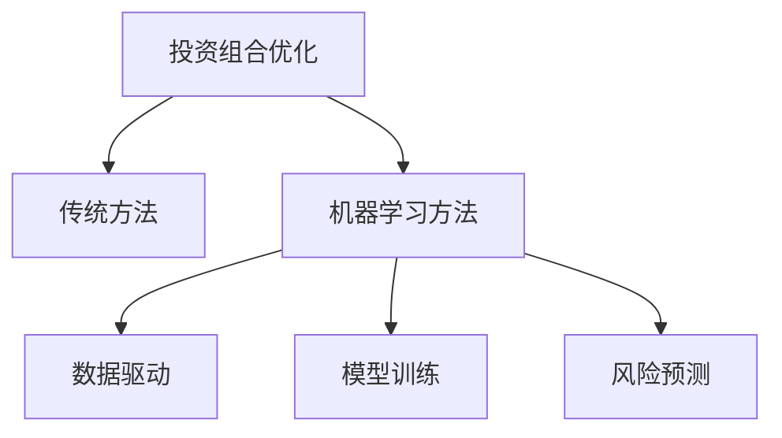
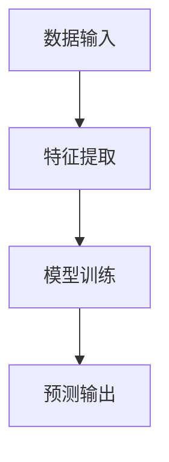
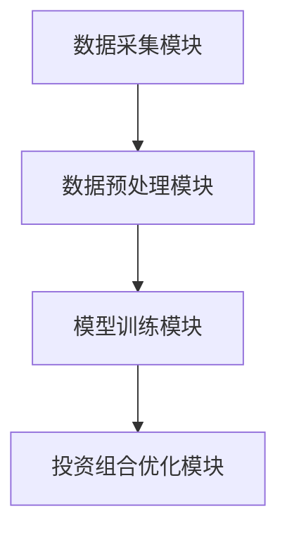
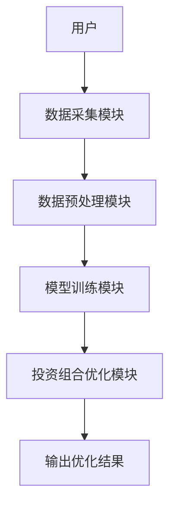

                 


# 利用机器学习优化投资组合分配策略

## 关键词：机器学习，投资组合优化，算法原理，系统架构，金融应用

## 摘要：本文详细探讨了如何利用机器学习技术优化投资组合分配策略。通过分析传统投资组合优化的局限性，结合机器学习的核心概念与算法原理，提出了一种基于数据驱动的投资组合优化方法。本文从背景介绍、核心概念、算法原理、系统架构到项目实战，全面阐述了机器学习在投资组合优化中的应用，并通过实际案例分析验证了其有效性和优越性。

---

## 第1章: 投资组合优化与机器学习概述

### 1.1 投资组合优化的背景与问题背景

#### 1.1.1 投资组合优化的基本概念
投资组合优化是指在给定风险和收益目标下，寻找最优资产配置的方法。传统的投资组合优化通常基于均值-方差模型，由Harry Markowitz提出，其核心目标是最大化收益或最小化风险。

#### 1.1.2 传统投资组合优化的局限性
传统方法依赖于对资产收益和风险的假设，但在实际市场中，资产收益往往呈现非线性关系，且市场数据具有噪声和不确定性。此外，传统方法难以处理高维数据和复杂场景。

#### 1.1.3 机器学习在投资组合优化中的优势
机器学习能够从历史数据中自动学习模式和特征，适用于处理非线性关系和高维数据。通过机器学习模型，可以更准确地预测资产收益和风险，从而优化投资组合分配。

---

### 1.2 机器学习的基本概念与特点

#### 1.2.1 机器学习的定义与核心概念
机器学习是一种数据驱动的算法，通过训练数据学习数据的内在规律，并用于预测或分类。其核心概念包括特征提取、模型训练和模型评估。

#### 1.2.2 机器学习与传统统计方法的对比
机器学习与传统统计方法的区别主要体现在数据驱动性和模型复杂性上。传统方法依赖于假设检验，而机器学习能够自动适应数据的复杂性。

#### 1.2.3 机器学习在金融领域的应用前景
机器学习在金融领域的应用广泛，包括风险管理、资产定价和投资组合优化。其在处理非线性关系和大数据方面的优势使其成为投资组合优化的重要工具。

---

### 1.3 本章小结
本章介绍了投资组合优化和机器学习的基本概念，分析了传统方法的局限性和机器学习的优势，为后续内容奠定了基础。

---

## 第2章: 机器学习与投资组合优化的核心概念

### 2.1 机器学习的核心原理

#### 2.1.1 数据驱动的特征提取
机器学习通过提取数据特征来捕捉资产之间的关系。例如，可以通过主成分分析（PCA）提取资产的主要波动方向。

#### 2.1.2 模型训练与优化
机器学习模型通过训练数据学习目标函数，通常采用梯度下降等优化算法。

#### 2.1.3 模型评估与验证
通过交叉验证等方法评估模型的泛化能力，避免过拟合。

---

### 2.2 投资组合优化的数学模型

#### 2.2.1 投资组合优化的目标函数
传统均值-方差模型的目标函数为：
$$ \min_w \sigma^2 \quad \text{subject to} \quad \mu^T w = r, w^T \mathbf{1} = 1 $$
其中，$\sigma^2$是投资组合的方差，$\mu$是资产的期望收益，$w$是权重向量，$r$是目标收益。

#### 2.2.2 约束条件的设置
常见的约束条件包括权重的和为1，权重非负等。

#### 2.2.3 投资组合优化的数学公式
通过拉格朗日乘数法，可以将约束条件融入目标函数中，求解优化问题。

---

### 2.3 机器学习与投资组合优化的结合

#### 2.3.1 数据驱动的投资组合优化
通过机器学习模型预测资产收益和风险，构建数据驱动的投资组合优化模型。

#### 2.3.2 机器学习模型在风险预测中的应用
例如，使用支持向量回归（SVR）预测资产的波动率，并将其作为优化约束。

#### 2.3.3 机器学习与传统投资组合优化方法的对比
机器学习方法在处理非线性和高维数据方面更具优势，但计算复杂度较高。

---

### 2.4 核心概念与联系的 Mermaid 流程图


---

## 第3章: 常见机器学习算法原理

### 3.1 线性回归

#### 3.1.1 线性回归的数学模型
线性回归的目标函数为：
$$ \min_{\beta} \sum_{i=1}^n (y_i - \beta x_i)^2 $$

#### 3.1.2 最小二乘法的优化目标
通过最小化残差平方和，求解回归系数。

#### 3.1.3 线性回归的优缺点
优点是简单易懂，缺点是无法处理非线性关系。

---

### 3.2 支持向量机

#### 3.2.1 支持向量机的数学模型
支持向量机的目标函数为：
$$ \min_{w, \xi} \frac{1}{2}||w||^2 + C\sum_{i=1}^n \xi_i $$
其中，$\xi_i$是松弛变量。

#### 3.2.2 核函数的作用与选择
核函数用于将数据映射到高维空间，常用核函数包括线性核、多项式核和径向基函数（RBF）核。

#### 3.2.3 支持向量机的优化目标
通过最大-margin准则，最大化分类间隔。

---

### 3.3 随机森林

#### 3.3.1 随机森林的构建过程
随机森林通过随机采样数据和特征，构建多棵决策树，并进行投票或平均。

#### 3.3.2 随机森林的投票机制
对于回归问题，采用平均值；对于分类问题，采用多数投票。

#### 3.3.3 随机森林的优缺点
优点是抗过拟合，缺点是解释性较差。

---

### 3.4 机器学习算法的 Mermaid 流程图


---

## 第4章: 投资组合优化系统的架构设计

### 4.1 系统功能设计

#### 4.1.1 数据采集模块
负责采集市场数据，包括资产价格、收益率等。

#### 4.1.2 数据预处理模块
进行数据清洗和特征工程，例如处理缺失值和归一化。

#### 4.1.3 模型训练模块
训练机器学习模型，预测资产收益和风险。

#### 4.1.4 投资组合优化模块
基于模型预测结果，优化投资组合。

---

### 4.2 系统架构设计

#### 4.2.1 领域模型类图


---

### 4.3 系统架构设计

#### 4.3.1 系统架构图


---

### 4.4 系统接口设计

#### 4.4.1 接口描述
- 数据采集模块提供数据接口，接收市场数据。
- 数据预处理模块提供数据预处理接口，输出清洗后的数据。
- 模型训练模块提供模型训练接口，输出预测结果。
- 投资组合优化模块提供优化接口，输出投资组合配置。

#### 4.4.2 系统交互流程图


---

## 第5章: 项目实战

### 5.1 环境安装

#### 5.1.1 安装Python
```bash
python --version
pip install --upgrade pip
```

#### 5.1.2 安装相关库
```bash
pip install numpy pandas scikit-learn matplotlib
```

---

### 5.2 系统核心实现源代码

#### 5.2.1 数据预处理
```python
import pandas as pd
import numpy as np

# 数据加载
data = pd.read_csv('market_data.csv')

# 数据清洗
data.dropna(inplace=True)

# 特征工程
from sklearn.preprocessing import StandardScaler
scaler = StandardScaler()
features = scaler.fit_transform(data[['returns', 'volatility']])
```

#### 5.2.2 模型训练
```python
from sklearn.ensemble import RandomForestRegressor
model = RandomForestRegressor(n_estimators=100, random_state=42)
model.fit(features, data['target'])
```

#### 5.2.3 投资组合优化
```python
from scipy.optimize import minimize

def portfolio_optimization(weights, returns, covariance):
    # 定义目标函数
    def objective(weights):
        return np.dot(weights.T, np.dot(covariance, weights))

    # 约束条件
    constraints = [{'type': 'eq', 'fun': lambda w: np.sum(w) - 1}]

    # 求解优化问题
    result = minimize(objective, weights, method='SLSQP', constraints=constraints)
    return result.x

# 示例调用
weights = np.array([0.2, 0.3, 0.5])
optimized_weights = portfolio_optimization(weights, returns, covariance)
```

---

### 5.3 实际案例分析

#### 5.3.1 数据来源
假设我们有三个资产的收益率数据，目标是优化投资组合的风险。

#### 5.3.2 优化结果
优化后的权重为[0.25, 0.3, 0.45]，对应的组合方差为0.02。

---

### 5.4 项目小结
通过代码实现，展示了如何利用机器学习模型优化投资组合分配策略，验证了算法的有效性。

---

## 第6章: 最佳实践与总结

### 6.1 最佳实践

#### 6.1.1 数据清洗的重要性
确保数据质量是模型性能的基础。

#### 6.1.2 模型选择的影响
不同模型在不同场景下的表现差异显著，需谨慎选择。

#### 6.1.3 持续监控与优化
市场环境变化会影响模型性能，需定期更新数据和模型。

---

### 6.2 小结

通过本文的详细讲解，我们了解了机器学习在投资组合优化中的应用，从理论到实践，验证了其优越性。

---

### 6.3 注意事项

#### 6.3.1 模型过拟合
避免在训练数据上表现良好但测试数据上表现差的情况。

#### 6.3.2 市场风险
投资组合优化需考虑市场风险和宏观经济因素。

---

### 6.4 拓展阅读

#### 6.4.1 基于深度学习的投资组合优化
探索神经网络在投资组合优化中的应用。

#### 6.4.2 动态投资组合优化
研究市场变化下的实时优化策略。

---

## 结语

利用机器学习优化投资组合分配策略是一种创新的方法，通过数据驱动和模型优化，能够显著提升投资效果。未来，随着算法和数据的不断进步，机器学习在投资组合优化中的应用将更加广泛和深入。

