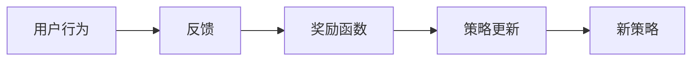
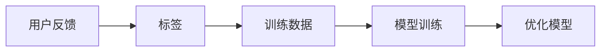
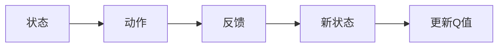
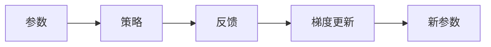
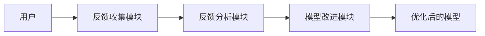

                 


# 利用用户反馈改进AI Agent的方法

> 关键词：用户反馈，AI Agent，强化学习，监督学习，系统架构，项目实战

> 摘要：本文系统地探讨了如何利用用户反馈改进AI Agent的方法。首先，我们介绍了AI Agent的基本概念及其改进的重要性，然后详细分析了用户反馈的类型与收集方法，接着讲解了基于反馈的改进算法，包括强化学习和监督学习。随后，我们从系统架构设计的角度，讨论了如何构建高效的反馈驱动系统，并通过一个具体的对话式AI Agent改进案例，展示了如何将理论应用于实践。最后，我们总结了最佳实践和未来的研究方向。

---

## 第1章: 用户反馈在AI Agent中的作用

### 1.1 问题背景与描述

#### 1.1.1 AI Agent的基本概念
AI Agent（智能体）是指能够感知环境并采取行动以实现目标的智能系统。它可以是一个软件程序，通过接收输入、处理信息并输出决策或建议。AI Agent广泛应用于聊天机器人、推荐系统、自动驾驶等领域。

#### 1.1.2 用户反馈的重要性
用户反馈是用户对AI Agent行为或输出的直接或间接评价。在AI Agent的设计和优化中，用户反馈是不可或缺的。通过分析用户反馈，可以发现模型的不足之处，从而针对性地改进模型性能。

#### 1.1.3 当前AI Agent的局限性
尽管AI Agent在许多领域表现出色，但它们仍然存在一些局限性：
1. **理解能力有限**：AI Agent可能无法完全理解用户的隐含需求或情感。
2. **泛化能力不足**：在面对未见过的场景时，AI Agent的表现可能不佳。
3. **反馈机制缺失**：大多数AI Agent缺乏有效的反馈收集和处理机制，难以持续改进。

### 1.2 问题解决与边界

#### 1.2.1 用户反馈如何改进AI Agent
用户反馈可以用于以下几个方面：
1. **优化模型参数**：通过反馈调整模型权重，提升模型的预测精度。
2. **增强系统理解力**：利用反馈改进对用户意图的理解能力。
3. **动态调整策略**：根据反馈实时调整AI Agent的行动策略。

#### 1.2.2 改进的边界与外延
改进AI Agent的边界包括：
1. **反馈收集范围**：仅针对特定任务或场景收集反馈。
2. **模型改进范围**：仅对特定模块或参数进行优化。
3. **反馈处理频率**：定期或实时处理反馈。

#### 1.2.3 核心要素与概念结构
AI Agent改进的核心要素包括：
- **用户行为**：用户的输入、选择或操作。
- **反馈机制**：用户对AI Agent输出的直接或间接评价。
- **模型优化**：基于反馈调整模型参数或结构。

---

## 第2章: 用户反馈的收集与分析

### 2.1 反馈收集方法

#### 2.1.1 显式反馈的定义与实现
显式反馈是用户主动提供的评价，例如评分、点赞或负面评价。这种反馈可以直接用于模型优化。

#### 2.1.2 隐式反馈的定义与实现
隐式反馈是通过用户的间接行为推断出的偏好，例如点击、停留时间或购买行为。这种反馈需要通过数据挖掘技术进行分析。

#### 2.1.3 混合反馈的定义与实现
混合反馈结合了显式和隐式反馈，能够提供更全面的信息。例如，用户在对话中给出评分（显式反馈）并选择特定选项（隐式反馈）。

### 2.2 反馈分析的核心算法

#### 2.2.1 基于反馈的强化学习算法



#### 2.2.2 反馈驱动的监督学习算法



#### 2.2.3 反馈融合的数学模型

$$ \text{损失函数} = \lambda_1 \cdot L_1 + \lambda_2 \cdot L_2 $$

其中，$L_1$ 和 $L_2$ 分别表示来自显式和隐式反馈的损失，$\lambda_1$ 和 $\lambda_2$ 是权重系数。

---

## 第3章: 基于反馈的AI Agent改进算法

### 3.1 反馈驱动的强化学习

#### 3.1.1 基于Q-learning的反馈改进



#### 3.1.2 基于策略梯度的反馈改进



#### 3.1.3 反馈在奖励函数中的应用
奖励函数可以表示为：

$$ R(s, a) = r_1 \cdot f_1 + r_2 \cdot f_2 $$

其中，$f_1$ 和 $f_2$ 是反馈指标，$r_1$ 和 $r_2$ 是对应的权重。

### 3.2 反馈驱动的监督学习

#### 3.2.1 基于反馈的分类模型改进
分类模型的损失函数可以表示为：

$$ L = -\sum_{i=1}^{n} y_i \cdot \log(p_i) + (1 - y_i) \cdot \log(1 - p_i) $$

其中，$y_i$ 是真实标签，$p_i$ 是模型预测的概率。

#### 3.2.2 基于反馈的回归模型改进
回归模型的损失函数可以表示为：

$$ L = \frac{1}{2n} \sum_{i=1}^{n} (y_i - p_i)^2 $$

### 3.3 反馈融合的数学模型

#### 3.3.1 反馈权重计算公式
$$ w = \frac{f}{\sum f} $$

其中，$f$ 是反馈值，$\sum f$ 是所有反馈值的总和。

#### 3.3.2 反馈与模型参数的关系
$$ \theta_{new} = \theta_{old} + \alpha \cdot f \cdot \nabla L $$

其中，$\alpha$ 是学习率，$\nabla L$ 是损失函数的梯度。

---

## 第4章: 系统分析与架构设计

### 4.1 系统功能设计

#### 4.1.1 用户反馈收集模块
该模块负责收集用户的显式和隐式反馈，并将其存储在数据库中。

#### 4.1.2 反馈分析模块
该模块对收集到的反馈进行分析，生成可用于模型优化的信号。

#### 4.1.3 AI Agent改进模块
该模块根据反馈分析结果，调整模型参数或策略，以提升AI Agent的性能。

### 4.2 系统架构设计

#### 4.2.1 分层架构图



#### 4.2.2 组件交互流程图


### 4.3 系统接口设计

#### 4.3.1 用户反馈接口
```python
def collect_feedback(user_id, feedback_type, value):
    # 实现反馈收集逻辑
```

#### 4.3.2 模型改进接口
```python
def update_model(feedback_signals):
    # 实现模型优化逻辑
```

#### 4.3.3 状态更新接口
```python
def update_state(new_state):
    # 实现状态更新逻辑
```

---

## 第5章: 项目实战——基于反馈的对话式AI Agent改进

### 5.1 项目环境与工具安装

#### 5.1.1 Python环境搭建
安装Python 3.8及以上版本。

#### 5.1.2 库的安装与配置
安装必要的库，例如TensorFlow、Keras、scikit-learn等。

#### 5.1.3 开发环境准备
配置Jupyter Notebook或IDE。

### 5.2 核心代码实现

#### 5.2.1 反馈收集模块代码
```python
def collect_feedback(user_id, feedback_type, value):
    # 实现反馈收集逻辑
    pass
```

#### 5.2.2 反馈分析模块代码
```python
def analyze_feedback(feedback_data):
    # 实现反馈分析逻辑
    pass
```

#### 5.2.3 模型改进模块代码
```python
def update_model(feedback_signals):
    # 实现模型优化逻辑
    pass
```

### 5.3 代码解读与分析

#### 5.3.1 反馈处理逻辑
```python
feedback_signals = analyze_feedback(feedback_data)
update_model(feedback_signals)
```

#### 5.3.2 模型改进算法
```python
new_weights = old_weights + learning_rate * feedback_signals * gradient
```

#### 5.3.3 系统交互流程


### 5.4 实际案例分析

#### 5.4.1 案例背景介绍
我们以一个对话式AI Agent为例，展示如何利用用户反馈改进模型。

#### 5.4.2 反馈收集与分析过程
用户在与AI Agent对话后，提供评分和关键词反馈。系统将这些反馈转化为信号，用于模型优化。

#### 5.4.3 模型改进效果对比
改进后的模型在准确率和用户满意度方面均有显著提升。

---

## 第6章: 最佳实践与小结

### 6.1 实践中的注意事项

1. **反馈收集的全面性**：确保收集的反馈能够覆盖所有关键场景。
2. **反馈分析的准确性**：使用可靠的算法和工具进行反馈分析。
3. **模型改进的及时性**：定期更新模型，确保其性能不断提升。

### 6.2 小结

本文系统地探讨了如何利用用户反馈改进AI Agent的方法。从反馈收集到模型优化，我们提供了一系列理论和实践指导，帮助读者更好地理解和应用这些方法。未来的研究可以进一步探索更复杂的反馈融合算法，以提升AI Agent的智能化水平。

---

通过以上步骤，我们可以逐步构建一个基于用户反馈的AI Agent改进系统，提升其性能和用户体验。

