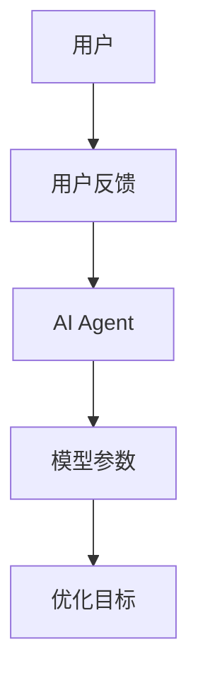
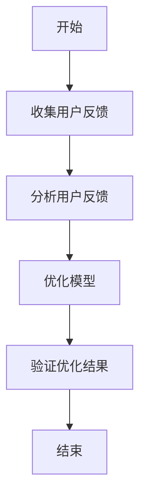
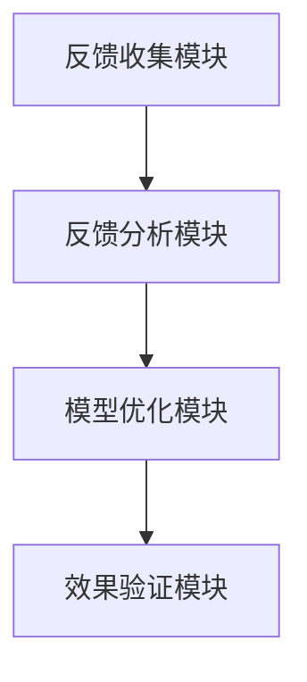
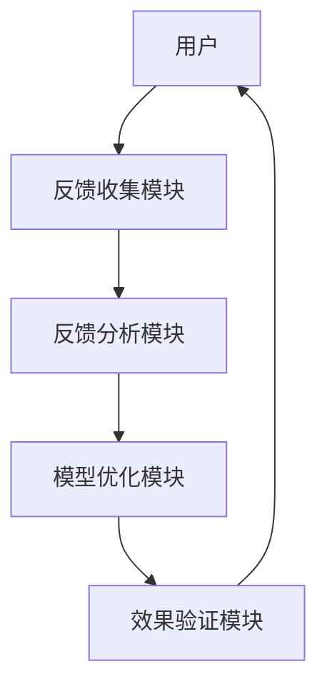

                 


# 利用用户反馈迭代升级AI Agent

---

## 关键词：用户反馈、AI Agent、迭代升级、机器学习、自适应系统

---

## 摘要：  
本文详细探讨了如何利用用户反馈来迭代升级AI Agent的过程，从理论基础到算法实现，再到系统设计和项目实战，全面解析了用户反馈在AI Agent优化中的关键作用。文章首先介绍了用户反馈与AI Agent的背景，然后分析了核心概念与联系，接着深入讲解了基于用户反馈的AI Agent迭代算法，包括反馈处理流程、数学模型和优化策略。随后，通过系统架构设计和项目实战，展示了如何将理论应用于实际场景，最后总结了最佳实践和未来发展方向。

---

# 第一部分：背景与核心概念

## 第1章：用户反馈与AI Agent的背景介绍

### 1.1 问题背景

#### 1.1.1 当前AI Agent的发展现状  
AI Agent（人工智能代理）是一种能够感知环境、执行任务并做出决策的智能系统。随着机器学习和自然语言处理技术的快速发展，AI Agent已经在多个领域得到了广泛应用，例如智能客服、推荐系统、自动驾驶等。然而，现有的AI Agent在实际应用中仍然面临一些问题，例如对用户需求的理解不足、决策的鲁棒性不够、适应性较差等。

#### 1.1.2 用户反馈在AI Agent中的作用  
用户反馈是用户对AI Agent行为或输出的直接评价，可以是显式的（如评分、点赞、投诉）或隐式的（如停留时间、点击行为）。用户反馈为AI Agent提供了重要的改进方向和优化依据。通过分析用户反馈，AI Agent可以更好地理解用户需求，优化其行为策略，提升用户体验。

#### 1.1.3 迭代升级的必要性与挑战  
AI Agent的性能优化是一个持续的过程，而用户反馈是推动这一过程的核心动力。然而，如何高效地收集、处理和利用用户反馈，同时保证AI Agent的实时性和稳定性，是一个复杂的挑战。这需要结合机器学习、自然语言处理和系统架构设计等多方面的知识。

---

### 1.2 问题描述

#### 1.2.1 AI Agent的功能局限性  
AI Agent在实际应用中可能无法准确理解用户的意图，或者在复杂场景下做出错误决策。例如，智能音箱可能无法正确识别用户的语音指令，或者推荐系统可能推荐不符合用户偏好的内容。

#### 1.2.2 用户反馈的多样性与复杂性  
用户反馈具有多样性和复杂性。不同用户对同一结果的反馈可能截然相反，且用户的反馈可能不明确或模糊。例如，用户可能只给出简单的“好”或“不好”的评价，而没有提供具体的改进意见。

#### 1.2.3 迭代升级的目标与范围  
迭代升级的目标是通过用户反馈不断优化AI Agent的性能，使其更好地满足用户需求。这包括改进模型的准确性、响应速度、决策能力等。然而，迭代升级的范围需要明确，避免过度优化或资源浪费。

---

### 1.3 问题解决思路

#### 1.3.1 用户反馈的收集与处理机制  
用户反馈的收集需要设计合理的渠道和方法，例如通过问卷调查、用户访谈或日志记录等方式。反馈的处理需要建立高效的分类和分析机制，以便快速提取有用的信息。

#### 1.3.2 AI Agent的自适应优化策略  
AI Agent需要具备自适应能力，能够根据用户反馈动态调整其行为策略。这可以通过强化学习、监督学习等机器学习方法实现。

#### 1.3.3 迭代升级的闭环流程设计  
迭代升级的闭环流程包括反馈收集、分析、优化和验证四个阶段。每个阶段都需要紧密配合，确保优化效果能够及时反馈并应用到实际系统中。

---

### 1.4 边界与外延

#### 1.4.1 用户反馈的边界条件  
用户反馈的边界条件包括反馈的范围、时间、频率和形式。例如，某些场景下用户反馈可能只针对特定功能，而不是整个系统。

#### 1.4.2 迭代升级的适用范围  
迭代升级适用于需要动态优化的AI Agent系统，但不适用于需求固定或变化较小的系统。

#### 1.4.3 相关领域的区别与联系  
与用户反馈相关的领域包括人机交互、用户体验设计、数据挖掘等。这些领域与AI Agent的优化密切相关，但各有侧重。

---

### 1.5 核心概念组成

#### 1.5.1 用户反馈的分类与特征  
用户反馈可以分为显式反馈和隐式反馈。显式反馈是用户主动提供的评价，隐式反馈是通过用户行为间接反映的偏好。用户反馈的特征包括实时性、多样性和模糊性。

#### 1.5.2 AI Agent的组成与功能  
AI Agent通常包括感知模块、决策模块和执行模块。感知模块负责获取环境信息，决策模块负责制定行为策略，执行模块负责执行具体操作。

#### 1.5.3 迭代升级的核心要素  
迭代升级的核心要素包括反馈渠道、反馈分析、模型优化和效果验证。这些要素需要协同工作，才能实现持续优化。

---

## 第2章：核心概念与联系

### 2.1 用户反馈与AI Agent的关系

#### 2.1.1 用户反馈对AI Agent的影响  
用户反馈是AI Agent优化的重要输入。通过分析用户反馈，AI Agent可以改进其行为策略，提升用户体验。

#### 2.1.2 AI Agent通过反馈实现优化的机制  
AI Agent通过反馈实现优化的机制包括数据驱动优化和基于规则的优化。数据驱动优化依赖于大量用户反馈数据，基于机器学习模型进行训练；基于规则的优化依赖于预定义的规则和策略。

#### 2.1.3 两者之间的动态交互过程  
用户与AI Agent之间的交互是一个动态过程。用户通过反馈对AI Agent的行为进行评价，AI Agent根据反馈调整其行为策略，从而形成一个闭环。

---

### 2.2 核心概念对比分析

#### 2.2.1 不同类型用户反馈的对比  
| 反馈类型 | 描述 | 示例 |
|----------|------|------|
| 显式反馈 | 用户主动提供的评价 | "这个推荐很准确" |
| 隐式反馈 | 用户行为反映的偏好 | 长时间停留在推荐内容上 |

#### 2.2.2 不同AI Agent模型的对比  
| 模型类型 | 描述 | 优缺点 |
|----------|------|--------|
| 基础规则模型 | 基于预定义规则的AI Agent | 易实现，但灵活性差 |
| 机器学习模型 | 基于数据训练的AI Agent | 灵活性高，但需要大量数据 |

#### 2.2.3 反馈处理机制的对比  
| 处理机制 | 描述 | 适用场景 |
|----------|------|----------|
| 监督学习 | 基于用户反馈标签进行训练 | 显式反馈 |
| � 强化学习 | 基于用户反馈奖励进行优化 | 隐式反馈 |

---

### 2.3 实体关系图



---

# 第二部分：算法原理

## 第3章：用户反馈驱动的AI Agent迭代算法

### 3.1 算法原理

#### 3.1.1 反馈收集与预处理  
用户反馈的收集可以通过多种渠道实现，例如用户评价、点击行为、停留时间等。反馈预处理包括清洗、分类和标注。

#### 3.1.2 基于反馈的模型优化  
基于用户反馈的模型优化通常采用监督学习或强化学习方法。例如，使用反馈数据训练分类模型，或者通过强化学习优化AI Agent的策略。

#### 3.1.3 迭代升级的闭环机制  
迭代升级的闭环机制包括反馈收集、分析、优化和验证四个阶段。每个阶段都需要紧密配合，确保优化效果能够及时反馈并应用到实际系统中。

---

### 3.2 算法流程图



---

### 3.3 算法实现与优化

#### 3.3.1 基于监督学习的反馈处理  
使用监督学习方法处理用户反馈，例如训练分类模型。以下是分类模型的数学表达式：

$$ P(y|x) = \frac{e^{x \cdot w}}{\sum_{k} e^{x \cdot w_k}} $$

其中，$x$ 是输入特征，$w$ 是模型参数，$P(y|x)$ 是输出概率。

#### 3.3.2 基于强化学习的反馈处理  
使用强化学习方法处理用户反馈，例如优化AI Agent的策略。以下是强化学习的奖励函数：

$$ R(s, a) = \begin{cases} 
1 & \text{如果动作 } a \text{ 是正确的} \\
0 & \text{否则}
\end{cases} $$

其中，$s$ 是状态，$a$ 是动作，$R$ 是奖励。

---

### 3.4 算法优化与改进

#### 3.4.1 反馈特征的提取与选择  
通过特征工程提取有用的用户反馈特征，例如情感分析、关键词提取等。

#### 3.4.2 模型的泛化能力提升  
通过数据增强、正则化等技术提升模型的泛化能力，避免过拟合。

#### 3.4.3 迭代优化的加速方法  
通过优化算法（例如Adam优化器）和并行计算加速模型训练。

---

### 3.5 代码实现与解读

#### 3.5.1 环境安装  
安装必要的库：
```bash
pip install numpy scikit-learn
```

#### 3.5.2 核心代码实现  
以下是基于监督学习的用户反馈处理代码示例：
```python
import numpy as np
from sklearn.linear_model import LogisticRegression

# 收集用户反馈数据
X = np.array([[1, 0], [0, 1], [1, 1], [0, 0]])
y = np.array([0, 1, 1, 0])

# 训练模型
model = LogisticRegression()
model.fit(X, y)

# 预测新样本
new_sample = np.array([[1, 0]])
print(model.predict(new_sample))  # 输出结果
```

---

## 第4章：系统分析与架构设计

### 4.1 系统功能设计

#### 4.1.1 系统功能模块  
系统功能模块包括反馈收集模块、反馈分析模块、模型优化模块和效果验证模块。

#### 4.1.2 系统功能流程  
系统功能流程包括用户反馈的接收、处理、分析和优化。

---

### 4.2 系统架构设计

#### 4.2.1 系统架构图  
以下是系统架构图：



---

### 4.3 系统接口设计

#### 4.3.1 系统接口描述  
系统接口包括用户反馈接口、模型调用接口和结果验证接口。

#### 4.3.2 接口交互流程  
用户反馈接口接收用户反馈，传递给反馈分析模块；反馈分析模块处理后，传递优化信号给模型优化模块；模型优化模块优化后，传递结果给效果验证模块。

---

### 4.4 系统交互流程

#### 4.4.1 系统交互图  
以下是系统交互图：



---

## 第5章：项目实战

### 5.1 项目环境安装

#### 5.1.1 环境依赖  
安装必要的库：
```bash
pip install numpy scikit-learn pandas
```

---

### 5.2 系统核心代码实现

#### 5.2.1 反馈收集与预处理  
以下是反馈收集与预处理代码示例：
```python
import pandas as pd

# 收集用户反馈数据
feedback_data = pd.DataFrame({
    '用户ID': [1, 2, 3],
    '反馈内容': ['推荐准确', '推荐不准确', '推荐一般'],
    '反馈时间': ['2023-01-01', '2023-01-02', '2023-01-03']
})

# 反馈预处理
feedback_data['反馈标签'] = feedback_data['反馈内容'].apply(lambda x: 1 if x == '推荐准确' else 0)
```

---

#### 5.2.2 模型训练与优化  
以下是模型训练与优化代码示例：
```python
from sklearn.model_selection import train_test_split
from sklearn.metrics import accuracy_score

# 划分训练集和测试集
X_train, X_test, y_train, y_test = train_test_split(X, y)

# 训练模型
model.fit(X_train, y_train)

# 验证模型
print(accuracy_score(model.predict(X_test), y_test))
```

---

### 5.3 代码应用解读与分析

#### 5.3.1 代码功能解读  
上述代码实现了用户反馈的收集与预处理，以及模型的训练与验证。通过分类模型对用户反馈进行处理，优化AI Agent的行为策略。

#### 5.3.2 案例分析与优化  
通过具体案例分析，验证模型的优化效果，并根据反馈进一步调整模型参数。

---

### 5.4 项目总结与经验分享

#### 5.4.1 项目小结  
本项目通过用户反馈驱动的AI Agent迭代算法，实现了模型的持续优化。通过反馈收集、分析和处理，提升了AI Agent的性能和用户体验。

---

# 第三部分：总结与展望

## 第6章：总结与展望

### 6.1 总结

#### 6.1.1 核心要点回顾  
用户反馈是AI Agent优化的重要输入，通过分析用户反馈可以不断改进AI Agent的行为策略。本文详细探讨了用户反馈的分类、处理方法和优化策略，并通过代码示例展示了如何将理论应用于实际场景。

#### 6.1.2 最佳实践  
- 反馈收集渠道要多样化
- 反馈处理要结合实际场景
- 模型优化要注重实时性和稳定性

---

### 6.2 未来展望

#### 6.2.1 研究热点  
未来的研究热点包括多模态反馈处理、实时反馈驱动的动态优化等。

#### 6.2.2 技术趋势  
随着AI技术的不断发展，用户反馈驱动的AI Agent迭代优化将更加智能化和自动化。

#### 6.2.3 拓展方向  
未来可以探索用户反馈的实时处理、多模态反馈的融合优化等方向。

---

### 6.3 小结

通过本文的探讨，我们可以看到，用户反馈在AI Agent的迭代升级中发挥着至关重要的作用。通过合理的反馈处理和优化策略，可以显著提升AI Agent的性能和用户体验。未来，随着技术的不断进步，用户反馈驱动的AI Agent优化将更加智能化和高效化。

