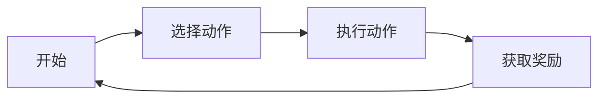

                 


# 制造业中AI Agent的实践案例

---

## 关键词

- 制造业
- AI Agent
- 人工智能
- 机器学习
- 工业自动化

---

## 摘要

本文详细探讨了AI Agent在制造业中的实际应用案例，涵盖了从背景分析到系统架构设计的全过程。通过分析制造业面临的挑战，介绍了AI Agent的核心概念与工作原理，并结合具体算法和数学模型，展示了如何利用AI技术优化生产流程。文章还通过项目实战案例，详细讲解了AI Agent在智能质量检测中的实现，并总结了最佳实践经验和未来发展方向。

---

## 第一部分：背景与挑战

### 1.1 制造业面临的挑战与问题背景

#### 1.1.1 制造业效率与成本的痛点

制造业在全球经济中扮演着重要角色，但传统制造流程中存在诸多痛点，如生产效率低下、资源浪费严重以及质量问题频发。这些问题不仅增加了企业的运营成本，还影响了产品的市场竞争力。

#### 1.1.2 制造业中的复杂问题

- **生产过程的不确定性**：原材料波动、设备故障等因素导致生产不稳定。
- **供应链的复杂性**：全球供应链的不透明性和不确定性增加了生产成本。
- **多变的市场需求**：消费者对产品个性化和多样化的需求要求企业灵活调整生产计划。

#### 1.1.3 AI Agent的引入与目标

AI Agent作为一种智能代理系统，通过实时数据分析和自动化决策，能够有效解决上述问题。其目标是提升生产效率、优化资源配置、降低运营成本，并实现从传统制造向智能制造的转型。

### 1.2 AI Agent在制造业中的定义与特点

#### 1.2.1 AI Agent的基本定义

AI Agent是指在制造业中利用人工智能技术实现智能化决策和执行的系统。它能够感知生产环境、分析数据、做出决策并执行操作，从而优化生产流程。

#### 1.2.2 AI Agent的核心特点

- **自动化决策能力**：能够根据实时数据自主做出最优决策。
- **实时数据分析**：通过传感器和数据分析技术，实时监控生产过程。
- **灵活性与适应性**：能够快速适应市场需求和生产环境的变化。

#### 1.2.3 AI Agent与传统自动化系统的区别

| 特性                | 传统自动化系统          | AI Agent                   |
|---------------------|-------------------------|-----------------------------|
| 决策方式            | 基于预设规则            | 基于实时数据和机器学习模型 |
| 灵活性              | 较低                    | 较高                        |
| 适应性              | 有限                   | 强                           |

---

## 第二部分：核心概念与工作原理

### 2.1 AI Agent的核心概念

AI Agent在制造业中的工作原理可以分为感知、决策和执行三个环节。

#### 2.1.1 感知

通过传感器和数据采集系统，AI Agent实时获取生产环境中的各种数据，如温度、压力、设备状态等。

#### 2.1.2 决策

基于感知到的数据，AI Agent利用机器学习模型进行分析和预测，生成最优决策方案。

#### 2.1.3 执行

根据决策结果，AI Agent通过执行机构（如机器人、自动化设备）完成相应的操作，实现生产优化。

### 2.2 AI Agent在制造业中的应用场景

#### 2.2.1 质量检测

通过图像识别技术，AI Agent可以快速检测产品缺陷，提高检测效率和准确性。

#### 2.2.2 预测性维护

AI Agent通过分析设备运行数据，预测设备故障，提前进行维护，减少停机时间。

#### 2.2.3 生产优化

通过优化生产计划和资源分配，AI Agent能够提高生产效率，降低成本。

### 2.3 AI Agent的技术优势

| 技术优势       | 描述                              |
|----------------|-----------------------------------|
| 实时性          | 能够快速响应生产环境的变化        |
| 高效性          | 提高生产效率，降低资源浪费        |
| 精准性          | 通过机器学习实现精准决策          |

---

## 第三部分：算法与数学模型

### 3.1 AI Agent的核心算法

#### 3.1.1 强化学习

强化学习是一种通过试错机制来优化决策的算法。AI Agent通过与环境的交互，不断调整策略以获得最大化的累积奖励。

##### 算法流程图（mermaid）



#### 3.1.2 监督学习

监督学习通过训练数据预测目标变量。例如，在质量检测中，可以通过监督学习模型预测产品是否合格。

##### 代码实现示例

```python
import numpy as np
from sklearn import linear_model

# 生成训练数据
X = np.array([[1], [2], [3], [4]])
y = np.array([2, 4, 6, 8])

# 训练模型
model = linear_model.LinearRegression()
model.fit(X, y)

# 预测
print(model.predict([[5]]))  # 输出：[[10]]
```

#### 3.1.3 算法数学模型

- **强化学习的数学模型**：通过状态值函数 \( V(s) \) 和策略 \( \pi(a|s) \) 来优化决策。
- **监督学习的数学模型**：通过最小化损失函数 \( L \) 来优化模型参数 \( \theta \)。

---

## 第四部分：系统架构设计

### 4.1 系统架构概述

制造业AI Agent的系统架构包括数据采集层、模型训练层、推理层和应用层。

#### 4.1.1 数据采集层

通过传感器和数据采集系统实时采集生产环境中的数据。

#### 4.1.2 模型训练层

利用机器学习算法对数据进行训练，生成预测模型。

#### 4.1.3 推理层

基于训练好的模型进行实时推理，生成决策指令。

#### 4.1.4 应用层

通过执行机构将决策指令转化为实际操作。

### 4.2 系统架构设计（mermaid图）


---

## 第五部分：项目实战

### 5.1 项目背景与目标

#### 5.1.1 案例背景

以智能质量检测为例，目标是通过AI技术提高检测效率和准确性。

#### 5.1.2 环境配置

- 操作系统：Ubuntu 20.04
- 开发工具：Python 3.8、TensorFlow 2.5、OpenCV 4.5

#### 5.1.3 数据收集与预处理

通过工业相机采集产品图像，并标注缺陷位置。

#### 5.1.4 模型训练与优化

使用卷积神经网络（CNN）进行图像分类任务，训练模型识别产品缺陷。

##### 代码实现示例

```python
import tensorflow as tf
from tensorflow.keras import layers

model = tf.keras.Sequential([
    layers.Conv2D(32, (3,3), activation='relu', input_shape=(64, 64, 3)),
    layers.MaxPooling2D((2,2)),
    layers.Conv2D(64, (3,3), activation='relu'),
    layers.MaxPooling2D((2,2)),
    layers.Flatten(),
    layers.Dense(128, activation='relu'),
    layers.Dense(2, activation='softmax')
])

model.compile(optimizer='adam', loss='sparse_categorical_crossentropy', metrics=['accuracy'])
model.fit(x_train, y_train, epochs=10, validation_data=(x_val, y_val))
```

#### 5.1.5 结果分析与可视化

通过混淆矩阵和ROC曲线分析模型性能，优化模型参数以提高检测准确率。

---

## 第六部分：最佳实践与总结

### 6.1 经验总结

- 数据质量对模型性能至关重要。
- 模型需要持续优化和迭代。
- 系统安全性是实现AI Agent的关键因素。

### 6.2 小结

本文通过详细分析AI Agent在制造业中的应用，展示了其在质量检测、预测性维护等场景中的巨大潜力。通过项目实战和系统设计，证明了AI技术能够显著提升生产效率和产品质量。

### 6.3 注意事项

- 数据隐私和安全问题需要高度重视。
- 模型的可解释性是实际应用中的重要考量因素。
- 系统的实时性和稳定性直接影响生产效率。

### 6.4 拓展阅读

- 推荐阅读《机器学习实战》和《深度学习》等书籍，深入了解AI技术在制造业中的更多应用。

---

## 结语

随着人工智能技术的不断进步，AI Agent在制造业中的应用将越来越广泛。通过本文的分析和案例展示，我们相信AI技术能够为制造业带来革命性的变革，推动工业4.0时代的全面到来。

--- 

**注：文章中的代码示例和图表请根据实际需求进行调整和补充。**

