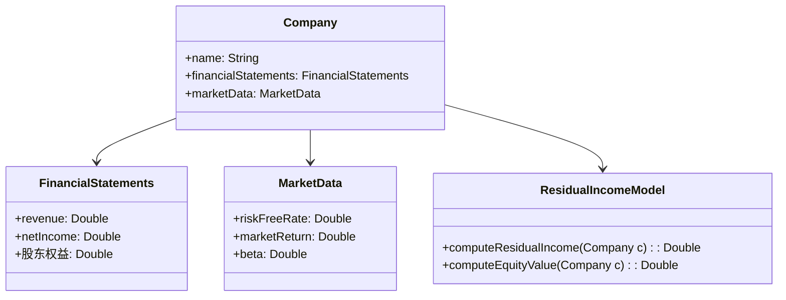
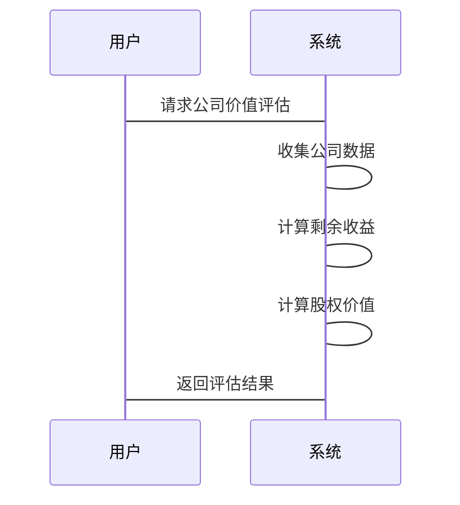

                 


# 剩余收益模型：结合会计信息的公司价值评估

## 关键词：剩余收益模型，公司价值评估，会计信息，财务报表分析，经济增加值（EVA），系统架构设计，项目实战

## 摘要：剩余收益模型是一种基于会计信息的公司价值评估方法，通过分析公司的剩余收益和资本成本，结合市场风险溢价，评估公司股权价值。本文系统地介绍了剩余收益模型的理论基础、数学原理、会计信息应用、实际案例分析、系统架构设计和项目实战，帮助读者全面理解和应用剩余收益模型进行公司估值。

---

# 第一部分: 剩余收益模型概述

## 第1章: 剩余收益模型的基本概念

### 1.1 什么是剩余收益模型

#### 1.1.1 剩余收益模型的定义
剩余收益模型（Residual Income Model）是一种用于评估公司股权价值的财务模型。它基于会计信息，通过计算公司的剩余收益（即净利润减去期望的股权收益），并将其折现以确定公司价值。剩余收益模型的核心思想是：公司价值等于其未来剩余收益的现值。

#### 1.1.2 剩余收益模型的核心要素
- **净利润（Net Income）**：公司报告的会计利润。
- **期望的股权收益（Expected Equity Return）**：基于资本成本计算的期望收益。
- **剩余收益（Residual Income）**：净利润减去期望的股权收益。
- **股权价值（Equity Value）**：剩余收益的现值。

#### 1.1.3 剩余收益模型的适用场景
- **适用于成长型公司**：尤其是那些具有稳定增长前景的公司。
- **适用于周期性波动较大的行业**：如制造业或能源行业。
- **适用于需要结合会计信息进行估值的场景**：如企业并购、投资决策等。

### 1.2 剩余收益模型的历史发展

#### 1.2.1 剩余收益模型的起源
剩余收益模型起源于20世纪70年代，与**经济增加值（EVA）**概念密切相关。EVA是一种衡量公司经济利润的指标，而剩余收益模型进一步将EVA应用于公司估值。

#### 1.2.2 剩余收益模型的发展历程
- **早期阶段**：20世纪70年代，剩余收益模型与EVA概念结合，初步应用于公司估值。
- **发展阶段**：20世纪90年代，剩余收益模型被广泛应用于投资银行和企业并购中。
- **现代阶段**：21世纪以来，剩余收益模型不断完善，结合现代金融理论和大数据分析技术。

### 1.3 剩余收益模型与传统估值模型的对比

#### 1.3.1 剩余收益模型与DCF模型的区别
- **DCF模型**：基于未来现金流的折现，假设现金流可以独立预测。
- **剩余收益模型**：基于净利润和资本成本，假设剩余收益可以预测。

#### 1.3.2 剩余收益模型与市盈率模型的对比
- **市盈率模型**：基于市盈率和可比公司分析。
- **剩余收益模型**：基于净利润和资本成本。

#### 1.3.3 剩余收益模型的优缺点分析
- **优点**：
  - 结合会计信息，易于理解和应用。
  - 适用于成长型公司和周期性行业。
- **缺点**：
  - 受会计政策影响较大。
  - 对未来剩余收益的预测依赖较高。

### 1.4 剩余收益模型的应用价值

#### 1.4.1 剩余收益模型在公司估值中的作用
- 通过剩余收益模型，可以将公司未来的盈利能力折现为股权价值。
- 适用于企业并购、投资决策等场景。

#### 1.4.2 剩余收益模型在投资决策中的应用
- 帮助投资者评估公司的内在价值。
- 识别被低估或高估的股票。

#### 1.4.3 剩余收益模型的局限性
- 依赖于会计信息的质量，容易受到管理层操控的影响。
- 对未来剩余收益的预测依赖较高，存在较大的不确定性。

### 1.5 本章小结
本章介绍了剩余收益模型的基本概念、历史发展、与其他估值模型的对比以及其应用价值。剩余收益模型是一种结合会计信息的公司价值评估方法，具有广泛的应用场景，但也存在一定的局限性。

---

## 第2章: 剩余收益模型的数学基础

### 2.1 剩余收益模型的公式推导

#### 2.1.1 剩余收益的定义公式
剩余收益（Residual Income, RI）的定义为：
$$
RI = \text{净利润} - \text{期望的股权收益}
$$
其中，期望的股权收益可以表示为：
$$
\text{期望的股权收益} = \text{股权资本成本} \times \text{股东权益}
$$

#### 2.1.2 剩余收益与股权价值的关系
剩余收益模型认为，公司股权价值是未来剩余收益的现值：
$$
\text{股权价值} = \sum_{t=1}^{\infty} \frac{\text{剩余收益}_t}{(1 + r)^t}
$$
其中，\( r \) 是股权资本成本。

#### 2.1.3 剩余收益模型的数学推导
假设公司未来的剩余收益为 \( RI_t \)，股权资本成本为 \( r \)，则公司股权价值可以表示为：
$$
\text{股权价值} = \frac{RI_t}{r - g}
$$
其中，\( g \) 是剩余收益的长期增长率。

### 2.2 剩余收益模型的假设条件

#### 2.2.1 市场风险溢价的假设
市场风险溢价是计算股权资本成本的重要组成部分，通常基于市场无风险利率和市场风险溢价的估计。

#### 2.2.2 无杠杆beta的计算
无杠杆beta（Unlevered Beta）是计算股权资本成本的重要参数，可以通过以下公式计算：
$$
\beta_{\text{无杠杆}} = \beta_{\text{有杠杆}} \times \left(1 - \frac{D}{E}\right)
$$
其中，\( D \) 是公司债务，\( E \) 是公司股权。

#### 2.2.3 股权资本成本的确定
股权资本成本（\( r \)）可以通过CAPM模型计算：
$$
r = r_f + \beta \times (r_m - r_f)
$$
其中，\( r_f \) 是无风险利率，\( \beta \) 是公司beta，\( r_m \) 是市场平均收益率。

### 2.3 剩余收益模型与经济增加值（EVA）的关系

#### 2.3.1 EVA的定义与计算
经济增加值（EVA）定义为：
$$
\text{EVA} = \text{净利润} - (WACC \times 净资产)
$$
其中，WACC 是加权平均资本成本。

#### 2.3.2 剩余收益模型与EVA的异同点
- **相同点**：两者都基于会计信息，强调净利润与资本成本的对比。
- **不同点**：剩余收益模型用于公司估值，而EVA用于衡量经济利润。

#### 2.3.3 剩余收益模型对EVA的改进
剩余收益模型将EVA的概念扩展到公司估值领域，结合未来剩余收益的现值计算股权价值。

### 2.4 本章小结
本章详细推导了剩余收益模型的数学公式，并介绍了其与EVA的关系。通过数学公式和假设条件的分析，读者可以更好地理解剩余收益模型的原理和应用。

---

## 第3章: 会计信息在剩余收益模型中的应用

### 3.1 会计信息对剩余收益模型的影响

#### 3.1.1 财务报表的基本构成
剩余收益模型主要基于以下财务报表信息：
- **利润表**：净利润、营业收入、营业成本等。
- **资产负债表**：股东权益、债务等。
- **现金流量表**：经营活动现金流等。

#### 3.1.2 收入、成本与利润的关系
剩余收益模型假设净利润与收入、成本之间存在线性关系，可以通过财务报表直接获取。

#### 3.1.3 净利润与剩余收益的关系
净利润减去期望的股权收益即为剩余收益：
$$
RI = \text{净利润} - (r \times \text{股东权益})
$$

### 3.2 会计信息的质量与剩余收益模型

#### 3.2.1 会计政策的影响
不同的会计政策（如收入确认、减值准备）会影响净利润，从而影响剩余收益。

#### 3.2.2 会计估计的不确定性
剩余收益模型依赖于会计估计（如折旧、摊销），这些估计具有较大的主观性。

#### 3.2.3 数据质量评估
- **数据完整性**：确保财务报表数据的完整性。
- **数据一致性**：确保财务报表数据的一致性。

### 3.3 剩余收益模型的会计信息应用步骤

#### 3.3.1 数据收集与整理
- 收集公司的财务报表数据。
- 确定股权资本成本。

#### 3.3.2 计算剩余收益
$$
RI = \text{净利润} - (r \times \text{股东权益})
$$

#### 3.3.3 折现剩余收益
$$
\text{股权价值} = \frac{RI}{r - g}
$$

### 3.4 本章小结
本章分析了会计信息在剩余收益模型中的应用，强调了会计信息质量对模型结果的影响。通过财务报表数据的收集与处理，可以计算剩余收益并评估公司股权价值。

---

## 第4章: 剩余收益模型在公司价值评估中的应用

### 4.1 基本应用

#### 4.1.1 基本模型的应用步骤
1. 收集公司财务报表数据。
2. 计算股权资本成本。
3. 计算剩余收益。
4. 折现剩余收益，确定股权价值。

#### 4.1.2 实际案例分析
以某公司为例，计算其剩余收益和股权价值。

### 4.2 扩展应用

#### 4.2.1 多阶段模型
- **第一阶段**：假设剩余收益保持一定增长率。
- **第二阶段**：假设剩余收益稳定增长。

#### 4.2.2 处理非正常收益
- **剔除非正常收益**：如一次性收益或损失。
- **调整剩余收益**：确保模型的准确性。

### 4.3 案例分析

#### 4.3.1 某公司案例分析
- 数据收集与整理。
- 计算股权资本成本。
- 计算剩余收益。
- 折现剩余收益，确定股权价值。

#### 4.3.2 案例总结
通过案例分析，验证剩余收益模型的有效性。

### 4.4 本章小结
本章通过实际案例分析，展示了剩余收益模型的基本应用和扩展应用。通过案例分析，读者可以更好地理解剩余收益模型的应用过程。

---

## 第5章: 剩余收益模型的高级应用

### 5.1 多阶段剩余收益模型

#### 5.1.1 多阶段模型的定义
多阶段模型假设公司的发展分为多个阶段，每个阶段的剩余收益增长率不同。

#### 5.1.2 多阶段模型的应用步骤
1. 确定公司发展的不同阶段。
2. 分别计算每个阶段的剩余收益。
3. 折现并汇总各阶段的剩余收益。

### 5.2 合并财务报表分析

#### 5.2.1 合并财务报表的基本构成
- 合并利润表。
- 合并资产负债表。
- 合并现金流量表。

#### 5.2.2 合并财务报表在剩余收益模型中的应用
- 计算合并净利润。
- 计算合并剩余收益。
- 折现合并剩余收益。

### 5.3 无形资产与剩余收益模型

#### 5.3.1 无形资产的定义与分类
- **无形资产**：没有实物形态的资产，如专利、商标等。
- **可辨认无形资产**：可以在法律上或市场上单独识别的无形资产。
- **不可辨认无形资产**：不能在法律上或市场上单独识别的无形资产。

#### 5.3.2 无形资产对剩余收益模型的影响
- **无形资产的摊销**：影响净利润，进而影响剩余收益。
- **无形资产的减值**：影响净利润，进而影响剩余收益。

### 5.4 本章小结
本章介绍了剩余收益模型的高级应用，包括多阶段模型、合并财务报表分析和无形资产处理。通过这些高级应用，可以更准确地评估公司股权价值。

---

## 第6章: 系统分析与架构设计

### 6.1 系统分析

#### 6.1.1 问题场景介绍
- **目标**：构建一个基于剩余收益模型的公司价值评估系统。
- **用户需求**：投资者、企业高管等需要快速评估公司价值。
- **数据来源**：公司财务报表数据、市场数据等。

#### 6.1.2 项目介绍
- **项目目标**：开发一个基于剩余收益模型的公司价值评估系统。
- **项目范围**：包括数据采集、模型计算、结果展示等功能。
- **项目约束**：数据质量、计算效率等。

### 6.2 系统功能设计

#### 6.2.1 功能模块划分
- **数据采集模块**：采集公司财务报表数据、市场数据等。
- **模型计算模块**：计算剩余收益、股权价值等。
- **结果展示模块**：展示评估结果，包括股权价值、敏感性分析等。

#### 6.2.2 领域模型设计
- **领域模型类图**：


### 6.3 系统架构设计

#### 6.3.1 系统架构图
```mermaid
client
    / | \
   /  |  \
  service1 service2 service3
 /      \     /
system1 system2 system3
```

#### 6.3.2 接口设计
- **数据接口**：提供REST API，供其他系统调用。
- **模型接口**：提供基于剩余收益模型的计算接口。
- **展示接口**：提供基于Web的展示界面。

#### 6.3.3 交互设计


### 6.4 本章小结
本章介绍了基于剩余收益模型的公司价值评估系统的系统分析与架构设计。通过功能模块划分、领域模型设计和系统架构图的展示，读者可以更好地理解系统的构建过程。

---

## 第7章: 项目实战

### 7.1 环境安装

#### 7.1.1 安装Python环境
- 安装Python 3.8或更高版本。
- 安装必要的Python库，如Pandas、NumPy、Matplotlib等。

#### 7.1.2 安装Jupyter Notebook
- 使用Anaconda安装Jupyter Notebook。

### 7.2 系统核心实现

#### 7.2.1 数据采集模块实现
```python
import pandas as pd

def load_financial_data(company):
    # 加载公司财务报表数据
    df = pd.read_csv(f'{company}_financial.csv')
    return df
```

#### 7.2.2 模型计算模块实现
```python
def compute_residual_income(company, r):
    # 计算剩余收益
    net_income = company.financial_data.netIncome
    equity = company.financial_data.股东权益
    residual_income = net_income - r * equity
    return residual_income
```

#### 7.2.3 结果展示模块实现
```python
import matplotlib.pyplot as plt

def plot_residual_income(residual_income):
    plt.plot(residual_income, label='剩余收益')
    plt.xlabel('年份')
    plt.ylabel('剩余收益')
    plt.legend()
    plt.show()
```

### 7.3 代码应用解读与分析

#### 7.3.1 数据采集模块解读
- 加载公司财务报表数据，包括收入、成本、利润等。
- 数据清洗与预处理，确保数据质量。

#### 7.3.2 模型计算模块解读
- 计算剩余收益，考虑股权资本成本和股东权益。
- 处理异常值，如负数剩余收益。

#### 7.3.3 结果展示模块解读
- 可视化剩余收益的时间序列图，分析趋势和波动性。
- 对比实际剩余收益与模型预测值。

### 7.4 实际案例分析

#### 7.4.1 案例选择
选择一家上市公司作为案例，分析其剩余收益和股权价值。

#### 7.4.2 数据分析与计算
- 加载公司财务报表数据。
- 计算股权资本成本。
- 计算剩余收益。
- 折现剩余收益，确定股权价值。

### 7.5 项目小结
本章通过实际项目实战，展示了剩余收益模型的应用过程。从环境安装到代码实现，再到案例分析，读者可以逐步掌握剩余收益模型的实现方法。

---

## 第8章: 总结与展望

### 8.1 全文总结

#### 8.1.1 核心内容回顾
- 剩余收益模型的基本概念。
- 剩余收益模型的数学基础。
- 会计信息在剩余收益模型中的应用。
- 剩余收益模型在公司价值评估中的应用。

#### 8.1.2 重点内容总结
- 剩余收益模型的核心公式。
- 会计信息对模型结果的影响。
- 剩余收益模型的高级应用。

### 8.2 最佳实践 tips

#### 8.2.1 数据质量控制
- 确保数据的完整性、一致性和准确性。
- 处理异常值和缺失值。

#### 8.2.2 模型优化建议
- 结合多阶段模型和无形资产处理。
- 考虑市场风险溢价的波动性。

#### 8.2.3 系统设计建议
- 模块化设计，便于维护和扩展。
- 数据可视化，便于用户理解和分析。

### 8.3 注意事项

#### 8.3.1 数据敏感性
- 保护公司财务数据的安全性。
- 遵守相关法律法规。

#### 8.3.2 模型假设的局限性
- 剩余收益模型依赖于会计信息，容易受到管理层操控的影响。
- 对未来剩余收益的预测依赖较高，存在较大的不确定性。

### 8.4 拓展阅读

#### 8.4.1 推荐书籍
- 《Financial Statement Analysis and Security Valuation》
- 《The Theory of Investment Value》

#### 8.4.2 推荐文章
- “The Residual Income Valuation Model” by Penman, S.
- “Economic Value Added and the Theory of the Firm” by Stewart, M.

### 8.5 本章小结
本章总结了全文的核心内容，提出了最佳实践建议，并给出了未来研究方向。通过本文的学习，读者可以全面掌握剩余收益模型的理论与实践。

---

# 结语

剩余收益模型是一种结合会计信息的公司价值评估方法，通过分析公司的剩余收益和资本成本，结合市场风险溢价，评估公司股权价值。本文系统地介绍了剩余收益模型的理论基础、数学原理、会计信息应用、实际案例分析、系统架构设计和项目实战，帮助读者全面理解和应用剩余收益模型进行公司估值。通过本文的学习，读者可以掌握剩余收益模型的核心思想，并能够将其应用于实际的公司价值评估中。

