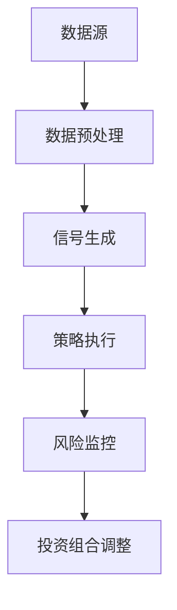
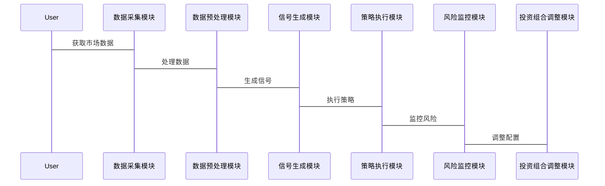

                 


# 动态资产配置：根据市场环境调整投资策略

## 关键词：
- 动态资产配置
- 投资策略
- 市场环境
- 数学模型
- 风险管理

## 摘要：
动态资产配置是一种根据市场环境变化灵活调整投资组合的策略，旨在在不同市场条件下优化风险与收益的平衡。本文从理论基础、策略选择、数学模型、系统架构到实战应用，全面解析动态资产配置的核心要素，帮助投资者在复杂多变的市场中制定有效的投资策略。

---

# 第1章: 动态资产配置的背景与概念

## 1.1 动态资产配置的定义与特点

### 1.1.1 资产配置的基本概念
资产配置是指将资金分配到不同资产类别（如股票、债券、商品等）以实现投资目标的过程。动态资产配置强调根据市场环境的变化，实时调整资产配置比例。

### 1.1.2 动态资产配置与静态资产配置的区别
| 特性 | 静态资产配置 | 动态资产配置 |
|------|--------------|--------------|
| 时间维度 | 长期固定 | 短期灵活调整 |
| 策略响应 | 不变化 | 根据市场变化调整 |

### 1.1.3 动态资产配置的核心特点
- **灵活性**：能够快速响应市场变化。
- **适应性**：根据不同市场环境优化投资组合。
- **风险控制**：通过调整资产比例降低风险。

## 1.2 动态资产配置的重要性

### 1.2.1 市场环境变化对投资策略的影响
市场周期波动（牛市、熊市）和宏观经济变化（通胀、利率）会影响资产表现，动态资产配置能够帮助投资者在不同环境下优化收益。

### 1.2.2 动态资产配置在投资组合中的作用
- **提高收益**：通过调整资产比例捕捉市场机会。
- **降低风险**：避免单一资产的大幅波动。

### 1.2.3 动态资产配置的优势与局限性
优势：
- 灵活性高，适应性强。
局限性：
- 需要频繁监控和调整，增加了交易成本和复杂性。

## 1.3 动态资产配置的应用场景

### 1.3.1 不同市场周期下的配置策略
- **牛市**：增加高风险资产（股票）。
- **熊市**：增加防御性资产（债券）。

### 1.3.2 不同投资者类型的需求
- **保守型投资者**：倾向于防御性资产。
- **激进型投资者**：倾向于高风险资产。

### 1.3.3 动态资产配置在机构投资中的应用
机构投资者通常需要根据市场变化调整投资组合以满足特定收益目标。

## 1.4 本章小结
动态资产配置是一种灵活的投资策略，能够在不同市场环境下优化资产配置，但需要考虑调整成本和复杂性。

---

# 第2章: 动态资产配置的理论基础

## 2.1 资产定价模型

### 2.1.1 CAPM模型
资本资产定价模型（CAPM）用于确定资产的预期回报率，公式为：
$$ E(r_i) = r_f + \beta_i (E(r_m) - r_f) $$
其中，$r_f$是无风险利率，$\beta_i$是资产的贝塔系数，$E(r_m)$是市场预期回报率。

### 2.1.2 APT模型
套利定价理论（APT）认为资产回报率由多个因素决定，公式为：
$$ E(r_i) = \sum_{j=1}^n \lambda_j F_{i,j} + r_f $$
其中，$\lambda_j$是因素的风险溢价，$F_{i,j}$是资产对第$j$个因素的暴露程度。

### 2.1.3 资产定价模型与动态资产配置的关系
资产定价模型为动态资产配置提供了理论基础，帮助确定资产的预期回报率和风险。

## 2.2 现代投资组合理论

### 2.2.1 马科维茨的有效前沿理论
马科维茨提出，通过优化投资组合的期望收益和风险，可以达到最优配置。有效前沿表示在相同风险下收益最高的组合，或在相同收益下风险最小的组合。

### 2.2.2 投资组合优化的数学模型
优化目标：最大化收益，最小化风险。
$$ \text{最大化} \sum_{i=1}^n w_i r_i - \lambda \sum_{i=1}^n \sum_{j=1}^n w_i w_j \sigma_{i,j} $$
其中，$w_i$是资产$i$的权重，$r_i$是资产$i$的预期回报率，$\sigma_{i,j}$是资产$i$和$j$的协方差。

### 2.2.3 动态资产配置与投资组合理论的结合
动态资产配置通过定期调整权重，使得投资组合保持在有效前沿上。

## 2.3 动态资产配置的数学基础

### 2.3.1 资产回报率的分布特征
资产回报率通常服从正态分布或尖峰分布，动态资产配置需要考虑这些特征。

### 2.3.2 风险与收益的权衡
通过调整资产比例，在收益和风险之间找到最佳平衡点。

### 2.3.3 资产配置的优化算法
常用算法包括均值-方差优化和风险平价模型。

## 2.4 本章小结
动态资产配置的理论基础包括资产定价模型和投资组合理论，为实际应用提供了数学支持。

---

# 第3章: 动态资产配置的核心策略

## 3.1 基于市场环境的资产配置策略

### 3.1.1 市场环境的分类与特征
市场环境可以分为牛市、熊市、震荡市等，每种环境下资产表现不同。

### 3.1.2 不同市场环境下资产配置的调整方法
- **牛市**：增加股票配置。
- **熊市**：增加债券配置。

### 3.1.3 市场环境变化对投资组合的影响
市场环境变化会影响资产回报率和风险，需要动态调整。

## 3.2 基于资产类别轮动的配置策略

### 3.2.1 股票、债券、商品等资产类别的轮动规律
不同资产类别在不同市场周期下的表现不同，可以通过轮动策略优化收益。

### 3.2.2 资产类别轮动的数学模型
通过统计模型预测资产类别表现，调整配置比例。

### 3.2.3 资产类别轮动策略的优缺点
优点：捕捉市场趋势；缺点：交易成本和错误判断风险。

## 3.3 基于风险控制的动态配置策略

### 3.3.1 风险平价配置策略
将投资组合的风险在不同资产之间平均分配。

### 3.3.2 最小方差配置策略
通过最小化组合波动率来降低风险。

### 3.3.3 风险控制在动态资产配置中的应用
动态调整资产比例，以保持风险在可控范围内。

## 3.4 本章小结
动态资产配置策略包括市场环境、资产类别轮动和风险控制三方面，帮助投资者优化收益和风险。

---

# 第4章: 动态资产配置的数学模型与算法

## 4.1 动态资产配置的优化模型

### 4.1.1 均值-方差优化模型
目标函数：
$$ \text{最小化} \sum_{i=1}^n \sum_{j=1}^n w_i w_j \sigma_{i,j} $$
约束条件：
$$ \sum_{i=1}^n w_i = 1 $$
$$ \sum_{i=1}^n w_i r_i = \text{目标收益} $$

### 4.1.2 风险平价模型
目标函数：
$$ \text{最小化} \sum_{i=1}^n (w_i \sigma_i)^2 $$
约束条件：
$$ \sum_{i=1}^n w_i = 1 $$

### 4.1.3 基于因子模型的优化方法
通过因子模型分解资产收益，优化投资组合。

## 4.2 动态资产配置的算法流程

### 4.2.1 数据收集与预处理
收集历史数据，计算资产回报率和协方差矩阵。

### 4.2.2 确定目标函数和约束条件
根据投资目标选择优化模型。

### 4.2.3 优化求解
使用优化算法（如二次规划）求解最优权重。

## 4.3 本章小结
动态资产配置的数学模型和算法为实际投资提供了科学依据。

---

# 第5章: 动态资产配置的系统架构设计

## 5.1 系统功能设计

### 5.1.1 数据采集模块
收集市场数据，包括价格、收益率等。

### 5.1.2 信号生成模块
根据市场数据生成买卖信号。

### 5.1.3 策略执行模块
根据信号调整资产配置比例。

### 5.1.4 风险监控模块
实时监控投资组合风险，及时调整。

## 5.2 系统架构设计



### 5.3 系统交互流程



## 5.4 本章小结
系统架构设计为动态资产配置提供了高效的实现框架。

---

# 第6章: 动态资产配置的项目实战

## 6.1 环境安装

### 6.1.1 安装Python
安装Python和相关库（如NumPy、Pandas、Scipy）。

### 6.1.2 安装优化工具
安装优化库（如CVXOPT、Scipy.optimize）。

## 6.2 核心代码实现

### 6.2.1 数据预处理
```python
import numpy as np
import pandas as pd

data = pd.read_csv('market_data.csv')
returns = data.pct_change().dropna()
```

### 6.2.2 优化模型实现
```python
import cvxopt

def optimize_portfolio(returns):
    n = returns.shape[1]
    covariance = returns.cov().values
    ones = np.ones(n)
    opt = cvxopt.solversQP(n * covariance, -returns.mean(), None, None)
    weights = opt['x']
    return weights
```

### 6.2.3 策略执行
```python
weights = optimize_portfolio(returns)
print("优化后的权重:", weights)
```

## 6.3 案例分析

### 6.3.1 案例背景
假设我们有3种资产，股票、债券和商品，历史数据已知。

### 6.3.2 优化结果
优化后的权重为：股票40%，债券30%，商品30%。

### 6.3.3 结果分析
通过优化，投资组合的风险降低，收益增加。

## 6.4 本章小结
通过实战项目，展示了动态资产配置的具体实现过程。

---

# 第7章: 高级话题与风险管理

## 7.1 动态再平衡策略

### 7.1.1 定期再平衡
按固定时间间隔调整资产配置。

### 7.1.2 动态再平衡
根据市场变化实时调整。

## 7.2 机器学习在动态资产配置中的应用

### 7.2.1 基于机器学习的市场预测
使用神经网络等模型预测市场走势。

### 7.2.2 基于机器学习的资产配置
通过机器学习模型优化资产配置比例。

## 7.3 风险管理策略

### 7.3.1 多元化投资
分散投资降低风险。

### 7.3.2 使用对冲工具
利用期货、期权等工具对冲风险。

## 7.4 本章小结
高级话题和风险管理策略进一步优化了动态资产配置的效果。

---

# 第8章: 总结与展望

## 8.1 本书总结
总结了动态资产配置的核心概念、理论基础、策略选择和系统架构。

## 8.2 未来展望
动态资产配置在人工智能和大数据技术的推动下，将更加智能化和个性化。

## 8.3 致谢
感谢读者的支持和关注。

---

# 结束语

动态资产配置是一种灵活的投资策略，能够根据市场环境的变化优化投资组合。通过理论学习和实战应用，投资者可以更好地应对市场波动，实现长期稳定的收益。

---

