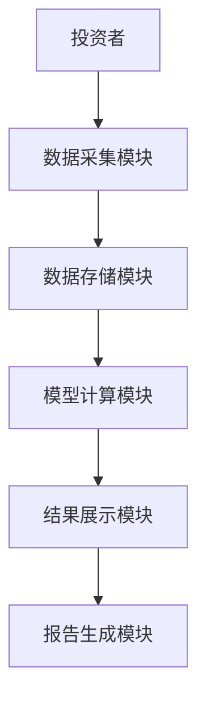
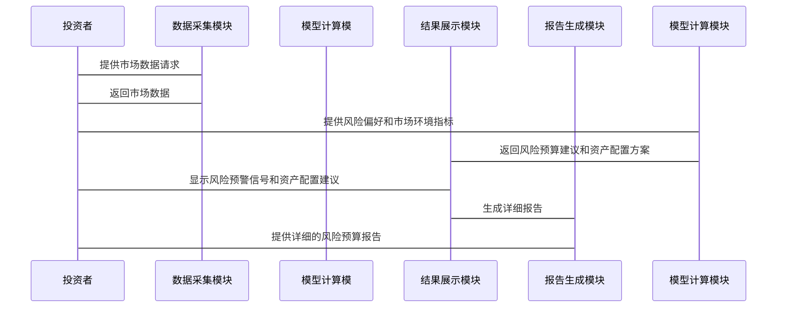

                 


# 动态风险预算：根据市场环境调整风险承受能力

## 关键词：
动态风险预算、风险管理、市场环境、风险承受能力、金融投资、风险模型、动态调整

## 摘要：
在金融市场中，风险管理和投资决策的动态调整至关重要。随着市场环境的变化，传统的静态风险管理方法已难以适应快速波动的市场。动态风险预算通过根据市场环境的变化实时调整风险承受能力，帮助投资者在不同市场条件下优化资产配置，平衡风险与收益。本文将深入探讨动态风险预算的核心概念、数学模型、系统架构以及实际应用，为读者提供全面的理论与实践指导。

---

## 第一部分：动态风险预算概述

### 第1章：动态风险预算的核心概念

#### 1.1 风险管理的基本概念

##### 1.1.1 风险的定义与分类
风险是指在投资或经营活动中，由于不确定因素的存在，可能导致实际结果与预期结果产生差异的可能性。根据其来源和影响，风险可以分为市场风险、信用风险、流动性风险、操作风险等。市场风险是由于市场波动引起的资产价格变化，是动态风险预算的主要关注点。

##### 1.1.2 风险承受能力的内涵
风险承受能力是指投资者在面对潜在损失时，能够承担的最大风险水平。传统的风险管理方法通常采用静态的资本分配策略，而动态风险预算则通过实时调整风险敞口，以适应市场环境的变化。

##### 1.1.3 动态风险预算的定义
动态风险预算是一种根据市场环境的变化，实时调整风险承受能力的方法。它通过动态调整资产配置和投资策略，以最大化收益并最小化潜在损失。这种方法特别适用于金融市场，因为市场环境的快速变化要求投资者能够迅速应对。

#### 1.2 市场环境对风险承受能力的影响

##### 1.2.1 市场波动性与风险偏好
市场波动性是影响风险承受能力的重要因素。高波动性市场通常意味着更高的风险，投资者的风险偏好可能需要相应调整。例如，在牛市中，投资者可能愿意承担更高的风险以追求更高的收益，而在熊市中，风险承受能力可能需要降低。

##### 1.2.2 经济周期与风险承受能力
经济周期的波动对市场环境有着深远的影响。在经济扩张期，市场通常较为活跃，风险承受能力较高；而在经济衰退期，市场不确定性增加，风险承受能力可能需要降低。

##### 1.2.3 市场环境变化的驱动因素
市场环境的变化主要由宏观经济因素、政策变化、市场参与者行为等驱动。例如，中央银行的货币政策变化、政府的财政政策调整、市场情绪的变化等都可能影响市场环境，进而影响风险承受能力。

#### 1.3 动态风险预算的重要性

##### 1.3.1 静态风险预算的局限性
传统的静态风险预算方法通常基于历史数据和固定模型，无法实时调整。在市场环境快速变化的情况下，这种方法可能导致过度风险暴露或保守的风险规避。

##### 1.3.2 动态调整的必要性
动态调整能够根据市场环境的变化，实时优化资产配置和投资策略。这种方法能够更灵活地应对市场波动，提高投资收益并降低潜在损失。

##### 1.3.3 动态风险预算的优势
动态风险预算的优势在于其灵活性和适应性。它能够在市场环境变化时迅速调整风险敞口，从而更好地平衡风险与收益。

---

## 第2章：动态风险预算的核心模型

### 2.1 动态风险预算模型的结构

#### 2.1.1 模型的基本框架
动态风险预算模型通常包括以下几个部分：数据采集模块、模型计算模块和结果展示模块。数据采集模块负责收集市场数据，模型计算模块根据市场数据计算风险敞口并进行动态调整，结果展示模块将计算结果以可视化形式呈现给投资者。

#### 2.1.2 模型的输入变量
模型的输入变量包括市场数据（如资产价格、波动率）、投资者的风险偏好、市场环境指标（如宏观经济指标）等。这些输入变量用于计算风险敞口和调整风险承受能力。

#### 2.1.3 模型的输出结果
模型的输出结果包括动态风险预算建议、资产配置优化方案、风险预警信号等。这些结果帮助投资者在不同市场环境下做出更明智的投资决策。

### 2.2 动态风险预算模型的数学基础

#### 2.2.1 风险价值（VaR）的计算
风险价值（Value at Risk，VaR）是一种常用的金融风险度量方法。VaR表示在一定置信水平下，资产组合可能遭受的最大损失。计算VaR的公式如下：

$$ VaR = \mu + z \times \sigma $$

其中，$\mu$是资产收益的均值，$z$是对应置信水平的分位数，$\sigma$是资产收益的标准差。

#### 2.2.2 风险调整后的资本充足率（RAROC）
RAROC（Risk-Adjusted Return on Capital）是一种衡量风险调整后收益的指标。其计算公式为：

$$ RAROC = \frac{\text{净利润} - \text{风险调整成本}}{\text{监管资本}} $$

#### 2.2.3 动态调整的数学公式
动态风险预算模型通常采用动态资产分配模型，例如均值-方差模型。其数学公式为：

$$ \text{最优权重} = \argmin_w \left( w^T \Sigma w \right) $$

其中，$w$是资产权重向量，$\Sigma$是资产收益的协方差矩阵。

### 2.3 动态风险预算模型的实现步骤

#### 2.3.1 数据收集与处理
首先，收集市场数据，包括资产价格、波动率、宏观经济指标等。数据通常需要清洗和预处理，以确保模型的输入数据准确无误。

#### 2.3.2 模型参数的设定
根据投资者的风险偏好和市场环境，设定模型的参数，如风险容忍度、市场波动率预测模型等。

#### 2.3.3 模型的运行与结果分析
运行模型，计算资产组合的风险敞口，并根据市场环境的变化进行动态调整。分析结果，生成风险预警信号和资产配置建议。

---

## 第3章：动态风险预算与传统风险管理的对比

### 3.1 传统风险管理方法

#### 3.1.1 静态风险预算的局限性
传统的风险管理方法通常采用静态的资本分配策略，无法根据市场环境的变化进行实时调整。这种方法在市场波动较大时可能导致风险暴露过高等问题。

#### 3.1.2 固定资本分配策略
固定资本分配策略是传统风险管理方法中的一种，其特点是根据历史数据和固定模型进行资产分配，不考虑市场环境的变化。这种方法在市场环境稳定时表现良好，但在市场波动较大时可能表现不佳。

#### 3.1.3 传统风险管理的优缺点
传统风险管理方法的优点在于其简单易懂和易于实施。缺点在于其缺乏灵活性，难以应对市场环境的快速变化。

### 3.2 动态风险预算的优势

#### 3.2.1 灵活性与适应性
动态风险预算的优势在于其灵活性和适应性。它能够根据市场环境的变化实时调整资产配置和风险承受能力，从而更好地应对市场波动。

#### 3.2.2 高效性与精确性
动态风险预算方法通常采用先进的数学模型和算法，能够在短时间内计算出最优的资产配置方案，提高决策的效率和精确性。

#### 3.2.3 风险与收益的平衡
动态风险预算方法能够在风险与收益之间找到平衡点，帮助投资者在不同市场环境下实现收益最大化和风险最小化。

### 3.3 动态风险预算的适用场景

#### 3.3.1 金融市场的动态变化
动态风险预算方法特别适用于金融市场，因为金融市场具有高度的不确定性和波动性，需要实时调整风险承受能力。

#### 3.3.2 不同资产类别的风险管理
动态风险预算方法可以应用于不同资产类别，如股票、债券、商品等，帮助投资者在不同资产类别之间进行动态配置，优化风险收益比。

#### 3.3.3 机构投资者的风险管理需求
机构投资者通常管理着大量的资产，对风险管理有更高的要求。动态风险预算方法能够帮助机构投资者更好地应对市场环境的变化，实现长期稳健的投资收益。

---

## 第4章：动态风险预算的系统架构设计

### 4.1 系统功能模块

#### 4.1.1 数据采集模块
数据采集模块负责收集市场数据，包括资产价格、波动率、宏观经济指标等。数据通常来自多种来源，如金融数据供应商、新闻网站等。

#### 4.1.2 模型计算模块
模型计算模块根据收集到的市场数据和投资者的风险偏好，计算资产组合的风险敞口，并根据市场环境的变化进行动态调整。

#### 4.1.3 结果展示模块
结果展示模块将计算结果以可视化形式呈现给投资者，包括风险预警信号、资产配置建议等。这些建议帮助投资者做出更明智的投资决策。

### 4.2 系统架构图



### 4.3 系统接口设计

#### 4.3.1 数据接口
数据接口用于与外部数据源（如金融数据供应商）进行数据交互。常用的数据接口包括API（应用程序编程接口）和文件接口。

#### 4.3.2 模型接口
模型接口用于与模型计算模块进行交互，接收输入数据并返回计算结果。模型接口通常采用RESTful API或其他轻量级协议。

#### 4.3.3 用户接口
用户接口是投资者与系统之间的交互界面，通常采用网页或移动应用的形式。用户可以通过界面查看风险预警信号、资产配置建议等信息，并进行相应的操作。

### 4.4 系统交互流程



---

## 第5章：动态风险预算的项目实战

### 5.1 项目背景

#### 5.1.1 项目介绍
本项目旨在开发一个基于动态风险预算的金融管理系统，帮助投资者根据市场环境的变化实时调整风险承受能力，优化资产配置。

#### 5.1.2 项目目标
项目的最终目标是为投资者提供一个高效、灵活的金融管理系统，能够在不同市场环境下实现风险与收益的平衡。

### 5.2 核心代码实现

#### 5.2.1 环境安装
首先，需要安装必要的开发工具和库，如Python、Pandas、NumPy、Matplotlib等。安装命令如下：

```bash
pip install pandas numpy matplotlib
```

#### 5.2.2 核心代码实现

##### 数据采集模块
```python
import pandas as pd
import requests

def get_market_data(api_key):
    url = f"https://api.example.com/market-data?api_key={api_key}"
    response = requests.get(url)
    data = response.json()
    df = pd.DataFrame(data)
    return df
```

##### 模型计算模块
```python
import numpy as np

def calculate_risk_budget(weights, covariance_matrix):
    portfolio_variance = weights.T @ covariance_matrix @ weights
    return portfolio_variance
```

##### 结果展示模块
```python
import matplotlib.pyplot as plt

def plot_portfolio_allocation(weights):
    plt.bar(weights.index, weights.values)
    plt.title('Portfolio Allocation')
    plt.xlabel('Assets')
    plt.ylabel('Weights')
    plt.show()
```

### 5.3 代码解读与分析

#### 5.3.1 数据采集模块
数据采集模块通过API获取市场数据，包括资产价格、波动率等。使用requests库发送HTTP请求，解析返回的JSON数据并转换为DataFrame格式。

#### 5.3.2 模型计算模块
模型计算模块采用均值-方差模型，计算资产组合的方差，从而得出风险预算。通过矩阵运算实现，确保计算的高效性和准确性。

#### 5.3.3 结果展示模块
结果展示模块使用Matplotlib库，将资产配置结果以柱状图的形式展示。这使得投资者能够直观地看到各资产的权重分布，便于做出投资决策。

### 5.4 案例分析

#### 5.4.1 案例背景
假设我们有一个包含股票、债券和商品的三资产组合，投资者的风险偏好为中等，希望在不同市场环境下动态调整风险承受能力。

#### 5.4.2 数据分析与处理
通过数据采集模块获取各资产的历史收益率和波动率数据。使用Pandas库进行数据清洗和预处理，确保数据的准确性和完整性。

#### 5.4.3 模型实现与优化
采用均值-方差模型计算最优资产权重，动态调整风险预算。通过回测和风险指标分析，验证模型的有效性和稳定性。

#### 5.4.4 结果展示与解读
将计算结果以可视化形式展示，包括资产配置建议、风险预警信号等。投资者可以根据这些建议进行资产再平衡，优化投资组合。

### 5.5 项目小结

#### 5.5.1 项目成果
本项目成功开发了一个基于动态风险预算的金融管理系统，能够根据市场环境的变化实时调整风险承受能力，优化资产配置。

#### 5.5.2 经验总结
通过本项目，我们认识到动态风险预算方法在金融风险管理中的重要性。同时，也发现了一些需要进一步优化的地方，如模型的实时性和可扩展性。

---

## 第6章：总结与展望

### 6.1 总结

动态风险预算是一种基于市场环境变化实时调整风险承受能力的方法，能够帮助投资者在不同市场环境下优化资产配置，平衡风险与收益。本文详细探讨了动态风险预算的核心概念、数学模型、系统架构以及实际应用，为读者提供了全面的理论与实践指导。

### 6.2 展望

未来，动态风险预算的研究和发展将更加注重模型的实时性和可扩展性。随着人工智能和大数据技术的不断发展，动态风险预算方法将更加智能化和精准化，为投资者提供更高效的金融管理工具。

---

## 参考文献

1. 杰里米·斯蒂恩斯、约翰·C·怀特劳. 《风险管理与金融机构》
2. 弗兰克·J·马里亚纳. 《金融风险管理》
3. 保罗·J·富兰克. 《投资组合管理》
4. 约翰·C·哈内斯. 《动态风险管理》
5. 彼得·林德. 《现代金融风险管理技术》

---

通过以上内容，我们可以看到动态风险预算在金融风险管理中的重要性和应用价值。随着市场环境的不断变化，动态风险预算方法将发挥越来越重要的作用，帮助投资者更好地应对市场波动，实现稳健的投资收益。

