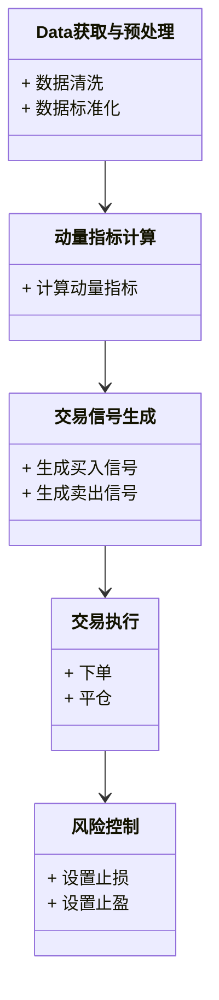

                 


# 动量投资策略：利用价格趋势获取收益

## 关键词：
动量投资策略, 动量效应, 动量指标, 投资策略, 价格趋势

## 摘要：
本文深入探讨了动量投资策略的核心概念、数学模型、算法实现以及实际应用。通过分析动量效应的形成机制，构建动量指标和回归模型，详细讲解了动量策略的实现步骤。结合系统架构设计和项目实战，展示了动量策略在金融投资中的应用。最后，提出了优化建议和未来研究方向。

---

# 第1章: 动量投资策略的基本概念

## 1.1 动量效应的定义与特征

### 1.1.1 动量效应的定义
动量效应是指资产价格在短期内表现出持续性的特征。如果一只股票在过去一段时间内表现优于市场，它在未来一段时间内可能会继续表现良好。

### 1.1.2 动量效应的特征
- **持续性**：价格趋势会延续一段时间。
- **短期性**：动量效应通常在较短的时间内表现明显。
- **市场性**：动量效应在不同市场和资产类别中表现不同。

### 1.1.3 动量效应的形成机制
动量效应的形成机制主要与投资者的行为偏差和市场参与者的有限理性有关。投资者的羊群效应、信息不对称和交易成本等因素导致价格趋势的延续。

## 1.2 动量投资策略的原理

### 1.2.1 动量策略的核心思想
动量策略的核心思想是基于价格趋势进行投资，通过捕捉动量效应来获取超额收益。

### 1.2.2 动量策略的实现方式
动量策略通过计算动量指标，如相对强弱指数（RSI）和动量指标（MOM），生成交易信号。

### 1.2.3 动量策略与其他投资策略的区别
动量策略与价值投资策略相反，价值投资寻找被低估的资产，而动量策略关注价格趋势。

## 1.3 动量策略的应用场景

### 1.3.1 股票市场的动量效应
在股票市场中，动量效应表现尤为明显，尤其是成长型股票。

### 1.3.2 债券市场的动量效应
债券市场中的动量效应相对较弱，但通过适当的策略优化仍可捕捉动量收益。

### 1.3.3 其他金融市场的动量效应
动量效应在外汇、商品期货等金融市场中也有表现。

## 1.4 动量策略的优缺点

### 1.4.1 动量策略的优点
- 短期收益显著。
- 操作简单，易于实现。

### 1.4.2 动量策略的缺点
- 长期收益不稳定。
- 在市场反转时可能遭受重大损失。

## 1.5 本章小结
动量投资策略基于价格趋势，通过捕捉动量效应获取收益。虽然动量策略在短期内表现优异，但长期表现不稳定，需要结合其他策略进行优化。

---

# 第2章: 动量策略的核心概念与数学模型

## 2.1 动量指标的定义与计算

### 2.1.1 动量指标的定义
动量指标衡量资产价格在过去一段时间内的表现。

### 2.1.2 动量指标的计算公式
$$ MOM = \frac{p_t - p_{t-n}}{n} $$

其中，$p_t$ 表示当前价格，$p_{t-n}$ 表示n天前的价格，n为计算窗口。

### 2.1.3 动量指标的标准化
动量指标可以通过归一化处理，使其在不同资产之间具有可比性。

## 2.2 动量因子的构建

### 2.2.1 动量因子的构建方法
动量因子通常基于动量指标的标准化值。

### 2.2.2 动量因子的标准化处理
$$ MOM_{norm} = \frac{MOM}{\sigma} $$

其中，$\sigma$ 为动量指标的标准差。

### 2.2.3 动量因子的组合优化
通过组合多个动量因子，可以提高动量策略的收益风险比。

## 2.3 动量模型的构建与验证

### 2.3.1 动量模型的构建步骤
1. 数据获取与预处理。
2. 计算动量指标。
3. 构建回归模型。

### 2.3.2 动量模型的验证方法
通过回测分析验证动量模型的收益和风险表现。

### 2.3.3 动量模型的回测分析
回测分析包括计算夏普比率、最大回撤等风险指标。

## 2.4 动量策略的数学模型

### 2.4.1 动量效应的回归模型
$$ R_{t} = \alpha + \beta \cdot MOM_{t-1} + \epsilon $$

其中，$R_t$ 为当前收益，$MOM_{t-1}$ 为动量指标，$\epsilon$ 为误差项。

## 2.5 本章小结
动量策略的核心是计算动量指标，并通过回归模型验证动量效应。动量因子的构建和组合优化是提高动量策略收益的关键。

---

# 第3章: 动量策略的算法实现

## 3.1 动量策略的算法流程

### 3.1.1 数据获取与预处理
从数据源获取历史价格数据，并进行清洗和标准化。

### 3.1.2 动量指标的计算
计算动量指标，并生成交易信号。

### 3.1.3 交易信号的生成
根据动量指标生成买入、卖出或持有信号。

## 3.2 动量策略的实现代码

### 3.2.1 环境安装与配置
安装必要的Python库，如Pandas、NumPy和Matplotlib。

### 3.2.2 数据获取与加载
使用Pandas读取数据文件。

### 3.2.3 动量指标的计算与可视化
```python
import pandas as pd
import matplotlib.pyplot as plt

# 数据获取与加载
data = pd.read_csv('stock_data.csv')

# 动量指标的计算
data['MOM'] = data['close'].pct_change() * 100

# 动量指标的可视化
plt.figure(figsize=(10, 6))
plt.plot(data['MOM'], label='Momentum')
plt.xlabel('Time')
plt.ylabel('Momentum (%)')
plt.legend()
plt.show()
```

## 3.3 动量策略的回测与优化

### 3.3.1 回测分析
计算动量策略的收益和风险指标。

### 3.3.2 参数优化
调整动量窗口等参数，优化策略表现。

## 3.4 本章小结
动量策略的实现需要数据获取、动量计算和交易信号生成三个步骤。通过代码实现动量策略，并进行回测和优化，可以验证策略的有效性。

---

# 第4章: 动量策略的系统架构设计

## 4.1 系统功能设计

### 4.1.1 领域模型类图


### 4.1.2 系统架构图


## 4.2 系统接口设计

### 4.2.1 系统接口设计
- 数据获取接口：从数据库获取历史价格数据。
- 交易信号接口：生成买卖信号。
- 交易执行接口：执行交易指令。

## 4.3 系统交互序列图

### 4.3.1 系统交互序列图

```mermaid
sequenceDiagram
    participant 用户
    participant 数据获取模块
    participant 动量计算模块
    participant 交易信号生成模块
    participant 交易执行模块
    用户 -> 数据获取模块: 获取数据
    数据获取模块 -> 动量计算模块: 传递数据
    动量计算模块 -> 交易信号生成模块: 传递动量指标
    交易信号生成模块 -> 交易执行模块: 发出交易信号
    交易执行模块 -> 用户: 反馈交易结果
```


## 4.4 本章小结
动量策略的系统架构设计包括数据获取、动量计算、交易信号生成和交易执行四个模块。通过模块化设计，可以提高系统的可维护性和扩展性。

---

# 第5章: 动量策略的项目实战

## 5.1 环境安装与配置

### 5.1.1 安装必要的Python库
安装Pandas、NumPy、Matplotlib等库。

## 5.2 系统核心实现源代码

### 5.2.1 动量策略实现代码
```python
import pandas as pd
import numpy as np
import matplotlib.pyplot as plt

# 数据获取与预处理
data = pd.read_csv('stock_data.csv')
data['close'] = data['close'].astype(float)

# 动量指标计算
data['MOM'] = data['close'].pct_change() * 100

# 交易信号生成
data['信号'] = np.where(data['MOM'] > 0, '买入', '卖出')

# 交易执行
data['收益'] = 0
for i in range(1, len(data)):
    if data['信号'].iloc[i] == '买入':
        data['收益'].iloc[i] = data['close'].iloc[i] - data['close'].iloc[i-1]
    else:
        data['收益'].iloc[i] = data['close'].iloc[i-1] - data['close'].iloc[i]

# 风险控制
data['止损'] = data['收益'].cumsum().apply(lambda x: x if x > -0.05 else -0.05)
data['止盈'] = data['收益'].cumsum().apply(lambda x: x if x < 0.05 else 0.05)
```

### 5.2.2 代码应用解读
代码实现动量策略的全过程，包括数据获取、动量计算、信号生成和交易执行。

## 5.3 实际案例分析

### 5.3.1 案例分析
分析某只股票的动量策略表现。

### 5.3.2 案例解读
通过案例分析，验证动量策略的有效性。

## 5.4 本章小结
通过项目实战，详细讲解了动量策略的实现过程，并通过案例分析验证了策略的有效性。

---

# 第6章: 动量策略的最佳实践与优化

## 6.1 动量因子的选择

### 6.1.1 动量窗口的选择
选择合适的动量窗口，如10天、20天等。

### 6.1.2 动量因子的组合
通过组合多个动量因子，优化策略表现。

## 6.2 交易成本的控制

### 6.2.1 交易成本的影响
交易成本会降低策略的净收益。

### 6.2.2 降低交易成本的方法
通过减少交易频率和优化交易执行，降低交易成本。

## 6.3 风险控制的优化

### 6.3.1 止损与止盈策略
设置合理的止损和止盈，控制风险。

### 6.3.2 风险指标的监控
监控最大回撤、VaR等风险指标。

## 6.4 本章小结
优化动量策略的关键在于动量因子的选择、交易成本的控制和风险管理。

---

# 第7章: 动量策略的应用案例分析

## 7.1 案例分析

### 7.1.1 案例背景
选择某只股票进行动量策略分析。

### 7.1.2 数据分析
分析股票的动量效应。

### 7.1.3 策略表现
评估动量策略的收益和风险。

## 7.2 案例解读

### 7.2.1 策略的有效性
动量策略在案例中的表现。

### 7.2.2 策略的局限性
动量策略在案例中的局限性。

## 7.3 本章小结
通过案例分析，验证动量策略的有效性和局限性，为实际应用提供参考。

---

# 第8章: 结论与展望

## 8.1 结论

### 8.1.1 动量策略的核心思想
动量策略基于价格趋势，通过捕捉动量效应获取收益。

### 8.1.2 动量策略的优势
动量策略在短期内表现优异，易于实现。

### 8.1.3 动量策略的局限性
动量策略在长期表现不稳定，容易受到市场反转的影响。

## 8.2 未来研究方向

### 8.2.1 动量因子的优化
研究新的动量因子，提高策略收益。

### 8.2.2 动量策略的组合优化
将动量策略与其他策略相结合，提高收益风险比。

### 8.2.3 动量策略的智能化
利用人工智能技术优化动量策略。

## 8.3 本章小结
动量策略是一种有效的投资策略，但需要结合其他策略和风险管理，才能实现长期稳定的收益。

---

# 参考文献

1. Fama, E. F. (1993). Momentum Strategies: A Test of Trend Following.
2. French, R. (1984). A Regression Methodology for Rational Portfolio Selection with Unbounded Short Sales.
3. Jegadeesh, N., & Titman, S. (1993). Returns to Momentum Strategies.

---

通过以上详细的内容，您可以根据实际需求进一步扩展或修改，以满足具体的应用场景和目标读者的需求。

