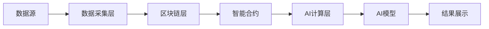
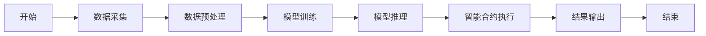
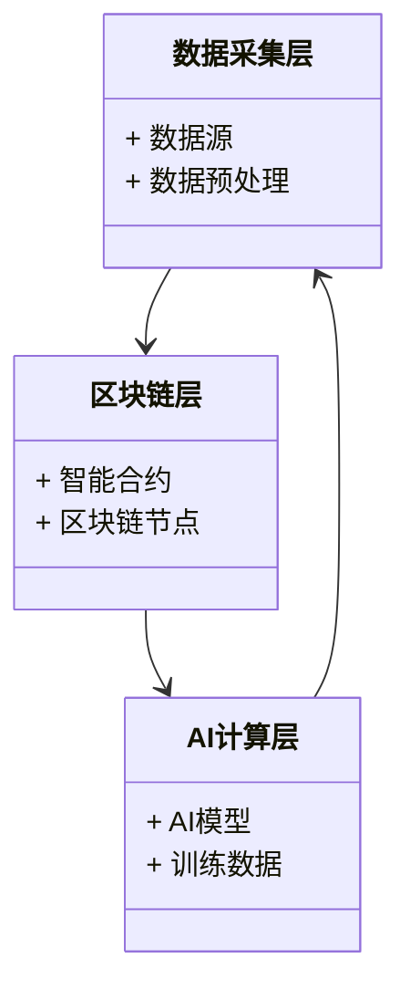

                 

# 区块链+AI：去中心化的可信AI Agent系统

## 关键词
区块链、AI、去中心化、可信系统、智能合约、共识机制、AI Agent

## 摘要
本文探讨了区块链与人工智能（AI）的结合，特别是如何利用区块链技术构建去中心化的可信AI Agent系统。文章从背景介绍、核心概念、算法原理、系统架构设计到项目实战，全面分析了去中心化AI Agent系统的技术实现与应用场景。通过结合区块链的可信机制与AI的智能决策能力，提出了一种新型的分布式智能系统架构，旨在解决传统AI系统中的信任问题，提升系统的安全性和可靠性。

---

## 第1章: 区块链与AI的结合背景

### 1.1 区块链技术概述

#### 1.1.1 区块链的基本概念与特点
区块链是一种去中心化的分布式账本技术，具有以下特点：
- **去中心化**：没有单点控制权，数据分布在网络中的多个节点上。
- **不可篡改**：数据一旦写入区块链，经过共识机制确认后，无法被修改。
- **透明性**：区块链上的数据对所有参与者可见，但可以通过加密技术保护隐私。
- **去信任化**：通过数学算法建立信任，无需依赖中心化机构。

#### 1.1.2 区块链的核心技术
区块链的核心技术包括：
1. **共识机制**：如工作量证明（POW）、权益证明（POS）、拜占庭容错（BFT）等，用于保证网络中节点达成一致。
2. **智能合约**：基于区块链的自动化程序，可以自动执行预定义的规则。
3. **分布式网络**：通过P2P网络实现数据的分布式存储和传输。

#### 1.1.3 区块链的应用场景与发展趋势
区块链技术已在金融、供应链管理、医疗健康等领域得到广泛应用。其发展趋势包括：
- **技术融合**：与其他前沿技术（如AI、物联网）的结合。
- **应用深化**：从简单的价值传递扩展到复杂的价值交换。
- **监管合规**：区块链技术在金融领域的应用逐步受到更多监管。

---

### 1.2 AI技术概述

#### 1.2.1 AI的基本概念与技术发展
人工智能（AI）是指模拟人类智能的计算机系统，主要技术包括：
1. **机器学习**：通过数据训练模型，使其能够从数据中学习规律。
2. **深度学习**：基于人工神经网络的机器学习方法。
3. **自然语言处理（NLP）**：使计算机能够理解和生成人类语言。

#### 1.2.2 当前主流AI技术
- **大模型**：如GPT系列，具备强大的自然语言理解与生成能力。
- **计算机视觉**：如卷积神经网络（CNN）在图像识别中的应用。
- **强化学习**：通过试错机制优化决策策略。

#### 1.2.3 AI在各领域的应用现状与挑战
AI技术已在多个领域取得显著进展，但仍然面临以下挑战：
- **数据隐私**：AI模型训练需要大量数据，数据隐私问题日益突出。
- **计算资源**：训练大模型需要大量的计算资源。
- **算法解释性**：AI决策过程缺乏透明性，难以解释。

---

### 1.3 区块链与AI的结合背景

#### 1.3.1 区块链与AI结合的必要性
- **数据可信性**：区块链的不可篡改性可以为AI数据提供信任基础。
- **去中心化决策**：通过区块链实现AI Agent的分布式决策，避免单点故障。
- **隐私保护**：区块链与隐私计算技术结合，可以保护AI模型和数据隐私。

#### 1.3.2 去中心化AI系统的概念与优势
去中心化AI系统是指多个AI Agent通过区块链技术协同工作的系统，其优势包括：
- **抗单点攻击**：去中心化结构使得系统更难被攻击。
- **数据共享**：通过区块链实现数据的可信共享，提升AI模型的泛化能力。
- **公平协作**：通过智能合约实现AI Agent之间的公平协作。

#### 1.3.3 当前AI系统中的信任问题与区块链的解决方案
- **数据造假**：区块链通过不可篡改性解决数据真实性问题。
- **模型可信性**：区块链可以记录AI模型的训练过程，提升模型的透明性。
- **协作信任**：区块链通过智能合约实现可信的协作机制。

---

## 第2章: 去中心化可信AI Agent系统的核心概念

### 2.1 AI Agent的基本概念

#### 2.1.1 AI Agent的定义与分类
AI Agent是指能够感知环境并采取行动以实现目标的智能体。根据智能水平，AI Agent可以分为：
- **反应式AI Agent**：基于当前感知做出反应。
- **认知式AI Agent**：具备推理、规划能力，能够主动决策。

#### 2.1.2 AI Agent的核心功能与特点
- **感知环境**：通过传感器或数据输入获取环境信息。
- **决策制定**：基于感知信息做出行动决策。
- **执行操作**：通过执行机构或接口与外部环境交互。

#### 2.1.3 AI Agent在去中心化系统中的角色
在去中心化系统中，AI Agent可以作为独立的决策单元，通过区块链技术实现可信的协作与通信。

---

### 2.2 区块链中的可信机制

#### 2.2.1 区块链的可信性与数据完整性
区块链通过去中心化和共识机制确保数据的可信性和完整性。

#### 2.2.2 区块链中的身份认证与权限管理
通过智能合约和零知识证明等技术，区块链可以实现细粒度的身份认证和权限管理。

#### 2.2.3 区块链中的数据隐私保护
通过加密技术和隐私计算（如零知识证明、同态加密），区块链可以在保护隐私的前提下进行数据计算。

---

### 2.3 去中心化AI Agent系统的整体架构

#### 2.3.1 系统的组成与功能模块划分
去中心化AI Agent系统通常包括以下功能模块：
- **数据采集层**：负责数据的采集与预处理。
- **AI计算层**：负责AI模型的训练与推理。
- **区块链层**：负责数据的存储与智能合约的执行。
- **应用层**：负责与用户交互和结果展示。

#### 2.3.2 系统的核心要素与关系图

#### 2.3.3 系统的边界与外延
去中心化AI Agent系统的边界包括数据输入、数据输出和外部服务接口。其外延包括与其他区块链节点的交互以及与其他AI系统的协作。

---

## 第3章: AI Agent的算法原理

### 3.1 AI Agent的核心算法

#### 3.1.1 基于强化学习的AI Agent算法
强化学习是一种通过试错机制优化决策的算法，适合用于动态环境中的AI Agent。

#### 3.1.2 基于决策树的AI Agent算法
决策树是一种基于规则的分类方法，适合用于静态环境中的AI Agent。

#### 3.1.3 基于图神经网络的AI Agent算法
图神经网络可以处理复杂的关联关系，适合用于社交网络中的AI Agent。

---

### 3.2 区块链中的共识算法

#### 3.2.1 共识算法的基本原理
共识算法通过分布式节点的协作达成一致，确保区块链的正确性。

#### 3.2.2 去中心化系统中的共识机制选择
不同的共识机制适用于不同的场景，如POW适用于比特币，BFT适用于联盟链。

---

### 3.3 去中心化AI Agent系统的算法实现

#### 3.3.1 算法流程图

#### 3.3.2 算法实现的数学模型与公式
以下是一个简单的强化学习模型公式：

$$
Q(s, a) = Q(s, a) + \alpha \cdot (r + \gamma \cdot \max Q(s', a') - Q(s, a))
$$

其中：
- $Q(s, a)$ 表示状态 $s$ 下采取行动 $a$ 的价值。
- $\alpha$ 是学习率。
- $r$ 是奖励。
- $\gamma$ 是折扣因子。
- $Q(s', a')$ 是下一状态的最大价值。

---

## 第4章: 去中心化可信AI Agent系统的系统架构与设计

### 4.1 系统功能设计

#### 4.1.1 系统的功能模块划分
- **数据采集模块**：负责采集环境数据。
- **AI计算模块**：负责模型训练与推理。
- **区块链模块**：负责数据存储与智能合约执行。
- **应用模块**：负责用户交互与结果展示。

#### 4.1.2 系统的领域模型

---

由于篇幅限制，以上是文章的部分内容。完整文章将涵盖更多细节，包括项目实战、数学公式推导、系统交互序列图等内容。

