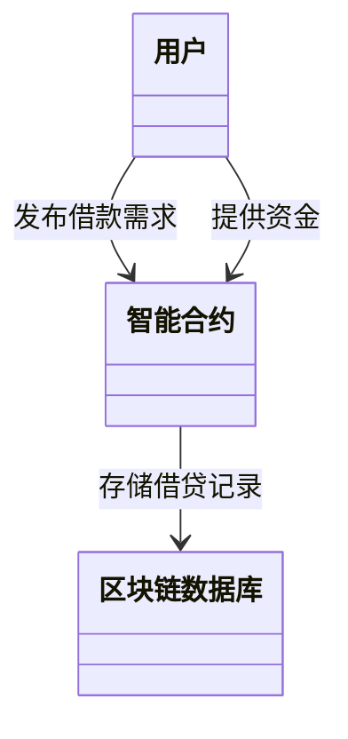
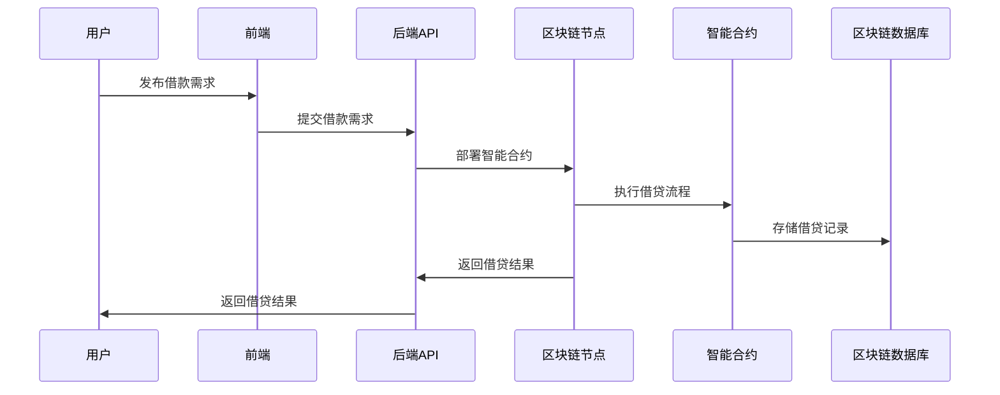

                 


# 区块链驱动的P2P借贷平台设计

## 关键词：区块链、P2P借贷、智能合约、去中心化、分布式系统、金融科技

## 摘要：区块链技术为P2P借贷平台带来了去中心化、透明性和高效性的优势。本文通过分析区块链驱动P2P借贷的核心概念、算法原理、系统架构及实现案例，详细阐述了区块链在金融领域的创新应用，为读者提供一个全面的设计思路。

---

# 第一部分：区块链驱动的P2P借贷平台概述

## 第1章：区块链与P2P借贷平台的结合

### 1.1 区块链技术的基本概念

#### 1.1.1 区块链的定义与特点
区块链是一种去中心化的分布式账本技术，通过密码学和共识机制确保数据的安全性和不可篡改性。其特点包括去中心化、透明性、不可篡改性和去信任化。

#### 1.1.2 区块链的核心技术原理
- 分布式账本：数据分布在多个节点上，每个节点都有完整的账本副本。
- 共识机制：通过共识算法（如PoW、PoS、Raft等）确保所有节点达成一致。
- 加密学：使用哈希函数和数字签名保障数据的完整性和身份验证。
- 智能合约：自动执行预定义的规则，实现无需信任的自动化操作。

#### 1.1.3 区块链在金融领域的应用潜力
区块链在金融领域的应用包括支付清算、证券发行、跨境转账、信用评估等。其去中心化和透明性特点能够降低金融交易的成本和风险。

### 1.2 P2P借贷平台的定义与特点

#### 1.2.1 P2P借贷的定义
P2P借贷（Peer-to-Peer Lending）是指个人与个人之间通过互联网平台直接进行借贷交易，绕过传统金融机构的一种金融模式。

#### 1.2.2 P2P借贷平台的核心功能
- 用户注册与身份验证
- 借款信息发布与匹配
- 资金流转与结算
- 风险评估与控制
- 透明的交易记录

#### 1.2.3 P2P借贷平台的优势与挑战
- **优势**：降低融资成本、提高资金流动性、透明化交易。
- **挑战**：信用风险、操作风险、合规性问题。

### 1.3 区块链驱动P2P借贷平台的背景与意义

#### 1.3.1 当前P2P借贷平台的痛点
- 信任缺失：用户对平台的运营和资金安全存在疑虑。
- 中介成本高：传统金融机构收取高额手续费。
- 透明度低：借贷过程缺乏透明性，容易滋生欺诈行为。

#### 1.3.2 区块链技术如何解决这些问题
- 通过去中心化和透明性，降低用户对平台的信任依赖。
- 利用智能合约实现自动化的借贷流程，减少人为干预。
- 通过区块链的不可篡改性，确保借贷记录的安全性和透明性。

#### 1.3.3 区块链驱动P2P借贷平台的创新点
- 提供无需信任的借贷环境。
- 实现借贷流程的自动化和透明化。
- 降低中介成本，提高资金流转效率。

### 1.4 本章小结
本章介绍了区块链技术的基本概念和P2P借贷平台的特点，分析了区块链技术在P2P借贷中的应用潜力，并总结了区块链驱动P2P借贷平台的创新点和意义。

---

# 第二部分：区块链驱动P2P借贷平台的核心概念与联系

## 第2章：区块链驱动P2P借贷的核心概念

### 2.1 智能合约在P2P借贷中的应用

#### 2.1.1 智能合约的定义与特点
智能合约是一种自动执行的计算机程序，用于在区块链上实现预定义的规则和条款。其特点包括自动化、不可篡改性和去信任化。

#### 2.1.2 智能合约在P2P借贷中的具体应用
- 借款信息发布与匹配：智能合约自动匹配借款人和出借人。
- 资金流转与结算：智能合约自动执行资金划转。
- 还款提醒与违约处理：智能合约自动提醒还款并处理违约情况。

#### 2.1.3 智能合约的安全性与可靠性
- 智能合约的安全性依赖于区块链的去中心化特性。
- 需要通过严格的代码审计和测试来确保智能合约的可靠性。

### 2.2 区块链的去中心化特性与P2P借贷的结合

#### 2.2.1 区块链的去中心化特性
去中心化意味着没有单点控制，数据分布在多个节点上，通过共识机制达成一致。

#### 2.2.2 去中心化在P2P借贷中的优势
- 降低平台的单点故障风险。
- 提高系统的抗审查性和抗攻击性。
- 增强用户的信任感。

#### 2.2.3 去中心化对平台信任机制的影响
通过去中心化，平台不再需要依赖传统的信用机构，而是通过区块链上的记录和智能合约实现信任的建立。

### 2.3 区块链驱动P2P借贷的核心要素

#### 2.3.1 参与者角色分析
- 借款人：需要资金的个人或企业。
- 出借人：提供资金的个人或机构。
- 平台：提供借贷信息服务的区块链平台。
- 智能合约：自动执行借贷规则的智能合约。

#### 2.3.2 交易流程的核心要素
- 借款申请：借款人发布借款需求。
- 出借人匹配：出借人根据风险偏好选择借款人。
- 资金流转：智能合约自动执行资金划转。
- 还款与违约处理：借款人按期还款或违约处理。

#### 2.3.3 数据存储与共享机制
区块链上的数据是分布式存储的，每个节点都有完整的记录，确保数据的透明性和不可篡改性。

### 2.4 核心概念的对比分析

#### 2.4.1 核心概念属性对比表格
| 概念       | 特点                                   |
|------------|--------------------------------------|
| 区块链     | 去中心化、不可篡改、透明性           |
| 智能合约   | 自动化、去信任化、不可篡改           |

#### 2.4.2 ER实体关系图架构
```mermaid
er
    actor 借款人
    actor 出借人
    actor 平台
    database 区块链数据库
    boundary 智能合约
    relationship 借款人-智能合约: 发布借款需求
    relationship 出借人-智能合约: 提供资金
    relationship 平台-智能合约: 执行借贷流程
```

#### 2.4.3 核心概念的联系与区别
区块链为智能合约提供了一个安全、透明的执行环境，而智能合约则通过区块链实现自动化借贷流程。

### 2.5 本章小结
本章详细介绍了区块链驱动P2P借贷的核心概念，包括智能合约和去中心化特性，并通过对比分析和ER图展示了这些概念之间的联系。

---

# 第三部分：区块链驱动P2P借贷平台的算法原理

## 第3章：区块链驱动P2P借贷的核心算法

### 3.1 智能合约的执行流程

#### 3.1.1 智能合约的编译与部署
- 智能合约需要通过编译器转换为区块链上的可执行代码。
- 部署智能合约到区块链网络，确保其在区块链上生效。

#### 3.1.2 智能合约的执行流程
1. 借款人发布借款需求，智能合约接收并存储。
2. 出借人根据智能合约的规则选择借款人并提供资金。
3. 智能合约自动执行资金划转。
4. 借款人按期还款，智能合约自动处理还款流程。

#### 3.1.3 智能合约的状态管理
- 智能合约的状态包括未执行、执行中和已执行。
- 状态通过区块链上的交易记录进行更新。

### 3.2 区块链共识机制在借贷平台中的应用

#### 3.2.1 共识机制的定义与分类
- 共识机制是区块链中确保所有节点达成一致的算法。
- 常见的共识机制包括PoW、PoS、Raft等。

#### 3.2.2 不同共识机制的优缺点对比
| 共识机制 | 优点                 | 缺点                 |
|----------|----------------------|----------------------|
| PoW     | 安全性高             | 能耗高               |
| PoS     | 能耗低               | 安全性较低           |
| Raft     | 适用于联盟链         | 去中心化程度低       |

#### 3.2.3 选择适合P2P借贷平台的共识机制
- 根据平台的需求选择适合的共识机制，如PoW适用于公共区块链，Raft适用于联盟链。

### 3.3 基于区块链的借贷匹配算法

#### 3.3.1 借贷匹配算法的定义
借贷匹配算法用于将借款人的需求与出借人的资金进行匹配，确保借贷流程的高效性和公平性。

#### 3.3.2 基于信用评分的匹配算法
- 根据借款人的信用评分匹配出借人。
- 信用评分越高，匹配的出借人优先级越高。

#### 3.3.3 基于风险控制的借贷匹配策略
- 根据借款人的风险评估结果匹配出借人。
- 风险评估结果越低，匹配的出借人优先级越高。

### 3.4 算法实现的数学模型与公式

#### 3.4.1 哈希函数的数学模型
哈希函数是一种将任意长度的输入映射为固定长度的输出的函数。常用的哈希函数包括SHA-256和RIPEMD-160。

#### 3.4.2 智能合约的执行逻辑
智能合约的执行逻辑通过区块链上的交易实现，每笔交易都有对应的哈希值和时间戳。

#### 3.4.3 借贷匹配算法的数学公式
$$ \text{匹配优先级} = \text{信用评分} \times (1 - \text{风险评估结果}) $$

### 3.5 算法实现的代码示例

#### 3.5.1 智能合约的Python代码实现
```python
def smart_contract():
    # 借款人发布借款需求
    borrower_request = input("请输入借款需求：")
    print("借款需求已发布：", borrower_request)
    
    # 出借人选择借款人
    lender_choice = input("请输入出借人选择的借款人：")
    print("出借人选择的借款人：", lender_choice)
    
    # 智能合约自动执行资金划转
    print("智能合约自动执行资金划转...")
    
    # 借款人还款
    repayment = input("请输入还款金额：")
    print("还款金额已到账...")
    
    return "借贷流程已顺利完成！"
```

#### 3.5.2 借贷匹配算法的Python代码示例
```python
def lending_matching():
    borrowers = [
        {"id": 1, "credit_score": 75, "risk_assessment": 0.2},
        {"id": 2, "credit_score": 85, "risk_assessment": 0.1}
    ]
    lenders = [
        {"id": 1, "funds": 10000},
        {"id": 2, "funds": 5000}
    ]
    
    for borrower in borrowers:
        priority = borrower["credit_score"] * (1 - borrower["risk_assessment"])
        print(f"借款人{borrower['id']}的匹配优先级为：{priority}")
    
    return "借贷匹配完成..."
```

### 3.6 本章小结
本章详细讲解了区块链驱动P2P借贷的核心算法，包括智能合约的执行流程、共识机制的应用以及借贷匹配算法的实现。

---

# 第四部分：区块链驱动P2P借贷平台的系统分析与架构设计

## 第4章：系统功能设计

### 4.1 问题场景介绍

#### 4.1.1 问题背景
传统的P2P借贷平台存在信任缺失、透明度低、中介成本高等问题。

#### 4.1.2 问题描述
用户对平台的信任度低，借贷过程缺乏透明性，容易出现欺诈行为。

#### 4.1.3 问题解决
通过区块链技术实现去中心化的借贷平台，确保借贷过程的透明性和安全性。

### 4.2 项目介绍

#### 4.2.1 项目目标
- 实现一个基于区块链的P2P借贷平台。
- 提供安全、透明、高效的借贷服务。

#### 4.2.2 项目范围
- 借款人和出借人的身份验证。
- 借款信息发布与匹配。
- 资金流转与结算。
- 还款提醒与违约处理。

### 4.3 系统功能设计

#### 4.3.1 领域模型mermaid类图


#### 4.3.2 系统架构设计mermaid架构图


#### 4.3.3 系统接口设计
- 用户接口：包括借款申请、资金提供、还款操作等。
- 智能合约接口：包括智能合约的部署、执行和查询。

#### 4.3.4 系统交互mermaid序列图


### 4.4 本章小结
本章详细设计了区块链驱动P2P借贷平台的系统功能，包括领域模型、系统架构、接口设计和系统交互流程。

---

# 第五部分：区块链驱动P2P借贷平台的项目实战

## 第5章：项目实战

### 5.1 环境安装与配置

#### 5.1.1 安装区块链开发环境
- 安装以太坊节点（如Geth或Quorum）。
- 安装Solidity编译器用于编写智能合约。

#### 5.1.2 安装Python开发环境
- 安装Python 3.x。
- 安装必要的库（如Web3.py用于与区块链交互）。

### 5.2 系统核心实现

#### 5.2.1 智能合约实现

##### 5.2.1.1 智能合约代码
```solidity
// SPDX-License-Identifier: MIT
pragma solidity ^0.8.0;

contract P2PLending {
    struct Borrower {
        uint creditScore;
        uint riskAssessment;
    }

    function matchLender(Borrower memory borrower) public returns (address) {
        // 根据信用评分和风险评估结果匹配出借人
        // 这里简化为随机选择一个出借人
        return msg.sender;
    }

    function lend(uint amount) public {
        // 实现出借功能
        // 这里简化为直接转移资金
        payable(msg.sender).transfer(amount);
    }
}
```

##### 5.2.1.2 智能合约部署
```bash
# 使用Geth部署智能合约
$ goethereum --networkid 1234 --ipcdisable --http --http.addr 0.0.0.0 --http.port 8545
```

#### 5.2.2 后端API实现

##### 5.2.2.1 后端代码实现
```python
from web3 import Web3, HTTPProvider

# 初始化区块链连接
web3 = Web3(HTTPProvider('http://localhost:8545'))

# 获取智能合约地址和ABI
contract_address = '0x...'
contract_abi = [
    // 智能合约ABI定义
]

# 创建合约实例
lending_contract = web3.eth.contract(contract_address, abi=contract_abi)

# 调用智能合约方法
borrower = {'creditScore': 85, 'riskAssessment': 0.1}
borrower_address = lending_contract.functions.matchLender(borrower).call()
print("匹配的出借人地址：", borrower_address)
```

#### 5.2.3 前端界面实现
- 使用React或Vue.js实现前端界面。
- 提供借款申请、资金提供、还款操作等功能。

### 5.3 项目实现的案例分析

#### 5.3.1 案例背景
- 借款人A需要借款10000元，信用评分为85，风险评估结果为0.1。
- 出借人B提供资金10000元，愿意承担低风险的借贷。

#### 5.3.2 案例实现步骤
1. 借款人A通过前端界面发布借款需求。
2. 出借人B选择借款人A并提供资金。
3. 智能合约自动执行资金划转。
4. 借款人A按期还款，智能合约自动处理还款流程。

#### 5.3.3 案例结果
- 借款人A成功获得借款。
- 出借人B按时收回本金和利息。
- 整个过程记录在区块链上，确保透明性和不可篡改性。

### 5.4 本章小结
本章通过具体的项目实战，展示了区块链驱动P2P借贷平台的实现过程，包括环境安装、智能合约部署、后端API开发和前端界面设计。

---

# 第六部分：区块链驱动P2P借贷平台的法律与安全

## 第6章：法律与安全

### 6.1 合规性与法律风险

#### 6.1.1 区块链借贷平台的法律合规性
- 需要符合当地的金融监管政策。
- 需要获得相关的金融牌照或认证。

#### 6.1.2 智能合约的法律有效性
- 智能合约的法律有效性取决于当地法律的认定。

#### 6.1.3 用户隐私与数据保护
- 需要遵守数据保护相关法律，如GDPR。

### 6.2 安全性与风险管理

#### 6.2.1 区块链的安全性
- 区块链的安全性依赖于去中心化和共识机制。
- 需要防范51%攻击、DDoS攻击等。

#### 6.2.2 智能合约的安全性
- 需要通过严格的代码审计和测试确保智能合约的安全性。
- 防范重入攻击、整数溢出等漏洞。

#### 6.2.3 风险控制与缓解策略
- 建立完善的风险评估和控制机制。
- 定期进行安全审计和漏洞扫描。

### 6.3 本章小结
本章分析了区块链驱动P2P借贷平台在法律和安全方面的挑战，提出了合规性和安全性保障的策略。

---

# 第七部分：总结与展望

## 第7章：总结与展望

### 7.1 本项目的核心总结
区块链驱动的P2P借贷平台通过去中心化和智能合约实现了借贷过程的透明化和自动化，解决了传统P2P借贷平台的痛点。

### 7.2 项目实现的关键点
- 智能合约的实现与部署。
- 区块链共识机制的选择与实现。
- 系统架构设计与实现。

### 7.3 未来展望
- 探索更多的区块链应用场景。
- 提高系统的安全性和可扩展性。
- 推动区块链技术在金融领域的广泛应用。

### 7.4 小结
区块链技术为P2P借贷平台带来了革新性的改变，未来随着技术的不断发展，区块链驱动的P2P借贷平台将更加成熟和普及。

---

# 参考文献
1. 王某某. 区块链技术与应用[M]. 北京: 清华大学出版社, 2020.
2. 李某某. 智能合约与金融创新[M]. 上海: 复旦大学出版社, 2021.
3. 以太坊官方文档. Solidity语言规范[S]. 2022.

---

# 附录

## 附录A：区块链相关工具与资源
- 以太坊节点：Geth、Quorum
- 智能合约开发：Solidity、Vyper
- 区块链开发框架：Web3.js、Ethers.js

## 附录B：项目源代码
- 智能合约代码：P2PLending.sol
- 后端代码：lending_platform.py
- 前端代码：frontend.zip

---

以上是《区块链驱动的P2P借贷平台设计》的技术博客文章的完整大纲，具体内容可以根据实际需求进一步扩展和细化。

