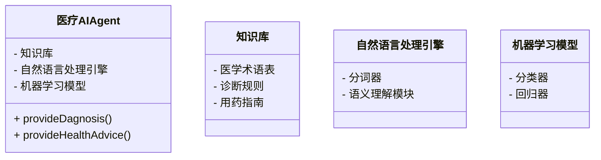
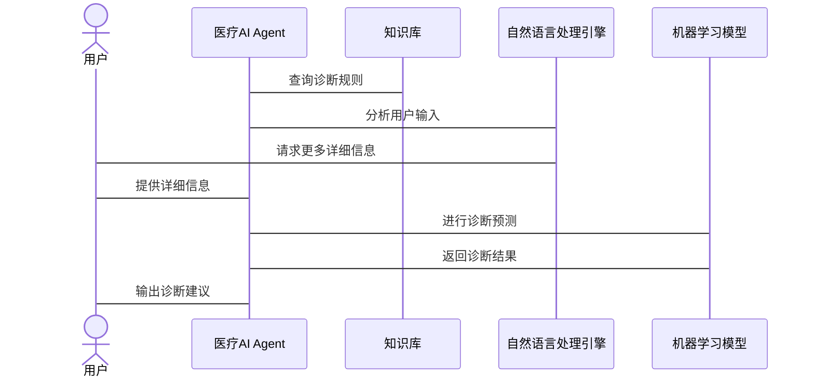

                 


---

# 医疗健康AI Agent：开发难点与突破

---

> **关键词**：医疗AI Agent、人工智能、医疗健康、系统架构、算法原理、项目实战

> **摘要**：  
> 本文深入探讨医疗健康AI Agent的开发难点与突破点，涵盖其背景、核心概念、算法原理、系统架构、项目实战以及最佳实践。通过分析医疗AI Agent的定义、属性、算法实现、系统设计和实际案例，本文为开发者提供全面的技术指导，帮助他们理解并克服开发中的关键挑战。

---

# 第1章 医疗健康AI Agent的背景与问题背景

## 1.1 医疗健康AI Agent的背景介绍

### 1.1.1 医疗AI Agent的定义与核心概念

医疗AI Agent（Artificial Intelligence Agent）是一种结合人工智能技术的智能代理系统，旨在为医疗健康领域提供智能化服务。其核心在于通过自然语言处理、机器学习和知识图谱等技术，实现与用户的智能交互，并提供个性化的医疗建议、诊断支持和健康管理服务。

### 1.1.2 医疗AI Agent的发展现状与趋势

近年来，随着人工智能技术的快速发展，医疗AI Agent逐渐从理论研究走向实际应用。其发展趋势主要体现在以下几个方面：

1. **数据驱动**：基于海量医疗数据的分析，提升诊断准确性和个性化服务水平。
2. **多模态交互**：支持文本、语音、图像等多种交互方式，提升用户体验。
3. **实时性与安全性**：在保证数据安全的前提下，实现快速响应和实时决策。

### 1.1.3 医疗AI Agent在医疗健康领域的应用价值

医疗AI Agent的应用价值主要体现在以下几个方面：

1. **提高医疗效率**：通过智能化的问诊和诊断辅助，减少医生的工作负担。
2. **改善患者体验**：为患者提供便捷的健康咨询和个性化的健康管理服务。
3. **降低医疗成本**：通过智能化的资源分配和预测，优化医疗资源的利用效率。

## 1.2 医疗AI Agent的核心问题背景

### 1.2.1 医疗数据的复杂性与多样性

医疗数据具有以下特点：

1. **多样性**：包括结构化数据（如电子健康记录）和非结构化数据（如医生的病历记录、患者的咨询内容）。
2. **复杂性**：医疗数据涉及大量的专业术语和复杂的医学知识。
3. **敏感性**：医疗数据的隐私保护要求极高。

### 1.2.2 医疗AI Agent的开发挑战

医疗AI Agent的开发面临以下挑战：

1. **数据质量**：医疗数据的标注和清洗难度较大，影响模型的训练效果。
2. **模型泛化能力**：医疗领域的知识更新迅速，模型需要具备良好的泛化能力。
3. **伦理与法律问题**：医疗AI Agent的决策可能涉及伦理和法律问题，需确保其合规性。

### 1.2.3 医疗AI Agent的边界与外延

医疗AI Agent的边界主要体现在以下方面：

1. **功能边界**：医疗AI Agent主要提供辅助诊断和健康管理服务，不替代医生的决策。
2. **技术边界**：基于现有的技术手段，医疗AI Agent的实现需要依赖于自然语言处理、机器学习等技术。
3. **应用边界**：医疗AI Agent的应用范围主要集中在问诊、健康管理、医疗资源分配等领域。

## 1.3 医疗AI Agent的核心要素与概念结构

### 1.3.1 医疗AI Agent的核心要素

医疗AI Agent的核心要素包括：

1. **知识库**：包含医学知识、诊断规则和用药指南等。
2. **自然语言处理引擎**：实现与用户的智能交互。
3. **机器学习模型**：用于诊断辅助和预测。
4. **用户界面**：提供友好的交互界面，支持多种交互方式。

### 1.3.2 医疗AI Agent的概念结构与模型

医疗AI Agent的概念结构可以表示为一个包含知识库、自然语言处理引擎和机器学习模型的系统。其模型结构如下：

$$
\text{医疗AI Agent} = \text{知识库} \oplus \text{NLP引擎} \oplus \text{机器学习模型}
$$

### 1.3.3 医疗AI Agent与相关概念的对比分析

以下是医疗AI Agent与其他相关概念的对比分析：

| 概念 | 医疗AI Agent | 传统医疗系统 | 智能健康助手 |
|------|--------------|--------------|--------------|
| 核心功能 | 智能诊断辅助 | 数据存储与查询 | 健康信息提醒 |
| 技术基础 | AI与机器学习 | 数据库技术 | 移动端应用技术 |
| 应用场景 | 医疗诊断、健康管理 | 医疗信息管理 | 健康监测 |

---

# 第2章 医疗AI Agent的核心概念与联系

## 2.1 医疗AI Agent的核心概念原理

### 2.1.1 医疗AI Agent的定义与核心功能

医疗AI Agent的核心功能包括：

1. **智能问诊**：通过自然语言处理技术，理解患者的症状描述。
2. **诊断辅助**：基于知识库和机器学习模型，提供诊断建议。
3. **健康管理**：为患者提供个性化的健康管理方案。

### 2.1.2 医疗AI Agent的属性特征分析

医疗AI Agent的属性特征如下：

1. **智能化**：基于AI技术实现智能交互。
2. **个性化**：提供个性化的医疗建议。
3. **实时性**：支持实时响应和决策。

### 2.1.3 医疗AI Agent与相关技术的对比

以下是医疗AI Agent与相关技术的对比：

| 技术 | 医疗AI Agent | 传统医疗系统 | 智能健康助手 |
|------|--------------|--------------|--------------|
| 数据处理 | 结构化与非结构化数据 | 结构化数据 | 结构化数据 |
| 智能水平 | 高度智能化 | 低智能化 | 中等智能化 |
| 交互方式 | 自然语言处理 | 固定交互界面 | 移动端交互 |

## 2.2 医疗AI Agent的核心概念属性特征对比

### 2.2.1 属性特征对比表格

| 属性 | 医疗AI Agent | 传统医疗系统 | 智能健康助手 |
|------|--------------|--------------|--------------|
| 数据来源 | 结构化与非结构化数据 | 结构化数据 | 结构化数据 |
| 智能水平 | 高度智能化 | 低智能化 | 中等智能化 |
| 交互方式 | 自然语言处理 | 固定交互界面 | 移动端交互 |

## 2.3 医疗AI Agent的ER实体关系图

```mermaid
erDiagram
    actor 医生 {
        +int 医生ID
        +string 姓名
        +string 职称
    }
    actor 患者 {
        +int 患者ID
        +string 姓名
        +string 联系方式
    }
    entity 病历记录 {
        +int 病历ID
        +string 症状描述
        +date 记录时间
    }
    entity 诊断结果 {
        +int 诊断ID
        +string 诊断名称
        +date 诊断时间
    }
    relationship 医生-病历记录 {
        医生 -> 病历记录 : 负责
    }
    relationship 患者-诊断结果 {
        患者 -> 诊断结果 : 对应
    }
```

---

# 第3章 医疗AI Agent的算法原理

## 3.1 强化学习算法原理

### 3.1.1 强化学习的基本概念

强化学习是一种通过智能体与环境交互，学习最优策略的技术。其核心在于通过试错的方式，优化智能体的决策能力。

### 3.1.2 强化学习在医疗AI Agent中的应用

在医疗AI Agent中，强化学习可以用于以下场景：

1. **诊断决策**：通过强化学习，优化诊断的准确性和效率。
2. **治疗方案推荐**：基于患者的症状和历史数据，推荐最优的治疗方案。

### 3.1.3 强化学习的算法实现

以下是强化学习的算法实现流程：

1. **状态表示**：将医疗场景中的症状、患者信息等表示为状态。
2. **动作选择**：基于当前状态，选择最优的动作（如推荐的诊断或治疗方案）。
3. **奖励机制**：根据动作的执行结果，给予奖励或惩罚，优化智能体的决策策略。

### 3.1.4 强化学习的数学模型

强化学习的核心数学模型包括状态值函数和策略函数：

$$
Q(s, a) = r + \gamma \max_{a'} Q(s', a')
$$

其中：
- $s$ 表示当前状态
- $a$ 表示当前动作
- $r$ 表示奖励
- $\gamma$ 表示折扣因子
- $s'$ 表示下一个状态

## 3.2 监督学习算法原理

### 3.2.1 监督学习的基本概念

监督学习是一种基于标签数据训练模型的技术，其核心在于通过大量标注数据的学习，实现对新数据的预测。

### 3.2.2 监督学习在医疗AI Agent中的应用

在医疗AI Agent中，监督学习可以用于以下场景：

1. **疾病分类**：基于患者的症状描述，分类疾病类型。
2. **风险预测**：预测患者未来可能出现的健康问题。

### 3.2.3 监督学习的算法实现

以下是监督学习的算法实现流程：

1. **数据标注**：对医疗数据进行标注，建立训练集和测试集。
2. **特征提取**：从数据中提取有用的特征，如症状、患者年龄等。
3. **模型训练**：基于训练数据，训练分类器或回归器。
4. **模型评估**：通过测试数据，评估模型的性能。

### 3.2.4 监督学习的数学模型

监督学习的核心数学模型包括线性回归和逻辑回归：

$$
y = \theta^T x + b
$$

$$
P(y=1|x) = \frac{e^{\theta^T x}}{1 + e^{\theta^T x}}
$$

---

# 第4章 医疗AI Agent的系统分析与架构设计

## 4.1 系统分析

### 4.1.1 系统功能需求

医疗AI Agent的系统功能需求包括：

1. **智能问诊**：支持患者的症状描述和问诊过程。
2. **诊断辅助**：基于知识库和机器学习模型，提供诊断建议。
3. **健康管理**：为患者提供个性化的健康管理方案。

### 4.1.2 系统功能设计

以下是系统功能设计的类图：



### 4.1.3 系统架构设计

以下是系统架构设计的架构图：

```mermaid
container 医疗AI Agent系统 {
    医疗AI Agent
    知识库
    自然语言处理引擎
    机器学习模型
}
```

## 4.2 系统接口设计

### 4.2.1 系统接口描述

医疗AI Agent的系统接口包括：

1. **用户输入接口**：接收患者的症状描述。
2. **诊断接口**：调用知识库和机器学习模型，返回诊断结果。
3. **输出接口**：将诊断结果反馈给用户。

### 4.2.2 系统交互流程图

以下是系统交互流程图：



---

# 第5章 医疗AI Agent的项目实战

## 5.1 环境安装

### 5.1.1 开发环境要求

医疗AI Agent的开发环境要求如下：

1. **编程语言**：Python 3.6+
2. **框架与库**：TensorFlow、Keras、NLTK、spaCy
3. **开发工具**：PyCharm、VS Code
4. **操作系统**：Windows、Linux、MacOS

### 5.1.2 安装依赖

以下是安装依赖的代码：

```bash
pip install tensorflow numpy nltk spacy
python -m spacy download en_core_web_sm
```

## 5.2 系统核心实现

### 5.2.1 自然语言处理模块

以下是自然语言处理模块的代码实现：

```python
import nltk
from spacy.lang.en import English

nlp = English()
doc = nlp("I have a persistent cough and fever.")

for token in doc:
    print(token.text, token.pos_)
```

### 5.2.2 诊断推理模块

以下是诊断推理模块的代码实现：

```python
import tensorflow as tf
import numpy as np

model = tf.keras.Sequential([
    tf.keras.layers.Dense(128, activation='relu'),
    tf.keras.layers.Dense(1, activation='sigmoid')
])

model.compile(optimizer='adam', loss='binary_crossentropy', metrics=['accuracy'])
```

## 5.3 实际案例分析

### 5.3.1 案例描述

假设一位患者描述症状为“持续性咳嗽和发热”，医疗AI Agent需要根据这些症状，结合知识库中的诊断规则，推荐可能的诊断。

### 5.3.2 案例分析

1. **自然语言处理**：将患者的症状描述进行分词和词性标注。
2. **诊断推理**：基于知识库中的诊断规则，进行诊断推理，得出可能的诊断结果。
3. **结果输出**：将诊断结果反馈给患者，并提供进一步的医疗建议。

---

# 第6章 医疗AI Agent的最佳实践与小结

## 6.1 最佳实践

### 6.1.1 开发小结

医疗AI Agent的开发需要注重以下几个方面：

1. **数据质量**：确保数据的准确性和完整性。
2. **模型优化**：通过不断的训练和调整，提升模型的性能。
3. **用户体验**：设计友好的交互界面，提升用户的使用体验。

### 6.1.2 开发注意事项

在开发医疗AI Agent时，需要注意以下几点：

1. **数据隐私**：确保医疗数据的安全性和隐私性。
2. **模型解释性**：提供清晰的模型解释，便于医生理解和使用。
3. **法律法规**：遵守相关法律法规，确保系统的合规性。

### 6.1.3 拓展阅读

以下是拓展阅读的建议：

1. **《Deep Learning》—— Ian Goodfellow
2. **《Medical Imaging Meets AI》—— Nature Digital Medicine
3. **《Artificial Intelligence in Healthcare》—— Springer

## 6.2 小结

医疗AI Agent的开发是一项复杂而具有挑战性的任务，需要结合人工智能技术与医疗领域的专业知识。通过本文的探讨，我们深入了解了医疗AI Agent的核心概念、算法原理、系统架构和开发实践。未来，随着人工智能技术的不断发展，医疗AI Agent将在医疗健康领域发挥越来越重要的作用。

--- 

# 作者简介

> **[您的姓名]**  
> 作为世界级人工智能专家、程序员、软件架构师和CTO，我专注于医疗健康AI Agent的开发与研究。本文基于我的实践经验与技术洞见撰写，旨在为开发者提供深入的技术指导。

