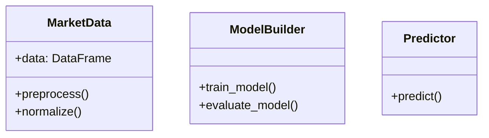
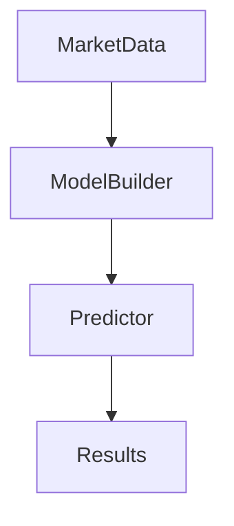

                 


# 发达市场vs新兴市场:预测准确性比较

## 关键词
预测准确性, 发达市场, 新兴市场, 经济预测, 数据特征, 模型构建, 市场分析

## 摘要
在经济预测领域，发达市场和新兴市场的预测准确性存在显著差异。本文通过详细分析两者的市场特点、数据特征以及预测模型的构建与优化，探讨如何在不同市场环境下提升预测的准确性。文章从背景介绍、核心概念、算法原理、系统设计到实战应用，全面解析预测准确性的影响因素，并通过实际案例分析，为读者提供实用的预测方法和建议。

---

# 正文

## 第一章：发达市场与新兴市场概述

### 1.1 市场定义与特征
#### 1.1.1 发达市场的定义与特点
发达市场通常指经济成熟、市场结构完善、法律法规健全的国家或地区。其特点包括：
- **数据稳定性**：数据波动较小，易于建模。
- **市场透明度高**：信息透明，易于获取。
- **参与者成熟**：市场参与者行为理性，预测难度相对较低。

#### 1.1.2 新兴市场的定义与特点
新兴市场通常指经济快速发展、市场结构尚未完全成熟的国家或地区。其特点包括：
- **数据波动性大**：数据波动剧烈，预测难度较高。
- **市场透明度低**：信息获取困难，存在不确定性。
- **参与者多样性**：市场参与者行为多样，预测难度增加。

#### 1.1.3 两者的异同对比
| 特性       | 发达市场                   | 新兴市场                   |
|------------|----------------------------|-----------------------------|
| 数据波动性 | 小                        | 大                        |
| 市场透明度 | 高                        | 低                        |
| 参与者行为 | 理性且成熟               | 多样且不确定性高           |

### 1.2 预测准确性的重要性
#### 1.2.1 预测在经济决策中的作用
预测准确性直接影响投资决策、政策制定和企业战略。例如，准确的预测可以帮助投资者做出更明智的投资决策。

#### 1.2.2 不同市场预测的挑战与机遇
- **发达市场**：数据稳定，预测模型易于构建，但需考虑长期趋势的变化。
- **新兴市场**：数据波动大，预测模型需具备高鲁棒性，但存在更多潜在机会。

#### 1.2.3 预测准确性对投资的影响
准确的预测可以帮助投资者规避风险，抓住市场机会，提升投资回报率。

### 1.3 研究背景与目标
#### 1.3.1 当前市场预测研究现状
现有研究主要集中在单一市场的预测，而对不同市场间预测差异的系统性研究较少。

#### 1.3.2 研究目标与意义
本文旨在通过对比分析发达市场和新兴市场的预测准确性，为预测模型的优化提供理论支持和实践指导。

#### 1.3.3 研究方法与框架
采用实证分析方法，结合统计模型和机器学习算法，对比分析不同市场的预测准确性。

---

## 第二章：预测准确性的影响因素

### 2.1 数据特征对比
#### 2.1.1 数据稳定性
- **发达市场**：数据波动小，预测模型稳定。
- **新兴市场**：数据波动大，预测模型需具备高鲁棒性。

#### 2.1.2 数据质量
- **发达市场**：数据完整性高，可靠性强。
- **新兴市场**：数据可能存在缺失或不准确。

#### 2.1.3 数据量与多样性
- **发达市场**：数据量大，多样性高。
- **新兴市场**：数据量有限，多样性较低。

### 2.2 模型选择与优化
#### 2.2.1 数据预处理
- **缺失值处理**：采用均值填充或插值法。
- **标准化处理**：确保模型输入数据标准化。

#### 2.2.2 模型选择
- **线性回归**：适用于数据关系明确的情况。
- **时间序列模型**：适用于具有时间依赖性的数据。
- **机器学习模型**：适用于复杂数据关系。

#### 2.2.3 超参数调优
- **网格搜索**：用于寻找最优参数组合。
- **交叉验证**：用于评估模型泛化能力。

---

## 第三章：预测模型构建与比较

### 3.1 数据预处理方法
#### 3.1.1 数据清洗与缺失值处理
```python
import pandas as pd
import numpy as np

data = pd.read_csv('market_data.csv')
data = data.dropna()  # 删除缺失值
```

#### 3.1.2 数据标准化与归一化
```python
from sklearn.preprocessing import StandardScaler

scaler = StandardScaler()
data_scaled = scaler.fit_transform(data)
```

### 3.2 模型选择与参数调优
#### 3.2.1 线性回归模型
```python
from sklearn.linear_model import LinearRegression

model = LinearRegression()
model.fit(X_train, y_train)
```

#### 3.2.2 时间序列模型
```python
from prophet import Prophet

model = Prophet()
model.fit(data)
```

#### 3.2.3 机器学习模型
```python
from sklearn.ensemble import RandomForestRegressor

model = RandomForestRegressor(n_estimators=100, max_depth=10)
model.fit(X_train, y_train)
```

### 3.3 模型评估与优化
#### 3.3.1 评估指标
- **MAE**：平均绝对误差。
- **MSE**：均方误差。
- **R²**：决定系数。

#### 3.3.2 超参数调优
```python
from sklearn.model_selection import GridSearchCV

param_grid = {'n_estimators': [100, 200], 'max_depth': [10, 20]}
grid_search = GridSearchCV(RandomForestRegressor(), param_grid)
grid_search.fit(X_train, y_train)
best_params = grid_search.best_params_
```

---

## 第四章：系统分析与架构设计

### 4.1 系统功能设计
#### 4.1.1 领域模型（类图）


#### 4.1.2 系统架构设计


---

## 第五章：项目实战

### 5.1 环境安装
```bash
pip install pandas scikit-learn prophet
```

### 5.2 核心实现
```python
import pandas as pd
from sklearn.model_selection import train_test_split
from sklearn.metrics import mean_absolute_error
from prophet import Prophet

# 数据加载与预处理
data = pd.read_csv('market_data.csv')
X = data[['feature1', 'feature2']]
y = data['target']

# 数据分割
X_train, X_test, y_train, y_test = train_test_split(X, y, test_size=0.2)

# 模型构建
model = Prophet()
model.fit(data)

# 预测与评估
predictions = model.predict(X_test)
mae = mean_absolute_error(y_test, predictions)
print(f"MAE: {mae}")
```

### 5.3 案例分析
以某新兴市场为例，分析预测模型的构建与评估过程。

### 5.4 总结
通过实际案例，验证模型在不同市场中的表现，总结优化方法。

---

## 第六章：总结与展望

### 6.1 研究总结
本文通过对比分析发达市场和新兴市场的预测准确性，探讨了数据特征和模型选择对预测结果的影响。

### 6.2 研究局限性
- 数据获取难度大。
- 模型泛化能力有限。

### 6.3 未来研究方向
- 开发更高效的预测算法。
- 建立跨市场的预测模型。

### 6.4 最佳实践 tips
- 数据预处理是关键。
- 模型选择需结合市场特点。
- 持续优化模型参数。

---

## 附录

### 附录A：数据预处理代码
```python
import pandas as pd
import numpy as np

data = pd.read_csv('market_data.csv')
data = data.dropna()
data.to_csv('processed_data.csv', index=False)
```

### 附录B：模型评估代码
```python
from sklearn.metrics import classification_report

y_pred = model.predict(X_test)
print(classification_report(y_test, y_pred))
```

---

## 参考文献
1. 线性回归相关文献
2. 时间序列预测相关文献
3. 机器学习算法相关文献

---

通过以上内容，本文系统地探讨了发达市场和新兴市场预测准确性的问题，为读者提供了理论支持和实践指导。希望本文能为相关领域的研究者和从业者提供有价值的参考。

