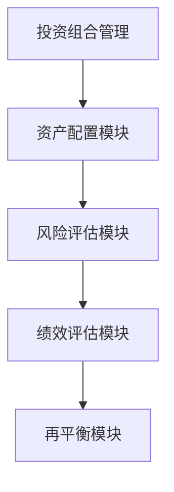

                 


# 另类投资在投资组合中的作用

> 关键词：另类投资，投资组合，资产配置，风险管理，数学模型

> 摘要：本文详细探讨了另类投资在投资组合中的作用，包括其定义、类型、策略、数学模型及实际应用。通过分析私募股权、对冲基金等另类资产，结合数学模型如均值-方差优化和风险平价策略，阐述了如何优化投资组合的风险与收益。文章还通过实际案例展示了系统架构设计和投资策略实现，为读者提供了实用的指导和建议。

---

## 第一部分: 另类投资的背景与基本概念

### 第1章: 另类投资的定义与特点

#### 1.1 另类投资的定义与背景
##### 1.1.1 投资组合的传统资产类别
传统投资组合主要由股票、债券、现金等资产组成。这些资产类别在历史上一直是投资者的主要选择，但随着市场的变化和投资者需求的多样化，传统资产的局限性逐渐显现，例如收益波动较大、风险集中等问题。

##### 1.1.2 另类投资的定义与特征
另类投资是指那些不属于传统资产类别的投资形式，主要包括私募股权、对冲基金、房地产信托、大宗商品等。这些资产类别具有多样性、复杂性和高风险高回报的特点。

##### 1.1.3 另类投资的兴起与发展趋势
近年来，另类投资因其多样化和高收益的潜力，逐渐成为投资者的重要选择。尤其是在经济波动加剧的背景下，另类投资能够有效分散风险，提升投资组合的整体收益。

#### 1.2 另类投资的核心概念与属性
##### 1.2.1 另类投资的分类与对比
- **私募股权**：投资于未上市公司的股权，具有高增长潜力，但流动性较低。
- **对冲基金**：采用多种策略追求绝对收益，如套利、空头交易等。
- **房地产信托**：通过投资房地产市场获取租金收入和资本增值。
- **大宗商品**：包括黄金、原油等，具有对冲通胀的作用。

##### 1.2.2 另类投资的主要特征
- **高风险高回报**：另类投资通常具有较高的波动性和潜在收益。
- **多样化**：通过投资不同类型的另类资产，可以有效分散风险。
- **复杂性**：另类投资涉及复杂的交易结构和策略，对投资者的专业知识要求较高。

##### 1.2.3 另类投资与传统资产的区别
| 特性         | 传统资产                | 另类资产                |
|--------------|-------------------------|-------------------------|
| 收益类型     | 相对收益                | 绝对收益                |
| 流动性       | 较高                    | 较低                    |
| 风险类型     | 市场风险                | 多样化风险              |
| 投资门槛     | 较低                    | 较高                    |

#### 1.3 另类投资在投资组合中的作用
##### 1.3.1 另类投资的多样化作用
通过引入另类资产，投资组合的多样性得以增强，从而降低整体风险。

##### 1.3.2 另类投资的风险分散机制
另类资产通常与传统资产的相关性较低，能够有效分散投资组合的系统性风险。

##### 1.3.3 另类投资的收益增强潜力
在市场波动较大的情况下，另类投资能够提供更高的收益，提升投资组合的整体表现。

---

### 第2章: 另类投资的类型与策略

#### 2.1 另类投资的主要类型
##### 2.1.1 私募股权与风险投资
私募股权主要投资于未上市公司，通过长期持有和增值实现收益。风险投资则侧重于高增长潜力的初创企业。

##### 2.1.2 对冲基金与绝对收益策略
对冲基金采用多种策略，如市场中性策略、套利策略等，追求绝对收益，无论市场行情如何。

##### 2.1.3 房地产信托与基础设施投资
房地产信托通过投资房地产项目获取租金收入和资本增值，而基础设施投资则涉及能源、交通等长期稳定的收益项目。

##### 2.1.4 大宗商品与另类资产配置
大宗商品包括黄金、原油等，具有对冲通胀和分散风险的作用。

#### 2.2 另类投资的策略选择
##### 2.2.1 资产配置策略
通过合理配置不同类型的另类资产，优化投资组合的风险和收益。

##### 2.2.2 风险对冲策略
利用衍生工具和对冲策略，降低市场波动带来的风险。

##### 2.2.3 市场中性策略
通过多空头寸平衡市场风险，追求超额收益。

##### 2.2.4 绝对收益目标策略
设定具体收益目标，通过多种策略实现绝对收益。

---

### 第3章: 另类投资的数学模型与算法原理

#### 3.1 投资组合优化的数学模型
##### 3.1.1 均值-方差优化模型
目标函数：最小化投资组合的方差（风险）。
$$ \text{目标函数：} \min \sigma^2 $$
约束条件：投资权重之和为1，且权重非负。
$$ \text{约束条件：} \sum w_i = 1, w_i \geq 0 $$

##### 3.1.2 风险平价模型
目标函数：最小化投资组合的方差，同时考虑各资产的风险贡献。
$$ \text{目标函数：} \min \sum w_i^2 \sigma_i^2 $$
约束条件：投资权重之和为1，且权重非负。
$$ \text{约束条件：} \sum w_i = 1, w_i \geq 0 $$

#### 3.2 另类资产的风险调整收益分析
##### 3.2.1 Sharpe比率计算
衡量投资组合的风险调整后收益。
$$ \text{Sharpe比率} = \frac{E[r - r_f]}{\sigma} $$

##### 3.2.2 Sortino比率计算
专注于下行风险的衡量。
$$ \text{Sortino比率} = \frac{E[r - r_f]}{\sqrt{\text{VaR}}^2} $$

---

### 第4章: 投资组合系统架构与实现

#### 4.1 投资组合管理系统架构
使用Mermaid绘制系统架构图，展示各模块的交互和功能。


#### 4.2 系统功能设计
##### 4.2.1 领域模型设计
使用Mermaid类图展示系统的实体关系。


#### 4.3 投资策略实现
##### 4.3.1 私募股权投资策略
通过筛选高增长潜力的企业，进行长期股权投资。

##### 4.3.2 对冲基金策略
采用市场中性策略，利用多空头寸平衡市场风险。

#### 4.4 投资组合再平衡
定期调整投资组合的权重，以维持预设的风险收益目标。

---

### 第5章: 项目实战与案例分析

#### 5.1 环境安装与数据准备
安装必要的金融分析工具和数据接口。

#### 5.2 核心代码实现
##### 5.2.1 私募股权投资模型
```python
import pandas as pd
import numpy as np

# 假设我们有一个私募股权的投资组合，包含多个项目
def calculate私募股权收益(projects):
    returns = []
    for project in projects:
        returns.append(project['收益'])
    return np.mean(returns), np.std(returns)

projects = [
    {'收益': 0.15, '风险': 0.1},
    {'收益': 0.20, '风险': 0.15},
    {'收益': 0.18, '风险': 0.12}
]
mean_return, std_dev = calculate私募股权收益(projects)
print(f"平均收益: {mean_return}, 标准差: {std_dev}")
```

##### 5.2.2 对冲基金策略实现
```python
import pyfolio as pf

# 假设我们有一个对冲基金的投资组合，采用市场中性策略
def market_neutral_strategy(returns):
    # 使用均值-方差优化模型
    optimizer = pf.PortfolioOptimization()
    optimizer.set_objective('min_variance')
    optimizer.add_constraint('sum_exweights == 1')
    optimized_weights = optimizer.optimize(returns)
    return optimized_weights

returns_data = pd.DataFrame({'资产1': [0.05, 0.06, 0.04], '资产2': [0.07, 0.05, 0.06]})
weights = market_neutral_strategy(returns_data)
print("优化后的权重:", weights)
```

#### 5.3 投资组合绩效评估
通过回测和风险调整，评估投资组合的实际表现。

#### 5.4 案例分析
通过实际案例分析，展示如何利用另类投资优化投资组合的风险和收益。

---

### 第6章: 最佳实践与小结

#### 6.1 最佳实践
##### 6.1.1 分散投资
避免过度集中于某一类型或单一资产。

##### 6.1.2 定期监控与调整
根据市场变化和个人风险承受能力，定期调整投资组合。

##### 6.1.3 专业管理
考虑聘请专业投资顾问，制定科学的投资策略。

#### 6.2 小结
另类投资在投资组合中扮演着重要角色，通过多样化和风险分散，能够有效提升整体收益并降低风险。投资者应根据自身需求和市场环境，合理配置另类资产，实现长期稳健的投资回报。

---

### 第7章: 附录

#### 7.1 术语表
列出文章中使用的主要术语及其定义。

#### 7.2 数据来源与参考文献
提供数据来源和参考文献，增强文章的可信度。

---

通过以上详细分析和实际案例，本文全面探讨了另类投资在投资组合中的作用，为投资者提供了科学的理论支持和实践指导。

