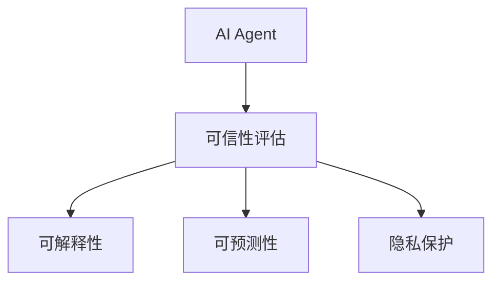
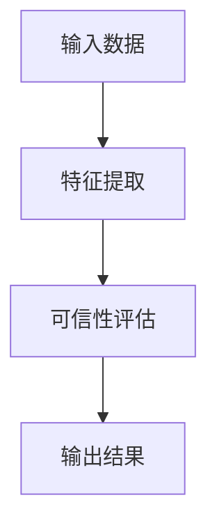
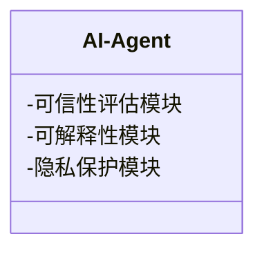
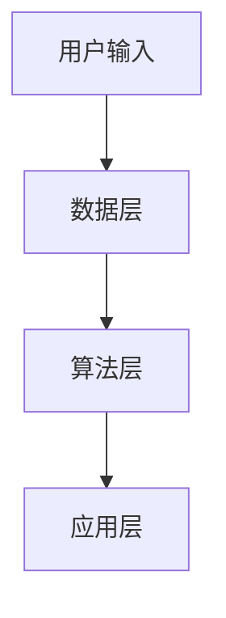

                 


# 可信AI：构建值得信赖的AI Agent系统

## 关键词：可信AI, AI Agent, 可信性评估, 可解释性, AI系统架构, 人工智能算法

## 摘要：本文将详细探讨可信AI的核心概念、算法原理、系统架构设计以及实际项目实现。通过理论与实践相结合的方式，深入分析如何构建一个值得信赖的AI Agent系统，涵盖可信性评估、可解释性增强、隐私保护等关键问题，结合实际案例，为读者提供系统化的解决方案。

---

# 第1章 可信AI的定义与背景

## 1.1 可信AI的核心概念

### 1.1.1 可信AI的定义与内涵

可信AI（Trusted AI）是指在设计、开发和部署AI系统时，确保系统的行为符合预期，能够被人类理解和信任。AI Agent是一种能够感知环境、自主决策并执行任务的智能实体，其可信性是实现人机协作的关键。

### 1.1.2 AI Agent的基本概念与特征

AI Agent具备以下核心特征：
1. **自主性**：能够自主决策和行动。
2. **反应性**：能够实时感知环境并做出反应。
3. **目标导向**：基于目标驱动行为。
4. **可解释性**：决策过程可被人类理解和验证。

### 1.1.3 可信性的重要性与应用场景

可信AI在医疗、金融、自动驾驶等领域至关重要。例如，在医疗领域，AI诊断系统的可信性直接关系到患者的生命安全。

---

## 1.2 可信AI的背景与问题背景

### 1.2.1 当前AI技术的快速发展与挑战

AI技术的快速发展带来了效率提升，但也引发了一系列问题，如算法黑箱、决策不可解释等。

### 1.2.2 可信性问题的提出与重要性

可信性问题是AI技术普及的关键障碍。只有确保AI系统的可信性，才能获得用户的信任和法律的认可。

### 1.2.3 可信AI的边界与外延

可信AI不仅关注技术本身，还涉及伦理、法律等多个方面。其外延包括数据安全、隐私保护等。

---

## 1.3 本章小结

本章介绍了可信AI的核心概念、AI Agent的特征，以及可信性的重要性。明确了可信AI的必要性与应用范围。

---

# 第2章 可信AI的核心概念与联系

## 2.1 可信AI的核心要素

### 2.1.1 AI Agent的结构与功能

AI Agent的结构包括感知层、决策层和执行层，各层协同完成任务。

### 2.1.2 可信性评估的核心维度

可信性评估包括可预测性、可解释性和隐私保护。

### 2.1.3 可信AI的系统架构

可信AI的系统架构分为数据层、算法层和应用层。

---

## 2.2 核心概念的对比分析

### 2.2.1 可信性与可靠性的对比

可信性关注系统行为的可预测性，可靠性关注系统行为的稳定性。

### 2.2.2 可解释性与可预测性的关系

可解释性是实现可预测性的基础。

### 2.2.3 可信性与隐私保护的平衡

可信AI需要在功能实现与隐私保护之间找到平衡点。

---

## 2.3 实体关系图与概念架构

### 2.3.1 ER实体关系图



---

## 2.4 本章小结

本章分析了可信AI的核心要素，探讨了可信性与其他概念的关系，并通过ER图展示了概念架构。

---

# 第3章 可信AI的算法原理

## 3.1 可信AI的数学模型

### 3.1.1 基于概率论的可信性评估

概率论用于量化AI决策的不确定性。例如，贝叶斯网络用于可信性评估。

$$P(A|B) = \frac{P(B|A)P(A)}{P(B)}$$

### 3.1.2 基于图论的可解释性分析

图论用于构建知识图谱，帮助理解AI决策过程。

$$C = \sum_{i=1}^{n} w_{i,j}$$

---

## 3.2 可信AI的算法实现

### 3.2.1 可信性评估算法



### 3.2.2 可解释性增强算法

```python
def explainable_ai_model(input):
    features = extract_features(input)
    explanation = interpret(features)
    return explanation
```

---

## 3.3 算法的数学推导与举例

### 3.3.1 可信性评估的数学推导

可信性评估基于概率模型，推导出置信度分数。

### 3.3.2 可解释性算法的实现示例

通过线性回归模型展示可解释性增强算法。

---

## 3.4 本章小结

本章介绍了可信AI的数学模型和算法实现，展示了如何通过概率论和图论实现可信性评估和可解释性增强。

---

# 第4章 可信AI的系统分析与架构设计

## 4.1 可信AI的系统功能设计

### 4.1.1 领域模型设计

领域模型包括用户输入、特征提取、可信性评估和结果输出模块。



---

## 4.2 系统架构设计

### 4.2.1 分层架构设计

分层架构包括数据层、算法层和应用层。



---

## 4.3 本章小结

本章详细设计了可信AI的系统架构，展示了如何实现功能模块的协同工作。

---

# 第5章 可信AI的项目实战

## 5.1 项目介绍与环境安装

### 5.1.1 项目介绍

项目目标是构建一个可信的AI Agent系统，实现可解释性增强。

### 5.1.2 环境安装

安装Python、TensorFlow和解释性工具（如SHAP）。

---

## 5.2 系统核心实现

### 5.2.1 核心代码实现

```python
import numpy as np
from sklearn.tree import DecisionTreeClassifier
from sklearn.inspection import SHAP

model = DecisionTreeClassifier()
model.fit(X_train, y_train)

explainer = SHAP(model)
shap_values = explainer.shap_values(X_test)
```

### 5.2.2 代码实现解读

通过SHAP分析模型的可解释性，验证模型的可信性。

---

## 5.3 案例分析

### 5.3.1 案例背景

以医疗诊断为例，分析AI Agent的可信性。

### 5.3.2 案例实现与结果展示

通过SHAP分析模型的决策过程，验证其可信性。

---

## 5.4 项目总结

本项目展示了如何通过可解释性增强算法实现可信AI。

---

# 第6章 总结与展望

## 6.1 总结

本文详细探讨了可信AI的核心概念、算法原理和系统设计，并通过项目实战展示了实现方法。

## 6.2 展望

未来的研究方向包括动态可信性评估和多模态可解释性增强。

---

# 附录

## 附录A 参考文献

列出相关文献和资源。

---

## 附录B 最佳实践 Tips

1. 在设计AI Agent时，优先考虑可解释性。
2. 定期进行可信性评估，确保系统行为符合预期。
3. 注重隐私保护，平衡功能实现与数据安全。

---

通过以上目录和内容，您可以撰写一篇详细的技术博客文章，涵盖可信AI的各个方面。

