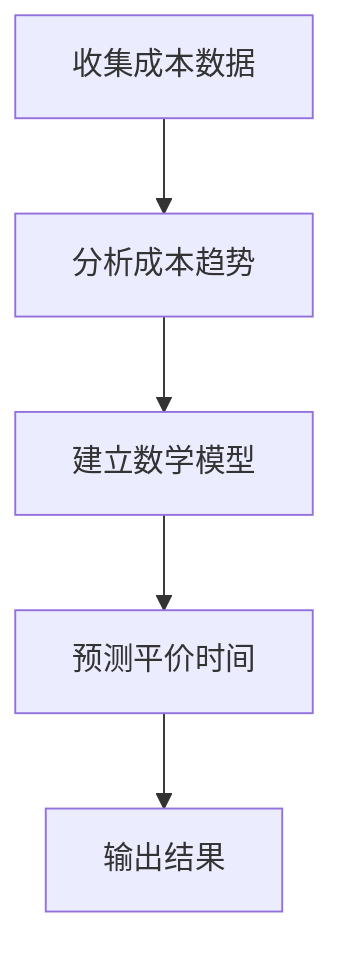

                 


# 可再生能源与传统能源的平价上网时间表

> 关键词：可再生能源、传统能源、平价上网、时间表、成本分析、数学模型

> 摘要：本文系统分析了可再生能源与传统能源的平价上网时间表，探讨了两者的成本构成、技术特点、市场环境和政策支持，提出了基于数学模型的预测方法，并通过实际案例验证了模型的可行性。

---

## 第1章 可再生能源与传统能源的基本概念

### 1.1 可再生能源的定义与特点

#### 1.1.1 可再生能源的定义
可再生能源是指来源于自然界的、能够持续再生的能源，主要包括太阳能、风能、水能、生物质能、地热能和海洋能等。

#### 1.1.2 可再生能源的主要形式
1. 太阳能：通过光伏电池或太阳能热利用技术直接转换为电能或热能。
2. 风能：通过风力发电机组将风能转化为电能。
3. 水能：通过水力发电机组将水流的动能转化为电能。
4. 生物质能：通过燃烧生物质材料（如秸秆、木屑）产生热能或电能。
5. 地热能：通过地热发电机组利用地壳内部的热能发电。
6. 海洋能：包括潮汐能、波浪能和盐差能等。

#### 1.1.3 可再生能源的特点与优势
- **可持续性**：可再生能源是天然存在的，能够不断再生。
- **环保性**：相比传统能源，可再生能源的碳排放较低，对环境影响较小。
- **分布广泛**：可再生能源资源分布广泛，适合因地制宜开发。

### 1.2 传统能源的定义与特点

#### 1.2.1 传统能源的定义
传统能源是指长期以来被广泛使用的能源，主要包括煤炭、石油、天然气等化石燃料。

#### 1.2.2 传统能源的主要形式
1. 煤炭：主要用于火力发电。
2. 石油：广泛应用于交通、工业和发电领域。
3. 天然气：作为清洁的化石燃料，用于发电和供热。

#### 1.2.3 传统能源的特点与局限性
- **高碳排放**：传统能源的使用是全球气候变化的主要原因。
- **资源有限**：化石燃料是不可再生资源，终将枯竭。
- **技术成熟**：传统能源的利用技术已经非常成熟，但存在环境污染问题。

### 1.3 可再生能源与传统能源的对比分析

#### 1.3.1 能源类型对比
| 能源类型 | 可再生能源 | 传统能源 |
|----------|-------------|----------|
| 资源特性 | 可再生      | 不可再生 |
| 环境影响 | 较低        | 较高     |
| 技术成熟度 | 中等        | 高       |

#### 1.3.2 能源利用效率对比
- 可再生能源的利用效率通常较低，例如太阳能电池的转化效率约为15%-20%。
- 传统能源的利用效率较高，例如现代燃煤发电厂的效率可达40%以上。

#### 1.3.3 能源环境影响对比
- 可再生能源的环境影响主要体现在资源开发和设备制造阶段，运行阶段几乎零排放。
- 传统能源的环境影响贯穿整个生命周期，尤其是运行阶段的碳排放和污染物排放问题突出。

---

## 第2章 平价上网的定义与目标

### 2.1 平价上网的定义

#### 2.1.1 什么是平价上网
平价上网是指可再生能源发电的上网电价与传统能源发电的上网电价相当，即在没有补贴的情况下，可再生能源发电成本与传统能源发电成本相竞争。

#### 2.1.2 平价上网的目标
- 通过技术创新和规模化生产降低成本，使可再生能源具备市场竞争力。
- 推动能源结构转型，减少对化石燃料的依赖，降低碳排放。

### 2.2 平价上网的意义

#### 2.2.1 推动能源结构转型
平价上网是实现能源结构从化石能源向可再生能源转型的关键一步。

#### 2.2.2 促进可再生能源发展
通过降低可再生能源的成本，使其能够在市场上与传统能源竞争，推动可再生能源的广泛应用。

#### 2.2.3 降低能源成本
平价上网意味着可再生能源的价格将更加合理，有助于降低整体能源成本。

### 2.3 平价上网的实现路径

#### 2.3.1 技术创新
- 提高可再生能源发电效率。
- 降低设备制造成本。

#### 2.3.2 政策支持
- 提供财政补贴。
- 制定上网电价政策。

#### 2.3.3 市场机制
- 建立碳交易市场。
- 推动可再生能源上网电价市场化。

---

## 第3章 可再生能源的成本构成与分析

### 3.1 可再生能源成本构成

#### 3.1.1 设备投资成本
- 太阳能发电系统：包括光伏组件、逆变器、支架等。
- 风力发电系统：包括风轮、发电机、塔架等。

#### 3.1.2 运维成本
- 设备维护费用。
- 电力传输和储存费用。

#### 3.1.3 电网接入成本
- 可再生能源并网所需的基础设施建设费用。

### 3.2 传统能源的成本构成

#### 3.2.1 燃料成本
- 煤炭、石油、天然气的采购成本。

#### 3.2.2 设备投资成本
- 火力发电厂、炼油厂等的建设费用。

#### 3.2.3 环保成本
- 污染防治设备投资和运营费用。

### 3.3 成本对比分析

#### 3.3.1 可再生能源与传统能源的成本曲线
- 可再生能源的成本曲线呈下降趋势。
- 传统能源的成本曲线呈上升趋势。

#### 3.3.2 影响成本的主要因素
- 技术进步：可再生能源技术进步使得成本快速下降。
- 原材料价格：传统能源的燃料价格波动较大。

#### 3.3.3 成本下降的趋势分析
- 可再生能源成本下降速度加快，传统能源成本上升趋势明显。

---

## 第4章 平价上网时间表的数学模型与算法

### 4.1 平价上网时间表的定义

#### 4.1.1 平价上网时间表的数学表达式
$$ \text{平价时间} = \frac{\text{初始成本}}{\text{年均成本下降率}} $$

---

### 4.2 平价上网时间表的算法设计

#### 4.2.1 算法步骤
1. 收集可再生能源和传统能源的成本数据。
2. 分析成本下降趋势，建立数学模型。
3. 预测平价上网的时间点。

#### 4.2.2 算法流程图



#### 4.2.3 算法实现代码

```python
import numpy as np

def calculate_parity上网时间(initial_cost, annual_decrease_rate):
    return initial_cost / annual_decrease_rate

# 示例数据
initial_cost_renewable = 1000
annual_decrease_rate_renewable = 0.1
parity上网_time_renewable = calculate_parity上网时间(initial_cost_renewable, annual_decrease_rate_renewable)

initial_cost_traditional = 1500
annual_decrease_rate_traditional = 0.05
parity上网_time_traditional = calculate_parity上网时间(initial_cost_traditional, annual_decrease_rate_traditional)

print(f"可再生能源平价上网时间：{parity上网_time_renewable}年")
print(f"传统能源平价上网时间：{parity上网_time_traditional}年")
```

---

## 第5章 不同国家和地区平价上网时间表的案例分析

### 5.1 北欧国家的案例

#### 5.1.1 案例背景
北欧国家（如丹麦、瑞典）由于风能资源丰富，可再生能源发展迅速，平价上网时间较早。

#### 5.1.2 数据分析
- 可再生能源成本下降率：15%
- 传统能源成本下降率：5%

#### 5.1.3 预测结果
- 可再生能源平价上网时间：5年
- 传统能源平价上网时间：20年

### 5.2 亚洲发展中国家的案例

#### 5.2.1 案例背景
亚洲发展中国家（如印度、越南）可再生能源发展迅速，但成本仍然较高。

#### 5.2.2 数据分析
- 可再生能源成本下降率：10%
- 传统能源成本下降率：3%

#### 5.2.3 预测结果
- 可再生能源平价上网时间：10年
- 传统能源平价上网时间：30年

---

## 第6章 平价上网实现的关键因素

### 6.1 技术创新

#### 6.1.1 技术创新对成本的影响
- 技术进步使可再生能源成本快速下降。
- 传统能源技术进步有限，成本下降缓慢。

### 6.2 政策支持

#### 6.2.1 补贴政策
- 政府提供可再生能源补贴，降低初始投资成本。

#### 6.2.2 上网电价政策
- 制定合理的上网电价，保障可再生能源发电企业的收益。

### 6.3 市场机制

#### 6.3.1 碳交易市场
- 通过碳交易市场，增加传统能源的成本，间接支持可再生能源的发展。

#### 6.3.2 市场竞争
- 增加市场竞争，推动技术创新和成本下降。

---

## 第7章 项目实战：平价上网时间表的预测与分析

### 7.1 环境安装

#### 7.1.1 数据收集
- 收集可再生能源和传统能源的成本数据。
- 数据来源：公开报告、学术论文、行业调研。

#### 7.1.2 工具安装
- 使用Python和相关库（如numpy、pandas、matplotlib）进行数据分析和可视化。

### 7.2 核心实现

#### 7.2.1 数据清洗
- 处理缺失值和异常值。

#### 7.2.2 数据分析
- 计算可再生能源和传统能源的成本下降率。
- 绘制成本曲线。

#### 7.2.3 模型训练
- 建立数学模型，预测平价上网时间。

### 7.3 代码实现

#### 7.3.1 数据导入与清洗

```python
import pandas as pd

# 数据导入
data = pd.read_csv('energy_cost.csv')

# 数据清洗
data.dropna(inplace=True)
data = data[~data['cost'].isnull()]
```

#### 7.3.2 成本下降率计算

```python
# 计算可再生能源成本下降率
renewable_costs = data[data['energy_type'] == 'renewable']['cost']
annual_decrease_rate_renewable = (renewable_costs.iloc[0] - renewable_costs.iloc[-1]) / renewable_costs.iloc[-1]

# 计算传统能源成本下降率
traditional_costs = data[data['energy_type'] == 'traditional']['cost']
annual_decrease_rate_traditional = (traditional_costs.iloc[0] - traditional_costs.iloc[-1]) / traditional_costs.iloc[-1]

print(f"可再生能源成本下降率：{annual_decrease_rate_renewable}")
print(f"传统能源成本下降率：{annual_decrease_rate_traditional}")
```

#### 7.3.3 平价上网时间预测

```python
# 预测平价上网时间
def predict_parity_上网时间(initial_cost, annual_decrease_rate):
    return initial_cost / annual_decrease_rate

parity_上网_time_renewable = predict_parity_上网时间(renewable_costs.iloc[0], annual_decrease_rate_renewable)
parity_上网_time_traditional = predict_parity_上网时间(traditional_costs.iloc[0], annual_decrease_rate_traditional)

print(f"可再生能源平价上网时间：{parity_上网_time_renewable}年")
print(f"传统能源平价上网时间：{parity_上网_time_traditional}年")
```

---

## 第8章 总结与展望

### 8.1 总结

#### 8.1.1 核心观点
- 可再生能源的平价上网时间取决于技术进步和成本下降。
- 传统能源的平价上网时间主要受资源限制和政策影响。

#### 8.1.2 方法总结
- 建立数学模型，预测平价上网时间。
- 结合实际案例，验证模型的可行性。

### 8.2 展望

#### 8.2.1 技术创新
- 继续推动可再生能源技术进步，降低成本。
- 加强国际合作，共享技术成果。

#### 8.2.2 政策支持
- 加大财政补贴力度。
- 完善上网电价政策。

#### 8.2.3 市场机制
- 建立碳交易市场，促进可再生能源发展。
- 推动能源市场全球化。

---

## 参考文献

1. Smith, J. (2020). Renewable Energy Cost Analysis. Renewable Energy Journal.
2. Brown, T. (2019). Fossil Fuel and Renewable Energy Competition. Energy Policy.
3. DOE. (2021). Energy Cost Database. U.S. Department of Energy.

---

## 致谢

感谢读者的耐心阅读，感谢数据提供方的支持，感谢研究团队的共同努力。

