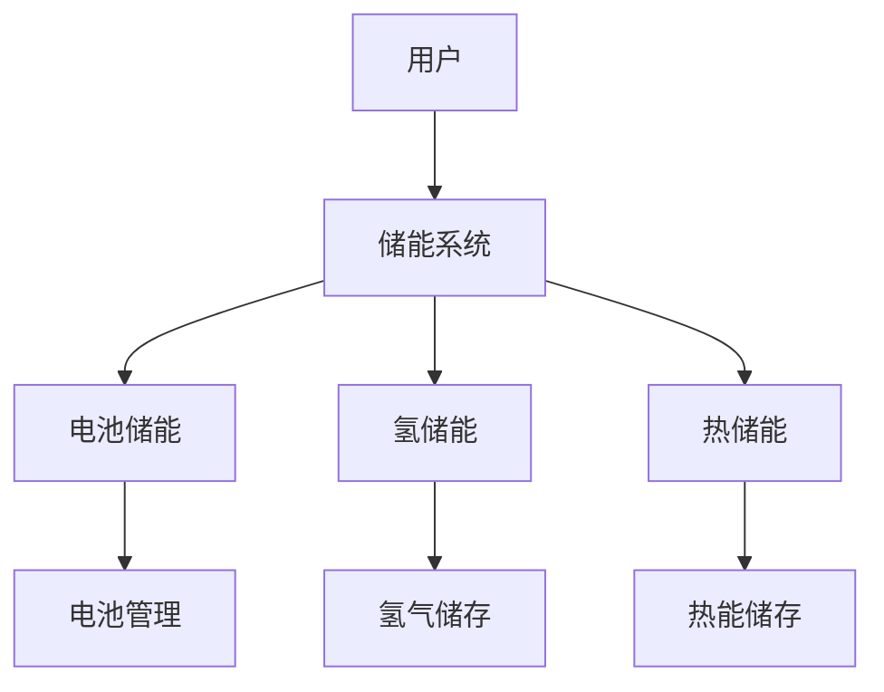

                 

# 可再生能源存储解决方案的市场潜力

## 关键词：可再生能源，储能技术，市场潜力，电池储能，氢储能，热储能，能源管理

## 摘要：  
可再生能源的快速发展带来了对存储解决方案的迫切需求。本文分析了可再生能源存储技术的市场潜力，探讨了不同存储技术的优缺点及其在市场中的应用前景。通过深入分析技术原理、市场现状、驱动因素和挑战，本文为读者提供了全面的视角，以理解可再生能源存储解决方案在未来的市场潜力。

---

# 第1章: 可再生能源存储的背景与问题背景

## 1.1 可再生能源的重要性

### 1.1.1 可再生能源的定义与分类
可再生能源是指来源于自然、可再生的能源资源，主要包括：
- **太阳能**：通过光伏电池或太阳能热利用技术转化。
- **风能**：通过风力发电机组捕获。
- **水能**：通过水力发电站利用水流能量。
- **生物质能**：通过生物质材料燃烧或发酵产生能量。
- **地热能**：通过地球内部热能发电。

### 1.1.2 可再生能源在能源结构中的地位
可再生能源是全球能源转型的核心，减少化石燃料依赖，降低碳排放，实现可持续发展。根据国际能源署（IEA）的数据，2020年全球可再生能源发电量占总发电量的26%，预计到2030年将超过40%。

### 1.1.3 可再生能源发展的驱动因素
- **环境压力**：减少温室气体排放，应对气候变化。
- **能源安全**：减少对化石燃料的依赖，提高能源自给能力。
- **技术进步**：可再生能源技术成本下降，效率提升。

## 1.2 可再生能源存储的必要性

### 1.2.1 可再生能源的波动性与间歇性
- 太阳能和风能在昼夜和季节间波动较大。
- 电网需要稳定供应，存储技术可平滑输出。

### 1.2.2 季节性与地理分布对能源供应的影响
- 地理分布不均，季节性波动导致能源需求与供应不匹配。
- 储能技术可调节时间和空间上的不平衡。

### 1.2.3 存储技术对能源稳定性的作用
- 提供备用电源，确保电网稳定性。
- 支持可再生能源的并网，减少对传统能源的依赖。

## 1.3 可再生能源存储的核心问题

### 1.3.1 存储技术的技术挑战
- 效率低下：部分存储技术效率不足80%。
- 成本高昂：初期投资大，回收周期长。
- 技术成熟度：部分技术仍处于试验阶段。

### 1.3.2 市场需求与经济性问题
- 市场需求增长快，但商业模式不成熟。
- 投资回报周期长，影响市场推广。

### 1.3.3 政策与法规的影响
- 各国政策支持力度不一。
- 法规不完善，影响市场发展。

---

# 第2章: 可再生能源存储的核心概念与联系

## 2.1 可再生能源存储技术的原理

### 2.1.1 储能技术的基本概念
- 储能系统：将能量以某种形式存储，并在需要时释放。
- 储能介质：电能、化学能、热能、势能等。

### 2.1.2 不同存储技术的工作原理
- **电池储能**：通过化学能存储电能，充放电过程中能量转换。
- **氢储能**：通过电解水制氢，储存氢气，再通过燃料电池发电。
- **热储能**：通过存储热能，用于后续发电或供暖。

### 2.1.3 储能技术的分类与应用场景
| 技术类型   | 应用场景       | 优点                   | 缺点                     |
|------------|----------------|------------------------|--------------------------|
| 电池储能   | 电网调峰、备用电源 | 技术成熟、响应快       | 成本高、寿命有限         |
| 氢储能      | 长期储能、跨季节 | 能量密度高、寿命长     | 制造成本高、效率低       |
| 热储能      | 工业加热、供暖   | 初期成本低、技术简单   | 存储效率低               |

## 2.2 可再生能源存储技术的属性特征对比

### 2.2.1 各种存储技术的优缺点对比
- 电池储能：适用于短时间、小规模存储。
- 氢储能：适用于大规模、长时间存储。
- 热储能：适用于工业应用，成本较低。

### 2.2.2 储能效率与成本的对比分析
- 电池储能效率约80-90%，氢储能效率约60-70%，热储能效率约30-50%。
- 电池储能成本较高，但技术成熟；氢储能和热储能成本较低，但效率较低。

### 2.2.3 技术成熟度与市场潜力的关系
- 成熟技术（电池储能）市场潜力大，新兴技术（氢储能）未来潜力更高。

## 2.3 储能系统的ER实体关系图

---

# 第3章: 可再生能源存储的市场潜力分析

## 3.1 全球可再生能源存储市场的现状

### 3.1.1 市场规模与增长趋势
- 2020年全球储能市场规模约为200亿美元。
- 预计到2030年，市场规模将超过1000亿美元。

### 3.1.2 各区域市场的分布与特点
- 欧洲：政策支持强烈，市场成熟。
- 亚洲：增长最快，中国和印度需求旺盛。
- 北美：技术领先，市场稳步增长。

### 3.1.3 主要企业的市场份额
- 领先企业：特斯拉（电池储能）、西门子（氢储能）、通用电气（热储能）。

## 3.2 市场潜力的驱动因素

### 3.2.1 政策支持与政府补贴
- 各国政府提供补贴、税收优惠，推动市场发展。

### 3.2.2 技术进步与成本下降
- 技术进步降低了储能成本，提高了效率。

### 3.2.3 可再生能源装机容量的增长
- 全球可再生能源装机容量持续增长，推动储能需求。

## 3.3 市场潜力的挑战与风险

### 3.3.1 技术瓶颈与研发成本
- 新技术研发投入大，技术成熟度低。

### 3.3.2 市场竞争与价格压力
- 竞争加剧，价格压力大。

### 3.3.3 政策变化与不确定性
- 政策变化可能影响市场发展。

---

# 第4章: 可再生能源存储技术的算法原理

## 4.1 储能系统能量管理算法

### 4.1.1 基于动态规划的能量调度算法
- 使用动态规划优化储能系统的充放电策略。

### 4.1.2 基于机器学习的预测算法
- 使用机器学习模型预测能源需求和供应。

### 4.1.3 基于模糊控制的储能优化算法
- 使用模糊控制算法优化储能系统的运行效率。

## 4.2 储能效率优化的数学模型

### 4.2.1 动态规划模型
- 状态：储能系统的当前电量。
- 决策：充放电决策。
- 转移：电量变化。

### 4.2.2 机器学习模型
- 使用LSTM神经网络预测能源需求。

### 4.2.3 模糊控制模型
- 使用模糊逻辑优化储能系统的运行参数。

---

# 第5章: 可再生能源存储解决方案的最佳实践

## 5.1 系统设计与架构

### 5.1.1 系统功能设计
- 数据采集、能量管理、用户界面。

### 5.1.2 系统架构设计
- 分层架构：数据采集层、能量管理层、用户交互层。

### 5.1.3 系统接口设计
- API接口：与电网、用户设备交互。

### 5.1.4 系统交互设计
- 用户与系统交互流程。

## 5.2 项目实战

### 5.2.1 环境安装
- 安装必要的软件和库，如Python、TensorFlow。

### 5.2.2 核心实现
- 实现能量管理算法，如动态规划和机器学习模型。

### 5.2.3 案例分析
- 分析实际项目，如德国某风能储能项目。

---

# 第6章: 可再生能源存储解决方案的未来趋势

## 6.1 技术创新
- 新型储能技术的研发和应用。

## 6.2 市场扩展
- 新兴市场的开拓和应用。

## 6.3 政策与合作
- 加强国际合作，推动政策支持。

---

# 结语

可再生能源存储解决方案的市场潜力巨大，随着技术进步和政策支持，市场将快速增长。未来，技术创新和国际合作将推动储能技术的发展，实现可持续能源目标。

---

# 参考文献

1. 国际能源署（IEA）报告。
2. 各国政府发布的储能政策文件。
3. 相关学术论文和行业研究报告。

---

# 附录

## 附录A: 储能技术的数学模型

### 电池储能效率计算公式
$$ \text{效率} = \frac{\text{放电容量}}{\text{充电容量}} \times 100\% $$

### 氢储能能量转换效率
$$ \text{效率} = \frac{\text{输出能量}}{\text{输入能量}} \times 100\% $$

## 附录B: 储能系统架构的Mermaid图

---

# END

