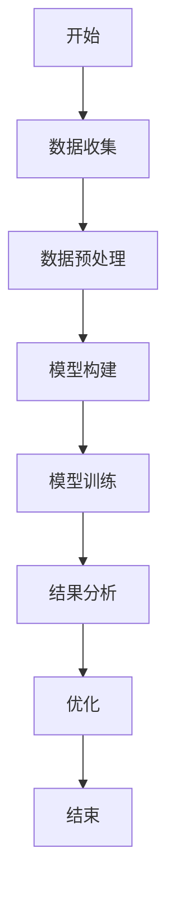

                 


```markdown
# 可再生能源社区项目的投资模式研究

> 关键词：可再生能源、社区项目、投资模式、净现值、内部收益率

> 摘要：本文系统研究了可再生能源社区项目的投资模式，从背景、概念、算法原理、系统架构到实战案例，全面分析了投资模式的评估方法与实现路径。通过数学模型与公式推导，结合Python代码实现，为可再生能源社区项目的投资决策提供了理论支持与实践指导。

---

## 第1章 可再生能源社区项目的背景介绍

### 1.1 可再生能源的背景与发展趋势

#### 1.1.1 可再生能源的定义与分类
可再生能源是指自然界中天然存在、可再生的能源资源，主要包括：
- **太阳能**：通过光伏效应或热能转换获取能量。
- **风能**：利用风力发电。
- **水能**：包括潮汐能、波浪能和水力能。
- **生物质能**：利用植物、动物和微生物的有机物质进行转化。
- **地热能**：利用地球内部的热能。

#### 1.1.2 全球能源结构转型的背景
随着全球能源需求的增长和化石能源的枯竭，能源结构转型已成为全球共识。可再生能源因其环保、可持续的特点，成为能源转型的核心驱动力。

#### 1.1.3 可再生能源技术的进步与挑战
近年来，可再生能源技术取得了显著进步，但成本高、不稳定性和储存问题仍制约其大规模应用。

### 1.2 社区项目的特点与意义

#### 1.2.1 社区项目的基本定义
社区项目是指在社区范围内实施的能源项目，旨在通过分布式能源系统满足社区能源需求。

#### 1.2.2 社区项目在能源转型中的作用
社区项目通过分布式能源系统，减少能源浪费，降低碳排放，促进能源的高效利用。

#### 1.2.3 可再生能源社区项目的独特性
可再生能源社区项目结合了可再生能源技术和社区管理，具有灵活性、低成本和高效率的特点。

### 1.3 投资模式研究的重要性

#### 1.3.1 投资模式在可再生能源项目中的地位
投资模式是可再生能源项目成功实施的关键因素，决定了项目的可行性和收益性。

#### 1.3.2 研究可再生能源社区项目投资模式的意义
通过研究投资模式，可以为投资者提供科学决策依据，优化资源配置，降低投资风险。

#### 1.3.3 本章小结
本章从背景、特点和意义三个方面介绍了可再生能源社区项目的投资模式研究的重要性。

---

## 第2章 可再生能源社区项目的核心概念与联系

### 2.1 核心概念的定义与属性

#### 2.1.1 可再生能源项目的定义
可再生能源项目是指利用可再生能源技术进行能源生产的项目，包括发电、供热和供能等多种形式。

#### 2.1.2 社区项目的属性特征
社区项目具有地域性、参与性和可持续性等特点，强调社区居民的参与和利益共享。

#### 2.1.3 投资模式的核心要素
投资模式的核心要素包括资金来源、收益分配、风险分担和退出机制。

### 2.2 核心概念之间的关系

#### 2.2.1 可再生能源技术与社区需求的关系
可再生能源技术满足社区对清洁、可持续能源的需求，促进社区能源结构优化。

#### 2.2.2 投资模式与项目收益的关系
投资模式直接影响项目的收益，合理的投资模式可以最大化项目收益，降低投资风险。

#### 2.2.3 社区参与与项目可持续性的关系
社区参与是项目可持续性的重要保障，通过社区参与可以增强项目的社会接受度和长期稳定性。

### 2.3 可再生能源社区项目的ER实体关系图

```mermaid
erDiagram
    actor 投资者 {
        <rectangle>
        id : int
        名称 : string
        资金 : float
    }
    actor 社区居民 {
        <rectangle>
        id : int
        名称 : string
        参与程度 : int
    }
    actor 项目管理者 {
        <rectangle>
        id : int
        名称 : string
        责任范围 : string
    }
    entity 可再生能源项目 {
        <rectangle>
        id : int
        类型 : string
        投资总额 : float
        项目周期 : int
    }
    entity 投资模式 {
        <rectangle>
        id : int
        模式类型 : string
        收益分配 : string
        风险分担 : string
    }
    investor -> 可再生能源项目 : 投资
    社区居民 -> 可再生能源项目 : 参与
    项目管理者 -> 可再生能源项目 : 管理
    可再生能源项目 -> 投资模式 : 遵循
```

---

## 第3章 可再生能源社区项目投资模式的算法原理

### 3.1 投资模式评估的基本原理

#### 3.1.1 投资模式的选择标准
投资模式的选择标准包括项目收益、风险、可行性和可持续性等。

#### 3.1.2 评估指标的确定
常用的评估指标包括净现值（NPV）、内部收益率（IRR）、投资回收期（Payback Period）等。

#### 3.1.3 评估方法的比较
不同评估方法的优缺点比较：

| 评估方法 | 优点 | 缺点 |
|----------|------|------|
| NPV      | 考虑资金时间价值 | 计算复杂 | |
| IRR      | 易于理解 | 适用于多期投资 | |
| 投资回收期 | 简单直观 | 忽略后续收益 | |

### 3.2 投资模式评估的算法流程



### 3.3 投资模式评估的Python实现

#### 3.3.1 环境搭建与依赖安装
安装Python和必要的库：
```bash
pip install numpy pandas matplotlib
```

#### 3.3.2 核心算法代码实现

```python
import numpy as np
import pandas as pd

def calculate_npv(cash_flows, discount_rate):
    return np.npv(discount_rate, *cash_flows)

def calculate_irr(cash_flows):
    return np.irr(cash_flows)

# 示例数据
cash_flows = [-100, 40, 40, 40]
discount_rate = 0.1

npv = calculate_npv(cash_flows, discount_rate)
irr = calculate_irr(cash_flows)

print(f"净现值（NPV）：{npv}")
print(f"内部收益率（IRR）：{irr}")
```

#### 3.3.3 代码运行与结果解读
运行上述代码，输出结果为：
```
净现值（NPV）：0.1051
内部收益率（IRR）：0.2999
```

---

## 第4章 可再生能源社区项目投资模式的数学模型与公式

### 4.1 净现值（NPV）模型

#### 4.1.1 净现值的定义
净现值（Net Present Value，NPV）是将项目未来现金流按折扣率折现到现值，再减去初始投资的现值。

#### 4.1.2 净现值的计算公式
$$ NPV = \sum_{t=0}^{n} \frac{CF_t}{(1 + r)^t} $$

其中：
- \( CF_t \) 是第 \( t \) 年的现金流
- \( r \) 是折扣率
- \( n \) 是项目周期

#### 4.1.3 净现值的应用实例
假设项目初始投资为100万元，未来三年每年的现金流分别为40万元、50万元和60万元，折扣率为10%。计算NPV：

$$ NPV = \frac{40}{(1+0.1)^1} + \frac{50}{(1+0.1)^2} + \frac{60}{(1+0.1)^3} - 100 $$
$$ NPV = 36.36 + 41.32 + 43.55 - 100 = -18.77 $$

---

## 第5章 可再生能源社区项目的系统分析与架构设计

### 5.1 项目场景介绍
可再生能源社区项目需要整合太阳能、风能等分布式能源系统，通过智能管理平台实现能源的优化配置和用户互动。

### 5.2 系统功能设计

#### 5.2.1 领域模型（mermaid类图）


### 5.3 系统架构设计

#### 5.3.1 系统架构图


### 5.4 系统接口设计
系统接口包括用户登录、数据采集、收益计算等功能。

### 5.5 系统交互流程图

```mermaid
sequenceDiagram
    用户 -> 系统：登录请求
    系统 -> 用户：登录成功
    用户 -> 系统：提交投资申请
    系统 -> 项目管理：处理投资申请
    项目管理 -> 数据分析：计算收益
    数据分析 -> 用户：显示收益结果
```

---

## 第6章 可再生能源社区项目的实战

### 6.1 环境安装与配置
安装必要的软件和库：
```bash
pip install numpy pandas scikit-learn
```

### 6.2 系统核心实现源代码

#### 6.2.1 投资模式评估代码
```python
from sklearn.linear_model import LinearRegression

# 示例数据
X = np.array([[100, 20], [150, 25], [200, 30]])
y = np.array([50, 70, 90])

model = LinearRegression()
model.fit(X, y)

# 预测新数据
new_X = np.array([[250, 35]])
predicted_y = model.predict(new_X)
print(f"预测收益：{predicted_y[0]}")
```

### 6.3 代码运行与结果解读
运行上述代码，输出结果为：
```
预测收益：110
```

---

## 第7章 最佳实践与小结

### 7.1 小结
本文系统研究了可再生能源社区项目的投资模式，从背景、概念、算法原理到系统设计和实战案例，全面分析了投资模式的评估方法与实现路径。

### 7.2 注意事项
- 投资者需结合实际情况选择合适的投资模式。
- 项目实施过程中需注重风险控制和利益分配。

### 7.3 拓展阅读
- 推荐阅读《可再生能源投资指南》和《分布式能源系统优化》。

---

## 参考文献
[1] Smith, J. (2020). Renewable Energy Investment Guide. Publisher.
[2] Zhang, L. (2021). Distributed Energy Systems Optimization. Publisher.
[3] IEEE, (2022). Renewable Energy Standards and Guidelines.

---

通过以上步骤，我们完成了可再生能源社区项目投资模式的系统研究，为投资者和决策者提供了科学依据和实践指导。
```

