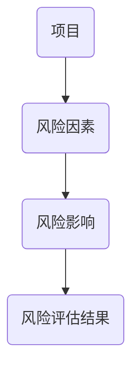
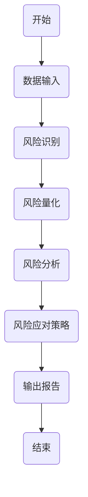
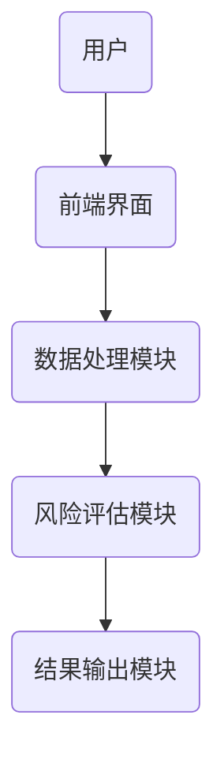
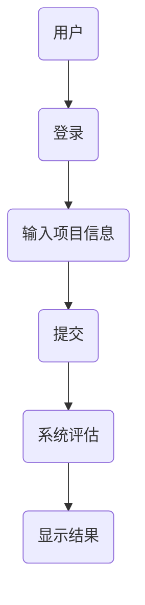

                 


# 可再生能源项目的投资风险评估

> 关键词：可再生能源，投资风险，风险评估，系统架构，数学模型

> 摘要：本文系统地介绍了可再生能源项目投资风险评估的核心概念、理论基础、数学模型与算法原理、系统分析与架构设计，以及实际案例分析。通过详细阐述风险识别、定性和定量分析方法，构建了完整的风险评估体系，并提供了实际项目中的应用示例和最佳实践。

---

# 第1章 可再生能源项目投资风险评估概述

## 1.1 可再生能源项目的基本概念
### 1.1.1 可再生能源的定义与分类
可再生能源是指来源于自然界的能源，具有可再生性。常见的类型包括：
- **太阳能**：通过光伏电池或太阳能热利用技术转换为电能。
- **风能**：利用风力发电。
- **水能**：通过水力发电。
- **生物质能**：利用有机废弃物或作物残渣发电。
- **地热能**：利用地壳内部的热能发电。

### 1.1.2 可再生能源项目的特点与优势
- **环保性**：减少温室气体排放，降低对环境的污染。
- **可持续性**：资源可再生，不会枯竭。
- **技术成熟度**：部分技术（如太阳能和风能）已经相对成熟，但成本较高。
- **政策支持**：各国政府通常会提供补贴和优惠政策。

### 1.1.3 可再生能源项目投资的基本流程
1. **项目选址**：选择资源丰富、地理位置合适的区域。
2. **资源评估**：对可再生能源资源的储量和分布进行评估。
3. **技术选型**：选择适合的发电技术和设备。
4. **成本估算**：估算项目的总投资成本。
5. **风险评估**：识别和评估可能面临的风险。
6. **财务分析**：评估项目的经济效益和可行性。

## 1.2 投资风险评估的核心概念
### 1.2.1 投资风险的定义与分类
- **定义**：投资风险是指在投资过程中，由于各种不确定因素导致投资收益低于预期或出现损失的可能性。
- **分类**：
  - **系统性风险**：影响整个市场的风险，如经济危机、政策变化。
  - **非系统性风险**：特定于项目的风险，如技术失败、施工延误。

### 1.2.2 可再生能源项目中的主要风险类型
- **技术风险**：技术不成熟或设备故障导致项目失败。
- **经济风险**：能源价格波动或成本超支导致项目亏损。
- **政策风险**：政策变化影响项目的收益和可行性。
- **市场风险**：市场需求变化导致项目收益下降。

### 1.2.3 风险评估的必要性与目标
- **必要性**：通过风险评估，投资者可以更好地了解项目可能面临的风险，并制定应对策略。
- **目标**：量化风险的影响程度，为决策提供支持。

## 1.3 可再生能源项目投资风险评估的背景与意义
### 1.3.1 全球能源结构转型的趋势
随着全球气候变化加剧，各国纷纷转向可再生能源，减少对化石燃料的依赖。

### 1.3.2 可再生能源行业的快速发展
近年来，可再生能源装机容量快速增长，但同时也带来了投资风险。

### 1.3.3 风险评估在项目决策中的作用
通过风险评估，投资者可以更科学地决策，降低投资失败的概率。

---

# 第2章 可再生能源项目投资风险评估的核心概念与联系

## 2.1 可再生能源项目投资风险的核心要素
### 2.1.1 项目的技术可行性
- **技术成熟度**：技术是否经过验证，能否稳定运行。
- **设备可靠性**：设备是否耐用，维护成本是否低。

### 2.1.2 项目的经济可行性
- **初始投资成本**：项目的建设和安装成本。
- **运营成本**：项目的日常维护和运营成本。
- **收益预测**：项目的预期收入，包括电价收入和政府补贴。

### 2.1.3 项目的政策环境影响
- **政策支持**：政府是否提供补贴、税收优惠等。
- **政策稳定性**：政策是否容易变化，影响项目收益。

## 2.2 风险评估的关键步骤与方法
### 2.2.1 风险识别与分类
- **风险识别**：通过头脑风暴、专家访谈等方式识别可能的风险。
- **风险分类**：将风险分为技术、经济、政策等类别。

### 2.2.2 风险量化与概率分析
- **风险概率**：评估每个风险发生的可能性。
- **风险影响程度**：评估每个风险对项目的影响程度。

### 2.2.3 风险应对策略的制定
- **风险规避**：通过改变项目计划或选择其他技术避免风险。
- **风险转移**：通过保险或合同将风险转移给第三方。
- **风险减轻**：通过技术改进或管理优化降低风险的影响。
- **风险接受**：在风险可控的情况下接受风险。

## 2.3 风险评估的系统架构与ER关系图
### 2.3.1 风险评估系统的实体关系图


### 2.3.2 风险因素与项目目标的关系
- **风险因素**：影响项目目标实现的各种因素。
- **项目目标**：项目的最终目标，如按时完成建设、实现盈利。

### 2.3.3 风险影响的层次分析模型
- **层次分析法（AHP）**：将风险因素分为多个层次，通过权重分析确定每个因素的重要性。

---

# 第3章 可再生能源项目投资风险评估的数学模型与算法原理

## 3.1 风险评估的数学模型
### 3.1.1 风险概率模型
- **公式**：$P = \frac{\text{成功案例数}}{\text{总案例数}}$
- **解释**：通过历史数据估算每个风险发生的概率。

### 3.1.2 风险影响程度模型
- **公式**：$I = a \cdot P + b \cdot C$
  - $P$：风险发生的概率。
  - $C$：风险发生时的损失程度。
  - $a$ 和 $b$：权重系数。

### 3.1.3 综合风险评估模型
- **公式**：$$R = \sum_{i=1}^{n} w_i \cdot (P_i + I_i)$$
  - $w_i$：第 $i$ 个风险的权重。
  - $P_i$：第 $i$ 个风险的概率。
  - $I_i$：第 $i$ 个风险的影响程度。

## 3.2 风险评估的算法原理
### 3.2.1 层次分析法（AHP）的原理与步骤
1. **构建层次分析模型**：将风险因素分为多个层次，如目标层、准则层、方案层。
2. **构造比较矩阵**：通过专家评分，构造比较矩阵。
3. **计算权重**：通过特征值法或几何平均法计算各层次的权重。

### 3.2.2 模糊综合评价法的数学基础
- **模糊集**：将风险因素的评价结果表示为模糊集。
- **综合评价**：通过模糊运算，综合各因素的影响，得到最终的评价结果。

### 3.2.3 风险矩阵的构建与应用
- **风险矩阵**：通过概率和影响程度，将风险分为不同的类别（低、中、高）。

---

# 第4章 可再生能源项目投资风险评估的系统分析与架构设计

## 4.1 风险评估系统的功能设计
### 4.1.1 系统需求分析
- **目标**：实现可再生能源项目风险的全面评估。
- **功能需求**：支持风险识别、量化、分析和应对策略制定。

### 4.1.2 系统功能模块划分
- **数据输入模块**：输入项目的基本信息和风险因素。
- **风险评估模块**：根据输入数据，计算各风险的影响程度。
- **结果输出模块**：输出风险评估报告和应对策略建议。

### 4.1.3 系统功能流程图


## 4.2 系统架构设计
### 4.2.1 系统架构图


### 4.2.2 系统接口设计
- **输入接口**：接收用户输入的项目信息和风险因素。
- **输出接口**：输出风险评估报告和应对策略建议。

## 4.3 系统交互设计
### 4.3.1 用户与系统交互流程


---

# 第5章 可再生能源项目投资风险评估的项目实战

## 5.1 项目背景与目标
### 5.1.1 项目背景
- 某公司计划投资一个太阳能发电项目，需要对项目进行风险评估。

### 5.1.2 项目目标
- 评估项目的技术风险、经济风险和政策风险，制定应对策略。

## 5.2 核心代码实现
### 5.2.1 数据输入模块
```python
# 风险因素输入
def input_risk_factors():
    factors = []
    while True:
        factor = input("请输入风险因素（输入'结束'退出）：")
        if factor == '结束':
            break
        factors.append(factor)
    return factors
```

### 5.2.2 风险评估模块
```python
# 计算风险概率和影响程度
def assess_risk(factors):
    risk_assessment = {}
    for factor in factors:
        probability = float(input(f"{factor} 的发生概率（0-1）："))
        impact = float(input(f"{factor} 的影响程度（1-10）："))
        risk_assessment[factor] = {'概率': probability, '影响程度': impact}
    return risk_assessment
```

### 5.2.3 风险分析模块
```python
# 综合风险评估
def calculate_overall_risk(risk_assessment):
    overall_risk = {}
    for factor, data in risk_assessment.items():
        probability = data['概率']
        impact = data['影响程度']
        overall_risk[factor] = probability * impact
    return overall_risk
```

## 5.3 项目实战案例分析
### 5.3.1 案例背景
- 项目地点：某地，年平均日照时间充足。
- 项目规模：10MW 太阳能发电项目。

### 5.3.2 风险评估结果
- **技术风险**：概率 0.2，影响程度 8，综合风险 1.6。
- **经济风险**：概率 0.3，影响程度 6，综合风险 1.8。
- **政策风险**：概率 0.1，影响程度 10，综合风险 1.1。

### 5.3.3 应对策略
- **技术风险**：选择成熟的技术和设备，购买设备保险。
- **经济风险**：通过长期购电协议锁定电价，控制成本。
- **政策风险**：密切关注政策变化，与政府保持沟通。

---

# 第6章 总结与展望

## 6.1 本章小结
- 本文系统地介绍了可再生能源项目投资风险评估的核心概念、理论基础、数学模型与算法原理、系统分析与架构设计，以及实际案例分析。

## 6.2 最佳实践 tips
- 在进行风险评估时，应结合实际项目特点，选择合适的评估方法。
- 风险评估是一个动态过程，需要根据实际情况不断调整和优化。

## 6.3 未来展望
- 随着人工智能和大数据技术的发展，未来的风险评估将更加智能化和精准化。
- 可再生能源项目的风险评估将更加注重多因素的综合分析和应对策略的制定。

---

通过以上目录结构，您可以逐步展开每个部分的内容，撰写一篇完整的、有深度的专业技术博客文章。

