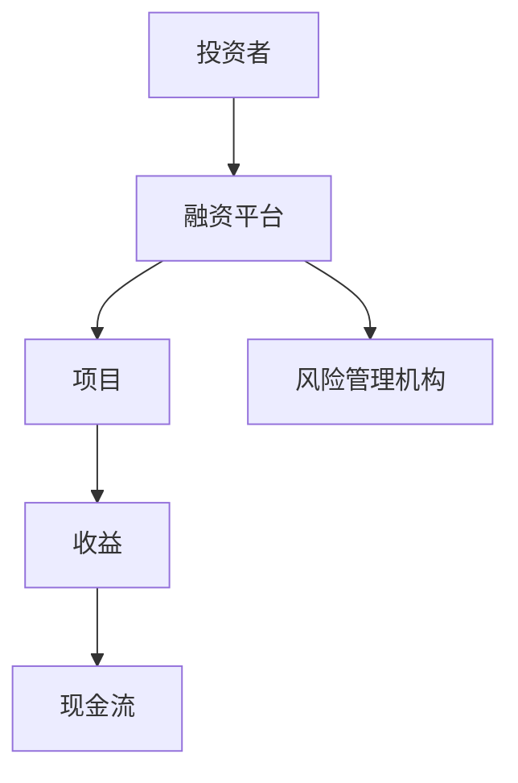
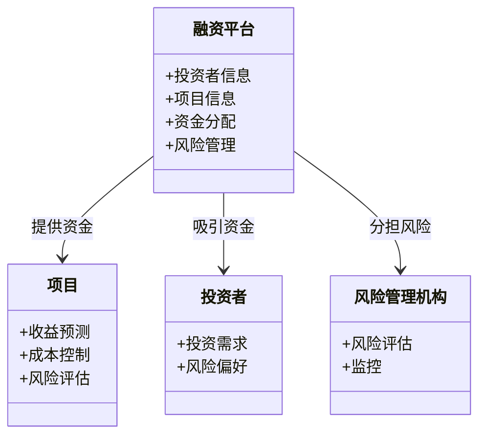

                 


# 可再生能源项目融资模式的创新与风险

## 关键词
可再生能源，项目融资，创新模式，风险管理，绿色金融

## 摘要
随着全球能源结构的转型，可再生能源项目逐渐成为推动可持续发展的重要力量。然而，这些项目的融资模式面临诸多挑战，包括高初始投资、较长的回收期以及政策和市场不确定性。本文旨在探讨可再生能源项目的融资模式创新，分析其潜在的风险，并提出有效的风险管理策略。通过结合实际案例和系统化的分析，本文为投资者和决策者提供了理论依据和实践指导。

---

## 第1章：可再生能源项目融资模式的背景与现状

### 1.1 背景介绍
#### 1.1.1 可再生能源的发展趋势
近年来，全球能源结构正经历深刻变革，可再生能源（如太阳能、风能、生物质能等）在全球能源消费中的占比迅速提升。根据国际能源署（IEA）的数据，2020年全球可再生能源发电量首次超过了化石能源，这一趋势在“双碳”目标的推动下将持续下去。

#### 1.1.2 融资需求的迫切性
可再生能源项目的建设通常需要大量前期投资，且项目周期较长。由于其技术性和不确定性较高，传统融资模式难以满足需求。因此，探索创新的融资模式成为行业发展的关键。

#### 1.1.3 传统融资模式的局限性
传统融资模式主要包括银行贷款和股权融资。然而，这些模式在可再生能源项目中存在以下问题：
- 资金需求大，银行贷款成本高且审批严格。
- 股权融资依赖于资本市场，风险较高且融资渠道有限。

### 1.2 融资需求的分析
#### 1.2.1 可再生能源项目的资金需求特点
- 高初始投资：可再生能源项目的建设成本较高，尤其是大型电站项目。
- 长周期回报：项目的回报周期较长，通常需要5-10年甚至更长时间。
- 技术风险：技术更新快，项目可能面临技术淘汰的风险。

#### 1.2.2 融资渠道的多样性
- 政府补贴：各国政府为推动可再生能源发展，提供了多种形式的财政补贴。
- 机构投资者：通过基金、保险等机构投资者吸引长期资金。
- 债务融资：通过发行债券或银行贷款获取资金。

#### 1.2.3 融资模式的演变
随着技术进步和政策支持，可再生能源融资模式逐渐从单一的传统模式向多元化、创新化方向发展。

---

## 第2章：可再生能源项目融资的核心概念与模式

### 2.1 核心概念
#### 2.1.1 融资模式的定义
融资模式是指为可再生能源项目提供资金的结构和机制。它涵盖了资金来源、分配方式以及风险管理等多个方面。

#### 2.1.2 融资模式的分类
- **债务融资**：包括银行贷款、债券发行等。
- **股权融资**：通过吸引投资者入股获取资金。
- **混合融资**：结合债务和股权融资的优势。

#### 2.1.3 核心要素
- 资金来源：包括政府、企业和个人投资者。
- 融资结构：项目的资金分配方式。
- 风险分担：明确各方在项目中的风险责任。

### 2.2 模式的属性特征
通过对比分析，可以发现不同融资模式在风险、成本和灵活性方面的差异：

| 模式类型 | 风险 | 成本 | 灵活性 |
|----------|------|------|--------|
| 债务融资 | 中 | 高 | 低 |
| 股权融资 | 低 | 中 | 高 |
| 混合融资 | 低 | 中 | 中 |

### 2.3 实体关系图
以下是可再生能源项目融资的核心实体关系图：



---

## 第3章：可再生能源项目融资的创新模式

### 3.1 创新模式的定义与分类
#### 3.1.1 创新模式的定义
创新融资模式是通过引入新的理念、技术和机制，优化资金分配和风险控制，从而提高项目融资效率的模式。

#### 3.1.2 分类
- **政府和社会资本合作（PPP）模式**：政府与社会资本合作，共同承担风险和收益。
- **资产支持证券化（ABS）模式**：将项目资产打包成证券，吸引投资者。
- **绿色债券**：专门用于可再生能源项目的债券融资。
- **收益分享模式**：根据项目收益分成，按比例分配资金。

### 3.2 创新模式的优劣势
| 模式类型 | 优势 | 劣势 |
|----------|------|------|
| PPP模式 | 风险分担，提高效率 | 政策依赖性强 |
| ABS模式 | 流动性高，资金来源广 | 资产质量要求高 |
| 绿色债券 | 低成本，支持环保 | 项目周期长 |

---

## 第4章：可再生能源项目融资的风险分析与应对策略

### 4.1 风险分析
#### 4.1.1 风险分类
- **市场风险**：能源价格波动影响项目收益。
- **技术风险**：技术落后导致项目失败。
- **政策风险**：政策变化影响补贴和税收优惠。
- **财务风险**：资金链断裂导致项目停滞。

#### 4.1.2 风险评估模型
我们可以使用以下数学模型来评估融资风险：

$$
风险指数 = \sum_{i=1}^{n} (风险因素_i \times 权重_i)
$$

其中，$n$为风险因素的数量，$权重_i$为每个风险因素的权重。

### 4.2 应对策略
#### 4.2.1 风险管理策略
- **分散投资**：通过多元化投资降低风险。
- **保险机制**：购买相关保险以应对意外损失。
- **政策跟踪**：密切关注政策变化，及时调整融资策略。

#### 4.2.2 具体措施
- 建立风险预警系统，定期评估项目风险。
- 引入专业的风险管理团队，提高风险控制能力。

---

## 第5章：可再生能源项目融资模式的系统分析与架构设计

### 5.1 系统功能设计
以下是可再生能源项目融资系统的功能模块设计：



### 5.2 系统架构设计
以下是系统的分层架构图：


---

## 第6章：可再生能源项目融资模式的项目实战

### 6.1 环境配置
为了实现可再生能源项目的融资管理，我们需要配置以下环境：
- 数据库：MySQL
- 开发工具：PyCharm
- 语言：Python

### 6.2 核心代码实现
以下是融资平台的核心代码：

```python
class Project:
    def __init__(self, name, cost, revenue):
        self.name = name
        self.cost = cost
        self.revenue = revenue

class Investor:
    def __init__(self, name, investment):
        self.name = name
        self.investment = investment

class FundingPlatform:
    def __init__(self):
        self.projects = []
        self.investors = []

    def add_project(self, project):
        self.projects.append(project)

    def add_investor(self, investor):
        self.investors.append(investor)

    def calculate_return(self, project):
        return project.revenue - project.cost
```

### 6.3 案例分析
以某风力发电项目为例，分析融资模式的应用：

- 项目总投资：5000万元
- 投资者结构：政府出资30%，社会资本出资70%
- 融资方式：混合融资（银行贷款+股权融资）

---

## 总结与展望

可再生能源项目的融资模式创新是推动行业发展的关键。本文通过分析传统融资模式的局限性，提出了多种创新模式，并结合实际案例探讨了风险管理的重要性。未来，随着技术的进步和政策的支持，可再生能源融资模式将更加多元化和高效化。

---

## 参考文献
1. 国际能源署（IEA）报告
2. 《绿色金融研究报告》
3. 相关学术论文和书籍

