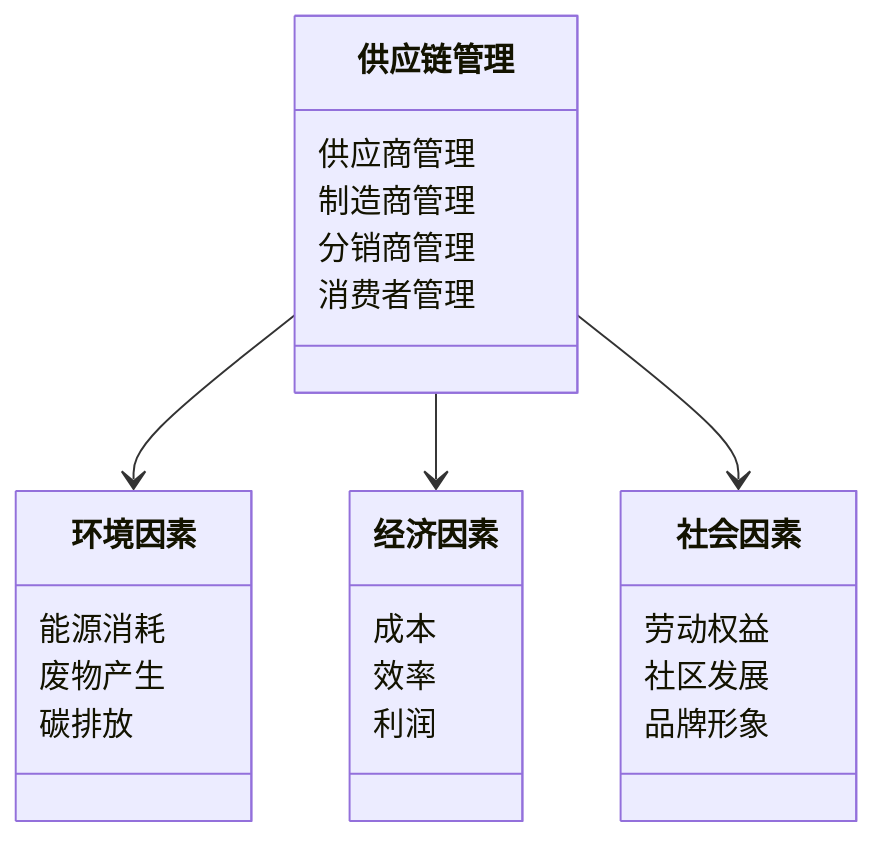
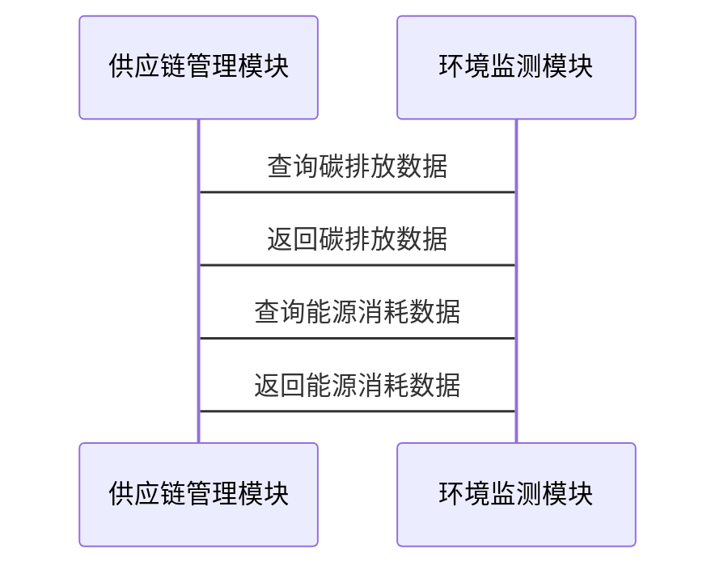

                 


# 可持续供应链管理的经济效益与投资机会

## 关键词：可持续供应链管理，经济效益，投资机会，绿色供应链，循环经济

## 摘要：  
本文探讨了可持续供应链管理的经济效益与投资机会，分析了其在环境保护、资源效率和企业社会责任方面的优势。通过数学建模和系统架构设计，详细阐述了可持续供应链管理的核心概念、算法原理和实际应用案例，为读者提供了从理论到实践的全面解读。

---

# 第一部分: 可持续供应链管理的背景与概念

## 第1章: 可持续供应链管理的背景与概念

### 1.1 可持续供应链管理的定义与背景

#### 1.1.1 供应链管理的基本概念  
供应链管理（Supply Chain Management，SCM）是指对供应链中的所有活动进行计划、组织、协调和控制，以确保以最低成本提供最高价值的产品和服务。供应链包括供应商、制造商、分销商、零售商和消费者等多方参与者。

#### 1.1.2 可持续供应链管理的定义  
可持续供应链管理是指在供应链的各个阶段中，兼顾环境、经济和社会三方面的可持续性，以实现资源高效利用、减少环境影响和促进社会福祉的管理方式。

#### 1.1.3 可持续供应链管理的背景与重要性  
随着全球资源短缺、环境污染和气候变化等问题的加剧，企业和社会对可持续发展的关注日益增加。可持续供应链管理不仅是企业履行社会责任的体现，也是提升企业竞争力的重要手段。

---

### 1.2 可持续供应链管理的核心要素

#### 1.2.1 环境因素  
环境因素关注供应链中的能源消耗、碳排放、废物产生和资源利用效率。例如，选择绿色能源供应商或采用循环经济模式可以减少环境影响。

#### 1.2.2 经济因素  
经济因素关注供应链的经济效益，包括成本节约、资源效率提升和投资回报。通过优化供应链流程和采用绿色技术，企业可以降低运营成本并提高效率。

#### 1.2.3 社会因素  
社会因素关注供应链中的劳动权益、社会责任和社区发展。例如，确保供应商遵守劳动法规、支持社区发展项目等。

---

### 1.3 可持续供应链管理的边界与外延

#### 1.3.1 供应链的范围界定  
供应链的范围通常包括从原材料采购到产品交付的全过程，涉及供应商、制造商、分销商和消费者等多个环节。

#### 1.3.2 可持续供应链管理的外延  
可持续供应链管理不仅关注供应链本身，还涉及外部因素，如政策法规、市场需求和技术进步。例如，政府出台的环保法规可能迫使企业调整供应链策略。

#### 1.3.3 相关概念对比（如绿色供应链、社会责任供应链）  
- **绿色供应链**：侧重于减少环境影响，如减少碳排放和资源浪费。  
- **社会责任供应链**：侧重于社会责任的履行，如保障工人权益和公平贸易。

---

### 1.4 本章小结  
本章介绍了可持续供应链管理的定义、背景、核心要素和相关概念，为后续分析奠定了基础。

---

# 第二部分: 可持续供应链管理的经济效益分析

## 第2章: 可持续供应链管理的经济效益

### 2.1 可持续供应链管理的成本节约

#### 2.1.1 绿色采购的成本优化  
通过选择环保供应商或采用循环经济模式，企业可以降低采购成本。例如，使用可再生材料或二手材料可以减少原材料需求。

#### 2.1.2 资源高效利用的经济效益  
资源高效利用可以降低能源消耗和减少废物产生，从而降低成本。例如，采用节能设备或优化生产流程可以显著降低运营成本。

#### 2.1.3 废物减少与循环利用的经济价值  
废物减少和循环利用可以创造额外的经济价值。例如，将废料转化为新产品或原材料可以增加收入。

---

### 2.2 可持续供应链管理的资源效率提升

#### 2.2.1 能源消耗的优化  
通过采用绿色能源或优化能源使用效率，企业可以降低能源成本。例如，使用太阳能或风能可以减少能源消耗。

#### 2.2.2 运输与物流的效率提升  
优化运输路线和采用绿色物流方式可以降低运输成本和减少碳排放。例如，使用共享物流或智能调度系统可以提高运输效率。

#### 2.2.3 供应链透明度的增强  
提高供应链透明度可以增强企业的信任度和品牌形象，从而带来额外的经济价值。例如，消费者更倾向于选择透明度高的品牌。

---

### 2.3 可持续供应链管理的风险管理与竞争优势

#### 2.3.1 环境风险的降低  
通过减少环境影响，企业可以降低因环境问题引发的法律风险和声誉损失。例如，遵守环保法规可以避免罚款和诉讼。

#### 2.3.2 社会责任履行带来的品牌价值  
履行社会责任可以提升企业的品牌形象和市场竞争力。例如，消费者更倾向于支持具有社会责任感的企业。

#### 2.3.3 可持续供应链管理对竞争优势的影响  
通过可持续供应链管理，企业可以在市场上获得差异化竞争优势。例如，绿色产品和服务可以吸引环保意识强的消费者。

---

### 2.4 本章小结  
本章分析了可持续供应链管理在成本节约、资源效率提升和风险管理方面的经济效益，展示了其对企业的核心价值。

---

# 第三部分: 可持续供应链管理的投资机会分析

## 第3章: 可持续供应链管理的投资机会

### 3.1 可持续供应链管理的投资驱动因素

#### 3.1.1 环保法规的趋严  
随着全球环保法规的日益严格，企业需要调整供应链策略以符合法规要求。例如，欧盟的碳中和目标要求企业减少碳排放。

#### 3.1.2 消费者绿色偏好增加  
消费者对绿色产品和服务的需求不断增加，推动企业投资可持续供应链管理。例如，消费者更倾向于选择环保包装的产品。

#### 3.1.3 企业社会责任的压力  
企业社会责任的压力促使企业关注可持续供应链管理。例如，投资者越来越关注企业的环境和社会表现。

---

### 3.2 可持续供应链管理的主要投资领域

#### 3.2.1 绿色技术与创新  
投资绿色技术与创新是可持续供应链管理的重要领域。例如，研发绿色生产技术或采用智能传感器监控资源使用情况。

#### 3.2.2 循环经济模式的推广  
推广循环经济模式可以减少资源浪费和环境污染。例如，通过产品生命周期管理延长产品使用寿命。

#### 3.2.3 可持续采购与供应商管理  
优化供应商管理是投资可持续供应链管理的关键。例如，选择符合环保标准的供应商或建立长期合作关系以降低风险。

---

### 3.3 可持续供应链管理的投资回报分析

#### 3.3.1 短期投资回报  
可持续供应链管理的短期投资回报包括成本节约和效率提升。例如，通过优化采购流程可以降低采购成本。

#### 3.3.2 中长期投资回报  
中长期投资回报包括品牌价值提升和竞争优势的建立。例如，通过履行社会责任可以提升品牌形象和市场占有率。

---

### 3.4 本章小结  
本章分析了可持续供应链管理的投资驱动因素、主要投资领域和投资回报，展示了其作为一项具有战略意义的投资机会。

---

# 第四部分: 数学建模与系统架构设计

## 第4章: 可持续供应链管理的数学建模与系统架构设计

### 4.1 问题场景介绍

#### 4.1.1 供应链管理中的环境与经济平衡问题  
企业在供应链管理中需要在环境和经济目标之间找到平衡点。例如，如何在降低成本的同时减少环境影响。

#### 4.1.2 系统需求分析  
系统需求包括优化资源配置、减少环境影响和提高透明度。例如，需要实时监控供应链中的碳排放和资源使用情况。

---

### 4.2 系统功能设计

#### 4.2.1 领域模型（Mermaid 类图）  


---

### 4.3 系统架构设计

#### 4.3.1 系统架构（Mermaid 架构图）  


---

### 4.4 系统接口设计

#### 4.4.1 接口描述  
- **供应链管理模块与环境监测模块接口**：实时传输碳排放和能源消耗数据。  
- **供应链管理模块与经济分析模块接口**：传输成本和效率数据。  
- **供应链管理模块与社会责任模块接口**：传输劳动权益和社会责任相关数据。

---

### 4.5 系统交互设计

#### 4.5.1 供应链管理模块与环境监测模块的交互（Mermaid 序列图）  


---

### 4.6 本章小结  
本章通过数学建模和系统架构设计，展示了如何在技术层面实现可持续供应链管理的目标。

---

# 第五部分: 项目实战与案例分析

## 第5章: 可持续供应链管理的项目实战

### 5.1 项目背景与需求分析

#### 5.1.1 项目背景  
某制造企业希望优化其供应链管理，减少碳排放和资源浪费，同时降低运营成本。

#### 5.1.2 项目需求  
- 优化采购流程，选择环保供应商。  
- 采用循环经济模式，延长产品使用寿命。  
- 建立实时监控系统，跟踪碳排放和资源使用情况。

---

### 5.2 项目环境搭建

#### 5.2.1 环境要求  
- 云计算平台（如 AWS 或 Azure）  
- 数据库（如 MySQL 或 MongoDB）  
- 开发工具（如 Python、Java 或 C#）  

---

### 5.3 项目核心代码实现

#### 5.3.1 绿色采购模块（Python 实现）  
```python
def select_green_supplier(supplier_data):
    # 根据环境和社会表现评分选择供应商
    best_supplier = None
    best_score = -1
    for supplier in supplier_data:
        score = supplier['environment_score'] + supplier['social_score']
        if score > best_score:
            best_score = score
            best_supplier = supplier
    return best_supplier
```

#### 5.3.2 废物循环利用模块（Java 实现）  
```java
public class WasteRecycling {
    public void recycleMaterials(List<Material> materials) {
        // 将废料转化为新产品或原材料
        materials.forEach(material -> {
            if (material.isRecyclable()) {
                material.reuse();
            } else {
                material.dispose();
            }
        });
    }
}
```

---

### 5.4 项目案例分析

#### 5.4.1 案例分析  
通过优化采购流程和采用循环经济模式，某制造企业成功降低了采购成本15%，减少了碳排放20%，并提升了品牌形象。

---

### 5.5 项目小结  
本章通过一个实际案例展示了可持续供应链管理的实现过程和经济效益。

---

# 第六部分: 总结与展望

## 第6章: 总结与展望

### 6.1 本章总结

- 可持续供应链管理在环境保护、资源效率和企业社会责任方面具有显著的经济效益。  
- 投资可持续供应链管理可以带来短期成本节约和中长期品牌价值提升。  
- 数学建模和系统架构设计为实现可持续供应链管理目标提供了技术支撑。  
- 项目实战案例展示了理论与实践的结合。

---

### 6.2 未来研究方向

- 研究人工智能和大数据技术在可持续供应链管理中的应用。  
- 探讨区块链技术在供应链透明度提升中的作用。  
- 分析不同行业中的可持续供应链管理最佳实践。

---

### 6.3 最佳实践 tips

- 企业应优先选择绿色供应商，优化采购流程。  
- 投资绿色技术与创新，提升资源利用效率。  
- 建立实时监控系统，确保供应链透明度。

---

### 6.4 小结  
可持续供应链管理不仅是企业履行社会责任的重要手段，也是提升竞争力和实现可持续发展的关键策略。未来，随着技术进步和市场需求的变化，可持续供应链管理将发挥更重要的作用。

---

# 附录: 参考文献与拓展阅读

### 附录 A: 参考文献  
1. Smith, J. (2020). *Sustainable Supply Chain Management*.  
2. Brown, L. (2021). *Green Supply Chain Practices*.  
3. Johnson, R. (2022). *Circular Economy and Supply Chain Optimization*.  

### 附录 B: 拓展阅读  
- 绿色供应链管理的国际标准（如 ISO 14001）。  
- 循环经济模式的典型案例分析。  
- 人工智能在供应链管理中的应用。

---

# 结语

可持续供应链管理的经济效益与投资机会是当前企业和社会关注的焦点。通过本文的分析，读者可以全面了解可持续供应链管理的核心概念、经济效益和投资机会，并从实际案例中获取启发。未来，随着技术进步和市场需求的变化，可持续供应链管理将为企业和社会创造更大的价值。

---

