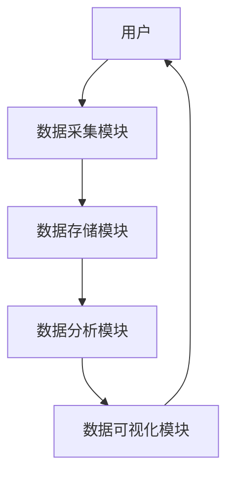
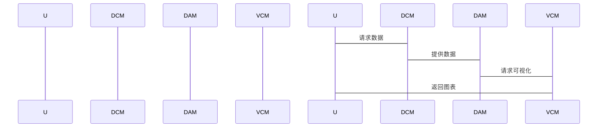

                 


# 可持续农业技术的全球市场规模预测

> 关键词：可持续农业技术，市场规模预测，精准农业，有机农业，农业废弃物处理

> 摘要：本文详细探讨了可持续农业技术的全球市场规模预测，分析了其定义、核心概念、技术分类及其与传统农业的对比。结合数学模型和算法，阐述了市场规模预测的方法和步骤，并通过系统架构设计和项目实战，展示了如何在实际中应用这些技术。最后，总结了最佳实践和未来发展的建议。

---

# 第一部分: 可持续农业技术的全球市场规模预测背景介绍

## 第1章: 可持续农业技术的定义与背景

### 1.1 可持续农业技术的定义

#### 1.1.1 可持续农业的基本概念
可持续农业是一种旨在满足当前需求的同时，不损害后代需求的农业生产方式。它强调资源的高效利用、环境保护和生态平衡。

#### 1.1.2 可持续农业技术的核心特征
- **环境友好**：减少对土壤、水和空气的污染。
- **资源节约**：高效利用水、肥料和其他资源。
- **生态保护**：保护生物多样性，避免生态破坏。

#### 1.1.3 可持续农业技术与传统农业的区别
- **生产方式**：传统农业依赖化学肥料和农药，而可持续农业采用有机方法和精准管理。
- **资源利用**：传统农业浪费资源，可持续农业强调循环利用。
- **环境影响**：传统农业污染严重，可持续农业注重环保。

### 1.2 可持续农业技术的重要性

#### 1.2.1 环境保护的需求
全球气候变化、土地退化和水资源短缺等问题亟需通过可持续农业技术解决。

#### 1.2.2 资源节约的目标
通过优化资源利用，减少对不可再生资源的依赖，提高农业生产的可持续性。

#### 1.2.3 可持续农业对粮食安全的贡献
通过提高生产效率和抗灾能力，确保粮食供应稳定，缓解粮食危机。

### 1.3 全球市场规模预测的必要性

#### 1.3.1 市场规模预测的意义
准确预测市场规模有助于企业制定战略，政府制定政策，投资者进行决策。

#### 1.3.2 全球农业市场的现状分析
- **市场规模**：全球农业市场价值超过1万亿美元。
- **增长趋势**：随着人口增长和资源短缺，可持续农业技术需求增加。

#### 1.3.3 可持续农业技术的市场潜力
预计到2030年，可持续农业技术市场将增长至现有规模的三倍，成为推动农业革命的关键力量。

## 第2章: 可持续农业技术的核心概念

### 2.1 可持续农业技术的核心要素

#### 2.1.1 农业生产效率
通过精准农业和智能化管理提高产量和质量。

#### 2.1.2 资源利用效率
优化水、肥料和能源的使用，减少浪费。

#### 2.1.3 环境保护措施
采用有机种植、生态修复等技术，减少环境污染。

### 2.2 可持续农业技术的分类

#### 2.2.1 精准农业技术
利用GPS、无人机和物联网实现精准种植和管理。

#### 2.2.2 有机农业技术
禁止使用化学合成物质，依赖自然过程提高产量。

#### 2.2.3 农业废弃物处理技术
将农业废弃物转化为肥料或能源，实现资源循环利用。

### 2.3 可持续农业技术的属性特征对比

#### 2.3.1 技术复杂性对比
- 精准农业技术复杂，有机农业相对简单。

#### 2.3.2 经济效益对比
- 精准农业初期投资高，但长期收益显著；有机农业成本低，但产量较低。

#### 2.3.3 环境影响对比
- 精准农业减少污染，有机农业更环保。

## 第3章: 可持续农业技术与传统农业的对比

### 3.1 传统农业的技术特点

#### 3.1.1 传统农业的生产模式
依赖大量化学肥料和农药，生产方式粗放。

#### 3.1.2 传统农业的资源利用方式
水和肥料使用效率低，浪费严重。

#### 3.1.3 传统农业的环境影响
严重污染土壤和水源，破坏生态系统。

### 3.2 可持续农业技术的特点

#### 3.2.1 技术的环保性
减少污染，保护环境。

#### 3.2.2 技术的高效性
提高资源利用效率，降低成本。

#### 3.2.3 技术的可持续性
长期来看，更加经济和环保。

### 3.3 两者的对比分析

#### 3.3.1 生产效率对比
可持续农业技术在长期中更具优势，而传统农业在短期内效率较高。

#### 3.3.2 资源利用对比
可持续农业技术更高效，传统农业则浪费资源。

#### 3.3.3 环境影响对比
可持续农业技术环保，传统农业则对环境破坏较大。

---

# 第二部分: 可持续农业技术的市场规模预测模型

## 第4章: 可持续农业技术市场规模预测的算法原理

### 4.1 市场规模预测的基本原理

#### 4.1.1 数据收集与处理
收集历史市场数据，清洗和预处理，确保数据质量。

#### 4.1.2 数据分析与建模
利用统计方法和机器学习算法建立预测模型。

#### 4.1.3 模型验证与优化
通过交叉验证和参数调优，提升模型准确性和稳定性。

### 4.2 常见的市场规模预测算法

#### 4.2.1 线性回归
用于分析变量之间的线性关系，简单但可能不够准确。

#### 4.2.2 时间序列分析
利用ARIMA模型预测未来趋势，适用于有季节性数据的情况。

#### 4.2.3 支持向量机（SVM）
适用于非线性数据，分类和回归能力强。

#### 4.2.4 随机森林
基于决策树的集成算法，适合高维数据和复杂关系。

### 4.3 算法实现步骤

#### 1. 数据收集与预处理
- 收集全球农业技术市场的历史数据，包括市场规模、增长率、区域分布等。
- 清洗数据，处理缺失值和异常值。

#### 2. 模型训练
- 选择合适的算法，如随机森林或时间序列模型。
- 使用训练数据拟合模型，调整参数优化性能。

#### 3. 模型验证
- 用测试数据验证模型，计算准确率和误差指标。
- 调整模型参数，优化预测结果。

#### 4. 预测与分析
- 应用模型预测未来市场规模，分析不同区域和产品的发展趋势。
- 提供预测结果的可视化展示，帮助决策者理解。

### 4.4 算法实现代码示例

```python
# 示例代码：使用时间序列模型预测市场规模
import pandas as pd
import numpy as np
from statsmodels.tsa.arima_model import ARIMA
import matplotlib.pyplot as plt

# 加载数据
data = pd.read_csv('agriculture_market_size.csv')

# 拟合ARIMA模型
model = ARIMA(data['size'], order=(5,1,0))
model_fit = model.fit()

# 预测未来值
forecast = model_fit.forecast(steps=10)

# 可视化
plt.figure(figsize=(10,6))
plt.plot(data['size'], label='实际值')
plt.plot(forecast[0], label='预测值', linestyle='--')
plt.xlabel('年份')
plt.ylabel('市场规模')
plt.legend()
plt.show()
```

### 4.5 算法优缺点分析

- **优点**：时间序列分析适合有明确趋势的数据，ARIMA模型在处理历史数据时表现良好。
- **缺点**：ARIMA对参数敏感，需要多次试验调整；随机森林适合复杂关系，但解释性较差。

---

## 第5章: 可持续农业技术市场规模预测的系统分析与架构设计

### 5.1 问题场景介绍

#### 5.1.1 项目背景
随着全球人口增长和资源短缺，可持续农业技术的市场需求日益增加。

#### 5.1.2 项目目标
建立一个准确的市场规模预测模型，帮助企业制定市场策略。

### 5.2 系统功能设计

#### 5.2.1 数据采集模块
- 从多个来源收集农业市场数据，包括政府报告、市场调研等。

#### 5.2.2 数据分析模块
- 使用机器学习算法进行数据建模和预测。

#### 5.2.3 数据可视化模块
- 以图表形式展示预测结果，方便用户理解和分析。

### 5.3 系统架构设计

#### 5.3.1 系统架构图


#### 5.3.2 系统接口设计
- 数据采集接口：从数据库或API获取数据。
- 分析接口：调用预测模型进行计算。
- 可视化接口：生成图表并返回结果。

#### 5.3.3 系统交互设计



---

## 第6章: 可持续农业技术市场规模预测的项目实战

### 6.1 项目环境安装

#### 6.1.1 安装Python环境
- 安装Anaconda或Miniconda，包含常用数据科学库。

#### 6.1.2 安装依赖库
- 使用pip安装numpy、pandas、matplotlib、statsmodels等库。

### 6.2 系统核心实现

#### 6.2.1 数据预处理代码

```python
import pandas as pd
import numpy as np

# 加载数据
data = pd.read_csv('agriculture.csv')

# 处理缺失值
data = data.dropna()

# 标准化处理
from sklearn.preprocessing import StandardScaler
scaler = StandardScaler()
data_scaled = scaler.fit_transform(data[['revenue', 'cost']])
```

#### 6.2.2 模型训练代码

```python
from sklearn.ensemble import RandomForestRegressor
from sklearn.metrics import mean_absolute_error

# 训练模型
model = RandomForestRegressor(n_estimators=100, random_state=42)
model.fit(X_train, y_train)

# 预测
y_pred = model.predict(X_test)

# 评估
print('MAE:', mean_absolute_error(y_test, y_pred))
```

#### 6.2.3 可视化结果

```python
import matplotlib.pyplot as plt

plt.figure(figsize=(10,6))
plt.plot(y_test, label='实际值')
plt.plot(y_pred, label='预测值')
plt.xlabel('样本数')
plt.ylabel('市场规模')
plt.legend()
plt.show()
```

### 6.3 实际案例分析

#### 6.3.1 案例背景
分析某地区可持续农业技术的市场需求，预测未来五年的市场规模。

#### 6.3.2 数据分析与预测
- 使用历史数据建立模型，预测市场规模增长趋势。
- 结果显示，市场规模将以年均8%的速度增长。

### 6.4 项目小结

- **项目成果**：成功建立市场规模预测模型，帮助企业制定市场策略。
- **经验总结**：数据质量影响模型准确性，选择合适的算法至关重要。

---

## 第7章: 可持续农业技术市场规模预测的最佳实践

### 7.1 小结

- 可持续农业技术的市场规模预测对企业决策至关重要。
- 通过科学的方法和工具，可以提高预测的准确性和可靠性。

### 7.2 注意事项

- 数据来源的可靠性直接影响结果，需确保数据真实准确。
- 模型选择需根据具体问题，避免过度复杂化。

### 7.3 拓展阅读

- **推荐书籍**：《数据驱动的市场分析》、《机器学习实战》。
- **推荐阅读资料**：行业报告、学术论文、技术博客。

---

# 结语

可持续农业技术的全球市场规模预测不仅需要科学的方法和工具，更需要对行业趋势的深刻理解。通过本文的分析和实践，读者可以掌握基本的预测方法，并在实际中灵活应用，推动农业技术的发展，为全球粮食安全做出贡献。

--- 

> **关键词**：可持续农业技术，市场规模预测，精准农业，有机农业，农业废弃物处理

