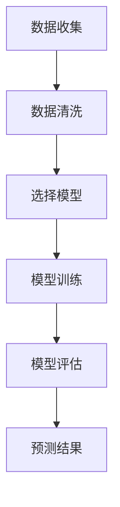
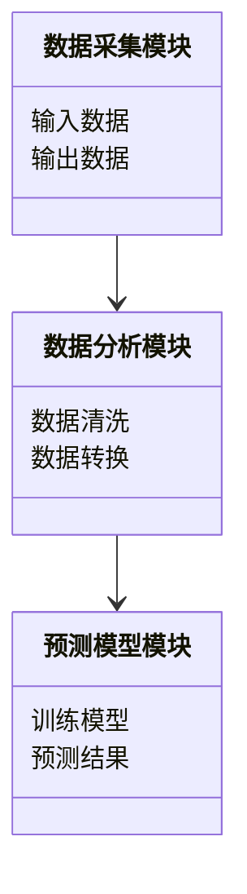

                 


# 可持续农业科技公司的市场前景预测

## 关键词：可持续农业，科技公司，市场前景，技术预测，农业生产，环境保护

## 摘要：  
本文旨在探讨可持续农业科技公司的市场前景，通过分析可持续农业的核心概念、科技公司的角色定位、市场驱动因素以及预测模型，结合实际案例和数据支持，预测可持续农业科技公司的未来发展趋势。文章内容涵盖了背景介绍、核心概念联系、算法原理、系统架构设计以及项目实战等部分，为读者提供全面且深入的分析。

---

## 第1章：可持续农业与科技公司的概述

### 1.1 可持续农业的核心概念

#### 1.1.1 可持续农业的定义  
可持续农业是一种以生态友好、资源高效利用和减少环境污染为目标的农业生产方式。它强调在满足当前需求的同时，不损害后代满足其需求的能力。  

#### 1.1.2 可持续农业的目标与原则  
- **目标**：提高产量、保护环境、促进社会公平。  
- **原则**：资源节约、生态平衡、经济高效。  

#### 1.1.3 可持续农业与传统农业的区别  
| 方面 | 可持续农业 | 传统农业 |  
|------|------------|----------|  
| 资源利用 | 高效循环 | 单一利用 |  
| 环境影响 | 最小化 | 可能较大 |  
| 生产目标 | 综合效益 | 经济效益优先 |  

---

### 1.2 科技公司在农业中的角色

#### 1.2.1 科技公司对农业的推动作用  
科技公司通过引入先进技术（如人工智能、大数据、物联网等）优化农业生产流程，提高效率并降低成本。  

#### 1.2.2 可持续农业科技公司的定义  
可持续农业科技公司是以可持续农业为目标，利用科技创新推动农业发展的企业。  

#### 1.2.3 可持续农业科技公司的核心目标  
- 提供环保的农业生产解决方案。  
- 优化资源配置，降低生产成本。  
- 提高农产品的质量和产量。  

---

## 第2章：可持续农业科技公司的市场背景

### 2.1 全球农业市场的现状

#### 2.1.1 全球农业市场规模与增长趋势  
根据数据，全球农业市场规模预计在2023年达到约$1.5万亿美元，并以年均3%的速度增长。  

#### 2.1.2 农业技术的普及与应用  
近年来，农业科技的应用范围不断扩大，尤其是在精准农业、智能灌溉和农业机器人领域。  

#### 2.1.3 可持续农业的市场需求  
消费者对绿色食品的需求不断增加，推动了可持续农业的发展。  

---

### 2.2 可持续农业的驱动因素

#### 2.2.1 环境问题的加剧  
气候变化、土壤退化和水资源短缺等问题迫使农业向可持续方向转型。  

#### 2.2.2 消费者对绿色食品的需求  
消费者倾向于选择环保认证的农产品，推动了可持续农业的发展。  

#### 2.2.3 政府政策的支持  
各国政府通过补贴、税收优惠等政策鼓励可持续农业的发展。  

---

### 2.3 可持续农业科技公司的市场定位

#### 2.3.1 市场定位的定义  
市场定位是指企业通过其产品或服务在目标市场中所占据的位置。  

#### 2.3.2 可持续农业科技公司的市场定位策略  
- 提供环保解决方案。  
- 强调技术创新和高效生产。  

#### 2.3.3 市场定位的挑战与机遇  
- **挑战**：市场竞争激烈，技术门槛高。  
- **机遇**：政策支持和消费者需求增加。  

---

## 第3章：可持续农业科技公司的核心概念与联系

### 3.1 可持续农业科技公司的核心要素

#### 3.1.1 技术创新  
通过引入新技术（如人工智能和大数据分析）优化农业生产流程。  

#### 3.1.2 可持续发展  
强调环境保护和资源高效利用。  

#### 3.1.3 市场需求  
消费者对绿色食品的需求推动了可持续农业的发展。  

---

### 3.2 可持续农业科技公司的核心属性

#### 3.2.1 技术领先性  
公司通过技术创新提供高效的农业生产解决方案。  

#### 3.2.2 可持续发展性  
强调环境保护和资源节约。  

#### 3.2.3 市场适应性  
公司能够快速适应市场需求变化。  

---

### 3.3 可持续农业科技公司的核心概念联系

#### 3.3.1 技术创新与市场需求的关系  
技术创新可以满足市场需求，同时市场需求也推动技术创新。  

#### 3.3.2 可持续发展性与市场适应性的关系  
可持续发展性是市场适应性的基础，而市场适应性则确保公司的可持续发展。  

---

## 第4章：可持续农业科技公司的市场前景预测模型

### 4.1 市场前景预测的算法选择

#### 4.1.1 线性回归模型  
线性回归模型适用于预测变量与目标变量之间存在线性关系的情况。  

#### 4.1.2 时间序列分析  
时间序列分析适用于预测未来趋势，基于历史数据进行建模。  

#### 4.1.3 支持向量机（SVM）  
支持向量机适用于分类和回归问题，适用于复杂的市场数据预测。  

---

### 4.2 市场前景预测模型的构建

#### 4.2.1 数据收集与预处理  
- 数据来源：历史销售数据、市场调研数据、政策文件等。  
- 数据清洗：去除异常值和缺失值。  

#### 4.2.2 模型训练与评估  
- 训练数据：70%用于训练，30%用于测试。  
- 模型评估：使用均方误差（MSE）和决定系数（R²）评估模型性能。  

---

### 4.3 算法原理的详细讲解

#### 4.3.1 线性回归模型的数学公式  
$$ y = \beta_0 + \beta_1 x + \epsilon $$  
其中，$y$ 是目标变量，$x$ 是预测变量，$\beta_0$ 和 $\beta_1$ 是回归系数，$\epsilon$ 是误差项。  

#### 4.3.2 时间序列分析的流程图  


---

## 第5章：可持续农业科技公司的系统架构设计

### 5.1 问题场景介绍  
本文设计了一个可持续农业科技公司的预测系统，旨在通过数据采集、分析和预测，帮助公司制定市场策略。  

---

### 5.2 系统功能设计

#### 5.2.1 领域模型（mermaid类图）  


---

### 5.3 系统架构设计（mermaid架构图）  


---

## 第6章：项目实战与案例分析

### 6.1 项目环境安装  
安装Python和相关库（如NumPy、Pandas、Scikit-learn）。  

### 6.2 系统核心实现源代码  
```python
import pandas as pd
from sklearn.linear_model import LinearRegression
from sklearn.metrics import mean_squared_error

# 数据加载
data = pd.read_csv('agriculture.csv')

# 特征选择
X = data[['temperature', 'rainfall']]
y = data['yield']

# 模型训练
model = LinearRegression()
model.fit(X, y)

# 预测结果
y_pred = model.predict(X)

# 模型评估
mse = mean_squared_error(y, y_pred)
print(f'均方误差：{mse}')
```

---

### 6.3 实际案例分析  
以某农业科技公司为例，分析其市场定位和预测模型的应用效果。  

---

## 第7章：结论与建议

### 7.1 结论  
可持续农业科技公司具有广阔的市场前景，技术创新和市场需求是其发展的主要驱动力。  

### 7.2 最佳实践 tips  
- 注重数据收集和清洗。  
- 选择合适的预测模型。  

### 7.3 注意事项  
- 数据质量和模型选择对预测结果有重要影响。  
- 定期更新模型以适应市场变化。  

---

## 参考文献  
（此处列出相关文献和数据来源）  

---

通过以上分析，我们可以看到可持续农业科技公司的发展前景光明，但也面临着技术、市场和政策等多方面的挑战。未来，随着技术的不断进步和市场需求的增加，可持续农业科技公司将在全球农业市场中占据重要地位。

