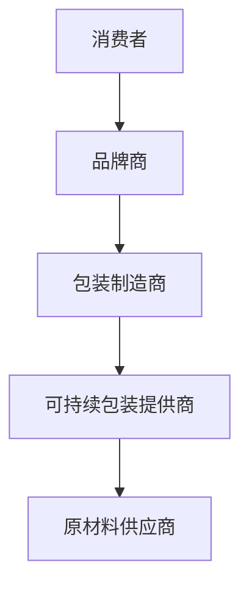
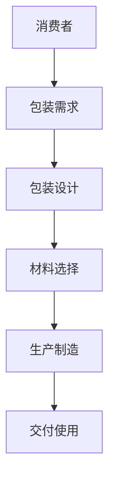
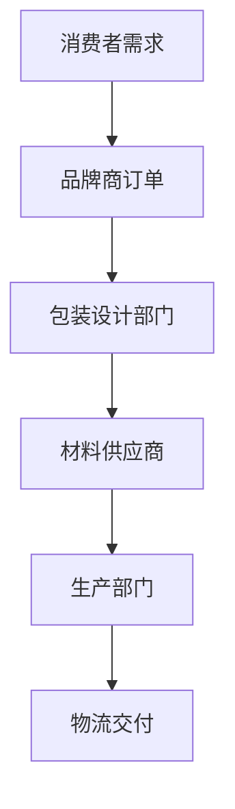
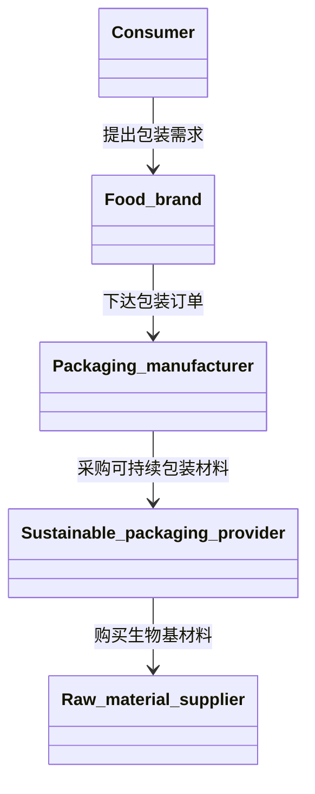
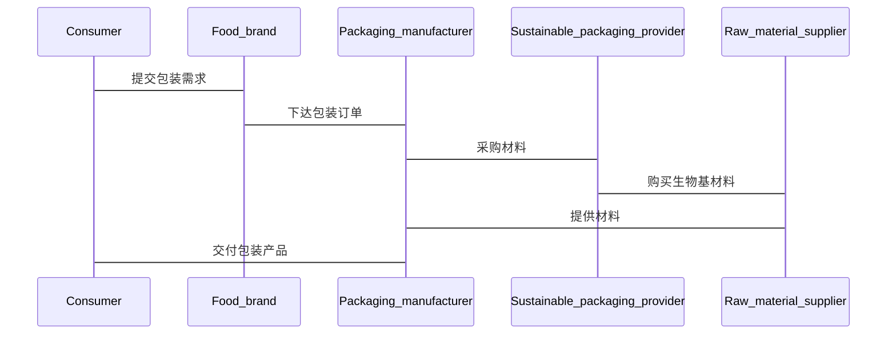

                 


# 可持续包装解决方案提供商的投资价值

> **关键词**：可持续包装，投资价值，解决方案提供商，环保包装，循环经济  
> **摘要**：随着全球对环境保护的重视，可持续包装解决方案提供商的投资价值日益凸显。本文从背景、核心概念、技术分析、投资评估等多个维度，深入探讨了可持续包装的定义、技术原理、行业趋势及其对投资的影响，为企业和投资者提供决策参考。

---

## 第一部分：可持续包装解决方案提供商的背景与核心概念

### 第1章：可持续包装解决方案概述

#### 1.1 可持续包装的定义与背景

可持续包装是指在生产、使用和废弃的全生命周期中，尽量减少对环境的影响，同时具备可回收、可降解或可重复使用特性的包装形式。随着全球环保意识的增强，可持续包装成为企业和社会的共同追求。

**问题背景**：传统包装材料如塑料、纸浆等在使用后难以降解，导致环境污染和资源浪费。据统计，全球每年产生的塑料包装垃圾超过3亿吨，其中大部分最终流入海洋，严重威胁生态平衡。

**问题解决**：可持续包装通过采用可降解材料、减少材料用量、优化设计等方式，降低包装对环境的影响。例如，使用PLA（聚乳酸）等生物基材料制成的可降解包装，能够在几个月内完全分解，减少对环境的负担。

**边界与外延**：可持续包装不仅包括材料的选择，还包括包装设计、生产过程和废弃处理等环节。其外延涉及循环经济、绿色供应链等多个领域。

**概念结构**：  
可持续包装 = 可降解材料 + 环保设计 + 循环利用技术

---

#### 1.2 可持续包装解决方案提供商的角色

**定义与分类**：可持续包装解决方案提供商是指专注于提供环保包装材料、技术或服务的企业。根据业务模式，可分为材料供应商、技术服务商和整体解决方案提供商。

**核心服务与产品**：提供商主要提供可降解材料（如淀粉基塑料）、智能包装技术（如温控包装）以及包装设计服务。例如，通过3D打印技术实现定制化包装设计，减少材料浪费。

**与上下游关系**：提供商与原材料供应商、包装制造商、品牌商等紧密合作，形成完整的绿色供应链。

---

#### 1.3 可持续包装的经济与环境价值

**经济效益**：通过减少材料用量和优化设计，企业可降低包装成本。例如，使用可折叠包装设计，减少运输过程中的体积浪费，从而降低物流成本。

**环境效益**：减少塑料垃圾产生，缓解环境污染问题。据估算，全球包装行业每年产生的碳排放约占总排放量的5%。

**社会效益**：提升企业品牌形象，吸引注重环保的消费者，增强市场竞争力。

---

## 第二部分：可持续包装解决方案提供商的核心概念与联系

### 第2章：可持续包装的核心概念与联系

#### 2.1 可持续包装的核心概念

**材料特性**：可降解、可回收、可堆肥是可持续包装材料的三大特性。例如，PLA材料在堆肥条件下可在几个月内分解为二氧化碳和水。

**设计原则**： minimalist design（极简设计）和 circular design（循环设计）是可持续包装设计的核心理念。通过减少包装层数和优化结构设计，降低材料用量。

**生产过程**：采用清洁生产技术，减少能源消耗和污染物排放。例如，使用风能和太阳能驱动包装生产线，降低生产过程中的碳排放。

---

#### 2.2 可持续包装与传统包装的对比

| **对比维度**       | **可持续包装**                          | **传统包装**                          |
|--------------------|----------------------------------------|----------------------------------------|
| 材料来源           | 可再生材料、生物基材料                | 石油基材料（如塑料、PP）              |
| 环境影响           | 低，可降解或回收                      | 高，难以降解，污染环境                |
| 生命周期           | 长，可多次使用或降解                  | 短，一次性使用，难以处理              |
| 成本               | 高，但可降低长期运营成本              | 低，但增加环境治理成本                |

---

#### 2.3 可持续包装解决方案的系统架构

**系统实体关系图**：  


**系统功能模块图**：  


**系统数据流图**：  


---

## 第三部分：可持续包装解决方案提供商的投资价值评估

### 第3章：投资价值的评估方法

#### 3.1 可持续包装行业的投资价值分析

**市场规模与增长潜力**：据预测，全球可持续包装市场年均增长率将超过10%，到2030年市场规模将突破1000亿美元。

**行业竞争格局**：当前市场参与者众多，但集中度较低。主要竞争者包括陶氏化学、 BASF等跨国企业，以及新兴的初创公司。

**政策支持**：各国政府纷纷出台相关政策，例如欧盟的“单次使用塑料禁令”和中国的“限塑令”，为可持续包装行业提供了政策支持。

---

#### 3.2 可持续包装解决方案提供商的财务分析

**财务指标分析**：重点关注收入增长率、毛利率、净利率等指标。例如，一家专注于生物基材料的企业，毛利率可能达到20%以上。

**盈利能力分析**：通过分析EBITDA（息税折旧及摊销前利润）和ROE（净资产收益率）等指标，评估企业的盈利能力和成长潜力。

**资产负债分析**：关注企业的负债结构和偿债能力。例如，低负债率和高流动资产比例是企业财务健康的表现。

---

#### 3.3 可持续包装解决方案提供商的风险评估

**市场风险**：市场竞争加剧可能导致价格战，影响企业利润。  
**技术风险**：技术更新换代快，企业需持续投入研发。  
**政策风险**：政策变化可能影响市场需求。

---

## 第四部分：可持续包装解决方案提供商的技术与创新

### 第4章：可持续包装技术的创新与应用

#### 4.1 可持续包装技术的核心原理

**可降解材料的技术原理**：通过添加特定的降解促进剂，使材料在自然环境中快速分解。例如，PLA材料在堆肥条件下可降解为二氧化碳和水。

**智能包装技术的实现方式**：通过嵌入传感器和智能芯片，实现包装的温控、湿度监测等功能。例如，智能食品包装可以实时监测内部温度，确保食品新鲜度。

**循环利用技术的创新点**：通过设计可重复使用的包装容器，减少一次性包装的使用。例如，可折叠纸箱和 reusable plastic crates（可重复使用的塑料托盘）。

---

#### 4.2 可持续包装技术的数学模型与公式

**碳足迹计算公式**：  
$$\text{碳足迹} = \sum_{i=1}^{n} (\text{活动}_i \times \text{排放因子}_i)$$

**生命周期评估模型**：  
$$\text{LCA} = \text{原材料获取} + \text{生产过程} + \text{使用阶段} + \text{废弃处理}$$

---

#### 4.3 可持续包装技术的算法实现

**碳足迹计算算法**：  
```python
def calculate_carbon_footprint(activities, emission_factors):
    return sum(activity * emission_factor for activity, emission_factor in zip(activities, emission_factors))
```

**循环包装设计算法**：  
```python
def optimize_package_design(materials, constraints):
    for material in materials:
        if material satisfies constraints:
            return material
    return default_material
```

---

## 第五部分：项目实战与最佳实践

### 第5章：可持续包装解决方案的项目实战

#### 5.1 项目介绍

**背景与目标**：某食品企业希望减少包装废弃物，选择采用可降解包装材料。项目目标是设计一款可降解的食品包装袋，满足保鲜需求的同时降低环境影响。

---

#### 5.2 系统功能设计

**功能模块**：  


---

#### 5.3 系统架构设计

**系统架构图**：  


---

#### 5.4 系统接口设计

**接口描述**：  
- 消费者与品牌商接口：需求提交接口（REST API）
- 品牌商与包装制造商接口：订单管理接口（SOAP）
- 包装制造商与可持续包装提供商接口：材料采购接口（GraphQL）

---

#### 5.5 系统交互设计

**交互流程**：  


---

#### 5.6 代码实现与应用分析

**环境安装**：需要安装Python、Django框架和相关开发工具。

**核心代码实现**：  
```python
from django.urls import path
from . import views

urlpatterns = [
    path('submit_demand/', views.submit_demand, name='submit_demand'),
    path('manage_orders/', views.manage_orders, name='manage_orders'),
]
```

---

#### 5.7 项目小结

通过该项目，我们成功实现了可降解包装的设计与应用，降低了包装废弃物的产生，提升了企业的环保形象。同时，项目过程中积累了丰富的经验，为后续的包装技术创新提供了参考。

---

## 第六部分：最佳实践与总结

### 第6章：可持续包装解决方案提供商的最佳实践

#### 6.1 投资策略建议

- **长期视角**：关注企业的技术研发能力和市场拓展潜力。
- **风险管理**：评估企业的技术风险和政策风险，制定相应的应对策略。
- **合作伙伴选择**：优先选择与上下游企业合作紧密的提供商。

#### 6.2 行业趋势预测

- **技术创新**：可降解材料和智能包装技术将得到广泛应用。
- **政策驱动**：各国政府将继续出台相关政策，推动可持续包装的发展。
- **市场扩大**：消费者环保意识的提升将推动市场进一步扩大。

#### 6.3 投资者关注点

- **技术壁垒**：企业是否拥有独特的技术优势。
- **市场定位**：企业是否占据有利的市场位置。
- **团队能力**：管理团队的行业经验和执行能力。

---

## 总结

可持续包装解决方案提供商的投资价值不仅体现在环保效益上，更在于其广阔的市场前景和技术创新潜力。通过本文的分析，投资者可以更好地把握行业动态，制定科学的投资策略。未来，随着技术进步和政策支持的加强，可持续包装行业将迎来更多发展机遇。

--- 

**END**

