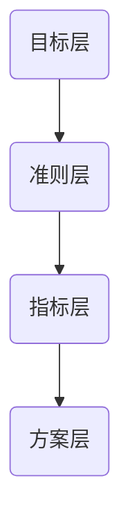

                 


# 可持续发展创新的专利价值评估方法

> **关键词**：可持续发展创新、专利价值评估、层次分析法、系统架构设计、Python实现

> **摘要**：本文详细探讨了可持续发展创新的专利价值评估方法，从背景、概念、算法原理到系统架构设计，再到项目实战，系统性地介绍了如何通过专利价值评估来支持可持续发展目标的实现。文章结合实际案例，提出了基于层次分析法（AHP）的评估模型，并通过Python代码实现，展示了如何将理论应用于实践。

---

## 第一部分: 可持续发展创新的背景与概念

### 第1章: 可持续发展创新的基本概念

#### 1.1 可持续发展创新的定义与内涵
- **1.1.1 可持续发展的基本概念**  
  可持续发展是指在满足当前需求的同时，不损害后代满足其需求的能力。它涵盖环境、社会和经济三个维度。
  
- **1.1.2 创新在可持续发展中的作用**  
  创新是推动可持续发展的核心动力，包括技术创新、管理创新和社会创新。

- **1.1.3 可持续发展创新的核心要素**  
  包括技术创新性、环境友好性、社会价值性和经济可行性。

#### 1.2 专利价值评估的基本原理
- **1.2.1 专利的基本概念与属性**  
  专利是一种知识产权，具有独占性、地域性和时间性。

- **1.2.2 专利价值的影响因素**  
  包括技术先进性、市场应用前景、法律保护力度和经济收益潜力。

- **1.2.3 可持续发展与专利价值的关系**  
  可持续发展创新的专利价值不仅体现在经济效益上，还体现在社会和环境价值上。

### 第2章: 可持续发展创新与专利价值评估的关联性

#### 2.1 创新与专利的关系
- **2.1.1 创新成果的专利化过程**  
  创新成果通过专利申请、授权和保护，转化为法律权利。

- **2.1.2 专利对创新的保护作用**  
  专利保护创新成果，防止他人未经许可的使用。

- **2.1.3 专利对创新的促进作用**  
  专利激励创新，推动技术进步和经济发展。

#### 2.2 可持续发展对专利价值的影响
- **2.2.1 可持续发展对专利技术的要求**  
  可持续发展创新需要专利技术具备环境友好性和社会价值性。

- **2.2.2 可持续发展对专利市场价值的影响**  
  具有社会和环境价值的专利更受市场青睐，其市场价值可能更高。

- **2.2.3 可持续发展对专利战略的影响**  
  可持续发展要求企业制定更具前瞻性的专利战略，注重绿色技术和可持续技术创新。

### 第3章: 可持续发展创新的专利价值评估框架

#### 3.1 专利价值评估的基本框架
- **3.1.1 技术评估维度**  
  评估专利的技术先进性、创新性和实用性。

- **3.1.2 法律评估维度**  
  评估专利的法律状态、保护范围和稳定性。

- **3.1.3 市场评估维度**  
  评估专利的市场应用前景、经济收益和竞争环境。

#### 3.2 可持续发展创新的专利价值评估模型
- **3.2.1 模型的设计思路**  
  将可持续发展创新的核心要素融入专利价值评估模型中。

- **3.2.2 模型的输入变量**  
  包括技术属性、法律属性和市场属性。

- **3.2.3 模型的输出结果**  
  综合评估得分，反映专利的可持续发展价值。

#### 3.3 评估框架的构建与优化
- **3.3.1 框架的构建步骤**  
  从核心概念出发，逐步构建评估框架。

- **3.3.2 框架的优化方法**  
  根据实际应用反馈，不断优化评估指标和权重。

- **3.3.3 框架的适用性分析**  
  分析框架在不同行业和应用场景下的适用性。

---

## 第二部分: 可持续发展创新的专利价值评估方法

### 第4章: 可持续发展创新的专利价值评估模型

#### 4.1 评估模型的核心算法
- **层次分析法（AHP）**  
  通过构建层次结构，计算各指标的权重，最终得出综合评估得分。

#### 4.2 算法原理讲解

##### 4.2.1 算法流程图


##### 4.2.2 算法实现代码
```python
def calculate_weights(matrix):
    # 计算权重
    n = len(matrix)
    total = sum(matrix[i][n-1] for i in range(n))
    return [matrix[i][n-1] / total for i in range(n)]

# 示例矩阵
matrix = [
    [1, 2, 3],
    [2, 1, 1],
    [3, 3, 2]
]

weights = calculate_weights(matrix)
print(weights)
```

#### 4.3 数学模型与公式
- **层次分析法的数学模型**  
  设 $A$ 为目标层，$B$ 为准则层，$C$ 为指标层，$D$ 为方案层。权重计算公式为：
  $$
  w_i = \frac{a_{i,n}}{\sum_{j=1}^{m} a_{i,j}}
  $$
  其中，$a_{i,j}$ 是指标层的权重，$m$ 是指标数量。

---

### 第5章: 可持续发展创新的专利价值评估系统架构

#### 5.1 系统功能设计
- **领域模型**  
  ```mermaid
  classDiagram
      class 专利价值评估系统 {
          输入：专利数据
          输出：评估结果
          功能：数据处理、权重计算、结果输出
      }
  ```

#### 5.2 系统架构设计
- **架构图**  
  ```mermaid
  architecture
      前端 --> 后端
      后端 --> 数据库
      后端 --> 第三方服务
  ```

#### 5.3 接口设计与交互流程
- **交互流程图**  
  ```mermaid
  sequenceDiagram
      用户 --> 输入专利数据
      系统 --> 数据预处理
      系统 --> 计算权重
      系统 --> 输出评估结果
  ```

---

## 第三部分: 项目实战与总结

### 第6章: 项目实战

#### 6.1 环境安装与配置
- 安装Python和相关库（如numpy、pandas）。

#### 6.2 核心代码实现
```python
import numpy as np

def ahp_evaluation(matrix):
    # 计算权重
    n = len(matrix)
    total = sum(matrix[i][n-1] for i in range(n))
    weights = [matrix[i][n-1] / total for i in range(n)]
    return weights

# 示例数据
matrix = np.array([
    [1, 2, 3],
    [2, 1, 1],
    [3, 3, 2]
])

weights = ahp_evaluation(matrix)
print("权重计算结果:", weights)
```

#### 6.3 案例分析与解读
- 通过实际案例，展示如何利用层次分析法评估专利价值。

### 第7章: 总结与展望

#### 7.1 最佳实践 tips
- 在实际应用中，建议结合具体行业特点调整评估模型。
- 注意数据质量和完整性，确保评估结果的准确性。

#### 7.2 小结
本文通过理论分析和实践应用，展示了可持续发展创新的专利价值评估方法，为企业制定专利战略提供了新的思路。

#### 7.3 注意事项
- 确保数据的准确性和完整性。
- 合理选择评估模型和参数。
- 定期更新评估方法以适应变化。

#### 7.4 拓展阅读
推荐相关书籍和论文，进一步深入学习专利价值评估方法。

---

通过以上内容，我们系统性地介绍了可持续发展创新的专利价值评估方法，从理论到实践，为读者提供了全面的指导和参考。

