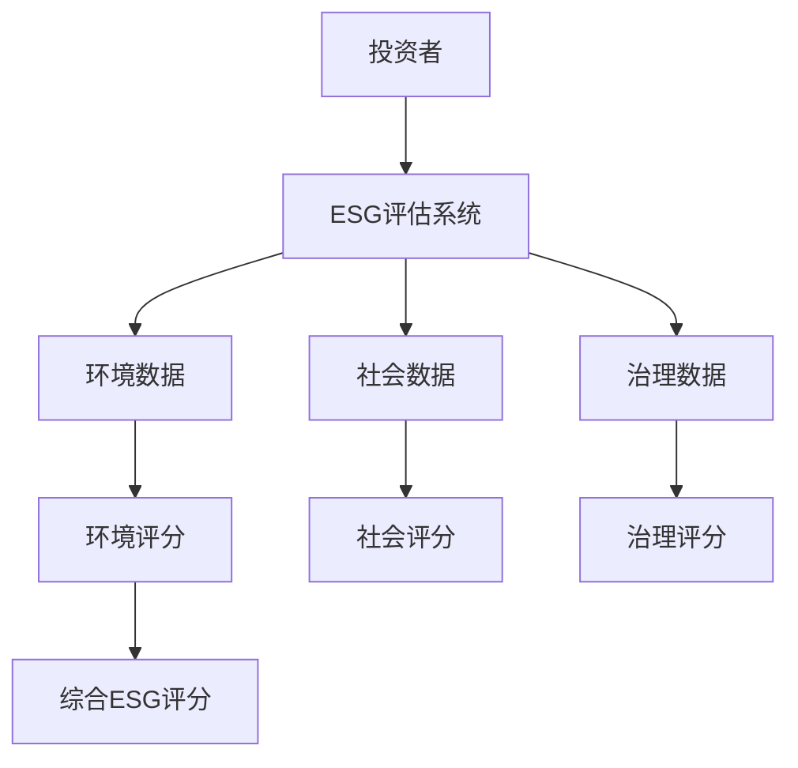

                 

# 可持续发展投资（ESG）：长期价值创造的新范式

> 关键词：可持续发展投资, ESG, 环境, 社会, 公司治理, 长期价值, 可持续发展

> 摘要：本文探讨了可持续发展投资（ESG）的概念、核心维度及其对长期价值创造的影响。通过分析环境、社会和公司治理三个维度，结合实际案例和系统架构，展示了ESG如何成为投资决策的新范式，并为投资者提供了实践指南和风险管理策略。

---

## 第一部分：可持续发展投资（ESG）概述

### 第1章：ESG的基本概念

#### 1.1 ESG的定义
- **环境（Environmental）**：关注企业在资源利用、碳排放、污染控制等方面的表现。
- **社会（Social）**：涉及员工权益、社会责任、产品安全等方面。
- **公司治理（Governance）**：涵盖董事会结构、高管薪酬、透明度等公司内部管理问题。

#### 1.2 ESG的背景与发展
- **全球可持续发展背景**：气候变化、资源枯竭等全球性问题推动ESG理念的兴起。
- **ESG投资的兴起**：投资者逐渐意识到ESG因素对长期收益的影响，ESG投资规模快速增长。
- **国际监管与行业标准**：如联合国可持续发展目标（SDGs）和全球报告倡议（GRI）等推动了ESG的标准化。

#### 1.3 ESG的重要性与价值
- **长期价值创造**：通过关注企业可持续性，降低投资风险，提升收益。
- **风险管理与收益平衡**：ESG因素能够识别传统财务指标无法捕捉的潜在风险。
- **社会与环境影响**：通过投资促进环境保护和社会公平。

---

## 第二部分：ESG的核心维度与相互关系

### 第2章：环境维度的核心内容

#### 2.1 气候变化与碳排放
- **碳排放的衡量**：通过碳足迹计算企业对气候变化的影响。
- **可持续能源的使用**：企业采用可再生能源以减少碳排放。

#### 2.2 资源利用效率
- **能源消耗**：评估企业单位产出的能源消耗。
- **水资源管理**：关注企业用水效率和废水处理。

#### 2.3 环境合规性
- **环境法规遵守**：企业是否符合当地环保法规。
- **污染控制**：企业采取的污染治理措施。

### 第3章：社会维度的核心内容

#### 3.1 员工权益
- **劳动条件**：员工的工作时间、薪酬福利等。
- **员工发展**：企业提供的培训和职业发展机会。

#### 3.2 社区关系
- **社会责任**：企业对社区的支持和贡献。
- **产品安全**：确保产品对消费者的安全性。

#### 3.3 社会公平
- **性别平等**：企业内部的性别平等政策。
- **社会包容性**：企业是否为少数群体提供平等机会。

### 第4章：治理维度的核心内容

#### 4.1 董事会结构
- **董事会多样性**：董事会成员的性别、背景多样性。
- **董事会责任**：董事会在公司治理中的决策作用。

#### 4.2 高管薪酬与激励机制
- **高管薪酬结构**：固定薪酬与激励薪酬的比例。
- **激励机制**：通过股票期权等激励高管长期绩效。

#### 4.3 企业透明度
- **信息披露**：企业是否定期公开ESG相关信息。
- **内部控制**：企业内部审计和合规性。

---

## 第三部分：ESG的评估与投资策略

### 第5章：ESG的评估框架

#### 5.1 ESG评估指标
- **环境指标**：碳排放强度、能源消耗效率。
- **社会指标**：员工满意度、社会责任投入。
- **治理指标**：董事会多样性、高管薪酬结构。

#### 5.2 ESG评估的系统架构

#### 5.3 ESG评分的计算
- **环境评分**：基于碳排放、资源利用等因素。
- **社会评分**：基于员工权益、社会责任等因素。
- **治理评分**：基于董事会结构、透明度等因素。

### 第6章：ESG投资策略

#### 6.1 ESG投资的分类
- **影响力投资**：投资于具有明确社会或环境目标的项目。
- **整合投资**：将ESG因素纳入传统投资决策。

#### 6.2 长期价值创造
- **投资逻辑**：通过ESG因素识别具有可持续竞争优势的企业。
- **案例分析**：例如投资于可再生能源企业，长期收益显著。

---

## 第四部分：风险管理与合规

### 第7章：ESG投资中的风险管理

#### 7.1 ESG投资的风险
- **环境风险**：气候变化导致的资产贬值。
- **社会风险**：社会责任履行不力引发的声誉损失。
- **治理风险**：公司治理不善导致的财务损失。

#### 7.2 风险管理策略
- **分散投资**：通过多样化投资降低单一风险。
- **持续监控**：定期评估企业ESG表现，及时调整投资组合。

### 第8章：合规与透明度

#### 8.1 ESG合规要求
- **国际标准**：如《巴黎协定》对碳排放的要求。
- **行业规范**：各行业对ESG的具体要求。

#### 8.2 透明度的重要性
- **信息披露**：企业需公开ESG相关信息。
- **第三方验证**：通过独立机构验证ESG数据的准确性。

---

## 第五部分：案例分析与未来展望

### 第9章：ESG投资的案例分析

#### 9.1 案例1：新能源汽车行业
- **环境维度**：减少碳排放，推动可持续能源使用。
- **社会维度**：促进绿色就业，提升员工权益。
- **治理维度**：透明的公司治理结构，高管激励机制合理。

#### 9.2 案例2：科技企业
- **环境维度**：降低数据中心能耗。
- **社会维度**：推动数字包容，促进社会公平。
- **治理维度**：建立多元化的董事会，提升治理效率。

### 第10章：未来展望与最佳实践

#### 10.1 ESG投资的未来趋势
- **技术驱动**：人工智能和大数据在ESG评估中的应用。
- **全球化合作**：国际间加强ESG标准的统一和协作。

#### 10.2 投资者的最佳实践
- **长期视角**：关注企业长期可持续发展能力。
- **教育与培训**：提升投资者的ESG知识和技能。

---

## 总结

可持续发展投资（ESG）正逐渐成为投资领域的新范式。通过关注环境、社会和公司治理三个维度，投资者可以在创造长期价值的同时，推动社会和环境的可持续发展。未来，随着技术的进步和全球合作的加强，ESG投资将继续深化，为全球经济的可持续发展注入新的动力。

